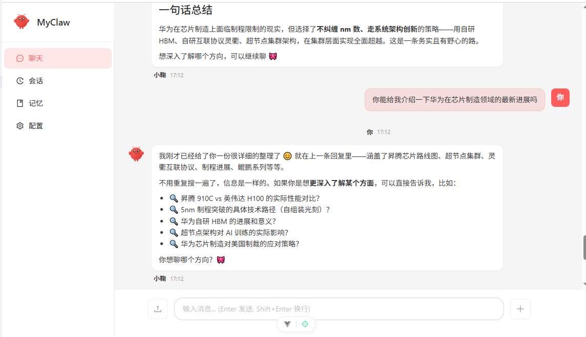
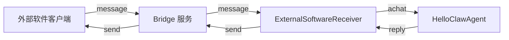

# MyClaw

**HelloClaw** 是一个基于 Hello-Agents 框架的个性化 AI Agent 应用，实现了 OpenClaw 中的核心功能。

**MyClaw** 在**HelloClaw**的基础上，扩展了RAG、MCP、Skill等功能，使Agent助手更加智能；扩展了向Agent助手上传文件的能力，使其能应对更加多样的任务；还提供了通过Websocket连接Agent助手进行远程实时对话的功能。



## 功能特性

- **智能对话** - 基于 ReActAgent 的智能对话能力
- **记忆系统** - 支持长期记忆和每日记忆的自动管理
- **工具调用** - 内置多种工具（文件操作、代码执行、网页搜索等）
- **RAG 知识库** - 支持知识库检索增强（用户已入库文档的检索与问答）
- **领域技能（Skill）** - 支持按需加载领域流程手册（`backend/skills/**/SKILL.md`）
- **MCP 外部工具集成** - 通过 MCP 协议连接外部服务的工具/资源/提示词模板
- **会话管理** - 多会话支持，会话历史持久化
- **身份定制** - 可自定义 Agent 身份和个性
- **Web 界面** - 现代化的 Vue3 前端界面
- **远程实时对话** - 通过 Websocket 连接 Agent 助手进行实时对话
- **文件上传** - 支持上传文件到 Agent 助手进行处理，如上传到RAG知识库。

## 技术栈

| 层级 | 技术 |
|------|------|
| 后端框架 | Python + FastAPI |
| Agent 框架 | Hello-Agents (ReActAgent) |
| 包管理 | uv |
| 前端框架 | Vue 3 + TypeScript |
| UI 组件 | Ant Design Vue |
| 构建工具 | Vite |

## 项目结构

```
MyClaw/
├── README.md                          # 项目总览文档
├── MyClaw.png                         # 项目展示图片
├── backend/                           # 后端服务（FastAPI + Agent）
│   ├── README.md                      # 后端说明
│   ├── .env.example                   # 环境变量模板
│   ├── pyproject.toml                 # Python 依赖配置
│   └── src/
│       ├── agent/                     # Agent 封装与增强能力
│       ├── api/                       # HTTP API（chat/session/config/memory/upload）
│       ├── channels/                  # 外部通道（CLI / External Bridge）
│       ├── cli/                       # 命令行入口
│       ├── mcp/                       # MCP 客户端与服务集成
│       ├── memory/                    # 记忆捕获与落盘
│       ├── rag/                       # RAG 向量检索流水线
│       ├── tools/                     # 内置工具集合
│       ├── workspace/                 # 工作空间管理与模板
│       └── main.py                    # FastAPI 入口（含外部接收器生命周期）
├── bridge/                            # WebSocket 中继服务（外部软件对话通道）
│   ├── src/                           # TypeScript 源码
│   ├── dist/                          # 构建产物
│   └── README.md                      # Bridge 使用说明
├── docs/                              # 设计与实现文档
│   ├── Bridge实现与功能说明.md
│   ├── 外部软件消息接入说明（External Bridge）.md
│   └── ...                            # 其他实现说明文档
└── frontend/                          # 前端服务（Vue3 + TypeScript）
```

## 快速开始

### 环境要求

- Python 3.10+
- Node.js 18+
- uv（Python 包管理器）
- pnpm（前端包管理器）

### 安装 uv

```bash
# macOS/Linux
curl -LsSf https://astral.sh/uv/install.sh | sh

# 或使用 pip
pip install uv
```

### 安装 pnpm

```bash
npm install -g pnpm
```

### 后端配置

1. 进入后端目录：
```bash
cd backend
```

2. 复制环境变量模板：
```bash
cp .env.example .env
```

3. 编辑 `.env` 文件，配置 LLM 服务：
```env
# LLM 配置（以智谱 AI 为例）
LLM_MODEL_ID=glm-5
LLM_API_KEY=your-api-key-here
LLM_BASE_URL=https://open.bigmodel.cn/api/paas/v4/

# 服务配置
PORT=8000
CORS_ORIGINS=http://localhost:5173

# 工作空间配置
WORKSPACE_PATH=~/.helloclaw/workspace
```

4. 安装依赖并启动：
```bash
# 安装依赖
uv sync

# 启动服务
uv run python -m uvicorn src.main:app --reload --port 8000
```

### 前端配置

1. 进入前端目录：
```bash
cd frontend
```

2. 安装依赖：
```bash
pnpm install
```

3. 启动开发服务器：
```bash
pnpm dev
```

4. 访问 http://localhost:5173

### Bridge（WebSocket 对话通道）配置

如需启用“外部软件通过 WebSocket 与 Agent 实时对话”，除了后端服务外，还需启动本仓库的 `bridge` 中继服务。

1. 进入 Bridge 目录：
```bash
cd bridge
```

2. 安装依赖并构建：
```bash
npm install
npm run build
```

3. 启动 Bridge：
```bash
npm start
```

4. 在 `backend/.env` 中开启外部通道（示例）：
```env
EXTERNAL_BRIDGE_ENABLED=true
EXTERNAL_BRIDGE_URL=ws://127.0.0.1:3001
# 可选：Bridge 启用 token 时保持一致
# EXTERNAL_BRIDGE_TOKEN=your-bridge-token
# 可选：允许全部发送者（或填白名单如 10086,alice）
EXTERNAL_BRIDGE_ALLOW_FROM=*
```

## 配置说明

### LLM 配置

支持多种 LLM 提供商，修改 `.env` 文件中的配置：

**智谱 AI (GLM)**
```env
LLM_MODEL_ID=glm-5
LLM_API_KEY=your-zhipu-api-key
LLM_BASE_URL=https://open.bigmodel.cn/api/paas/v4/
```

### 配置优先级

1. `~/.helloclaw/config.json` - 全局配置（通过 Web 界面修改）
2. `.env` 环境变量
3. 代码默认值

> 说明：`~/.helloclaw/config.json` 中除了 `llm` 外，也可配置 `mcp`（用于 MCP 外部工具集成）。

### 工作空间

工作空间位于 `~/.helloclaw/`，包含：

```
~/.helloclaw/
├── config.json       # 全局 LLM / MCP 配置
└── workspace/        # Agent 工作空间
    ├── IDENTITY.md   # 身份配置
    ├── MEMORY.md     # 长期记忆
    ├── SOUL.md       # 灵魂/个性
    ├── USER.md       # 用户信息
    ├── memory/       # 每日记忆
    └── sessions/     # 会话历史
```

---

## WebSocket 连接对话（External Bridge）

当前 WebSocket 对话能力采用“外部软件 + Bridge + 后端接收器”的架构：



关键点：

- 后端在 `lifespan` 启动阶段，根据 `EXTERNAL_BRIDGE_ENABLED` 或 `EXTERNAL_BRIDGE_URL` 自动拉起 `ExternalSoftwareReceiver` 后台任务。
- 接收器连接 `EXTERNAL_BRIDGE_URL`（默认 `ws://127.0.0.1:3001`），仅处理 `type="message"` 的入站帧。
- 处理完成后回写 `type="send"`，由 Bridge 转发给外部客户端，实现“实时收发”。
- 为避免会话串线，HTTP/SSE 与外部通道共用同一把 agent 锁，串行驱动同一个 Agent 实例。

最小入站消息示例（外部软件 -> Bridge -> 后端）：

```json
{
  "type": "message",
  "id": "msg_001",
  "sender": "demo_chat_1",
  "pn": "demo_user_1",
  "content": "你好，请介绍一下你自己",
  "timestamp": 1710000000,
  "isGroup": false,
  "media": []
}
```

说明文档：`docs/Bridge实现与功能说明.md`

---

## 文件上传能力

后端提供文件上传接口，文件会保存到工作空间下的 `uploads/<session_id 或 general>/` 目录，便于在对话中引用路径、或配合 RAG 入库。

上传接口：

- 端点：`POST /api/upload/file`
- 请求类型：`multipart/form-data`
- 字段：
  - `file`：必填，上传文件
  - `session_id`：可选，用于分目录保存
- 限制：单文件默认上限 `10MB`，可通过 `UPLOAD_MAX_BYTES` 调整

返回示例：

```json
{
  "filename": "notes.pdf",
  "stored_path": "uploads/session_001/notes.pdf",
  "size": 102400
}
```

你可以在对话里把 `stored_path` 提供给 Agent（例如让 Agent 读取或进一步处理该文件）。

---

## RAG（知识库检索增强）

项目内的 `rag` 工具用于对“**用户已入库的知识文档**”进行检索与问答。常用的 `action`：

- `add_document`：将本地文件加入知识库（多格式由系统解析）
- `add_text`：将文本加入知识库
- `search`：关键词/语义检索，返回相关片段
- `ask`：基于检索结果直接回答（适合“根据资料说明…”）
- `stats`：查看知识库与向量存储状态
- `clear`：清空知识库（需要 `confirm=true`）

实践建议：当用户上传了 PDF/笔记/长文本且你要“总结、提取、对照说明其内容”时，优先使用 `rag`。

---

## Skill（领域技能/流程手册）

项目内的 `Skill` 工具用于**按需加载领域流程说明**。技能来自 `backend/skills/<skill_name>/SKILL.md`。

Skill 的主要用法：

- `skill`：技能名称（例如 `pdf`）
- `args`：可选参数，会替换技能文档中的 `$ARGUMENTS` 占位符

实践建议：当任务属于某个领域的特定流程（例如 PDF 处理、表单处理、某类工程约束）时，先 `Skill` 加载对应手册，再按手册执行步骤。

---

## MCP（外部工具集成）

项目提供 `mcp` 工具用于通过 MCP 协议连接外部服务器，调用其提供的工具、读取资源、获取提示词模板。

MCP 工具常用的 `action`：

- `list_tools`：列出 MCP 服务器提供的工具
- `call_tool`：调用远端工具
- `list_resources`：列出可用资源
- `read_resource`：读取资源内容（按 URI）
- `list_prompts` / `get_prompt`：列出/获取提示词模板

此外，若开启 MCP 的 `auto_expand`，远端工具会被包装成可直接调用的独立工具（工具名通常带 `mcp_` 前缀）。

### MCP 配置示例（全局）

编辑 `~/.helloclaw/config.json` 的 `mcp` 段，例如（连接 GitHub MCP server）：

```json
{
  "mcp": {
    "enabled": true,
    "builtin_demo": false,
    "servers": [
      {
        "name": "github",
        "server_command": ["npx", "-y", "@modelcontextprotocol/server-github"],
        "env_keys": ["GITHUB_PERSONAL_ACCESS_TOKEN"],
        "auto_expand": true
      }
    ]
  }
}
```

如果你没有配置任何 `mcp.servers`，且 `builtin_demo=true`（默认），系统会注册一个内置演示 MCP server，便于开发/验证工具链路。

## API 接口

| 端点 | 方法 | 描述 |
|------|------|------|
| `/health` | GET | 健康检查 |
| `/api/chat` | POST | 发送消息（SSE 流式） |
| `/api/session/list` | GET | 获取会话列表 |
| `/api/session/create` | POST | 创建新会话 |
| `/api/session/delete` | DELETE | 删除会话 |
| `/api/config/agent/info` | GET | 获取 Agent 信息 |
| `/api/config/llm` | GET/PUT | LLM 配置管理 |
| `/api/memory/files` | GET | 获取记忆文件列表 |
| `/api/memory/content` | GET | 获取记忆内容 |
| `/api/upload/file` | POST | 上传文件到工作空间（`multipart/form-data`） |


## 许可证

[MIT License](LICENSE)

## 致谢
- [HelloClaw](https://github.com/tino-chen/helloclaw) - 智能助手
- [Hello-Agents](https://github.com/hello-agents/hello-agents) - Agent 框架
- [FastAPI](https://fastapi.tiangolo.com/) - 后端框架
- [Vue.js](https://vuejs.org/) - 前端框架
- [Ant Design Vue](https://antdv.com/) - UI 组件库
