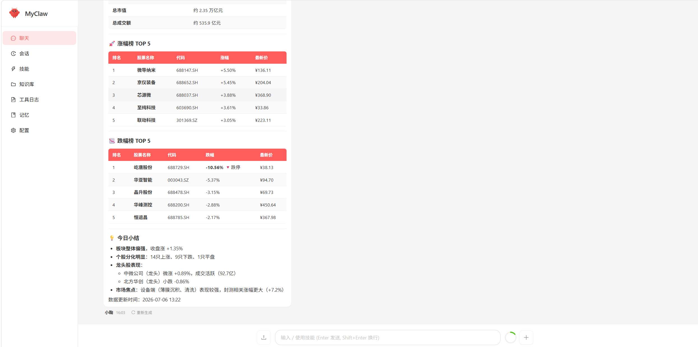

# MyClaw

基于 [Hello-Agents](https://github.com/hello-agents/hello-agents) 的个性化 AI Agent 应用，在 [HelloClaw](https://github.com/tino-chen/helloclaw) 能力之上扩展了 **多工作区、RAG、MCP、Skill、子代理（SubAgent）、定时任务、文件上传、WebSocket 外部接入、多模态输入** 等能力。



## 核心架构

```
~/.helloclaw/                  # Agent 基座（全局、进程固定）
├── identity/                  # IDENTITY.md 人格定义
├── config.json                # LLM / MCP 全局配置
├── workspaces.json            # 工作区授权白名单
└── skills/                    # 全局 Skill（跨工作区共享）

<workspace>/                   # 工作区（可运行时切换）
└── .myclaw/                   # Agent 运行时数据
    ├── AGENTS.md              # 工作区级系统提示词（叠加到 identity）
    ├── HEARTBEAT.md           # 项目上下文（Agent 每次对话前读取）
    ├── sessions/              # 会话持久化
    ├── tasks/                 # 任务追踪
    ├── uploads/               # 文件上传
    ├── skills/                # 工作区 Skill
    └── automations/           # 定时任务存储
```

> **身份与工作区解耦**：身份/Prompt 固定在 `~/.helloclaw/identity/`，项目文件归拢到 `<workspace>/.myclaw/`。切换工作区时 `bind_workspace` 全量重绑 14 个引用点，无需重启进程。

## 功能概览

| 能力 | 说明 |
|------|------|
| 流式对话 | SSE 流式输出；支持**编辑历史消息 / 重新生成**（仅替换该轮回复，保留后续对话） |
| 多工作区 | 运行时切换工作区（`POST /api/workspace/switch`），隔离不同项目的会话、文件、Skill、定时任务 |
| 记忆 | 长期记忆 + 语义检索，自动捕获对话要点并老化衰减 |
| 工具 | 文件读写（Read/Write/Edit/MultiEdit）、Shell、计算器、网页搜索/抓取、RAG、Skill、MCP |
| 子代理（SubAgent） | 上下文隔离的并行子任务执行，支持工具过滤和摘要返回 |
| 会话 | 多会话管理，历史持久化到 `<workspace>/.myclaw/sessions/` |
| 定时任务 | 基于 RRULE 的定时/循环任务引擎，支持后台自动化执行 |
| Web UI | Vue 3 前端：配置、记忆、会话管理、工作区切换、定时任务、工具日志 |
| 外部通道 | WebSocket Bridge（含飞书适配）；HTTP 与 Bridge 共用 Agent 锁串行处理 |
| 文件上传 | 保存至 `<workspace>/.myclaw/uploads/`，支持 RAG 入库 |
| 多模态输入 | 聊天直传图片（VLM `image_url`，base64/URL 双模式）与文档（PDF/DOCX/XLSX/TXT 抽文本注入） |
| 工具日志 | `ToolCallLogViewer` 可视化工具调用链路 |

## 技术栈

Python · FastAPI · Hello-Agents · uv · Vue 3 · TypeScript · Ant Design Vue · Vite

## 项目结构

```
MyClaw/
├── backend/
│   ├── src/
│   │   ├── agent/             # Agent 核心（MyClawAgent、EnhancedSimpleAgent、子代理编排）
│   │   ├── api/               # FastAPI 路由（chat、session、config、memory、workspace、automation 等）
│   │   ├── workspace/         # 工作区管理（多工作区切换、授权、模板部署）
│   │   ├── memory/            # 记忆系统（MemoryVectorStore Qdrant 存储 + 衰减机制）
│   │   ├── rag/               # RAG 检索引擎
│   │   ├── tools/             # 自定义工具（Read/Write/Edit/Bash/RAG/Skill/MCP/Search 等）
│   │   ├── skill/             # Skill 加载器（全局 + 工作区双目录）
│   │   ├── automation/        # 定时任务引擎（RRULE 调度 + 执行器）
│   │   ├── channels/          # 外部通道（ExternalSoftwareReceiver WebSocket）
│   │   └── context/           # 上下文管理（token 统计、压缩、Guard）
│   ├── pyproject.toml
│   └── README.md
├── frontend/
│   ├── src/
│   │   ├── views/             # 页面（ChatView、ConfigView、MemoryView、AutomationView 等）
│   │   ├── components/        # 组件（WorkspaceSwitcher、ToolCallLogViewer、SessionList 等）
│   │   ├── stores/            # Pinia 状态管理
│   │   ├── api/               # API 封装层
│   │   └── router/            # 路由配置
│   └── package.json
├── bridge/                    # WebSocket 中继（外部软件 / 飞书等 → 后端）
├── docs/                      # 设计与实现文档（17 篇）
└── README.md
```

## 快速开始

**环境**：Python 3.10+ · Node.js 18+ · [uv](https://github.com/astral-sh/uv) · pnpm

### 1. 后端

```bash
cd backend
cp .env.example .env   # 配置 LLM_MODEL_ID / LLM_API_KEY / LLM_BASE_URL
uv sync
uv run uvicorn src.main:app --reload --port 8000
```

### 2. 前端

```bash
cd frontend
pnpm install
pnpm dev    # http://localhost:5173
```

### 3. Bridge（可选，外部实时对话）

```bash
cd bridge
cp .env.example .env    # 按需配置
npm install && npm run build && npm start
```

在 `backend/.env` 中启用：

```env
EXTERNAL_BRIDGE_ENABLED=true
EXTERNAL_BRIDGE_URL=ws://127.0.0.1:3001
EXTERNAL_BRIDGE_ALLOW_FROM=*
```

详见 [bridge/README.md](bridge/README.md)、[docs/外部软件消息接入说明（External Bridge）.md](docs/外部软件消息接入说明（External Bridge）.md)。

## 配置要点

| 来源 | 内容 |
|------|------|
| `backend/.env` | `LLM_MODEL_ID`、`LLM_API_KEY`、`LLM_BASE_URL`、`WORKSPACE_PATH`、Bridge、多模态、端口 |
| `~/.helloclaw/config.json` | 全局 LLM / MCP 配置（Web 配置页 `http://localhost:5173/#/config` 可改） |
| `~/.helloclaw/identity/` | `IDENTITY.md` 人格定义、`AGENTS.md` 系统提示词骨架 |
| `~/.helloclaw/skills/` | 全局 Skill（所有工作区共享） |
| `<workspace>/.myclaw/` | 工作区数据：`sessions/`、`tasks/`、`uploads/`、`skills/`、`automations/` |
| `<workspace>/.myclaw/AGENTS.md` | 工作区级提示词（叠加到 identity 之上） |
| `<workspace>/.myclaw/HEARTBEAT.md` | 项目上下文（Agent 每次对话前自动读取） |

**LLM 示例（智谱）**

```env
LLM_MODEL_ID=glm-4-flash
LLM_API_KEY=your-key
LLM_BASE_URL=https://open.bigmodel.cn/api/paas/v4/
```

**工作区切换**：前端左上角下拉框切换，或在发送消息时附带 `workspace_path` 参数。首次使用需先在设置页授权目录。

**网页搜索（可选）**：在 `.env` 中配置 `BRAVE_API_KEY` / `TAVILY_API_KEY` / `SERPAPI_API_KEY` 之一。

配置优先级：`config.json` > `.env` > 代码默认值。

## 扩展能力

- **多工作区**：运行时隔离项目，每个工作区独立的会话/文件/定时任务 → [docs/多工作区工程设计.md](docs/多工作区工程设计.md)
- **RAG**：对用户已入库文档检索/问答 → [docs/RAG_IMPLEMENTATION.md](docs/RAG_IMPLEMENTATION.md)
- **Skill**：加载 `<workspace>/.myclaw/skills/<name>/SKILL.md` 或 `~/.helloclaw/skills/` 定义领域流程 → [docs/Skill系统实现与升级说明.md](docs/Skill系统实现与升级说明.md)
- **子代理（SubAgent）**：上下文隔离的并行子任务执行，解决"内存不够、串行太慢"问题 → [docs/SubAgent与Task系统实现说明.md](docs/SubAgent与Task系统实现说明.md)
- **MCP**：在 `~/.helloclaw/config.json` 的 `mcp.servers` 配置外部工具服务，支持 `auto_expand` → [docs/MCP工具实现说明.md](docs/MCP工具实现说明.md)
- **定时任务**：基于 iCalendar RRULE 的自动化调度引擎，支持工作区级隔离 → `POST /api/automation/*`
- **上传**：`POST /api/upload/file`（`multipart/form-data`，字段 `file`、可选 `session_id`）
- **多模态**：聊天直传图片与文档（PDF/DOCX/XLSX/TXT）→ [docs/多模态实现说明.md](docs/多模态实现说明.md)

## 主要 API

| 端点 | 说明 |
|------|------|
| `GET /health` | 健康检查 |
| `POST /api/chat/send/stream` | 流式对话（SSE）；支持 `workspace_path`、`user_turn_index`、`regenerate` |
| `POST /api/chat/send/sync` | 同步对话 |
| `GET/POST/DELETE /api/session/*` | 会话列表、创建、历史、删除 |
| `GET/PUT /api/config/*` | Agent / LLM / MCP 配置 |
| `GET /api/memory/*` | 记忆查询与管理 |
| `POST /api/upload/file` | 上传文件 |
| `POST /api/workspace/switch` | 切换工作区 |
| `POST /api/workspace/authorize` | 授权工作区目录 |
| `GET /api/workspace/current` | 获取当前工作区信息 |
| `GET/POST/PUT/DELETE /api/automation/*` | 定时任务 CRUD 与管理 |
| `GET /api/skills` | 查询已加载的 Skill 列表 |

## 文档索引

| 文档 | 主题 |
|------|------|
| [docs/HelloClaw-Backend-请求执行流程.md](docs/HelloClaw-Backend-请求执行流程.md) | 请求与 Agent 执行链路 |
| [docs/Agent工程设计.md](docs/Agent工程设计.md) | Agent 核心架构与设计决策 |
| [docs/多工作区工程设计.md](docs/多工作区工程设计.md) | 多工作区隔离方案与实现 |
| [docs/前端实现说明.md](docs/前端实现说明.md) | 前端架构与页面 |
| [docs/Memory实现与功能说明.md](docs/Memory实现与功能说明.md) | 记忆系统（Qdrant 存储 + 衰减机制） |
| [docs/Bridge实现与功能说明.md](docs/Bridge实现与功能说明.md) | Bridge 架构 |
| [docs/多模态实现说明.md](docs/多模态实现说明.md) | 多模态输入（图片 + 文档）协议与实现 |
| [docs/MCP工具实现说明.md](docs/MCP工具实现说明.md) | MCP 工具集成 |
| [docs/RAG_IMPLEMENTATION.md](docs/RAG_IMPLEMENTATION.md) | RAG 系统实现 |
| [docs/Skill系统实现与升级说明.md](docs/Skill系统实现与升级说明.md) | Skill 加载与管理 |
| [docs/SubAgent与Task系统实现说明.md](docs/SubAgent与Task系统实现说明.md) | 子代理编排与任务追踪 |
| [docs/ToolCallLogViewer实现说明.md](docs/ToolCallLogViewer实现说明.md) | 工具日志可视化 |
| [docs/外部软件消息接入说明（External Bridge）.md](docs/外部软件消息接入说明（External Bridge）.md) | 外部通道接入指南 |
| [docs/enhanced_simple_agent_arun_stream_with_tools.md](docs/enhanced_simple_agent_arun_stream_with_tools.md) | EnhancedSimpleAgent 流式执行详解 |
| [docs/IMPLEMENTATION_GUIDE.md](docs/IMPLEMENTATION_GUIDE.md) | 实现指南 |
| [backend/README.md](backend/README.md) | 后端补充说明 |

## 许可证

[MIT License](LICENSE)

## 致谢

[HelloClaw](https://github.com/tino-chen/helloclaw) · [Hello-Agents](https://github.com/hello-agents/hello-agents) · FastAPI · Vue.js · Ant Design Vue
