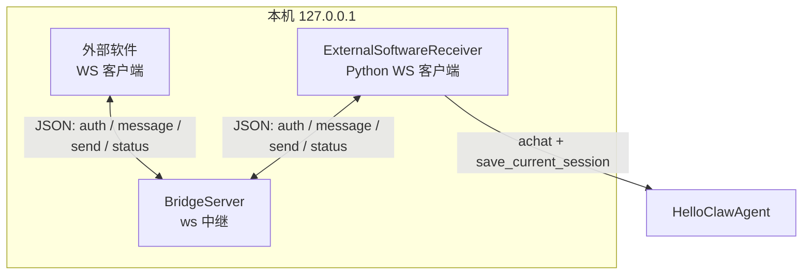
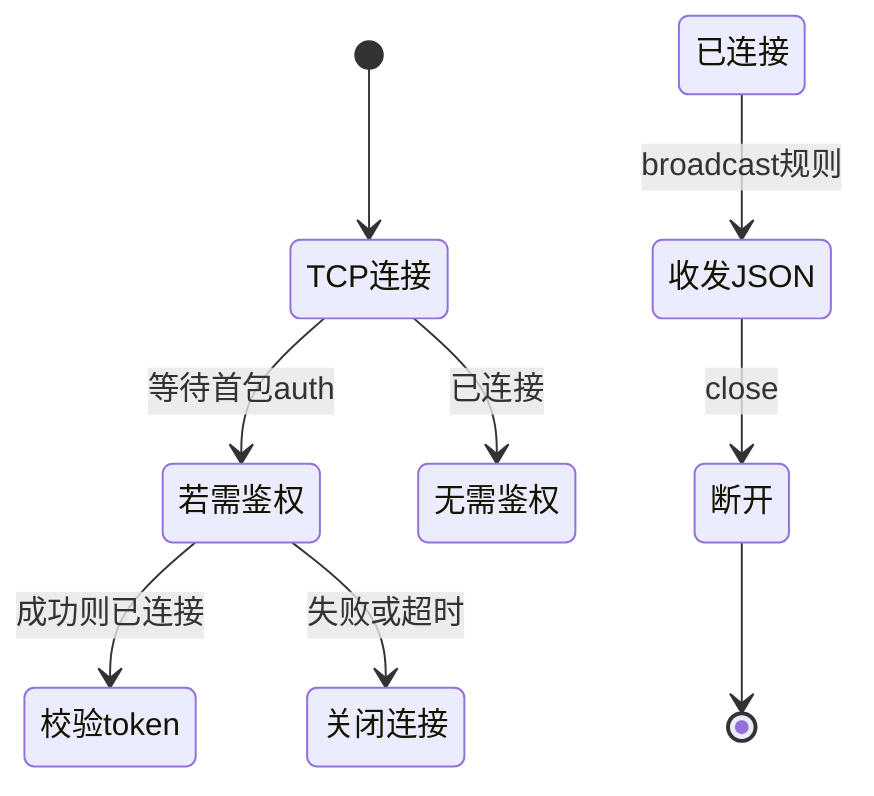
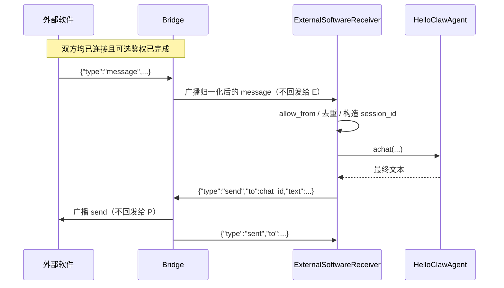

# Bridge 实现与功能说明

本文档描述 **MyClaw 仓库内 `bridge/` 目录** 的实现细节、运行方式与消息协议。Bridge 在本项目中定位为 **本地 WebSocket 中继服务**：在「外部软件 / 任意客户端」与 **Python 后端的外部消息接收器**（`ExternalSoftwareReceiver`）之间转发 JSON 消息，**不依赖 WhatsApp 或 Baileys**（当前入口仅启动通用中继；`package.json` 中遗留的 Baileys 依赖与历史命名有关，可视为未在默认路径使用）。

与「如何配置后端、如何编写外部软件」相关的端到端说明，另见：[外部软件消息接入说明（External Bridge）](./外部软件消息接入说明（External%20Bridge）.md)。

---

## 1. 功能概述

| 能力 | 说明 |
|------|------|
| **监听地址** | 仅绑定 **`127.0.0.1`**（本机），避免默认暴露到局域网/公网 |
| **中继模式** | 任意已连接客户端发送 `type: "message"` 或 `type: "send"` 时，**向除发送者外的所有其他客户端**广播同一条规范化后的 JSON |
| **连接就绪通知** | 客户端通过鉴权（若启用）并完成 `setupClient` 后，会收到 `{"type":"status","status":"connected"}` |
| **可选鉴权** | 若设置环境变量 `BRIDGE_TOKEN`，则连接后 **第一条消息** 必须为 `{"type":"auth","token":"<与服务器一致>"}`，否则关闭连接；超时约 5 秒 |
| **回执** | 当某客户端发送 `type: "send"` 时，Bridge 在广播给其他人之后，**向发送者本人**再发一条 `{"type":"sent","to": "<原 to 字段>"}` |

典型拓扑：**一端**为 Python 后端的 `ExternalSoftwareReceiver`（作为 WS 客户端连入）；**另一端**为你的外部程序（同样作为 WS 客户端），负责把业务事件转成 `message`，并订阅 Bridge 转发的 `send` 以把 Agent 回复送达用户。

---

## 2. 代码结构与职责

| 文件 | 职责 |
|------|------|
| `bridge/src/index.ts` | 进程入口：读取 `BRIDGE_PORT`、`BRIDGE_TOKEN`，构造 `BridgeServer` 并 `start()`；处理 `SIGINT` / `SIGTERM` 优雅退出 |
| `bridge/src/server.ts` | `BridgeServer`：创建 `ws` 的 `WebSocketServer`、维护 `clients` 集合、鉴权握手、`broadcast`、命令解析与字段补全 |

构建产物由 TypeScript 编译到 `bridge/dist/`，`npm start` 执行 `node dist/index.js`。

---

## 3. 环境变量（Bridge 进程）

| 变量 | 含义 | 默认 |
|------|------|------|
| `BRIDGE_PORT` | WebSocket 监听端口 | `3001` |
| `BRIDGE_TOKEN` | 若设置非空字符串，则启用首包鉴权；须与后端 `EXTERNAL_BRIDGE_TOKEN` 一致 | 未设置（不鉴权） |

后端侧对应变量见 `ExternalSoftwareReceiver` / `load_external_bridge_config()`：`EXTERNAL_BRIDGE_URL`（默认 `ws://127.0.0.1:3001`）、`EXTERNAL_BRIDGE_TOKEN` 等。

---

## 4. 启动与构建

要求 **Node.js ≥ 20**（见 `package.json` 的 `engines`）。

```bash
cd bridge
npm install
npm run build
npm start
```

开发时可使用 `npm run dev`（等价于先 `tsc` 再 `node dist/index.js`）。

---

## 5. 消息协议（Bridge 层）

以下均为 **UTF-8 JSON 文本帧**。

### 5.1 鉴权（仅当服务端设置了 `BRIDGE_TOKEN`）

连接建立后，客户端必须在超时内发送第一条消息：

```json
{"type":"auth","token":"<BRIDGE_TOKEN 的值>"}
```

成功则进入普通客户端逻辑并收到 `status: connected`；失败则关闭连接（如 `4003 Invalid token`）。

### 5.2 服务端 → 客户端：`status`

```json
{"type":"status","status":"connected"}
```

在客户端被加入集合后立即发送，表示可以开始收发业务消息。

### 5.3 客户端 → Bridge：`message`（入站业务消息，将被中继）

发送方可只提供部分字段，Bridge 会 **归一化** 后广播：

| 字段 | 归一化规则 |
|------|------------|
| `type` | 固定为 `"message"` |
| `id` | 缺省则为 `msg_<Date.now()>` |
| `sender` | 缺省 `""` |
| `pn` | 缺省 `""` |
| `content` | 缺省 `""` |
| `timestamp` | 缺省 `Date.now()` |
| `isGroup` | 缺省 `false` |
| `media` | 缺省 `[]` |

广播对象：**除发送者外的所有已连接且 OPEN 的客户端**。

### 5.4 客户端 → Bridge：`send`（出站回复，将被中继）

```json
{"type":"send","to":"<目标会话标识>","text":"<文本>"}
```

Bridge 行为：

1. 向 **其他** 客户端广播：`{"type":"send","to":...,"text":...}`（与发送内容一致）。
2. 向 **发送者本人** 发送：`{"type":"sent","to":"<原 to>"}`。

### 5.5 错误

解析或处理异常时，可能向当前连接发送：

```json
{"type":"error","error":"<错误字符串>"}
```

---

## 6. 与 Python 后端的配合要点

后端 `ExternalSoftwareReceiver`（`backend/src/channels/external_software_receiver.py`）行为摘要：

- 作为 **WebSocket 客户端** 连接 `EXTERNAL_BRIDGE_URL`。
- 若配置了 token，连接后发送 `{"type":"auth","token":...}`。
- **只处理** 收到的 JSON 中 `type === "message"` 的帧；`status` / `error` 等会被忽略。
- 处理完成后向同一连接发送 `{"type":"send","to": chat_id,"text": reply}`，其中 `chat_id` 来自入站消息的 `sender` 字段（与 nanobot 风格对齐）。

因此：外部软件若要收到 Agent 回复，必须作为 **另一客户端** 连上同一 Bridge；由于中继 **排除发送者**，后端发回的 `send` 会到达外部软件，而外部软件发 `message` 会到达后端（双方互不把自己发的同类型消息再收一遍，除非通过对方转发）。

---

## 7. 架构图（Obsidian / Mermaid）

### 7.1 组件关系



### 7.2 连接与鉴权生命周期



### 7.3 一条「外部消息 → Agent 回复」的中继顺序



说明：后端在收到自己发出的 `send` 的广播时，若业务层未过滤，可能收到无关 `send`；当前接收器仅处理 `type=="message"`，一般不会误处理。`sent` 为发给发送者的确认，Python 端若未特殊处理可忽略。

---

## 8. 安全与运维注意

1. **仅监听本机**：`host: '127.0.0.1'` — 若需跨机访问，应自行加反向代理、TLS 与强鉴权，**不要**在未评审的情况下改为 `0.0.0.0`。
2. **Token**：`BRIDGE_TOKEN` 与 `EXTERNAL_BRIDGE_TOKEN` 应一致且足够随机；仍属本地明文协议，不适合公网裸奔。
3. **日志**：连接、鉴权成功、断开等会在控制台输出（含 emoji 前缀），便于联调。

---

## 9. 故障排查（Bridge 侧）

| 现象 | 可能原因 |
|------|----------|
| 端口已被占用 | 更换 `BRIDGE_PORT` 或结束占用进程 |
| 后端无法连接 | 确认 Bridge 已启动、`EXTERNAL_BRIDGE_URL` 端口一致 |
| 鉴权失败 | `BRIDGE_TOKEN` 与 `EXTERNAL_BRIDGE_TOKEN` 不一致，或首包不是合法 JSON auth |
| 外部收不到回复 | 确认外部软件与后端同时在线；回复通过 **广播** 到达，发送 `message` 的一方收不到自己转发的 `send`，应由对端接收 |

---

## 10. 版本与依赖

- 运行时：**Node.js ≥ 20**，依赖 **`ws`**（WebSocket）。
- TypeScript 编译为 ESM（`"type": "module"`）。

若需仅协议对齐的最小实现，亦可参考 [外部软件消息接入说明](./外部软件消息接入说明（External%20Bridge）.md) 中的示例脚本；仓库内 **`bridge/src/server.ts`** 为当前权威实现。
