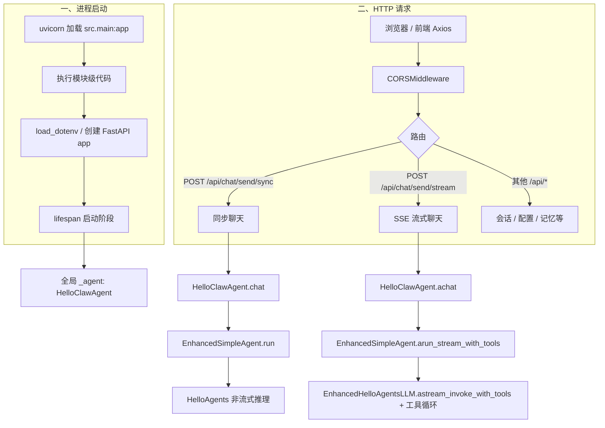
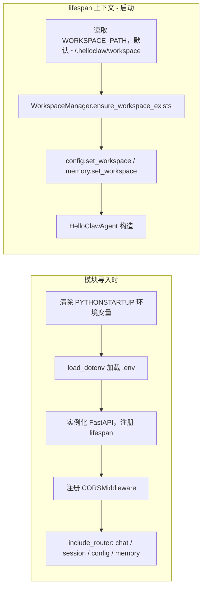
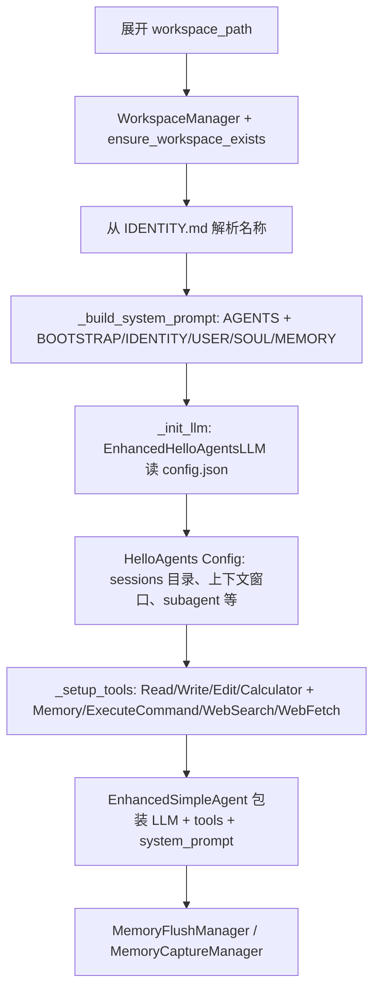
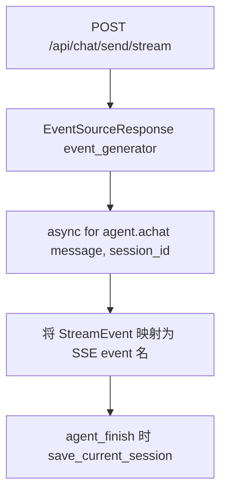
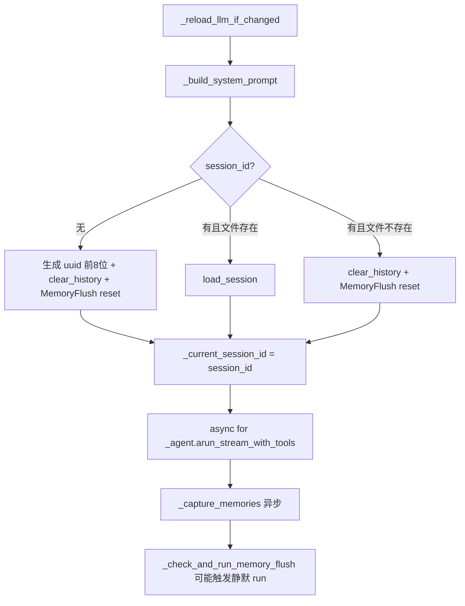
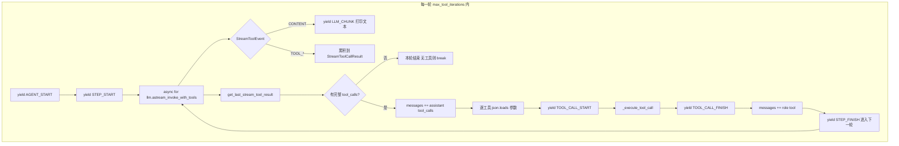
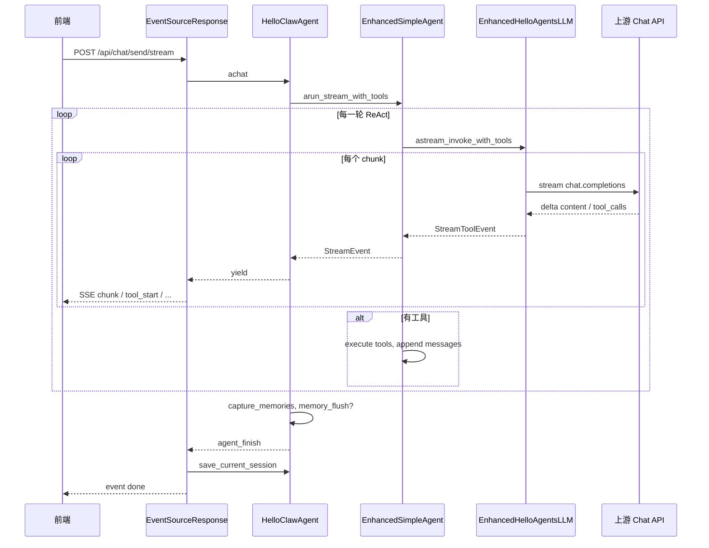

# HelloClaw 后端：从服务启动到处理前端请求的完整执行流程

本文档基于当前仓库实现（`backend/src/main.py`、`api/chat.py`、`agent/helloclaw_agent.py`、`agent/enhanced_simple_agent.py`、`agent/enhanced_llm.py`）整理，便于阅读架构与排查问题。

---

## 一、总览流程图

---

## 二、服务启动阶段（详细）

### 环节说明

| 环节 | 位置 | 说明 |
|------|------|------|
| 清除 `PYTHONSTARTUP` | `main.py` 模块顶部 | 避免某些环境下自定义启动脚本干扰标准 I/O，减少异常。 |
| `load_dotenv()` | `main.py` | 从 `backend` 工作目录加载 `.env`，供 `WORKSPACE_PATH`、`CORS_ORIGINS`、`PORT` 等使用。 |
| 创建 `FastAPI` 并挂 `lifespan` | `main.py` | `lifespan` 在应用**真正开始服务请求前**执行启动逻辑，在关闭时执行清理。 |
| `CORSMiddleware` | `main.py` | 允许前端源（默认 `http://localhost:5173`，可由 `CORS_ORIGINS` 逗号分隔配置）跨域访问 API。 |
| 注册路由 | `main.py` | 聊天相关主要在 `api/chat.py`（前缀 `/chat`，整体挂载在 `/api` 下 → 实际路径如 `/api/chat/send/stream`）。 |
| 工作空间初始化 | `lifespan` | `WorkspaceManager` 确保目录、模板配置文件等就绪；后续配置类 API 与记忆 API 依赖同一 workspace 实例。 |
| `config.set_workspace` / `memory.set_workspace` | `lifespan` | 把全局 workspace 注入配置与记忆模块，与聊天用的 `HelloClawAgent` 共用同一磁盘根路径。 |
| `HelloClawAgent(...)` | `lifespan` | 构造**进程内单例**的全局 Agent（赋值给模块级 `_agent`），`get_agent()` 始终返回该实例。 |

### `HelloClawAgent.__init__` 内部（启动时一次性完成）

| 子环节 | 说明 |
|--------|------|
| 系统提示词 | 以 `AGENTS.md` 为必选主体；未走完 onboarding 时附加 `BOOTSTRAP`；可选拼接 `IDENTITY`、`USER`、`SOUL`、`MEMORY`。 |
| LLM | `EnhancedHelloAgentsLLM` 继承框架 `HelloAgentsLLM`，后续支持 `astream_invoke_with_tools`（流式 + 工具增量解析）。 |
| 工具集 | 工作空间内文件类工具根目录为 `workspace_path`；命令工具限制在允许目录；搜索/抓取依赖环境变量（如 `BRAVE_API_KEY`）。 |
| `EnhancedSimpleAgent` | 在 `enable_tool_calling` 且 LLM 为 `EnhancedHelloAgentsLLM` 时走**流式工具调用**路径；否则流式接口会回退警告并走非流式 `run`。 |

---

## 三、前端请求进入后端（通用）

1. 前端（如 Vite 开发服务器）向 `http://localhost:8000/api/chat/...` 发请求。
2. **Uvicorn** 将请求交给 **Starlette/FastAPI** 路由层。
3. **CORSMiddleware** 处理预检与实际响应头。
4. 匹配到 `chat` 路由的处理函数，通过 `get_agent()` 取得全局 `HelloClawAgent`。

以下分**同步**与**流式（主路径）**两条链路说明。

---

## 四、同步路径：`POST /api/chat/send/sync`（及 `/api/chat/send`）

```mermaid
sequenceDiagram
    participant FE as 前端
    participant API as chat.send_message_sync
    participant HA as HelloClawAgent
    participant SA as EnhancedSimpleAgent

    FE->>API: JSON message, session_id?
    API->>HA: chat(message, session_id)
    HA->>HA: _reload_llm_if_changed
    HA->>HA: _build_system_prompt 写回 _agent.system_prompt
    HA->>HA: 按 session_id 加载会话文件或 clear_history
    HA->>SA: run(message, llm_kwargs)
    SA-->>HA: 最终文本
    HA->>HA: save_session(session_id 或新建)
    HA-->>API: str
    API-->>FE: ChatResponse JSON
```

### 环节说明

| 步骤 | 说明 |
|------|------|
| `get_agent()` | 若 `lifespan` 未跑完或失败，可能为 `None`，接口返回「Agent not initialized」。 |
| `_reload_llm_if_changed` | 对比 `config.json` 与内存中的 model/key/base_url，变更则重建 `EnhancedHelloAgentsLLM` 并写回 `_agent.llm`。 |
| 动态系统提示 | 每次请求重新 `_build_system_prompt()`，使 `BOOTSTRAP` 完成状态、磁盘上的 `MEMORY` 等即时生效。 |
| 会话 | 若传入 `session_id` 且 `sessions/{id}.json` 存在则 `load_session`；否则 `clear_history`。无 `session_id` 时清空历史。 |
| `_agent.run` | 走 HelloAgents 基类**阻塞式**推理（含工具则内部非流式完成多轮）。 |
| 保存会话 | `session_id or create_session()` 后 `save_session`，持久化到工作空间 `sessions/`。 |

---

## 五、流式路径：`POST /api/chat/send/stream`（SSE）

### 5.1 从 HTTP 到 SSE 事件

**SSE 事件名与框架事件对应关系**（`chat.py`）：

| 框架 `StreamEvent`（type.value） | SSE `event` 字段 | 含义 |
|----------------------------------|------------------|------|
| `agent_start` | `session` | 携带 `session_id`（供前端续聊） |
| `step_start` | `step_start` | 当前 ReAct 轮次与最大轮次 |
| `llm_chunk` | `chunk` | 模型输出文本增量 |
| `tool_call_start` | `tool_start` | 工具名与已解析参数 |
| `tool_call_finish` | `tool_finish` | 工具执行结果 |
| `step_finish` | `step_finish` | 本轮结束 |
| `agent_finish` | `done` | 最终正文 + `session_id`，并触发磁盘保存 |
| `error` | `error` | 错误信息 |

### 5.2 `HelloClawAgent.achat` 流程

| 环节 | 说明 |
|------|------|
| 新会话 | 无 `session_id` 时生成短 id，清空 Agent 历史，重置 **MemoryFlush** 状态，避免旧会话压缩状态串到新会话。 |
| 流式主体 | 将所有 `StreamEvent` 原样 `yield` 给 `chat.py`，由后者包装为 SSE。 |
| `_capture_memories` | 对话结束后异步分析用户消息等，可能写入工作空间记忆（失败仅打日志，不阻断响应）。 |
| `_check_and_run_memory_flush` | 用字符/3 估算 token；超阈值则构造 flush 提示词，**同步** `_agent.run(flush_prompt)` 做静默回合，引导模型把记忆写入文件；用户已收完主流，此步对用户不可见。 |

### 5.3 `EnhancedSimpleAgent.arun_stream_with_tools`（核心 ReAct 循环）

| 环节 | 说明 |
|------|------|
| `astream_invoke_with_tools` | `EnhancedHelloAgentsLLM` 使用 **AsyncOpenAI** `chat.completions.create(stream=True)`，解析 `delta.content` 与 `delta.tool_calls` 片段，合并为完整 OpenAI 格式 `tool_calls`。 |
| 仅文本 | `get_complete_tool_calls()` 为空时，认为模型直接回复，结束 while。 |
| 有工具 | 将 `result.to_assistant_message()` 追加到 `messages`，执行工具，结果以 `role: tool` 写回，再进入下一轮 LLM。 |
| 达到最大轮次 | 可再 `astream_invoke` 拉一段最终回复；最后 `add_message` 持久化到 Agent 内存历史，并 `AGENT_FINISH`。 |

### 5.4 会话落盘时机（流式）

- **主流式结束**：`achat` 生成器耗尽后，`chat.py` 在处理 `agent_finish` 映射为 `done` 时调用 **`agent.save_current_session()`**，将当前 `_agent` 内存历史写入 `sessions/{session_id}.json`。
- **与同步区别**：同步在 `chat()` 末尾直接 `save_session`；流式在 SSE 发出最终 `done` 前通过 `save_current_session` 完成同样持久化。

---

## 六、端到端时序（流式，简化）

---

## 七、小结表

| 阶段 | 关键组件 | 要点 |
|------|----------|------|
| 启动 | `lifespan`、`HelloClawAgent` | 单例 Agent、工作空间、工具与 LLM 一次性就绪。 |
| 请求入口 | `CORSMiddleware`、`api/chat` | 同步 `/send/sync`，流式 `/send/stream`（SSE）。 |
| 业务编排 | `HelloClawAgent` | 配置热更新、系统提示动态拼接、会话加载/新建、记忆捕获与 Flush。 |
| 推理与工具 | `EnhancedSimpleAgent` + `EnhancedHelloAgentsLLM` | 流式输出 + 流式解析工具调用，多轮消息直至无工具或达上限。 |
| 持久化 | `WorkspaceManager` / `sessions/*.json` | 会话历史；记忆文件由工具与 Memory 模块维护。 |

---

*文档生成自仓库源码梳理；若你升级了 `hello_agents` 或调整了路由前缀，请以实际代码为准。*
