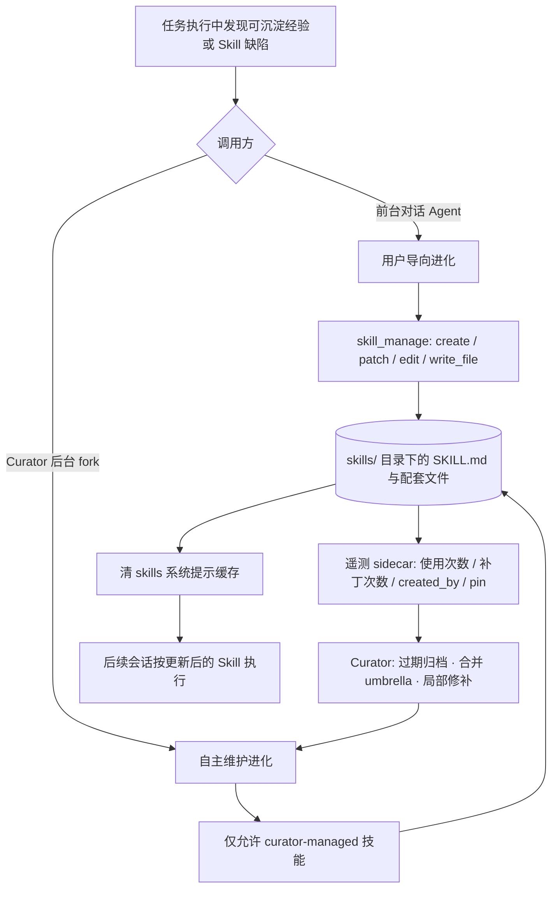
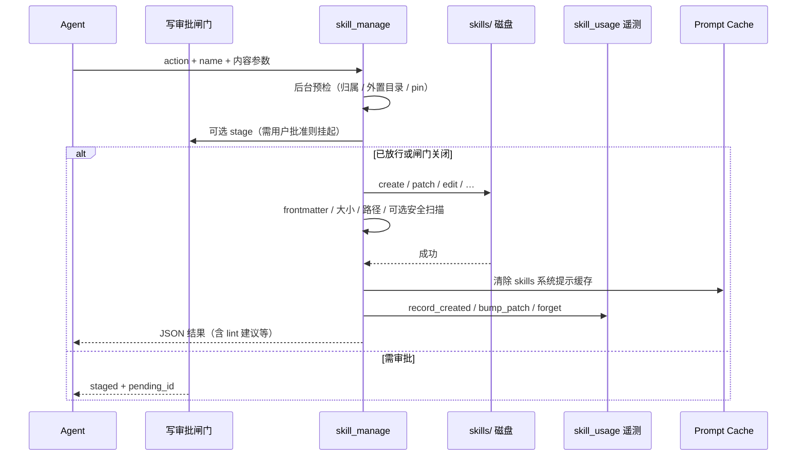

# SKILL 自进化说明文档

本文档说明 **Skill（技能）自进化** 的设计动机、实现方法与价值。实现参考来自 Hermes Agent 的 `skill_manage` 工具链路（`tools/skill_manager_tool.py`）及其配套的遥测与 Curator 维护体系。文中 Mermaid 图可在 Obsidian 中渲染。

> **与 MyClaw Skill 系统的关系**  
> MyClaw 已具备 Skill 的加载、启用/禁用、导入、编辑与 Agent 调用（见 `MyClaw实现详解/MyClaw_SKILL实现文档.md`）。本文是自进化能力的**设计蓝本与动机说明**；落地后的模块、API、配置与数据流以该实现文档（尤其 §10）为准。二者分工：本文讲「为什么 / 对齐 Hermes 的什么」；实现文档讲「MyClaw 代码里怎么做的」。

---

## 1. 什么是 SKILL 自进化

Skill 是 Agent 的 **程序性记忆（procedural memory）**：记录「如何完成某一类任务」——触发条件、步骤、命令、坑点与验证方式。

| 记忆类型 | 典型载体 | 内容形态 |
|----------|----------|----------|
| 陈述式记忆 | MEMORY.md / 向量记忆 | 偏好、事实、实体（*是什么*） |
| 程序性记忆 | `SKILL.md` + 配套脚本/模板 | 可执行流程（*怎么做*） |

**自进化**不是对模型权重做微调，而是一套闭环：

1. Agent 在任务中发现可复用的做法或缺陷  
2. 通过写入工具把经验落到磁盘上的 Skill  
3. 后续会话加载并使用更新后的 Skill  
4. 后台维护（归档、合并、修补）防止技能库腐烂  

因此，自进化的本质是：**经验 → 可版本化的 Skill 资产 → 再经验 → 再改写**。

---

## 2. 为什么要实现 SKILL 自进化

### 2.1 没有自进化时的问题

| 问题 | 表现 |
|------|------|
| 经验易丢失 | 某次复杂排障成功后，流程只留在对话里；下次同类任务仍从零探索 |
| 静态 Skill 会过时 | 环境、API、OS 差异导致步骤失效，但文档不会自动修正 |
| 上下文成本高 | 每次靠长对话重推流程，浪费 token，且结果不稳定 |
| 知识无法跨会话复用 | 同一用户、多会话、多工作区之间缺少「怎么做」的沉淀层 |
| 技能库只会膨胀 | 只增不改、不合并，最终索引噪音大、触发条件冲突 |

### 2.2 设计目标

- **把成功路径固化**：复杂任务（多步工具调用、踩坑后修正、用户纠正有效）应能沉淀为 Skill  
- **用时即改**：发现 Skill 缺步骤、写错命令、平台差异时，立即局部 patch，而不是下次再踩一次  
- **区分所有权**：用户主动创建的技能归用户；后台自主沉淀的技能才进入自动维护面  
- **可恢复、可审计**：自主删除优先归档而非硬删；合并需声明吸收目标，避免静默抹掉仍被 cron/自动化引用的名字  

### 2.3 一句话动机

> Agent 会「做对一次」，不等于系统「永远会做对」。SKILL 自进化把「做对一次」变成「下次默认按正确流程做」，并允许在现实反馈下持续修正。

---

## 3. 具体实现方法

### 3.1 总体架构

自进化由三层配合完成：**变异面（写入工具）**、**遥测/归属**、**后台生命周期（Curator）**。

### 3.2 变异面：`skill_manage` 六类动作

核心写入入口是 `skill_manage`（Hermes：`tools/skill_manager_tool.py`）。它把「进化」表达为显式、可校验的文件操作：

| 动作 | 作用 | 进化语义 |
|------|------|----------|
| `create` | 新建目录 + `SKILL.md` | 新沉淀一条程序性知识 |
| `patch` | 对 `SKILL.md` 或配套文件做 find-replace | **首选**：局部纠错，成本低、风险小 |
| `edit` | 整篇重写 `SKILL.md` | 大改版时使用 |
| `write_file` | 写入 `references/`、`templates/`、`scripts/`、`assets/` | 补脚本、参考、模板 |
| `remove_file` | 删除配套文件 | 去掉过时附件 |
| `delete` | 删除或归档技能 | 淘汰，或合并进 umbrella 后清理 |

工具 Schema 中内嵌的策略提示（给模型看的「何时进化」）：

- **Create when**：复杂任务成功（例如多轮工具调用）、错误被克服、用户纠正后的路径有效、发现非平凡工作流、用户要求记住流程  
- **Update when**：说明过时/错误、平台相关失败、使用中发现缺步骤或缺坑点——**用了就立刻 patch**  
- **Skip**：简单一次性任务不必建 Skill；创建/删除前宜与用户确认  

### 3.3 写入流水线（单次进化如何落地）

一次成功的 `skill_manage` 大致经过：

关键实现要点：

1. **校验**：名称合法、YAML frontmatter、内容长度、配套文件路径不得穿越目录  
2. **原子写**：写入后可选安全扫描；扫描拦截则回滚，避免留下半成品危险 Skill  
3. **模糊匹配 patch**：允许轻微空白/缩进差异，降低「改不进去」导致进化中断的概率  
4. **Lint 仅建议**：规范问题以 `lint_warnings` 返回，引导再 patch，不硬挡写入  
5. **缓存失效**：成功后清除 skills 相关 system prompt 缓存，保证下一会话索引与内容一致（注意：不在同一对话中途重写整份 system prompt，以免破坏 prompt caching）

### 3.4 两条进化路径与所有权

| 路径 | 触发者 | `create` 归属 | 可写范围 |
|------|--------|---------------|----------|
| 前台进化 | 用户对话中的 Agent | **用户资产**（不标 `created_by: agent`） | 用户允许下可改多数本地 Skill；pin 仅挡删除 |
| 后台进化 | Curator / background review fork | **curator-managed**（`created_by: agent`） | 仅本地、非 pin、非 bundled/hub/external 的 curator-managed Skill |

归属逻辑（成功写入后的遥测）：

- 前台 `create`：用户导向沉淀 → Curator **不得**擅自改写  
- 后台 `create`：自主沉淀 → 进入自动维护面  
- `patch` / `edit` / `write_file` / `remove_file`：递增 `patch_count`，记录最近修补时间  
- 前台硬删：`forget` 清遥测；后台合并删除：走 **archive**，保留可恢复记录  

### 3.5 后台自主进化的安全护栏

自主维护没有用户在环，护栏比前台更严：

| 护栏 | 规则 |
|------|------|
| 写范围 | 拒绝 external_dirs、bundled、hub、非 curator-managed、pin 技能 |
| 先读后写 | 必须先 `skill_view` 读过目标文件，才能 patch/edit（防凭对话臆测改写） |
| 合并删除 | `delete` 必须带已存在的 `absorbed_into=<umbrella>`；裸删 fail-closed |
| 删除语义 | 后台最大破坏动作是 **归档**（可 restore），不是永久 `rmtree` |
| 用户技能 opt-in | 用户技能需显式 `curator adopt` 才进入自主维护 |

### 3.6 与生命周期配套（本工具之外）

`skill_manage` 是 **变异算子**；完整自进化还依赖：

| 组件 | 职责 |
|------|------|
| `skill_usage` 遥测 | `use_count`、`patch_count`、`created_by`、`pinned`、归档状态 |
| Curator | 空闲时审查：过期归档、合并相似技能为 umbrella、局部修补 |
| `skill_view` | 读取现有 Skill，支撑「先读后写」与高质量 patch |
| 可选写审批 / org sync | 敏感环境先 stage 再批准；组织共享 Skill 可本地改后 propose 回上游 |

### 3.7 在 MyClaw 落地时可对照的映射

| Hermes 概念 | MyClaw 可对接点（现状 / 建议） |
|-------------|-------------------------------|
| `~/.hermes/skills/` | 工作空间 `skills/` + `SkillLoader` |
| `skill_manage` | 新增 Agent 工具：封装 create/patch/edit，内部复用现有编辑/导入 API |
| `skill_usage` | 可新增 sidecar（如 `skill_usage.json`）记录使用与修补 |
| Curator | 可做成定时任务 / heartbeat：只维护「agent 创建」标记的技能 |
| pin / archive | 扩展 `skill_states.json` 或独立状态字段 |

---

## 4. SKILL 自进化的意义

### 4.1 对 Agent 能力

- **从一次性聪明 → 可复现能力**：同类任务第二次起有标准作业程序（SOP）  
- **从静态说明书 → 活文档**：真实失败反馈能回流到 Skill，减少幻觉步骤  
- **缩小探索空间**：工具调用更短、更稳，复杂工作流不再每次重新发明  

### 4.2 对用户与产品

- **个性化积累**：个人/团队特有的环境、脚本习惯、排障套路被沉淀下来  
- **可控信任边界**：用户技能与自主技能分离，pin 保护关键流程不被误删  
- **可运维的技能库**：归档、合并、恢复让技能数量可控，避免「技能垃圾场」  

### 4.3 对系统成本与质量

- **降 token / 降延迟**：复用 Skill 替代长上下文重推流程  
- **提成功率**：坑点与验证步骤写进 Skill，降低重复踩坑  
- **可观测**：`patch_count`、使用与归档记录支撑审计与产品改进  

### 4.4 与 Memory / RAG 的分工

| 系统 | 回答的问题 | 自进化侧重点 |
|------|------------|--------------|
| Memory | 用户是谁、偏好与事实是什么 | 陈述式知识的增删改检索 |
| RAG | 外部文档里写了什么 | 语料索引与召回 |
| Skill 自进化 | 这类任务应该怎么做 | 流程的创建、修补、合并、归档 |

三者互补：Memory/RAG 提供「知道什么」，Skill 自进化提供「会做什么，且越做越准」。

---

## 5. 小结

| 维度 | 要点 |
|------|------|
| **是什么** | 把任务经验写成可复用 `SKILL.md`，并在使用与后台维护中持续改写 |
| **为什么** | 避免成功经验丢失、静态技能腐烂、重复探索与技能库无序膨胀 |
| **怎么做** | 写入工具（create/patch/edit/…）+ 归属遥测 + Curator 护栏化自主维护 |
| **意义** | 让 Agent 能力可复现、可改进、可运维，并与 Memory/RAG 形成清晰分工 |

**一句话**：SKILL 自进化不是让模型「自己变聪明」，而是让系统把「做对的一次」固化成资产，并在反馈中不断修订这套资产——从而让 Agent 在真实工作流上越用越稳、越用越省。
