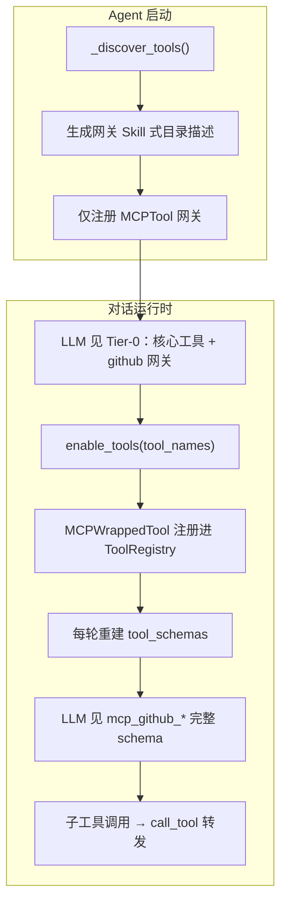
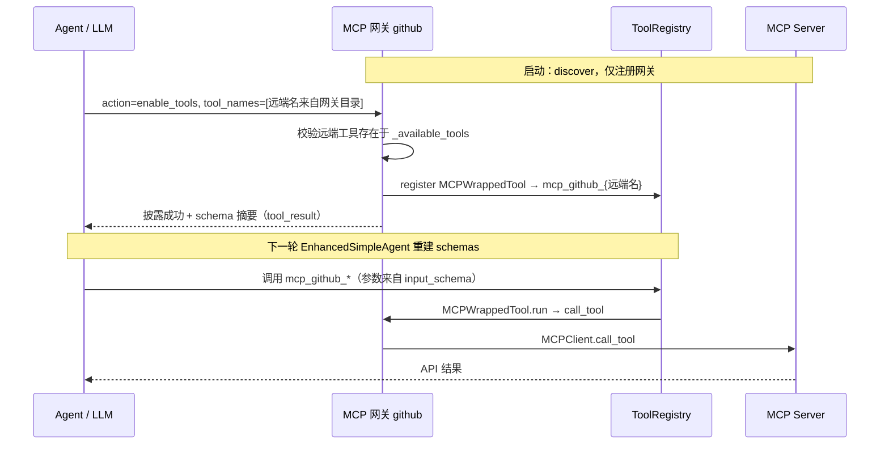
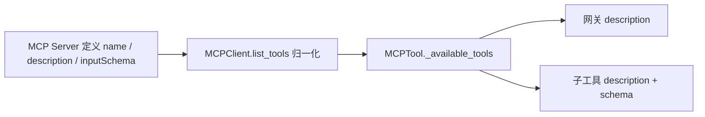
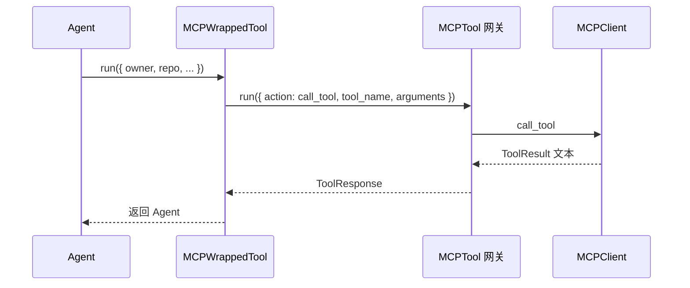

# MCP 工具实现说明（MyClaw）

本文基于以下代码实现梳理：

- `backend/src/tools/builtin/mcp_tool.py` — MCP 网关与渐进披露
- `backend/src/tools/builtin/mcp_wrapper_tool.py` — 远端子工具包装
- `backend/src/mcp/client.py` — 多传输 MCP 客户端
- `backend/src/agent/myclaw_agent.py` — 注册与会话级清理
- `backend/src/agent/enhanced_simple_agent.py` — 每轮重建 tool schema
- `backend/src/workspace/templates/config.json` — 配置模板
- `backend/src/workspace/templates/AGENTS.md` — Agent 使用约定

---

## 1. MCP 是什么，Agent 为什么需要 MCP

### 1.1 MCP 的作用

MCP（Model Context Protocol）是让 Agent 以统一协议连接外部能力的接口层。  
它把「外部工具、资源、提示词模板」抽象成标准操作（如 `list_tools`、`call_tool`、`list_resources`、`get_prompt`），从而让 Agent 不必为每个外部系统单独写适配逻辑。

### 1.2 Agent 需要 MCP 的原因

- **统一接入**：同一套调用模型，可接文件系统、GitHub、Slack、数据库等服务器。
- **上下文增强**：不仅能调用函数，还能读取资源与 prompt 模板。
- **解耦扩展**：新增能力多为「挂新 MCP Server」，而非改 Agent 核心。
- **跨运行形态**：支持本地进程（stdio）、内存（测试）、HTTP/SSE（远程托管服务）。

### 1.3 MyClaw 中的特殊问题：工具数量膨胀

单个 GitHub MCP 服务器即可暴露二十余个 API 工具。若启动时**全部展开**并注入 LLM 的 function calling schema，会导致：

- Token 占用陡增；
- 工具选型准确率下降（与 Read / rag / web 等内置工具争抢注意力）；
- 与 AGENTS.md「按需使用 MCP」的约定不一致。

因此 MyClaw 默认采用 **渐进式披露（Progressive Disclosure）**，而非启动时全量展开。

---

## 2. 组件分层

| 层级 | 路径 | 职责 |
|------|------|------|
| 协议层 | `backend/src/mcp/` | `MCPClient` 多传输连接；`list_tools` 结果归一化 |
| 工具层 | `mcp_tool.py` | MCP **网关**；discover、描述生成、`enable_tools`、转发 `call_tool` |
| 包装层 | `mcp_wrapper_tool.py` | 单个远端工具 → 本地 `Tool`（含 JSON Schema → 参数列表） |
| Agent 层 | `myclaw_agent.py` | 读 `~/.helloclaw/config.json` 注册 MCP；切换 session 时清理已披露子工具 |
| Agent 层 | `enhanced_simple_agent.py` | **每轮工具迭代**重建 `_build_tool_schemas()`，使披露后的子工具对 LLM 可见 |

---

## 3. 两种运行模式

配置项 `auto_expand`（`~/.helloclaw/config.json` → `mcp.servers[]`）控制行为：

| 模式 | `auto_expand` | 启动时 ToolRegistry | 典型日志 |
|------|---------------|---------------------|----------|
| **渐进披露（默认）** | `false` | 仅 1 个网关（如 `github`） | `✅ 工具 'github' 已注册。` |
| **全量展开（兼容旧行为）** | `true` | 网关 + 全部 `mcp_github_*` 子工具 | `✅ 工具 'github' 已展开为 N 个独立工具` |

> **注意**：运行时读取的是 `~/.helloclaw/config.json`，不是项目内模板。若全局配置仍为 `"auto_expand": true`，仍会全量展开。

### 3.1 渐进披露总览



### 3.2 与 Skill 的类比

| 维度 | Skill | MCP 渐进披露 |
|------|-------|----------------|
| 常驻暴露 | 1 个 `Skill` 工具 | 1 个 MCP 网关（如 `github`） |
| 目录来源 | `SkillLoader` 聚合描述 | 启动时 `list_tools`，写入网关 `description` |
| 按需加载 | `run({ skill: "pdf" })` | `run({ action: "enable_tools", tool_names: [...] })` |
| 加载结果 | 手册文本注入 tool_result | **可调用子工具**注册进 ToolRegistry |
| 参数准确性 | 手册指导行为 | 子工具自带 MCP `input_schema` |

**一句话**：Skill 决定「该怎么做」；MCP 提供「能连哪里、能调什么 API」。

---

## 4. 推荐调用协议（两阶段）

Agent 侧约定（见 `AGENTS.md` §5.5）：



### 4.1 网关 action 一览

| action | 用途 | 必填参数 |
|--------|------|----------|
| **enable_tools** | 推荐 — 按需披露子工具 | `tool_names` |
| **enable_and_call** | 披露并立即调用（同轮兜底） | `tool_name`, `arguments` |
| list_tools | 刷新/调试远端清单 | — |
| call_tool | 不经披露的直连（参数易错） | `tool_name`, `arguments` |
| list_resources / read_resource | 资源 | `uri`（read 时） |
| list_prompts / get_prompt | 提示词模板 | `prompt_name`（get 时） |

披露后的子工具命名：`mcp_{网关名}_{远端工具名}`（远端名必须与 discover 目录一致，托管与 npm 命名可能不同）。

---

## 5. 工具描述如何生成

数据流：



### 5.1 远端元数据来源

`MCPClient.list_tools()` 将 fastmcp 返回归一化为：

```python
{
    "name": tool.name,
    "description": tool.description or "",
    "input_schema": tool.inputSchema  # JSON Schema
}
```

**描述与 schema 的权威来源是 MCP 服务器**，MyClaw 不做业务语义改写。

### 5.2 网关描述（`_generate_description`）

- **渐进模式**：拼接 Skill 式长描述 — 远端工具目录（每工具取 description **首句**）+ 使用说明 + 本会话已披露列表。
- **全量展开模式**：简短说明「包含 N 个工具、启动时已展开」。
- **discover 失败**：兜底文案，提示 `list_tools` / `enable_tools`。

### 5.3 子工具描述（`MCPWrappedTool`）

- **description**：MCP 返回的**完整** `description`（不截断）。
- **参数**：见下节。

---

## 6. 参数 schema 如何确定

### 6.1 网关 schema — 代码固定

`MCPTool.get_parameters()` 手写 `action`、`tool_names`、`tool_name`、`arguments` 等，与远端 API 无关。LLM 通过网关调用时，**看不到** GitHub 各 API 的字段级 schema。

### 6.2 披露子工具 schema — 来自 MCP `input_schema`

`MCPWrappedTool._parse_input_schema()` 将 JSON Schema 映射为 `ToolParameter`：

| JSON Schema | ToolParameter |
|-------------|---------------|
| `properties` 的 key | 参数名 |
| property.`type` | 类型（默认 `string`） |
| property.`description` | 参数说明 |
| `required` 数组 | 是否必填 |

**已知局限**：仅处理一层 `properties`；嵌套 object、oneOf、$ref 等复杂 schema 未完整支持。

### 6.3 发给 LLM 的最终 schema

`EnhancedSimpleAgent._build_tool_schemas()` 将 `ToolParameter` 转为 OpenAI function calling 格式。**每轮工具迭代都会重新构建**，否则 `enable_tools` 后 LLM 看不到新注册的 `mcp_*` 工具。

---

## 7. MCPTool 初始化与连接

### 7.1 服务来源（三选一）

1. **内置 Demo Server** — 未配置 `server_command` / `server_url` / `server`
2. **本地 stdio** — `server_command: ["npx", "-y", "..."]`
3. **远程 HTTP/SSE** — `server_url` + 可选 `transport_type`、`headers`

GitHub **推荐**托管地址（工具更全）：

```json
{
  "name": "github",
  "server_url": "https://api.githubcopilot.com/mcp/",
  "transport_type": "http",
  "env_keys": ["GITHUB_PERSONAL_ACCESS_TOKEN"],
  "auto_expand": false
}
```

若仍使用已弃用的 `@modelcontextprotocol/server-github`（npm，约 26 个工具），启动时会打印迁移提示。

### 7.2 GitHub：托管 MCP vs 本地 npm（为何 Cursor 工具更多）

| 对比项 | `server_url` 托管（推荐） | `server_command` + 弃用 npm 包 |
|--------|---------------------------|--------------------------------|
| 地址 / 命令 | `https://api.githubcopilot.com/mcp/` | `npx -y @modelcontextprotocol/server-github` |
| 传输 | HTTP（`StreamableHttpTransport`） | stdio（`NpxStdioTransport` / `StdioTransport`） |
| 工具数量（实测量级） | 约 **46**（含 Copilot 专属 toolset） | 约 **26** |
| 与 Cursor 对齐 | 是 | 否（旧版 API 面） |
| 鉴权 | `Authorization: Bearer <PAT>`（可由 `env_keys` 自动注入） | 子进程环境变量 `GITHUB_PERSONAL_ACCESS_TOKEN` |
| 维护状态 | GitHub 官方托管、持续更新 | npm 包已弃用，迁移至 `github/github-mcp-server` |

**重要**：两套服务器的**远端工具名不一定相同**（例如旧包常见 `search_repositories`，托管版可能为 `search_repositories` 或其它命名）。`enable_tools` 必须使用网关 `description` 目录中的**精确远端名**，不能凭记忆或 Cursor 文档里的别名。

### 7.3 环境变量与鉴权

优先级：`env` > `env_keys` > `MCP_SERVER_ENV_MAP` 自动检测。

远程 GitHub：可从 `GITHUB_PERSONAL_ACCESS_TOKEN` 自动注入 `Authorization: Bearer ...` 请求头。

### 7.4 异步与事件循环

`_discover_tools()` 与 `run()` 内 MCP 操作：若当前线程已有 asyncio 事件循环（如 uvicorn/FastAPI），则在**新线程 + 新 event loop** 中执行，避免 `asyncio.run()` 与运行中 loop 冲突。

若网关 `list_tools` / `enable_tools` 报错 `asyncio.run() cannot be called from a running event loop`，说明 MCP 调用未正确落入线程隔离路径，需检查 Agent 是否在异步上下文中同步调用了 `Tool.run()`（属 Harness 集成问题，与 MCP 配置无关）。

### 7.5 `MCPClient` 实现要点（相对初版）

- **HTTP**：`server_url` + `headers` / `auth`（Bearer PAT），对应 `StreamableHttpTransport`。
- **npx**：`["npx","-y","@scope/pkg"]` 解析为 `NpxStdioTransport`，Windows 上自动解析 `npx.cmd`。
- **list_tools / list_resources / list_prompts**：兼容 fastmcp 3.x 直接返回 `list` 与旧版带 `.tools` 字段的两种结果；`list_tools` 分页由 fastmcp 自动拉全。
- **日志**：传输层使用 `logging`，避免 Windows GBK 控制台因 emoji `print` 崩溃。

---

## 8. 传输层选择（`MCPClient`）

```mermaid
flowchart LR
    A[server_source 输入] --> B{类型判断}
    B -->|FastMCP 实例| C[memory 传输]
    B -->|dict 配置| D[stdio / http / sse]
    B -->|http(s) URL| E[StreamableHttpTransport 或 SSETransport]
    B -->|.py 脚本| F[PythonStdioTransport]
    B -->|npx -y pkg| G[NpxStdioTransport]
    B -->|其它 command| H[StdioTransport]
```

---

## 9. MCPWrappedTool 与 call_tool 转发



全量展开模式下，启动时即创建全部 `MCPWrappedTool` 并注册，无需 `enable_tools`。

---

## 10. 会话级披露生命周期

| 事件 | 行为 |
|------|------|
| `enable_tools` 成功 | 子工具注册进 ToolRegistry，同 session 内保持可用 |
| 切换 session / `clear_all_history` | `reset_all_mcp_disclosed_tools()` 注销已披露子工具 |
| `shutdown` | 同上，再清空注册表 |
| 披露上限 | 环境变量 `MCP_MAX_DISCLOSED_TOOLS`（默认 20） |

---

## 11. 配置参考

文件：`~/.helloclaw/config.json`（模板见 `backend/src/workspace/templates/config.json`）

```json
{
  "mcp": {
    "enabled": true,
    "builtin_demo": true,
    "servers": [
      {
        "name": "github",
        "server_url": "https://api.githubcopilot.com/mcp/",
        "transport_type": "http",
        "env_keys": ["GITHUB_PERSONAL_ACCESS_TOKEN"],
        "auto_expand": false
      }
    ]
  }
}
```

| 字段 | 说明 |
|------|------|
| `enabled` | 是否注册 MCP |
| `builtin_demo` | `servers` 为空时是否注册内置演示 MCP |
| `name` | 网关在 ToolRegistry 中的名称 |
| `server_url` / `server_command` | 二选一 |
| `transport_type` | 远程：`http`（默认）或 `sse` |
| `env_keys` / `env` / `headers` | 鉴权 |
| `auto_expand` | `false` = 渐进披露（推荐）；`true` = 全量展开 |

---

## 12. 常见问题

### 12.1 启动仍显示「已展开为 26 个」

检查 `~/.helloclaw/config.json` 中对应 server 的 `auto_expand` 是否为 `true`。

### 12.2 enable_tools 后 LLM 仍调不到子工具

确认 `EnhancedSimpleAgent` 在**每轮**工具迭代重建 schema；披露发生在迭代 N，调用应在迭代 N+1（或使用 `enable_and_call`）。

### 12.3 工具返回 JSON 极大，session 文件很长

终端 `print` 的 200 字符预览**不**写入 session；`tool` 角色消息存**完整**结果。大体积 MCP 响应（如 `search_repositories`）会原样进入历史，需单独做输出截断策略（与选型侧渐进披露正交）。

### 12.4 鉴权失败

确认 `GITHUB_PERSONAL_ACCESS_TOKEN` 已设置且对托管 MCP 具备足够 scope。托管端点返回 401 时，`_discover_tools()` 会得到空目录，表现为 `enable_tools` 报「远端工具不存在」。

### 12.5 `enable_tools` 报「远端工具不存在」且可用示例为空

常见原因（按优先级排查）：

1. **discover 失败**：未配置 `server_url`、PAT 无效、网络无法访问 `api.githubcopilot.com`。
2. **工具名写错**：未从网关 `description` 目录复制远端名（托管与 npm 命名可能不同）。
3. **仍用弃用 npm 包**：仅 26 个工具且名称集与文档/Cursor 示例不一致。
4. **配置未生效**：修改的是项目模板而非 `~/.helloclaw/config.json`。

处理：先对网关执行 `action=list_tools` 刷新；成功后再 `enable_tools` 目录中出现的名称。

### 12.6 工具数量与 Cursor 不一致

Cursor 默认连 `https://api.githubcopilot.com/mcp/`；MyClaw 若仍配 `server_command` + `@modelcontextprotocol/server-github`，只会 discover 约 26 个。改为 `server_url` 托管配置即可对齐量级。

---

## 13. 实现亮点与后续增强

### 已实现

1. **渐进披露** — 控制 LLM 可见工具规模，对齐 Skill 心智。
2. **多传输** — memory / stdio / http / sse 统一入口。
3. **事件循环兼容** — 线程隔离 asyncio，适配 uvicorn。
4. **结构化 ToolResponse** — 统一成功/错误协议。
5. **GitHub 托管 MCP** — `server_url` 优先于弃用 npm 包；自动 Bearer 鉴权。
6. **会话级清理** — 避免披露工具跨 session 泄漏。
7. **传输实现加固** — NpxStdioTransport、Windows 命令解析、fastmcp 3 列表归一化。

### 可继续增强

1. **工具结果截断** — 写入 history / LLM context 前按工具类型限长。
2. **复杂 JSON Schema** — 支持 nested / oneOf 或生成简化 schema。
3. **超时 / 重试 / 熔断** — 远程 MCP 稳定性。
4. **连接池** — 减少每次 `call_tool` 新建 stdio 进程的开销（stdio 场景）。
5. **观测性** — per-action 延迟、transport、error_code 指标。

---

## 14. 一句话总结

MyClaw 的 MCP 实现以 **网关 + 渐进披露** 为核心：启动时 discover 并生成目录，默认只暴露网关；Agent 通过 `enable_tools` 按需注册带完整 schema 的子工具，并在每轮迭代重建 function calling 列表。全量 `auto_expand` 保留作兼容；GitHub 等远程场景优先 `server_url` 托管 MCP。
