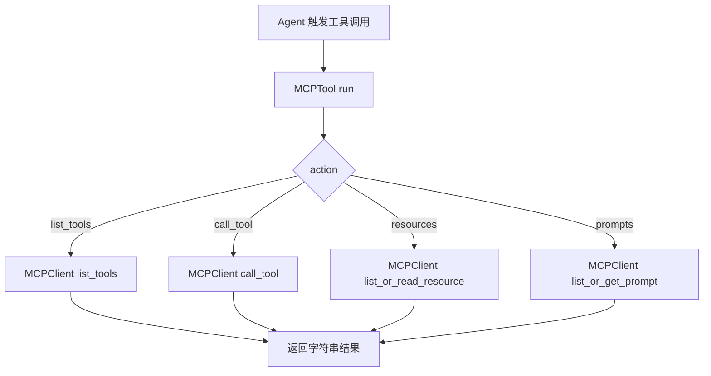
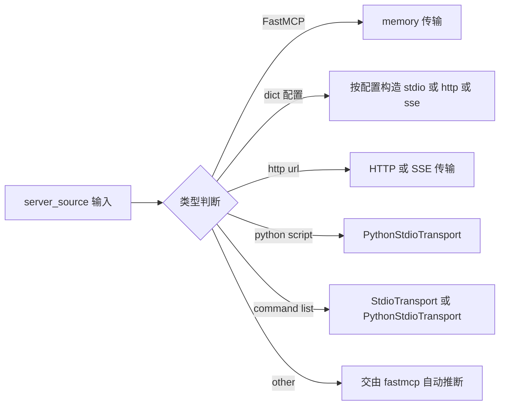
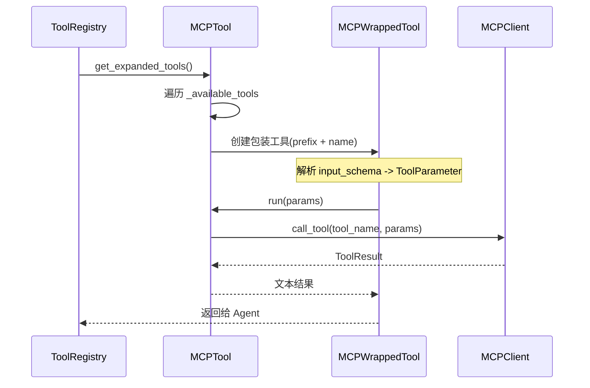

# MCP 工具实现说明（MyClaw）

本文基于以下代码实现梳理：
- `backend/src/tools/builtin/mcp_tool.py`
- `backend/src/tools/builtin/mcp_wrapper_tool.py`
- `backend/src/mcp/client.py`
- `backend/src/mcp/server.py`
- `backend/src/mcp/utils.py`
- `backend/src/mcp/__init__.py`

---

## 1. MCP 是什么，Agent 为什么需要 MCP

### 1.1 MCP 的作用
MCP（Model Context Protocol）是让 Agent 以统一协议连接外部能力的接口层。  
它把“外部工具、资源、提示词模板”都抽象成标准操作（如 `list_tools`、`call_tool`、`list_resources`、`get_prompt`），从而让 Agent 不必为每个外部系统单独写一套适配逻辑。

### 1.2 Agent 需要 MCP 的原因
- **统一接入**：同一套调用模型，可接文件系统、GitHub、Slack、数据库等服务器。
- **上下文增强**：不仅能调用函数，还能拿到资源与 prompt 模板，增强推理上下文。
- **解耦扩展**：新增能力更多是“挂新 MCP Server”，不是改 Agent 核心逻辑。
- **跨运行形态**：支持本地进程（stdio）、内存（测试）、HTTP/SSE（远程服务）。

---

## 2. 当前代码如何实现 MCP

## 2.1 组件分层

- **协议层封装**：`backend/src/mcp/`
  - `client.py`：增强 MCP 客户端，处理多传输方式与结果标准化。
  - `server.py`：基于 `fastmcp` 的服务器封装（工具/资源/prompt 注册）。
  - `utils.py`：上下文与响应结构辅助函数。
  - `__init__.py`：按依赖可用性进行导出和降级提示。
- **工具层封装**：`backend/src/tools/builtin/`
  - `mcp_tool.py`：Agent 可直接调用的 MCP 总入口（list/call/read/prompt）。
  - `mcp_wrapper_tool.py`：把 MCP 远端工具“展开”为本地独立 Tool。

---

## 2.2 核心流程图（可在 Obsidian 渲染）

---

## 2.3 传输层选择流程（`MCPClient`）

`MCPClient._prepare_server_source()` 根据输入自动选择传输方式：

---

## 2.4 MCPTool 的运行机制（关键点）

1. **初始化**
   - 支持三种服务来源：
     - 内置 Demo Server（未传 `server_command` / `server`）
     - 外部命令启动（`server_command`）
     - 直接传 `FastMCP` 实例（内存传输）
   - 自动发现远端工具（`_discover_tools`），用于描述生成与 auto-expand。

2. **环境变量注入策略**
   - 优先级：`env` > `env_keys` > 自动检测（`MCP_SERVER_ENV_MAP`）。
   - 能自动识别常见服务器（如 GitHub/Slack）所需 token。

3. **调用执行**
   - `run()` 内根据 `action` 路由到异步客户端操作。
   - 若当前线程已有事件循环，使用 `ThreadPoolExecutor + 新 event loop` 避免冲突。
   - 输出对用户友好的文本结果，而非原始协议对象。

4. **auto_expand 机制**
   - `get_expanded_tools()` 使用 `MCPWrappedTool` 将远端每个工具转为独立 Tool。
   - 包装器会把 JSON Schema 输入自动映射为 `ToolParameter` 列表。

---

## 2.5 MCPWrappedTool 展开机制图

---

## 3. MCP 与 Skill 的区别

| 维度 | MCP | Skill |
|---|---|---|
| 本质 | 协议化“能力连接器” | 领域知识/流程说明加载器 |
| 主要解决 | 如何连外部系统并执行动作 | 如何让 Agent 遵循某领域最佳实践 |
| 典型产出 | 工具调用结果、资源内容、prompt 模板 | `SKILL.md` 指南文本与资源提示 |
| 时效性 | 面向实时/动态系统（API、服务） | 面向静态/半静态方法论 |
| 风险点 | 网络、鉴权、远程副作用、协议兼容 | 指令过时、流程漂移 |
| 组合方式 | “做事” | “指导如何做事” |

一句话：**Skill 决定“该怎么做”，MCP 提供“能去哪里做、做什么”。**

---

## 4. MCP 的常见问题与本实现中的表现

### 4.1 常见问题
- **鉴权复杂**：不同服务器有不同 token/key 约定。
- **传输兼容性**：stdio/http/sse 行为和错误模型不同。
- **事件循环冲突**：在异步框架内嵌套调用容易报错。
- **结果格式异构**：不同 server 返回对象结构不一致。
- **安全边界**：连接外部工具意味着更大副作用面。

### 4.2 在本实现中的处理
- 通过 `MCP_SERVER_ENV_MAP + env/env_keys` 缓解鉴权配置负担。
- `MCPClient` 统一多传输入口，隐藏底层差异。
- `MCPTool.run()` 采用“有循环则新线程+新loop”的兼容策略。
- `client.py` 对 `ToolResult`/`Resource`/`Prompt` 做了二次解析，统一成更易消费的数据。

---

## 5. 这份 MCP 实现的亮点

1. **多传输自动推断很实用**  
   一个 `MCPClient` 同时覆盖 memory / stdio / http / sse，工程可迁移性高。

2. **事件循环冲突处理成熟**  
   在已有 loop 的场景下切线程跑新 loop，避免“cannot run event loop”类问题。

3. **自动工具发现 + 自动展开**  
   先发现远端能力，再按 JSON Schema 转本地 Tool 参数，Agent 体验接近原生工具。

4. **环境变量三层优先级**  
   同时兼顾“快速起步”（自动检测）和“生产可控”（显式 env 覆盖）。

5. **内置演示服务器降低接入门槛**  
   无外部依赖时也可验证 MCP 全链路行为，便于开发调试与教学。

---

## 6. 当前实现可继续增强的点（建议）

1. **接入层注册可见性**
   - 目前 `backend/src/tools/__init__.py` 未导出 `MCPTool`，`HelloClawAgent._setup_tools()` 也未注册 MCP。
   - 若要正式启用，建议补齐导出与注册路径。

2. **返回结构标准化**
   - 现 `MCPTool.run()` 主要返回拼接文本；建议增加结构化 `ToolResponse`（含 code/data），便于前端与自动化处理。

3. **超时/重试/熔断**
   - 远程 MCP 场景建议加入统一超时与重试策略，提升稳定性。

4. **安全白名单**
   - 建议增加允许连接的 MCP server 白名单（命令、域名、URI scheme）。

5. **观测性**
   - 增加 per-action 日志字段（transport、latency、server_name、error_code）。

---

## 7. 建议的使用姿势（实践）

- 对“领域方法”先用 Skill（例如 `pdf`），对“外部系统动作”用 MCP。
- 先 `list_tools` 探索能力，再 `call_tool`，避免盲调。
- 生产环境尽量显式传 `env_keys` 或 `env`，避免隐式自动检测导致的不确定性。
- 对远程服务优先配置超时和重试，避免阻塞主对话链路。

---

## 8. 一句话总结

这套实现已经具备了 MCP 在工程落地的关键骨架：**多传输、自动发现、工具展开、异步兼容、环境变量注入**。  
如果补上“统一注册入口 + 结构化响应 + 安全/观测增强”，可以很快从“可用”走向“可运营”。

