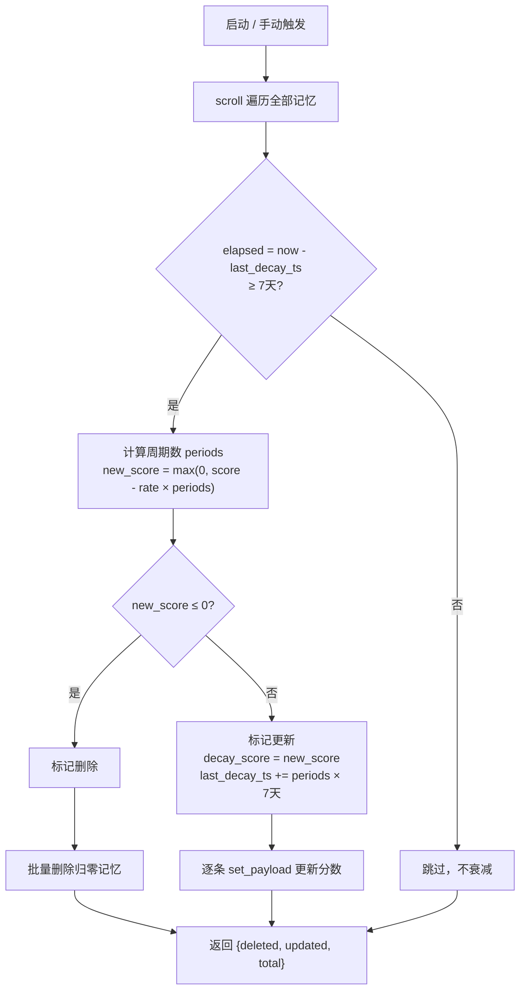
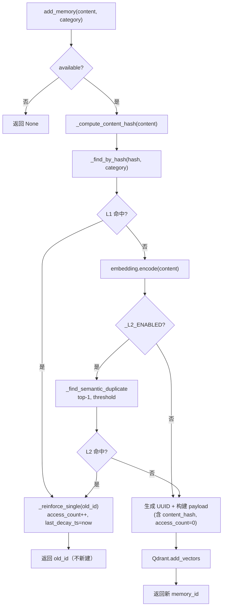
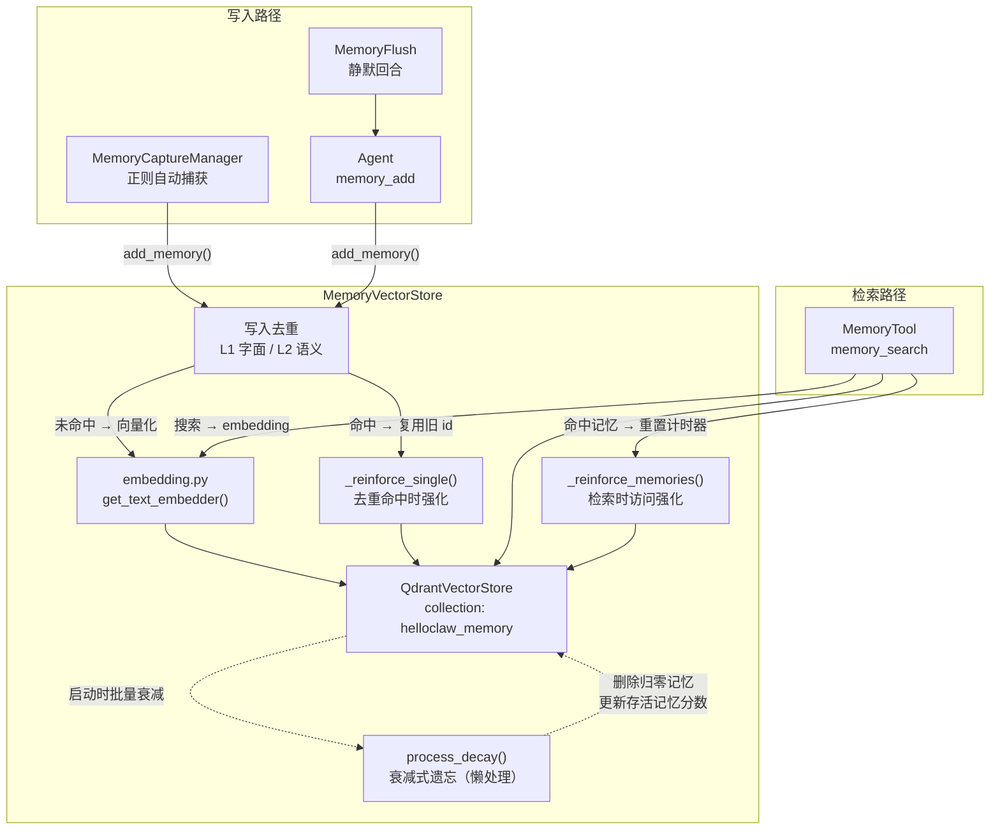
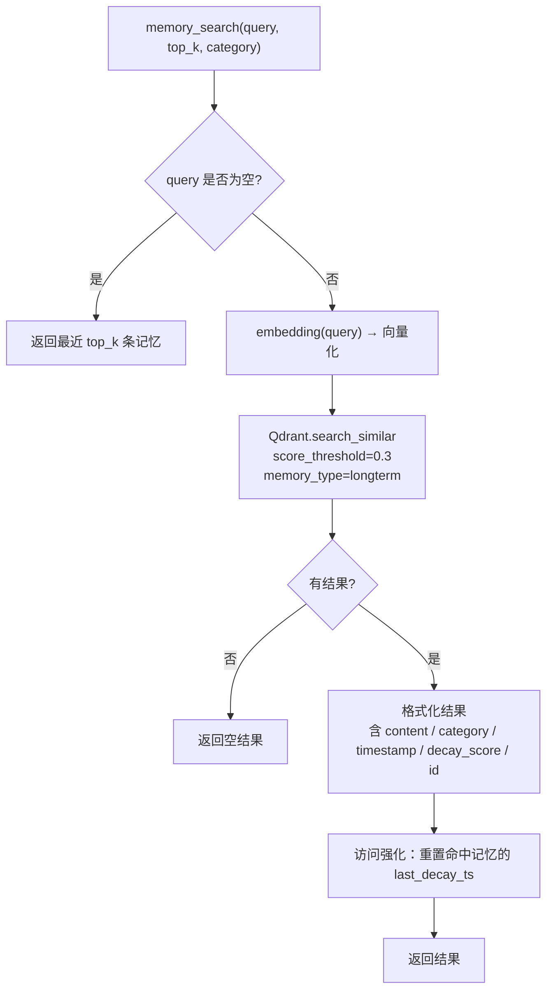
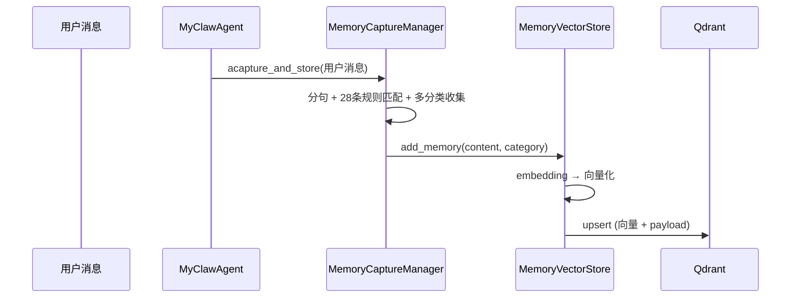
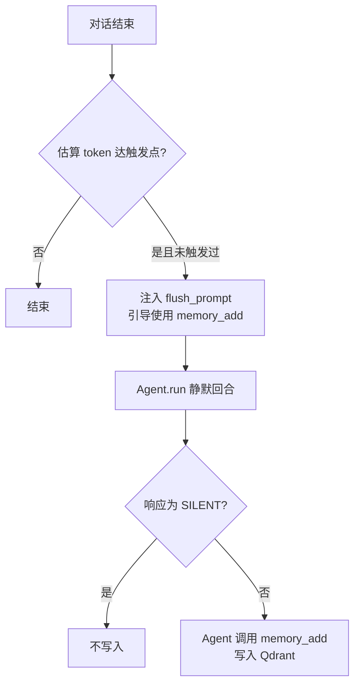
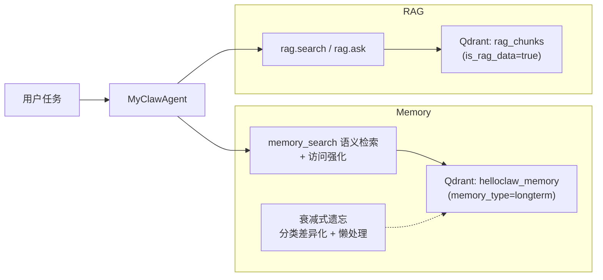

# Memory 实现与功能说明

本文档基于当前代码，说明 MyClaw 中 **Memory（记忆）** 的存储位置、内置工具接口、`backend/src/memory` 子模块职责，以及 **Memory 对 Agent 的意义** 与 **Memory 和 RAG 的关系**。文中的 Mermaid 图可在 Obsidian 中渲染。

---

## 1. 功能总览

记忆系统已重构为 **统一的长期记忆**，基于 **Qdrant 向量数据库** 存储，使用与 RAGTool 相同的 embedding 基础设施做语义检索。

| 特性 | 说明 |
|------|------|
| **存储** | Qdrant 向量数据库（collection: `helloclaw_memory`） |
| **写入方式** | 自动捕获（MemoryCaptureManager，正则匹配）、Agent 工具 `memory_add`、Memory Flush 静默回合 |
| **写入去重** | 写入路径上做两层去重：**L1 字面去重（默认启用）** 用 `content_hash + category` 精确匹配；**L2 语义去重（默认关闭）** 用 embedding top-1 + 阈值。命中均不新建，复用旧 memory_id 并强化（重置 `last_decay_ts` + `access_count++`） |
| **检索方式** | 语义检索（embedding → Qdrant search_similar），由 Agent 按需调用，不自动注入系统提示词 |
| **遗忘机制** | 衰减式遗忘：`decay_score` 初始 1.0，每 7 天按分类速率衰减，归零则删除；被检索命中的记忆重置计时器（用进废退）；懒处理（启动时批量执行） |
| **分类体系** | preference / decision / entity / fact / plan / relationship / reference / rule（8 种） |

### 与旧架构的区别

| 维度 | 旧架构 | 新架构 |
|------|--------|--------|
| 长期记忆 | `MEMORY.md` 文件 | Qdrant 向量 |
| 每日记忆 | `memory/YYYY-MM-DD.md` | 统一为长期记忆 |
| 会话摘要 | `memory/YYYY-MM-DD-slug.md` | 已移除 |
| 检索方式 | 文件子串匹配 | embedding 语义检索 |
| 进入模型 | 全量注入系统提示词 | Agent 按需调用 `memory_search` |

---

## 2. 存储层

### 2.1 MemoryVectorStore（`memory/vector_store.py`）

记忆专用 Qdrant 封装层，提供统一的 CRUD 接口：

```
MemoryVectorStore
├── qdrant_store: QdrantVectorStore (collection="helloclaw_memory")
├── embedder: EmbeddingModel (从 embedding.py 单例获取)
├── add_memory(content, category, session_id, source) → memory_id
├── search_memories(query, top_k, score_threshold, category) → List[dict]
├── delete_memories(memory_ids) → bool
├── process_decay() → {deleted, updated, total}   # 衰减式遗忘（懒处理）
├── cleanup_expired(days) → int                     # 向后兼容包装器 → process_decay
├── _reinforce_memories(memory_ids)                 # 访问强化（内部方法）
└── get_stats() → dict
```

**Qdrant Payload 结构**：

| 字段 | 类型 | 说明 |
|------|------|------|
| `content` | string | 记忆文本内容 |
| `content_hash` | keyword | 归一化内容 sha1[:16]（小写 + 折叠连续空白），用于 L1 字面去重精确匹配 |
| `category` | keyword | 分类标签 |
| `memory_type` | keyword | 固定 "longterm" |
| `memory_id` | keyword | UUID |
| `timestamp` | integer | Unix 时间戳（创建时间） |
| `added_at` | integer | Unix 时间戳（与 timestamp 相同，冗余保留） |
| `session_id` | keyword | 关联会话 ID（可选） |
| `source` | keyword | capture / agent / flush / api |
| `decay_score` | float | 衰减分数，初始 1.0，随时间递减，归零则删除 |
| `last_decay_ts` | integer | 上次衰减计算时间戳（用于懒策略 + 访问强化计时） |
| `access_count` | integer | 命中复用计数：每次被 L1/L2 去重命中或检索强化时 +1，反映"被回忆"的活跃度 |

> 用于 filter 的 keyword 字段必须建立 payload index。`MemoryVectorStore` 初始化时会自动确保 `category` 和 `content_hash` 的索引存在（云端 Qdrant 强制要求；本地 Qdrant 也建议建立以加速 scroll/filter）。

### 2.2 遗忘机制（衰减式）

采用 **衰减分数 + 分类差异化速率 + 访问强化 + 懒处理** 的设计，替代旧的固定时间阈值删除。

#### 核心机制

- 每条记忆写入时 `decay_score = 1.0`，`last_decay_ts = 当前时间戳`
- 每 **7 天**（`DECAY_INTERVAL_DAYS`）为一个衰减周期，每周期按分类对应的速率扣减 `decay_score`
- 当 `decay_score` 归零（≤ 0.0）时，该记忆被删除
- 衰减计算和删除 **只在程序启动时** 或 **手动调用 `memory_cleanup`** 时执行（懒策略），不随每轮对话触发

#### 分类差异化衰减速率

不同分类的记忆重要性不同，衰减速率也不同。值越小衰减越慢、记忆保留越久：

| 分类 | 每7天衰减量 | 理论寿命 | 设计理由 |
|------|------------|---------|---------|
| `entity` | 0.10 | ~70 天 | 个人信息、账号 — 不应遗忘 |
| `rule` | 0.10 | ~70 天 | 规则、约束 — 持久有效 |
| `preference` | 0.15 | ~47 天 | 用户偏好 — 较重要 |
| `relationship` | 0.15 | ~47 天 | 人际关系 — 较重要 |
| `decision` | 0.20 | ~35 天 | 决策 — 中等重要 |
| `plan` | 0.25 | ~28 天 | 计划 — 标准衰减 |
| `fact` | 0.25 | ~28 天 | 事实 — 标准衰减 |
| `reference` | 0.30 | ~23 天 | URL/路径 — 易过时 |

#### 访问强化（用进废退）

当记忆被 `search_memories` 检索命中时，自动重置该记忆的 `last_decay_ts` 为当前时间。这相当于给予一个新的完整衰减周期——**频繁被回忆的记忆将持久存在，无人问津的记忆自然消退**。每次检索最多涉及 `top_k` 条记忆（通常 5 条），每条仅一次轻量级 `set_payload` 调用。

#### `process_decay()` 处理流程



#### 触发时机

1. **Agent 启动时**（`main.py` lifespan startup）
2. **Agent 调用 `memory_cleanup` 工具时**
3. **调用 `/api/memory/cleanup` HTTP 接口时**

#### 向后兼容

- `cleanup_expired(days)` 保留为薄包装器，内部调用 `process_decay()` 并返回删除数量
- 对没有 `decay_score` / `last_decay_ts` 字段的旧记忆，`process_decay` 会自动回退到 `timestamp` 作为基准补算衰减

### 2.3 写入路径去重（L1 字面 / L2 语义）

`MemoryVectorStore.add_memory` 在真正写入 Qdrant 之前依次执行 **L1 字面去重**（默认启用）与 **L2 语义去重**（默认关闭）。命中任一层 → 不新建记忆，复用旧 `memory_id` 并执行 **B 策略强化**：重置 `last_decay_ts` + `access_count++`。两层去重均不抛异常，失败时静默回退到正常写入，不阻塞主对话流程。

#### L1 字面去重（默认启用，零误判）

- **核心**：把 `content` 经过 `_normalize_content`（小写 + strip + 内部空白折叠）后求 sha1[:16]，作为 `content_hash` 字段
- **查询**：用 Qdrant `scroll + filter`（`content_hash` + `category` + `memory_type=longterm`）精确匹配，开销 < 10ms
- **限定同分类**：跨分类即使字面相同也作为两条独立记忆（如 preference 下"我喜欢简洁回复"是偏好声明，fact 下同句是事实记录，语义不同）
- **覆盖场景**：用户反复说同一句、同一句被多个正则 trigger 命中、空白/大小写扰动

#### L2 语义去重（默认关闭，需 env 启用）

- **核心**：用待写入内容的 embedding 在 `memory_type=longterm` + 同 `category` 范围内查 top-1，相似度 ≥ `MEMORY_DEDUPE_THRESHOLD` 视为重复
- **默认 1.0 = 关闭**：当前默认 embedding `all-MiniLM-L6-v2` 对中文反义/同义辨别力不足，实测反义对（"我喜欢简洁回复" vs "我讨厌简洁回复"，~0.872）相似度 **反而高于** 同义改写对（vs "我偏好简洁的回复方式"，~0.865），无法用固定阈值兼顾"接受同义 + 拒绝反义"
- **启用方式**：换用对中文友好的 embedding（如 `BAAI/bge-small-zh-v1.5`、`text-embedding-3-small`）后，在 `.env` 设置 `MEMORY_DEDUPE_THRESHOLD=0.92`（推荐起步值）即可
- **短路优化**：默认配置下检测到 `_L2_ENABLED=False`，会跳过 embedding + Qdrant 查询，零额外开销

#### 写入流程



#### 命中行为对照表

| 场景 | L1 状态 | L2 状态（默认） | 结果 |
|------|---------|-----------------|------|
| 同一内容 + 同分类反复写入 | 命中 | — | 复用旧 ID，`access_count++` |
| 大小写/空白扰动 | 命中 | — | 复用旧 ID，`access_count++` |
| 同一内容 + 不同分类 | 未命中 | 未命中 | 新建独立记忆 |
| 同义改写（默认 L2 关） | 未命中 | 未触发 | 新建独立记忆 |
| 同义改写（L2 启用且命中） | 未命中 | 命中 | 复用旧 ID，`access_count++` |
| 反义内容 | 未命中 | 未命中（推荐阈值下） | 新建独立记忆 |
| Qdrant 异常 | 查询失败 | — | 回退到正常写入 |

#### 单次 capture 内字面去重（轻量）

`MemoryCaptureManager.capture()` 内额外有一层 `seen_contents: set` 做**单次调用内**的字面去重——同一句被多个 trigger 命中时只保留一份。**跨次 capture / 跨会话的去重统一由 MemoryVectorStore 写入路径上的 L1/L2 负责**，capture 层不再依赖 `workspace.check_duplicate_memory`（该调用已移除）。

### 2.4 Embedding 共享

MemoryVectorStore 使用与 RAGTool 相同的 embedding 基础设施（`rag/embedding.py` 中的 `get_text_embedder()` 单例），确保向量空间一致。



---

## 3. 内置工具：`MemoryTool`

实现文件：`backend/src/tools/builtin/memory.py`。

| 子动作 | 说明 | 检索方式 |
|--------|------|----------|
| **`memory_search`** | 语义检索长期记忆 | embedding → Qdrant search_similar，支持 `category` 过滤 |
| **`memory_get`** | 按 memory_id 查询具体内容 | 通过 ID 精确查找 |
| **`memory_add`** | 写入新的长期记忆（合并旧 `memory_update_longterm`） | 向量化 → Qdrant upsert |
| **`memory_list`** | 列出最近记忆 | 按 timestamp 降序返回 |
| **`memory_cleanup`** | 处理记忆衰减，删除归零记忆 | 调用 `process_decay()`（懒策略：批量计算衰减分数 + 删除） |
| **`memory_delete`** | 删除指定记忆（按 ID） | `delete_memories(ids)` |

### 检索流程



### Agent 记忆操作对齐

Agent **不自动注入**记忆内容到系统提示词，而是在需要时主动调用工具：

- **检索**：`memory_search` 语义搜索（与 RAGTool 使用方式一致），命中记忆自动获得访问强化
- **写入**：`memory_add` 写入向量数据库（初始 `decay_score=1.0`）
- **删除**：`memory_delete` 按 ID 删除
- **清理**：`memory_cleanup` 触发衰减处理，删除归零记忆

系统提示词中仅注入使用指引，提醒 Agent 在需要上下文时调用 `memory_search`。

---

## 4. `backend/src/memory` 子模块

### 4.1 `MemoryCaptureManager`（`capture.py`）

在 **每轮用户消息处理结束后**（`MyClawAgent.achat` 流程末尾），对用户消息异步执行 `acapture_and_store`：

- 按 **句子** 切分（支持中文逗号/分号 + 转折连词断句）。
- 用 28 条 `MEMORY_TRIGGERS` 正则规则匹配 8 种分类（preference / decision / entity / fact / plan / relationship / reference / rule）。
- 一条句子可命中多个分类（`_match_trigger` 返回 `List[str]`）。
- 写入 **Qdrant**（`MemoryVectorStore.add_memory`）。



### 4.2 `MemoryFlushManager`（`memory_flush.py`）

在 **上下文接近压缩阈值** 时触发 **一次静默回合**：

- 向底层 Agent 注入 prompt，要求使用 `memory_add` 将关键信息写入 Qdrant。
- 若模型只回复 `[SILENT]` 则视为无需保存。
- **每会话仅触发一次**（`_flush_triggered`），新会话加载时 `reset()`。



### 4.3 `MemoryVectorStore`（`vector_store.py`）

见第 2.1 节。

### 4.4 包导出（`memory/__init__.py`）

导出 `MemoryCaptureManager`、`MemoryFlushManager`、`MemoryVectorStore`。

---

## 5. Memory 对 Agent 的意义

1. **向量语义检索**：不再依赖文件子串匹配，基于 embedding 找到真正语义相关的历史记忆。
2. **按需而非全量注入**：Agent 根据当前对话内容主动调用 `memory_search`，避免每次将全量记忆塞入上下文消耗 token。
3. **衰减式遗忘**：记忆按分类差异化速率衰减，重要的个人信息（entity/rule）保留 ~70 天，易过时的 URL（reference）~23 天自动消退；被检索命中的记忆重置计时器（用进废退）；衰减处理只在启动时批量执行，零运行时开销。
4. **写入去重**：L1 字面去重在写入路径上拦截"完全相同"的重复条目（自动捕获场景下高频出现），不让记忆库被同一句话反复污染；L2 语义去重作为可选项，依赖更优的中文 embedding 即可启用。无论哪层命中，旧记忆都会被强化（`access_count++` + 重置 `last_decay_ts`），形成"被回忆 → 更不容易遗忘"的正反馈。
5. **统一存储**：消除长期记忆/每日记忆/会话摘要的界限，所有记忆以统一格式存储在 Qdrant 中。

---

## 6. Memory 与 RAG 的关系

二者均基于 **Qdrant + embedding 语义检索**，但数据来源与用途不同：

| 维度 | Memory | RAG（`RAGTool` / `backend/src/rag`） |
|------|--------|--------------------------------------|
| **内容性质** | 用户偏好、对话中沉淀的事实、决策、实体信息 | 用户主动入库的知识文档（PDF、笔记等） |
| **存储** | Qdrant collection `helloclaw_memory` | Qdrant collection（同一实例，通过 `memory_type` / `is_rag_data` 区分） |
| **检索方式** | 语义检索（`memory_search`） | 语义检索 + ask 管道（`rag.search` / `rag.ask`） |
| **进入模型的路径** | Agent 按需调用 `memory_search` | Agent 按需调用 `rag.search` / `rag.ask` |
| **生命周期** | 衰减式遗忘（分类差异化速率 + 访问强化 + 懒处理） | 由用户管理，无自动过期 |
| **典型用途** | 「记得我喜欢简短回复」「上周决定用方案A」 | 「根据手册第 3 章回答」「知识库规范」 |



**协同建议**：个人化、对话衍生、需长期跟随用户的信息优先 **Memory**；大体积资料、规范文档、多文档推理优先 **RAG**。两者共享同一 embedding 基础设施和 Qdrant 连接，由模型按任务选择工具。

---

## 7. 记忆捕获规则参考

当前 `MEMORY_TRIGGERS` 共 28 条规则，覆盖 8 个分类：

| 分类 | 示例触发词 | 条数 |
|------|------------|------|
| **fact** | 记住、记下、remember、keep in mind、版本、带数字的事实 | 5 |
| **preference** | 喜欢、偏好、prefer、习惯、经常、rather | 3 |
| **decision** | 决定、选定、不对、错了、改成、纠正、切换 | 3 |
| **plan** | 我想、计划、明天、下周、deadline、日程、待办、要做 | 4 |
| **entity** | 电话、邮箱、密码、密钥、我叫、GitHub、QQ | 7 |
| **relationship** | 同事、老板、团队、朋友、家人、领导 | 2 |
| **reference** | https://、文件路径 | 2 |
| **rule** | 禁止、不允许、always、务必、格式要求 | 2 |

---

## 8. 相关代码与 API 索引

| 位置 | 作用 |
|------|------|
| `backend/src/memory/vector_store.py` | MemoryVectorStore：Qdrant 封装，CRUD + 遗忘机制 + 写入去重（L1/L2） + payload index 自动建立 |
| `backend/src/memory/capture.py` | MemoryCaptureManager：28 条规则自动捕获，对接 Qdrant（跨次去重已下沉到 vector_store） |
| `backend/src/memory/memory_flush.py` | MemoryFlushManager：压缩前静默回合 |
| `backend/src/memory/__init__.py` | 包导出 |
| `backend/src/tools/builtin/memory.py` | MemoryTool：6 个子动作，全部基于 Qdrant 向量操作 |
| `backend/src/rag/qdrant_store.py` | QdrantVectorStore：底层 Qdrant 操作 |
| `backend/src/rag/embedding.py` | 统一 embedding 基础设施 |
| `backend/src/workspace/manager.py` | WorkspaceManager（已移除记忆文件操作） |
| `backend/src/agent/myclaw_agent.py` | 注册工具、系统提示词注入使用指引、Capture/Flush 调度 |
| `backend/src/main.py` | 启动时初始化 MemoryVectorStore + 过期清理 |
| `backend/src/api/memory.py` | 记忆列表/统计/捕获/清理/**按 ID 删除**等 HTTP 接口（同步 Qdrant 调用统一走 `run_in_threadpool`） |

### HTTP 接口速查

| 方法 | 路径 | 作用 |
|------|------|------|
| GET | `/api/memory/list` | 列出最近 / 关键词检索记忆 |
| GET | `/api/memory/stats` | 各分类记忆条数统计 |
| POST | `/api/memory/capture` | 手动添加记忆（带分类） |
| POST | `/api/memory/cleanup` | 触发衰减处理，删除归零记忆 |
| DELETE | `/api/memory/{memory_id}` | 按 ID 删除单条记忆（直接从 Qdrant 移除） |

---

## 9. 配置与运维提示

- **Qdrant 连接**：MemoryVectorStore 自动复用 `QdrantConnectionManager` 单例，与 RAG 共享同一 Qdrant 实例的不同 collection。
- **Payload index**：初始化时自动为 `category` 和 `content_hash` 创建 keyword 索引（云端 Qdrant 对 filter 字段强制要求索引，否则 scroll/search 直接返回 `400`；本地 Qdrant 也建议建立以加速查询）。重复调用安全（已存在会被静默忽略）。
- **遗忘机制**：衰减式遗忘，不再使用固定天数阈值。衰减周期为 7 天，各分类的衰减速率见 `CATEGORY_DECAY_RATES`（entity/rule 最慢 0.10，reference 最快 0.30）。衰减处理在启动时自动执行，也可通过 `memory_cleanup` 工具或 `/api/memory/cleanup` 手动触发。
- **写入去重阈值**：环境变量 `MEMORY_DEDUPE_THRESHOLD`（默认 `1.0` = 关闭 L2，仅启用 L1 字面去重）。换用对中文友好的 embedding 后可调到 `0.92` 启用 L2 语义去重；阈值越高越保守（不容易合并），越低越激进（可能误合并）。详见第 2.3 节。
- **Embedding 模型**：由环境变量 `EMBED_MODEL_TYPE` / `EMBED_MODEL_NAME` 控制，与 RAGTool 一致。**切换 embedding 后**：旧记忆向量与新模型空间不一致，建议清空 collection 重建（或保留旧记忆但接受检索效果下降）。
- **HTTP 路由线程模型**：`api/memory.py` 所有同步 Qdrant 调用（`search_memories` / `get_stats` / `add_memory` / `delete_memories` / `process_decay`）均通过 `fastapi.concurrency.run_in_threadpool` 派发到线程池，避免阻塞事件循环（否则点击「记忆」菜单可能拖死其它接口）。
- **回退兼容**：MemoryTool 和 MemoryCaptureManager 均保留 `workspace_manager` 参数，在 `memory_store` 为空时回退到旧的文件操作模式。
- **自动捕获的局限**：基于规则与正则，可能漏检或误检；重要信息仍建议用户确认或让 Agent 显式调用 `memory_add`。L1 去重只对**新写入**带 `content_hash` 字段的记忆生效；历史旧记忆（无 hash 字段）不会参与去重判定，可放心增量灰度。

---

以上为当前 Memory 子系统的实现与功能说明；若后续调整 `MEMORY_TRIGGERS`、`CATEGORY_DECAY_RATES`、`MEMORY_DEDUPE_THRESHOLD` 或工具参数，请以对应源码为准。
