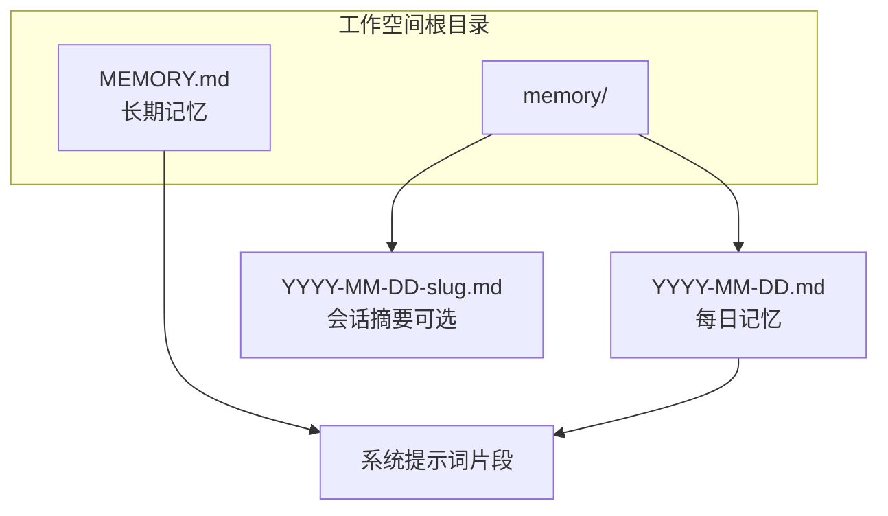
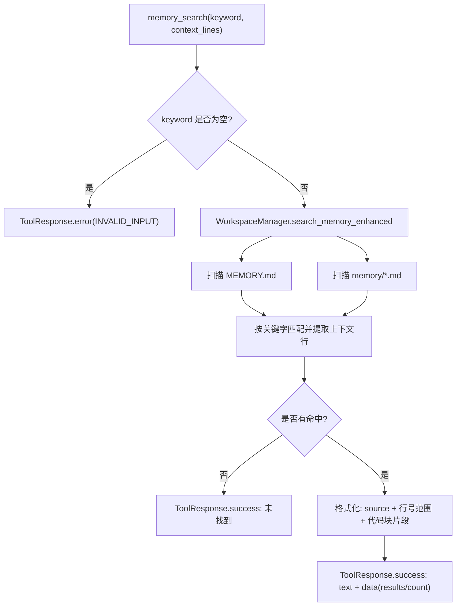
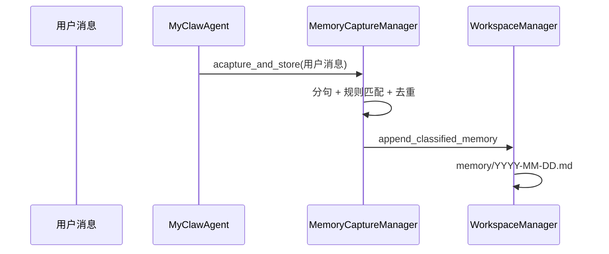
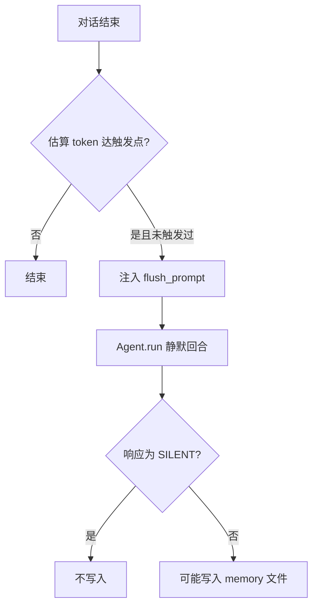
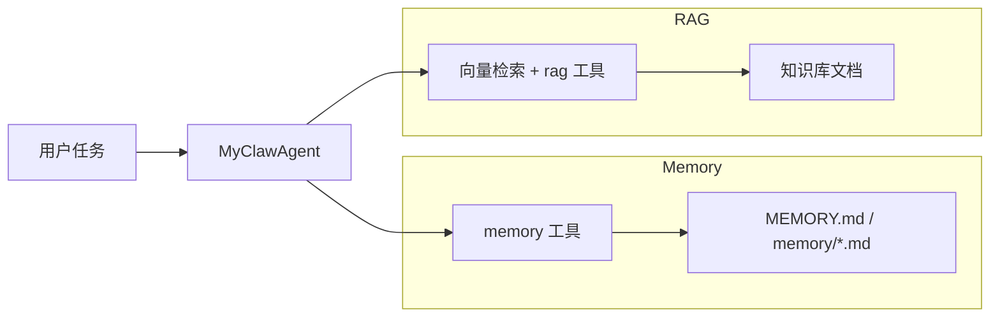

# Memory 实现与功能说明

本文档基于当前代码，说明 MyClaw 中 **Memory（记忆）** 的存储位置、内置工具接口、`backend/src/memory` 子模块职责，以及 **Memory 对 Agent 的意义** 与 **Memory 和 RAG 的关系**。文中的 Mermaid 图可在 Obsidian 中渲染。

---

## 1. 功能总览

Memory 在本项目中指：**与工作空间绑定的、以 Markdown 为主的持久化“助手记忆”**，包括：

| 类型 | 典型位置 | 写入方式 |
|------|----------|----------|
| **长期记忆** | 工作空间根下 `MEMORY.md`（通过 `WorkspaceManager` 的 `MEMORY` 配置键读写） | Agent 工具 `memory_update_longterm`、Memory Flush 静默回合、手动编辑 |
| **每日记忆** | `memory/YYYY-MM-DD.md` | 工具 `memory_add`、自动 **Memory Capture**（`MemoryCaptureManager`）按规则写入分类条目 |
| **会话摘要** | `memory/YYYY-MM-DD-<slug>.md` | 创建新会话时 `SessionSummarizer` 生成（见 `api/session.py`） |

与「会话 JSON 历史」（`sessions/*.json`）不同：Memory 文件是 **跨轮次、可检索的文本资产**，并会进入 **系统提示词**（长期记忆部分），使模型在不开工具时也能带上部分用户偏好与事实。

---

## 2. 存储与 Workspace 层

核心逻辑在 `backend/src/workspace/manager.py`：

- **`memory/` 目录**：存放按日期的 `.md` 与可选的会话摘要文件。
- **`MEMORY.md`**：与 `IDENTITY.md` 等并列，通过 `load_config("MEMORY")` / `save_config("MEMORY", ...)` 维护。
- **增强搜索** `search_memory_enhanced(keyword, context_lines)`：在 `MEMORY.md` 与 `memory/*.md` 中做子串匹配，合并相邻匹配行为一段，返回 **带行号的上下文**（供 `MemoryTool` 展示）。
- **`read_memory_lines`**：按文件名与行范围读取（`MEMORY.md` 或 `memory/` 下日期文件）。
- **`append_classified_memory`**：向当日文件追加带 `[category]` 标签的内容（与 Capture 一致）。
- **`check_duplicate_memory`**：与近期每日记忆、长期记忆做相似度判断，减少重复写入（Capture 使用）。
- **`cleanup_old_memories(days)`**：删除超过保留天数的每日记忆文件（工具 `memory_cleanup` 调用）。

---

## 3. 内置工具：`MemoryTool`

实现文件：`backend/src/tools/builtin/memory.py`。

继承 Hello-Agents 的 `Tool`，`expandable=True`，可展开为多个子动作；默认 `run` 等价于关键词搜索。

| 子动作 / 行为 | 说明 |
|-----------------|------|
| **默认 / `memory_search`** | 调用 `workspace.search_memory_enhanced`，返回带行号上下文的匹配结果 |
| **`memory_get`** | 读取指定记忆文件或行范围；未指定文件名时默认为 **当天** `YYYY-MM-DD.md`；支持 `lines` 如 `"10-20"` |
| **`memory_add`** | 追加到今日记忆；可选 `category`（`preference` / `decision` / `entity` / `fact`）时走 `append_classified_memory`，否则 `append_to_daily_memory` |
| **`memory_update_longterm`** | 读取 `MEMORY`，在末尾追加 `## 新增` 与内容后写回 |
| **`memory_list`** | 列出长期记忆与每日记忆文件及大小 |
| **`memory_cleanup`** | 调用 `cleanup_old_memories(days)`，默认保留 30 天 |

**Agent 主动使用 Memory 的意义**：在对话中需要「回顾几天前写了什么」「精确读某段」时，通过工具检索比把整文件塞进上下文更省 token；需要**固化**新事实时，用 `memory_add` / `memory_update_longterm` 写入磁盘。

---

## 4. 记忆检索流程

本项目的记忆检索由 `MemoryTool._search_memory()` 与 `WorkspaceManager.search_memory_enhanced()` 协作完成，目标是返回“可直接给模型使用”的命中上下文，而不是仅返回文件名。

### 4.1 检索入口与返回

- 默认 `memory.run({"keyword": ...})` 会触发 `_search_memory(keyword)`。
- 子动作 `memory_search(keyword, context_lines=3)` 也走同一条路径。
- 返回值为 `ToolResponse`：
  - `text`：格式化后的命中片段（含来源与行号范围）
  - `data`：结构化结果（`results/count/keyword`），便于后续程序化处理

### 4.2 实际检索范围

`search_memory_enhanced()` 会扫描：

1. `MEMORY.md`（长期记忆）  
2. `memory/*.md`（每日记忆/会话摘要）

匹配策略为**不区分大小写的关键词子串匹配**，并返回每个命中点附近 `context_lines` 行上下文；相邻上下文行会合并为一个片段，最终输出 `start_line/end_line/content`。

### 4.3 检索流程图（Obsidian Mermaid）

### 4.4 与 `memory_get` 的关系

- `memory_search`：先定位“哪一段相关”。  
- `memory_get`：再按 `filename + 行范围` 精读。  

二者组合可实现“先粗检索，再精读取”的低 token 成本工作流。

---

## 5. `backend/src/memory` 子模块

### 5.1 `MemoryCaptureManager`（`capture.py`）

在 **每轮用户消息处理结束后**（`MyClawAgent.achat` 流程末尾），对用户消息异步执行 `acapture_and_store`：

- 按 **句子** 切分，用 `MEMORY_TRIGGERS` 正则匹配是否值得记（偏好、决策、实体、事实等）。
- 命中后规范化文本，**去重**（同轮次 + `check_duplicate_memory`）。
- 写入当日分类记忆（`append_classified_memory`）。

### 5.2 `MemoryFlushManager`（`memory_flush.py`）

在 **上下文接近压缩阈值** 时（`MyClawAgent` 用字符数/3 估算 token，与 `should_trigger_flush` 比较），触发 **一次静默回合**：向底层 Agent 注入英文 prompt，要求使用 `memory_add` / `memory_update_longterm` 保存重要信息；若模型只回复 `[SILENT]` 则视为无需保存。**每会话仅触发一次**（`_flush_triggered`），新会话加载时 `reset()`。

### 5.3 `SessionSummarizer`（`session_summarizer.py`）

在 **创建新会话** 等 API 路径中用于对旧会话做摘要，生成 `memory/YYYY-MM-DD-<slug>.md`（`save_session_summary`）。与 Capture/Flush 并行存在，侧重「会话级归档」而非单句记忆。

### 4.4 包导出（`memory/__init__.py`）

仅导出 `SessionSummarizer`、`MemoryFlushManager`；`MemoryCaptureManager` 在 `helloclaw_agent` 中直接 import。

---

## 6. Memory 对 Agent 的意义

1. **身份与长期上下文**：`_build_system_prompt` 会把 `MEMORY.md` 内容以「## 长期记忆」拼入系统提示词，使模型在**不调用工具**时也能利用已固化的重要信息。
2. **时间维度**：每日文件记录「今天发生的事」，便于工具按日期检索；Capture 把用户口语中的偏好/事实自动落入当日文件。
3. **防止压缩丢信息**：Memory Flush 在上下文将压缩前，**强制一轮**让模型把关键信息写入文件，而不是仅依赖滑窗内的对话。
4. **可审计、可编辑**：纯 Markdown，用户可直接改 `MEMORY.md` 或 `memory/*.md`，与 Agent 行为一致。

---

## 7. Memory 与 RAG 的关系

二者均为「让模型利用更多文本」，但 **数据来源、机制与适用场景** 不同：

| 维度 | Memory | RAG（`RAGTool` / `backend/src/rag`） |
|------|--------|--------------------------------------|
| **内容性质** | 用户偏好、对话中沉淀的事实、助手主动记录的摘要 | 用户**主动入库**的知识文档（PDF、笔记等），向量索引 |
| **存储** | 工作空间内 Markdown + 可选向量无关 | 解析后的向量库（如 Qdrant）+ 命名空间 |
| **检索方式** | 关键词子串 + 行上下文（`search_memory_enhanced`）或整段读文件 | 语义检索、`ask` 等管道 |
| **进入模型的路径** | 系统提示词（长期）+ `memory_*` 工具按需拉取 | 工具 `rag` 的 `search` / `ask` 等 |
| **典型用途** | 「记住我喜欢简短回复」「上周说过要用某账号」 | 「根据手册第 3 章回答」「知识库里的规范」 |

**协同建议**：个人化、对话衍生、需长期跟随用户的信息优先 **Memory**；大体积资料、规范文档、多文档推理优先 **RAG**。两者在同一 Agent 上可同时注册（`helloclaw_agent` 中 `MemoryTool` 与 `RAGTool` 并存），由模型按任务选择工具。

---

## 8. 相关代码与 API 索引

| 位置 | 作用 |
|------|------|
| `backend/src/tools/builtin/memory.py` | `MemoryTool` 全部子动作 |
| `backend/src/workspace/manager.py` | 记忆文件读写、搜索、去重、清理 |
| `backend/src/memory/capture.py` | 自动捕获规则与存储 |
| `backend/src/memory/memory_flush.py` | 压缩前 flush 策略与提示词 |
| `backend/src/memory/session_summarizer.py` | 会话摘要生成与落盘 |
| `backend/src/agent/helloclaw_agent.py` | 注册工具、系统提示词注入 MEMORY、Capture/Flush 调度 |
| `backend/src/api/memory.py` | 记忆列表、捕获、清理等 HTTP 接口 |

---

## 9. 配置与运维提示

- **工作空间路径**：由 `WORKSPACE_PATH` 决定，记忆文件均在对应工作空间下。
- **Memory Flush 参数**：与 `MyClawAgent` 使用的 `context_window`、`compression_threshold` 一致，可在 Agent 配置中体现（见 `MemoryFlushManager` 构造函数传参）。
- **自动捕获的局限**：基于规则与正则，可能漏检或误检；重要信息仍建议用户确认或让 Agent 显式调用 `memory_add`。

---

以上为当前 Memory 子系统的实现与功能说明；若后续调整 `MEMORY_TRIGGERS` 或工具参数，请以对应源码为准。
