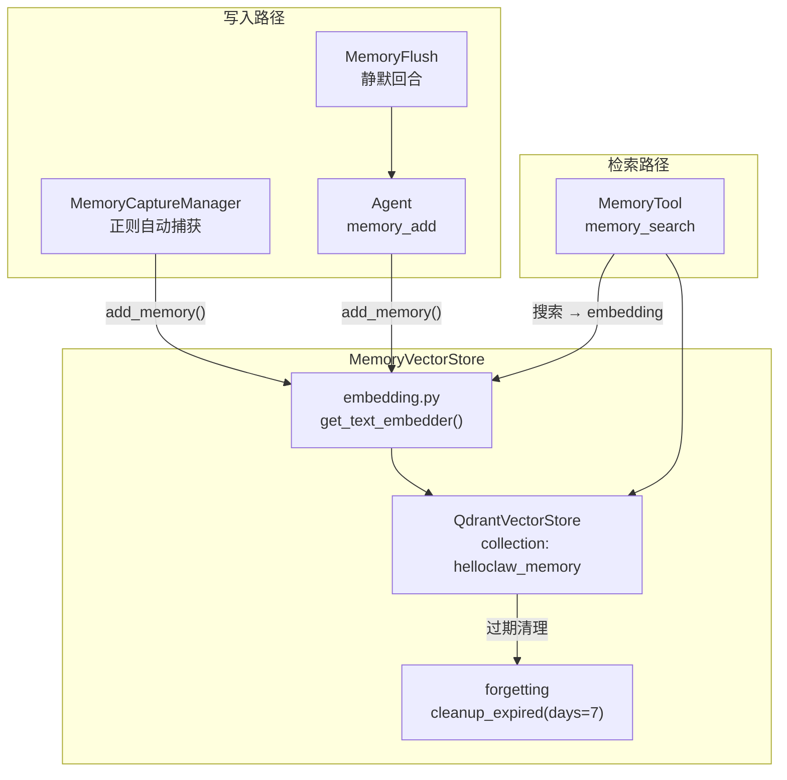
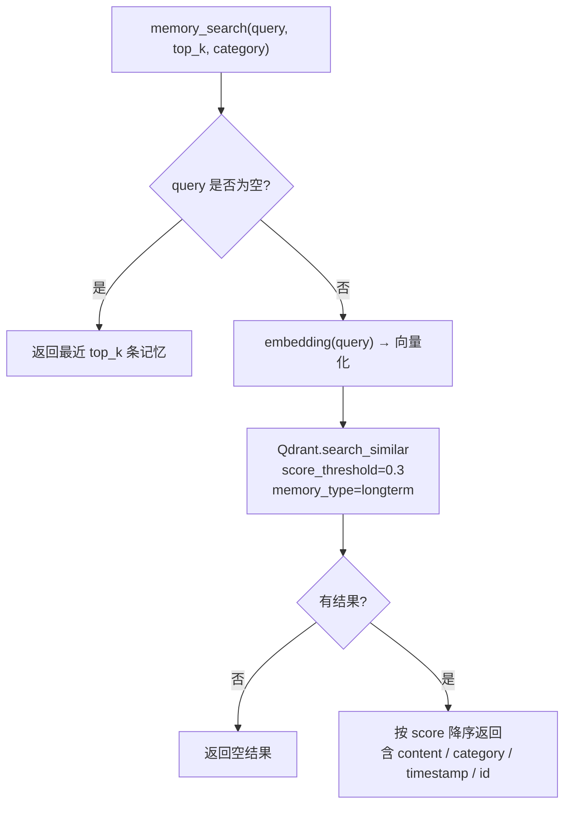
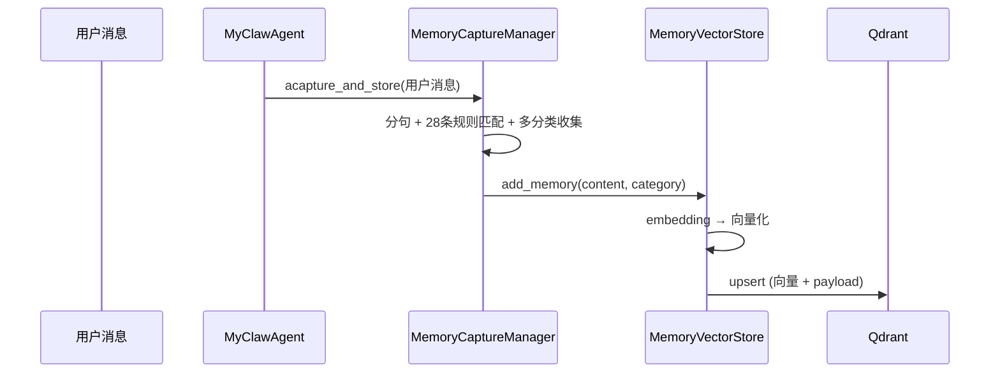
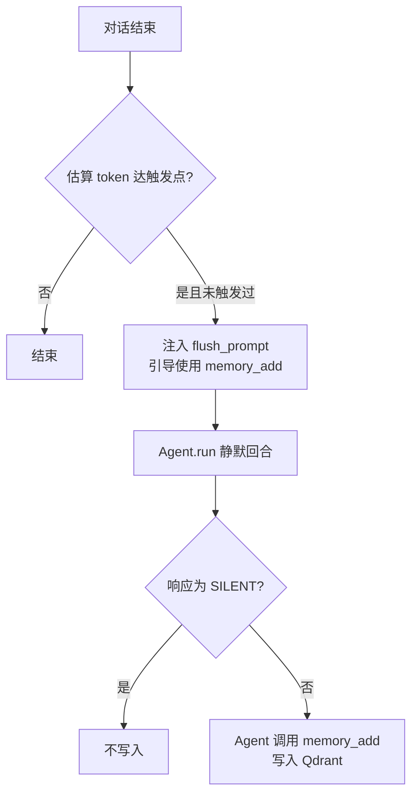
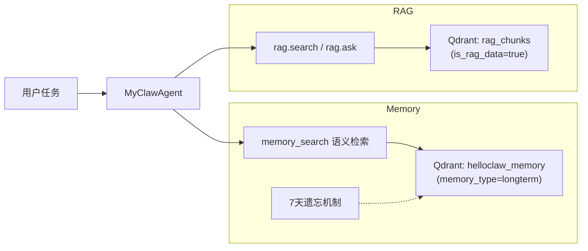

# Memory 实现与功能说明

本文档基于当前代码，说明 MyClaw 中 **Memory（记忆）** 的存储位置、内置工具接口、`backend/src/memory` 子模块职责，以及 **Memory 对 Agent 的意义** 与 **Memory 和 RAG 的关系**。文中的 Mermaid 图可在 Obsidian 中渲染。

---

## 1. 功能总览

记忆系统已重构为 **统一的长期记忆**，基于 **Qdrant 向量数据库** 存储，使用与 RAGTool 相同的 embedding 基础设施做语义检索。

| 特性 | 说明 |
|------|------|
| **存储** | Qdrant 向量数据库（collection: `helloclaw_memory`） |
| **写入方式** | 自动捕获（MemoryCaptureManager，正则匹配）、Agent 工具 `memory_add`、Memory Flush 静默回合 |
| **检索方式** | 语义检索（embedding → Qdrant search_similar），由 Agent 按需调用，不自动注入系统提示词 |
| **遗忘机制** | 超过 7 天的记忆自动从 Qdrant 中清除（启动时 + 每次 `memory_cleanup`） |
| **分类体系** | preference / decision / entity / fact / plan / relationship / reference / rule（8 种） |

### 与旧架构的区别

| 维度 | 旧架构 | 新架构 |
|------|--------|--------|
| 长期记忆 | `MEMORY.md` 文件 | Qdrant 向量 |
| 每日记忆 | `memory/YYYY-MM-DD.md` | 统一为长期记忆 |
| 会话摘要 | `memory/YYYY-MM-DD-slug.md` | 已移除 |
| 检索方式 | 文件子串匹配 | embedding 语义检索 |
| 进入模型 | 全量注入系统提示词 | Agent 按需调用 `memory_search` |

---

## 2. 存储层

### 2.1 MemoryVectorStore（`memory/vector_store.py`）

记忆专用 Qdrant 封装层，提供统一的 CRUD 接口：

```
MemoryVectorStore
├── qdrant_store: QdrantVectorStore (collection="helloclaw_memory")
├── embedder: EmbeddingModel (从 embedding.py 单例获取)
├── add_memory(content, category, session_id, source) → memory_id
├── search_memories(query, top_k, score_threshold, category) → List[dict]
├── delete_memories(memory_ids) → bool
├── cleanup_expired(days=7) → int  # 遗忘机制
└── get_stats() → dict
```

**Qdrant Payload 结构**：

| 字段 | 类型 | 说明 |
|------|------|------|
| `content` | string | 记忆文本内容 |
| `category` | keyword | 分类标签 |
| `memory_type` | keyword | 固定 "longterm" |
| `memory_id` | keyword | UUID |
| `timestamp` | integer | Unix 时间戳（用于遗忘过滤） |
| `session_id` | keyword | 关联会话 ID（可选） |
| `source` | keyword | capture / agent / flush / api |

### 2.2 遗忘机制

`cleanup_expired(days=7)` 通过 **scroll 遍历** 找到 `timestamp < cutoff_ts` 的记忆点，用 `PointIdsList` 批量删除。触发时机：

1. **Agent 启动时**（`main.py` lifespan startup）
2. **Agent 调用 `memory_cleanup` 工具时**
3. 可扩展为每隔 N 次对话自动触发

### 2.3 Embedding 共享

MemoryVectorStore 使用与 RAGTool 相同的 embedding 基础设施（`rag/embedding.py` 中的 `get_text_embedder()` 单例），确保向量空间一致。



---

## 3. 内置工具：`MemoryTool`

实现文件：`backend/src/tools/builtin/memory.py`。

| 子动作 | 说明 | 检索方式 |
|--------|------|----------|
| **`memory_search`** | 语义检索长期记忆 | embedding → Qdrant search_similar，支持 `category` 过滤 |
| **`memory_get`** | 按 memory_id 查询具体内容 | 通过 ID 精确查找 |
| **`memory_add`** | 写入新的长期记忆（合并旧 `memory_update_longterm`） | 向量化 → Qdrant upsert |
| **`memory_list`** | 列出最近记忆 | 按 timestamp 降序返回 |
| **`memory_cleanup`** | 清除超过指定天数的过期记忆 | 调用 `cleanup_expired(days)` |
| **`memory_delete`** | 删除指定记忆（按 ID） | `delete_memories(ids)` |

### 检索流程



### Agent 记忆操作对齐

Agent **不自动注入**记忆内容到系统提示词，而是在需要时主动调用工具：

- **检索**：`memory_search` 语义搜索（与 RAGTool 使用方式一致）
- **写入**：`memory_add` 写入向量数据库
- **删除**：`memory_delete` 按 ID 删除
- **清理**：`memory_cleanup` 触发遗忘

系统提示词中仅注入使用指引，提醒 Agent 在需要上下文时调用 `memory_search`。

---

## 4. `backend/src/memory` 子模块

### 4.1 `MemoryCaptureManager`（`capture.py`）

在 **每轮用户消息处理结束后**（`MyClawAgent.achat` 流程末尾），对用户消息异步执行 `acapture_and_store`：

- 按 **句子** 切分（支持中文逗号/分号 + 转折连词断句）。
- 用 28 条 `MEMORY_TRIGGERS` 正则规则匹配 8 种分类（preference / decision / entity / fact / plan / relationship / reference / rule）。
- 一条句子可命中多个分类（`_match_trigger` 返回 `List[str]`）。
- 写入 **Qdrant**（`MemoryVectorStore.add_memory`）。



### 4.2 `MemoryFlushManager`（`memory_flush.py`）

在 **上下文接近压缩阈值** 时触发 **一次静默回合**：

- 向底层 Agent 注入 prompt，要求使用 `memory_add` 将关键信息写入 Qdrant。
- 若模型只回复 `[SILENT]` 则视为无需保存。
- **每会话仅触发一次**（`_flush_triggered`），新会话加载时 `reset()`。



### 4.3 `MemoryVectorStore`（`vector_store.py`）

见第 2.1 节。

### 4.4 包导出（`memory/__init__.py`）

导出 `MemoryCaptureManager`、`MemoryFlushManager`、`MemoryVectorStore`。

---

## 5. Memory 对 Agent 的意义

1. **向量语义检索**：不再依赖文件子串匹配，基于 embedding 找到真正语义相关的历史记忆。
2. **按需而非全量注入**：Agent 根据当前对话内容主动调用 `memory_search`，避免每次将全量记忆塞入上下文消耗 token。
3. **遗忘机制**：7 天以上的旧记忆自动清除，保持记忆库新鲜且可管理。
4. **统一存储**：消除长期记忆/每日记忆/会话摘要的界限，所有记忆以统一格式存储在 Qdrant 中。

---

## 6. Memory 与 RAG 的关系

二者均基于 **Qdrant + embedding 语义检索**，但数据来源与用途不同：

| 维度 | Memory | RAG（`RAGTool` / `backend/src/rag`） |
|------|--------|--------------------------------------|
| **内容性质** | 用户偏好、对话中沉淀的事实、决策、实体信息 | 用户主动入库的知识文档（PDF、笔记等） |
| **存储** | Qdrant collection `helloclaw_memory` | Qdrant collection（同一实例，通过 `memory_type` / `is_rag_data` 区分） |
| **检索方式** | 语义检索（`memory_search`） | 语义检索 + ask 管道（`rag.search` / `rag.ask`） |
| **进入模型的路径** | Agent 按需调用 `memory_search` | Agent 按需调用 `rag.search` / `rag.ask` |
| **生命周期** | 7 天遗忘机制 | 由用户管理，无自动过期 |
| **典型用途** | 「记得我喜欢简短回复」「上周决定用方案A」 | 「根据手册第 3 章回答」「知识库规范」 |



**协同建议**：个人化、对话衍生、需长期跟随用户的信息优先 **Memory**；大体积资料、规范文档、多文档推理优先 **RAG**。两者共享同一 embedding 基础设施和 Qdrant 连接，由模型按任务选择工具。

---

## 7. 记忆捕获规则参考

当前 `MEMORY_TRIGGERS` 共 28 条规则，覆盖 8 个分类：

| 分类 | 示例触发词 | 条数 |
|------|------------|------|
| **fact** | 记住、记下、remember、keep in mind、版本、带数字的事实 | 5 |
| **preference** | 喜欢、偏好、prefer、习惯、经常、rather | 3 |
| **decision** | 决定、选定、不对、错了、改成、纠正、切换 | 3 |
| **plan** | 我想、计划、明天、下周、deadline、日程、待办、要做 | 4 |
| **entity** | 电话、邮箱、密码、密钥、我叫、GitHub、QQ | 7 |
| **relationship** | 同事、老板、团队、朋友、家人、领导 | 2 |
| **reference** | https://、文件路径 | 2 |
| **rule** | 禁止、不允许、always、务必、格式要求 | 2 |

---

## 8. 相关代码与 API 索引

| 位置 | 作用 |
|------|------|
| `backend/src/memory/vector_store.py` | MemoryVectorStore：Qdrant 封装，CRUD + 遗忘机制 |
| `backend/src/memory/capture.py` | MemoryCaptureManager：28 条规则自动捕获，对接 Qdrant |
| `backend/src/memory/memory_flush.py` | MemoryFlushManager：压缩前静默回合 |
| `backend/src/memory/__init__.py` | 包导出 |
| `backend/src/tools/builtin/memory.py` | MemoryTool：6 个子动作，全部基于 Qdrant 向量操作 |
| `backend/src/rag/qdrant_store.py` | QdrantVectorStore：底层 Qdrant 操作 |
| `backend/src/rag/embedding.py` | 统一 embedding 基础设施 |
| `backend/src/workspace/manager.py` | WorkspaceManager（已移除记忆文件操作） |
| `backend/src/agent/myclaw_agent.py` | 注册工具、系统提示词注入使用指引、Capture/Flush 调度 |
| `backend/src/main.py` | 启动时初始化 MemoryVectorStore + 过期清理 |
| `backend/src/api/memory.py` | 记忆列表、捕获、统计、清理等 HTTP 接口（基于 Qdrant） |

---

## 9. 配置与运维提示

- **Qdrant 连接**：MemoryVectorStore 自动复用 `QdrantConnectionManager` 单例，与 RAG 共享同一 Qdrant 实例的不同 collection。
- **遗忘周期**：默认 7 天，通过 `MemoryVectorStore(..., forget_days=N)` 或 `memory_cleanup(days=N)` 调整。
- **Embedding 模型**：由环境变量 `EMBED_MODEL_TYPE` / `EMBED_MODEL_NAME` 控制，与 RAGTool 一致。
- **回退兼容**：MemoryTool 和 MemoryCaptureManager 均保留 `workspace_manager` 参数，在 `memory_store` 为空时回退到旧的文件操作模式。
- **自动捕获的局限**：基于规则与正则，可能漏检或误检；重要信息仍建议用户确认或让 Agent 显式调用 `memory_add`。

---

以上为当前 Memory 子系统的实现与功能说明；若后续调整 `MEMORY_TRIGGERS` 或工具参数，请以对应源码为准。
