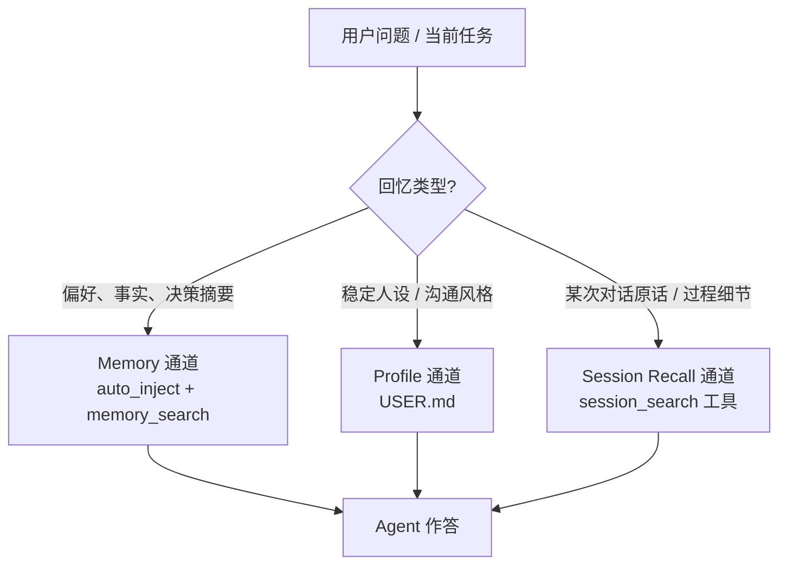
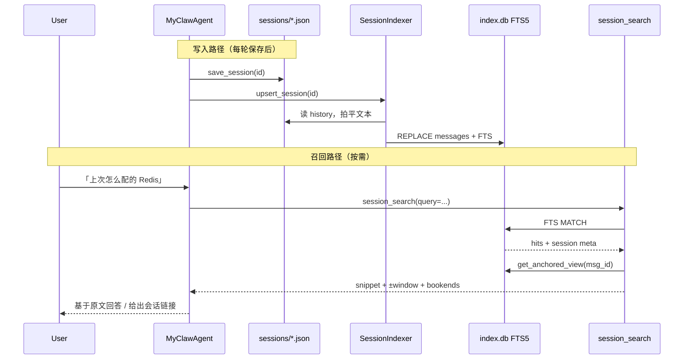

# MyClaw 完整跨会话回忆 — 详细设计方案

> 版本：v1.0  
> 日期：2026-08-11  
> 状态：设计草案  
> 依据：`MyClaw_Memory实现文档.md`（当前实现）、多工作区工程设计（会话全局化）、Hermes `session_search` 实践对照

---

## 1. 背景与目标

### 1.1 现状（已有）

根据更新后的 Memory 实现文档，MyClaw 已具备：

| 能力 | 实现 |
|------|------|
| 长期事实 / 偏好记忆 | Qdrant `helloclaw_memory` + 语义检索 |
| 每轮自动注入 | `_inject_relevant_memories`，默认 top-K=**3** |
| 工具深挖 | `memory_search` / `memory_add` / … |
| 用户画像 | `ProfileAggregator` → `USER.md` 常驻 system prompt |
| 会话原文落盘 | `~/.helloclaw/sessions/<id>.json`（**全局**，跨工作区保留） |
| UI 打开旧会话 | `/session/{id}/history` |

### 1.2 缺口（本方案要补齐）

```text
跨会话回忆 = A. 蒸馏事实可搜可注入     ✅ 已有（Memory）
           + B. 对话原文可搜可钻取     ❌ 缺失（本方案核心）
           + C. 压缩滚出后仍可找回     ⚠️ 弱（依赖 Flush，不完备）
```

Agent **无法**在当前会话中回答：「上周那个会话里我们怎么决定用方案 A 的？原话是什么？」——除非碰巧写进了 Qdrant Memory。会话 JSON 只服务前端，没有 Agent 工具、没有全文索引。

### 1.3 设计目标

1. **原文可召回**：Agent 可按关键词 / 短语 / 时间，跨所有全局会话检索消息原文。  
2. **可钻取**：命中后能拉「锚定窗口」（前后若干条）与会话首尾 bookend，必要时滚动翻阅。  
3. **与 Memory 分工清晰**：事实偏好走 Memory；「那次对话说了什么」走 Session Recall。  
4. **不破坏现有体验**：自动注入 top-3、画像、Flush 行为保持；Session Recall **默认不自动注入全文**（按需工具，控 token）。  
5. **贴合 MyClaw 架构**：会话已在 `~/.helloclaw/sessions/` 全局化；索引亦全局，与多工作区兼容。  
6. **可演进**：首期 FTS 关键词召回；二期可选语义 / 标题摘要 / 压缩归档可发现性。

### 1.4 非目标（本期不做）

- 不把完整 transcript 灌进 `helloclaw_memory`（污染事实记忆、放大衰减与去重噪声）。  
- 不替代 Memory 自动注入；不做「每轮自动塞 N 段旧对话原文」。  
- 不实现 Hermes 级多 FTS 表（trigram / CJK-bigram）的全部工程复杂度——先可用，再增强中文。  
- 不改前端会话列表为主要入口（可后续加「从回忆打开」）；本期以 **Agent 工具** 为主。

---

## 2. 产品定义：三通道回忆模型



| 通道 | 存什么 | 进模型方式 | 典型问法 |
|------|--------|------------|----------|
| **Memory** | 短条目事实/偏好 | 每轮 top-3 自动注入 + 工具 | 「我喜欢什么风格？」 |
| **Profile** | 聚合后的用户画像 | 常驻 system prompt | 「按我的习惯来」 |
| **Session Recall（新）** | 消息级原文索引 | **仅工具按需** | 「上次部署失败的日志我们怎么排查的？」 |

系统提示（`AGENTS.md`）应明确三者优先级，避免模型把 Session Recall 当 Memory 写，或反之。

---

## 3. 总体架构

### 3.1 模块划分

```
backend/src/
├── session_store/                    # 新增包
│   ├── __init__.py
│   ├── db.py                         # SQLite 连接、schema、迁移
│   ├── indexer.py                    # 从 session JSON 增量索引 / 全量重建
│   ├── search.py                     # FTS 查询、锚定窗口、browse
│   └── models.py                     # 结果 DTO
├── tools/builtin/
│   └── session_search_tool.py        # 新增 Agent 工具
├── agent/myclaw_agent.py             # save/delete/activate 时挂钩索引；注册工具
└── api/
    └── session_search.py             # 可选：HTTP 调试 / 前端「回忆」面板
```

数据落点：

| 路径 | 角色 |
|------|------|
| `~/.helloclaw/sessions/*.json` | **权威原文**（保持现有格式，继续给 UI / load_session） |
| `~/.helloclaw/sessions/index.db` | **检索索引**（SQLite + FTS5），可重建，非唯一真相 |

### 3.2 为何选 SQLite FTS5（而非再开一个 Qdrant collection）

| 方案 | 优点 | 缺点 | 结论 |
|------|------|------|------|
| **A. SQLite FTS5**（推荐） | 关键词/短语准、成本低、无 embedding、易锚定 message_id、与 Hermes 同构 | 语义改写召回弱；中文分词需处理 | **一期主方案** |
| B. Qdrant 消息向量 | 语义近 | 与 Memory 易混、写入贵、工具结果难控长度 | 二期可选「语义补召回」 |
| C. 运行时扫全部 JSON | 零新存储 | 会话多时慢、难排序、难分页 | 仅作索引损坏时的 fallback |

**原则**：JSON 仍是 source of truth；`index.db` 损坏或版本升级可全量 `rebuild`。

**环境前提**：FTS5 来自解释器自带的 SQLite，而非 pip 包。是否可用必须经 **§13.1 目标环境探测** 确认；探测失败则同进程降级 LIKE，仍不引入新依赖。

### 3.3 端到端数据流



---

## 4. 存储与 Schema 设计

### 4.1 表结构（草案）

```sql
-- 元信息
CREATE TABLE schema_meta (
  key   TEXT PRIMARY KEY,
  value TEXT NOT NULL
);

CREATE TABLE sessions (
  id            TEXT PRIMARY KEY,
  title         TEXT,
  workspace_id  TEXT,          -- 可选：创建/最后绑定的工作区标识
  source        TEXT DEFAULT 'chat',  -- chat / automation / subagent …
  created_at    REAL,
  updated_at    REAL,
  message_count INTEGER DEFAULT 0,
  preview       TEXT           -- 首条 user 或标题预览，browse 用
);

CREATE TABLE messages (
  id            INTEGER PRIMARY KEY AUTOINCREMENT,
  session_id    TEXT NOT NULL REFERENCES sessions(id) ON DELETE CASCADE,
  seq           INTEGER NOT NULL,   -- 会话内顺序，0-based
  role          TEXT NOT NULL,      -- user / assistant / tool
  content       TEXT NOT NULL,      -- 拍平后的可检索文本
  content_hash  TEXT,               -- 可选：增量跳过未变内容
  is_compacted  INTEGER DEFAULT 0,  -- 1 = 压缩摘要手递消息（见 §6）
  created_at    REAL,
  UNIQUE(session_id, seq)
);

-- FTS5：external content 指向 messages
CREATE VIRTUAL TABLE messages_fts USING fts5(
  content,
  content='messages',
  content_rowid='id',
  tokenize='unicode61 remove_diacritics 2'
);

-- 触发器：messages INSERT/UPDATE/DELETE → 同步 FTS（实现时写全）
```

索引辅助：

```sql
CREATE INDEX idx_messages_session_seq ON messages(session_id, seq);
CREATE INDEX idx_sessions_updated ON sessions(updated_at DESC);
```

### 4.2 从 JSON 到索引的字段映射

现有 `sessions/<id>.json` 典型形状：`{ "history": [ {role, content, metadata?}, ... ] }`。

索引写入规则：

| JSON 字段 | 索引行为 |
|-----------|----------|
| `role` ∈ user/assistant | **默认入 FTS**（discover 默认只搜这两类） |
| `role` = tool | 可选入表但 **默认不入 FTS** 或降权（工具输出噪音大）；需要时 `role_filter` 显式包含 |
| `content` 多模态编码 / list | 拍平为纯文本（复用 `flatten_content_to_text` / 现有 `get_session_history` 逻辑） |
| 超长 tool dump | 截断至例如 8KB/条再索引，原文仍以 JSON 为准 |
| 无 `title` | `preview` = 第一条 user 文本前 80 字；二期再 LLM 标题 |

### 4.3 工作区维度

多工作区设计下会话已全局共享。索引侧：

- `workspace_id` **可选**记录（若 `save_session` 时能拿到当前 bound workspace）。  
- `session_search` 默认 **不按工作区过滤**（全局回忆）；可选 `workspace_id=` 收窄。  
- 切工作区 **不重建**索引、不丢会话（与 v1.1 全局 sessions 一致）。

---

## 5. Agent 工具设计：`session_search`

### 5.1 调用形态（单工具、参数推断模式）

对齐 Hermes 的「无显式 mode」体验，降低模型选错模式的成本：

| 模式 | 触发参数 | 行为 |
|------|----------|------|
| **discover** | `query` | FTS 检索 → 按 session 去重 → 每命中返回 snippet + 锚定窗口 + bookends |
| **scroll** | `session_id` + `around_message_id` | 无 FTS，返回以该消息为中心的 ±window |
| **read** | 仅 `session_id` | 返回会话摘要信息 + head/tail（大会话不全量倾倒） |
| **browse** | 无参或仅 `limit` | 按 `updated_at` 列近期会话（title/preview/时间） |

建议注册名：`session_search`（toolset：可与 memory 并列，或独立 `session_recall`）。

### 5.2 参数草案

| 参数 | 类型 | 说明 |
|------|------|------|
| `query` | string | FTS 查询；支持简单词、引号短语；实现侧 sanitize |
| `session_id` | string | scroll / read |
| `around_message_id` | int | scroll 锚点（`messages.id`） |
| `window` | int | 默认 5 |
| `limit` | int | discover 返回会话数，默认 3 |
| `role_filter` | string | 默认 `user,assistant` |
| `sort` | string | `relevance`（默认）/ `newest` / `oldest` |
| `include_current` | bool | 默认 false：跳过当前会话中仍 live 的命中 |

### 5.3 Discover 返回结构（示例）

```json
{
  "success": true,
  "mode": "discover",
  "query": "Redis 配置",
  "count": 2,
  "results": [
    {
      "session_id": "a1b2c3d4",
      "title": null,
      "preview": "帮我配一下本地 Redis…",
      "when": "2026-08-01 14:22",
      "match_message_id": 1284,
      "matched_role": "user",
      "snippet": "…配一下本地 >>>Redis<<< 端口…",
      "messages": [
        {"id": 1282, "role": "user", "content": "…"},
        {"id": 1284, "role": "assistant", "content": "…", "anchor": true}
      ],
      "bookend_start": ["…"],
      "bookend_end": ["…"],
      "messages_before": 40,
      "messages_after": 12,
      "link_hint": "可请用户在会话列表打开 a1b2c3d4"
    }
  ]
}
```

约束：

- 单条 `content` 截断（如 4k 字符），带 `content_truncated`。  
- 默认 discover 扫 FTS top-N（如 100）再按 session 去重，避免同一会话占满结果。  
- **排除当前会话 live 命中**（已在上下文中）；若未来做「压缩归档行」，归档行可放行（见 §6）。

### 5.4 与 Memory 工具的路由指引（写入 AGENTS.md）

```text
- 问偏好 /「我是谁」类 → memory_search 或依赖自动注入 / USER.md
- 问「上次我们具体怎么说的 / 哪次排障」→ session_search
- 先 session_search 发现会话，需要固化为长期事实时再 memory_add
- 不要把大段 transcript 用 memory_add 整段塞进长期记忆
```

### 5.5 ContextGuard / 工具元数据

| 属性 | 建议值 |
|------|--------|
| `output_size_hint` | 3000～5000（discover 多命中时偏大） |
| `has_side_effects` | `false`（只读） |
| Ask 模式 | **允许**（只读回忆） |
| Plan 规划期 | **允许** |
| 委托 | 可委托（无副作用） |

---

## 6. 与上下文压缩、Memory Flush 的衔接

### 6.1 现状问题

`ContextManager` 会压缩 / 截断历史；`restore_original_content` 仅在加载会话时恢复。压缩后 live context 变短，但：

- JSON 里通常仍保留较完整 history（视 hello_agents `save_session` 行为而定——实现时需 **实测** 压缩后磁盘是否仍含原文）。  
- Flush 每会话一次，只能抢救部分事实进 Qdrant，**救不了原文检索**。

### 6.2 本期策略

| 场景 | 策略 |
|------|------|
| 磁盘 JSON 仍含完整 history | 索引始终索引 **磁盘 JSON**，与 live 压缩无关 → 召回自然覆盖「滚出上下文」的内容 |
| 磁盘被改成仅摘要 | 索引摘要行并打 `is_compacted=1`；discover 仍可搜到摘要；在工具结果中标注「此为压缩摘要」 |
| Flush | **保留**；Flush 负责事实进 Memory，Session Recall 负责原文。二者互补，不互相替代 |

### 6.3 实现检查清单（开发时必须验证）

1. 触发智能压缩后，`sessions/<id>.json` 的 `history` 是否仍含压缩前消息？  
2. 若否：是否在 `metadata.original_content` 中可恢复？索引应优先索引 `original_content`。  
3. 若皆无：二期引入「压缩归档表」或压缩前 snapshot 文件。

---

## 7. 索引同步与生命周期

### 7.1 写入挂钩

| 事件 | 动作 |
|------|------|
| `save_session` / `save_current_session` 成功后 | `indexer.upsert_session(session_id)`（异步友好：可 `asyncio.to_thread`） |
| `delete_session` | `indexer.delete_session(session_id)` |
| 启动 `lifespan` | `indexer.ensure_schema()`；若 `schema_version` 落后则标记 rebuild；可选后台 `rebuild_if_needed()` |
| 手动运维 | CLI 或 API：`POST /api/session-search/rebuild` |

### 7.2 增量策略

- 读 JSON → 算整文件 mtime / 内容 hash；与 `sessions.updated_at` 比较，未变则跳过。  
- 变化则：**删除该 session 旧 messages 再批量插入**（会话一般不大，实现简单、正确性高）。  
- 单次 upsert 失败只打日志，**不阻断对话保存**。

### 7.3 存量迁移

首次启用：

1. 扫描 `~/.helloclaw/sessions/*.json`  
2. 批量 upsert（限并发，避免启动卡死）  
3. 进度写入 `schema_meta`（`rebuild_percent`），工具结果可附带「索引重建中，结果可能不全」

### 7.4 多进程 / 锁

- SQLite `WAL` 模式；写用短事务。  
- Agent 单例为主写者；HTTP rebuild 与对话写争用时，rebuild 可 `BEGIN IMMEDIATE` 或低优先级重试。

---

## 8. 查询实现细节

### 8.1 查询消毒

用户 / 模型输入不可直接丢进 `MATCH`：

- 长度上限（如 200 字符）  
- 剥离未配对的 FTS 特殊字符  
- 保留 `"短语"`；对 `foo-bar` / `a.b` 类词酌情加引号  

### 8.2 中文（一期务实方案）

unicode61 对 CJK 常按字切分，短查询易噪。一期：

1. **主路径**：FTS `MATCH`（长查询 / 含英文 / 引号短语）  
2. **Fallback**：当 query 含 CJK 且 FTS 命中过少时，对 `messages.content` 做 `LIKE '%'||?||'%'`（限 session 更新时间近 N 天或 LIMIT 收紧）  
3. 二期：可选 `tokenize='trigram'` 副表或外部 jieba 分词列  

### 8.3 排序与过滤

- 默认 BM25 / FTS rank  
- `sort=newest` 时 `ORDER BY messages.created_at DESC, rank`  
- 排除 `source IN ('subagent','automation')`（若未来写入）；一期可先只有 `chat`  
- Automation 会话若索引：降权而非删除（避免「回忆致盲」）

### 8.4 锚定视图

```text
get_anchored_view(session_id, message_id, window=5, bookend=3)
→ window: seq∈[anchor-window, anchor+window]
→ bookend_start: 会话最早 3 条 user/assistant
→ bookend_end: 会话最晚 3 条
→ messages_before / messages_after 计数
```

实现可读 SQLite；若索引滞后，**可回退读 JSON** 按 seq 切片（保证工具可用性）。

---

## 9. 与现有 Memory 自动注入的协同策略

| 策略 | 说明 | 建议 |
|------|------|------|
| Session 不自动注入 | 避免每轮额外数千 token | **采用** |
| Memory 继续 top-3 | 不变 | **保持** |
| 可选「轻量会话提示」 | 若 browse 发现 24h 内强相关会话，仅在 system 中加一行 hint：`相关旧会话 id=…，可用 session_search` | **二期可选**，默认关 |
| 双通道同时命中 | 模型可并用；AGENTS 写明 Memory 优先答偏好，细节用 session_search 核实 | 文档 + prompt |

**禁止**：把 `session_search` 的整窗结果再 `memory_add` 成一条超长记忆（除非模型提取短事实）。

---

## 10. API / 前端（可选但建议）

### 10.1 HTTP（调试与后续 UI）

| 方法 | 路径 | 作用 |
|------|------|------|
| GET | `/api/session-search?q=&limit=` | 同 discover |
| GET | `/api/session-search/{session_id}/around/{msg_id}` | scroll |
| POST | `/api/session-search/rebuild` | 全量重建 |

同步 SQLite 查询走 `run_in_threadpool`（与 memory API 一致）。

### 10.2 前端（二期）

- 会话列表增加「搜索历史对话」入口。  
- Agent 回复中的 `session_id` 可做成可点击 chip（打开该会话）。  

一期可不改前端，仅 Agent 工具即可闭环。

---

## 11. 配置项

建议挂在全局 `~/.helloclaw/config.json`（与 memory 并列）：

```json
"session_recall": {
  "enabled": true,
  "db_path": null,
  "discover_limit": 3,
  "fts_scan_limit": 100,
  "default_window": 5,
  "index_tool_messages": false,
  "exclude_current_session": true,
  "cjk_like_fallback": true,
  "auto_hint_in_prompt": false
}
```

- `db_path` 默认 `~/.helloclaw/sessions/index.db`  
- `enabled: false` 时不注册工具、不挂钩索引  

---

## 12. 分阶段落地计划

### Phase 0 — 验证（0.5～1 天）

- [ ] **目标环境探测**（见 §13.1）：在开发机 / CI / 拟发布 OS 上确认 `sqlite3` 是否带 FTS5（及可选 trigram）  
- [ ] 确认压缩后 JSON 是否保留原文 / `original_content`  
- [ ] 统计典型用户 sessions 数量与单文件大小，估算 FTS 体积  
- [ ] 定 `sessions_path` 解析（Identity 基座路径，与 `WorkspaceManager` 全局 sessions 一致）

### Phase 1 — MVP（核心，约 3～5 天）

- [ ] `session_store`：schema + upsert/delete + FTS search + anchored view  
- [ ] 启动时调用环境探测结果选择 FTS 或 LIKE-only 路径（见 §13.1.3）  
- [ ] 启动时存量 rebuild（可后台）  
- [ ] `save_session` / `delete_session` 挂钩  
- [ ] `SessionSearchTool`：discover / scroll / read / browse  
- [ ] 注册到 `MyClawAgent._setup_tools`；Ask 模式放行  
- [ ] 更新 `AGENTS.md` Memory / Session 分工说明  
- [ ] 单元测试：索引往返、中文 LIKE fallback、排除当前会话、**环境探测用例**  

### Phase 2 — 硬化（约 2～3 天）

- [ ] 查询 sanitize 完善、snippet 高亮  
- [ ] 索引重建进度提示、损坏自愈  
- [ ] HTTP 调试 API  
- [ ] 压缩原文优先索引 `original_content`（若 Phase 0 证明需要）  
- [ ] `workspace_id` 可选过滤  
- [ ] 文档：更新 `MyClaw_Memory实现文档` 增加「Session Recall」交叉引用；更新工具集总结  

### Phase 3 — 增强（可选）

- [ ] 会话自动标题（轻量 LLM）  
- [ ] FTS trigram / 更好中文分词（仅当 §13.1 探测到 trigram 可用，或引入可选分词依赖后）  
- [ ] 可选：消息级向量「语义补召回」合并进 discover（独立 collection，如 `helloclaw_session_msgs`）  
- [ ] 前端搜索面板 + session 深链  
- [ ] 自动 hint（`auto_hint_in_prompt`）  

---

## 13. 测试计划

测试分两层：**目标环境探测**（能否用 FTS5）与 **功能回归**（召回行为是否正确）。前者是后者的前置门禁，并写入 CI / 启动自检。

### 13.1 目标环境探测（测试环境一环）

一期承诺「不引入新 pip 依赖、用标准库 `sqlite3` + FTS5」。该承诺依赖**运行时 SQLite 构建**是否编入 FTS5（及可选 tokenizer）。探测不是可选手工步骤，而是测试矩阵与启动路径的一部分。

#### 13.1.1 探测什么

| 探测项 | 目的 | 失败时的产品行为 |
|--------|------|------------------|
| `sqlite3` 模块可 import | 基线 | 关闭 `session_recall` 或仅 browse 读 JSON（极罕见） |
| **FTS5** 可用 | 主检索路径 | **降级为 LIKE-only**（仍无新依赖）；工具结果可附 `index_mode: "like"` |
| `tokenize='trigram'`（可选） | Phase 3 子串增强 | 跳过 trigram 表；中文继续靠 LIKE fallback |
| SQLite 版本字符串 | 排障 / 测试报告 | 仅记录，不阻断 |

#### 13.1.2 探测方法（建议实现为可单测函数）

在 `session_store/db.py`（或 `session_store/probe.py`）提供纯函数，例如 `probe_sqlite_fts_capabilities() -> ProbeResult`：

```python
# 伪代码 — 正式实现放在源码中并用 pytest 覆盖
import sqlite3

def probe_sqlite_fts_capabilities() -> dict:
    result = {
        "sqlite_version": sqlite3.sqlite_version,
        "fts5": False,
        "trigram": False,
        "error": None,
    }
    try:
        conn = sqlite3.connect(":memory:")
        conn.execute(
            "CREATE VIRTUAL TABLE temp._fts5_probe USING fts5(x)"
        )
        conn.execute("DROP TABLE temp._fts5_probe")
        result["fts5"] = True
        try:
            conn.execute(
                "CREATE VIRTUAL TABLE temp._trigram_probe "
                "USING fts5(x, tokenize='trigram')"
            )
            conn.execute("DROP TABLE temp._trigram_probe")
            result["trigram"] = True
        except sqlite3.OperationalError:
            pass  # trigram 不可用：Phase 1 不依赖
        conn.close()
    except sqlite3.OperationalError as e:
        result["error"] = str(e)
    return result
```

要点：

- 使用 **`:memory:`** 临时库，不写用户 `index.db`，可在任意测试环境安全反复执行。  
- FTS5 探测失败不得抛到请求顶层拖垮 Agent；记日志后走降级。  
- 探测结果可缓存于进程内（启动测一次即可）；测试里可强制重跑。

#### 13.1.3 何时执行

| 时机 | 要求 |
|------|------|
| **Phase 0 / 本地开发** | 合并 MVP 前在 Windows（主开发机）、Linux CI、目标 macOS（若有）各跑一遍并记录结果表 |
| **pytest** | 专用用例 `test_sqlite_fts_probe`：断言当前 CI 镜像的 `fts5` 期望值；另用 mock/`unittest` 覆盖「fts5=False → LIKE 路径」分支（不依赖真缺 FTS 的机器） |
| **应用启动（lifespan）** | 调用探测；写 `schema_meta`（如 `fts5=1/0`）；选择建 FTS 表或 LIKE-only schema |
| **CI matrix（建议）** | 至少：`windows-latest` + `ubuntu-latest`（与现有后端 CI 对齐）；job 日志打印 `sqlite_version` / `fts5` / `trigram` |

#### 13.1.4 测试环境记录模板

每次 Phase 0 或 CI 首次接入时填写（可贴进 PR / 本附录）：

| 环境 | OS | Python | `sqlite_version` | fts5 | trigram | 备注 |
|------|-----|--------|------------------|------|---------|------|
| 开发机 | Windows 10/11 | x.y | | ☐ | ☐ | |
| CI | Ubuntu | x.y | | ☐ | ☐ | |
| （可选）macOS | | | | ☐ | ☐ | |

若 **CI 与开发机均 fts5=True**：Phase 1 以 FTS 为主路径，LIKE 仅作中文兜底与降级单测。  
若 **任一目标环境 fts5=False**：必须在合并前验证 LIKE-only 全功能可验收，并在启动日志明确 `session_recall index_mode=like`。

#### 13.1.5 与「无新依赖」承诺的关系

- 探测通过 → 零新依赖交付 FTS 主路径。  
- 探测失败 → **仍零新依赖**，自动 LIKE 降级；**不**为此引入 Whoosh / jieba / 外部搜索引擎。  
- 仅当产品明确要求「无 FTS 也要接近 FTS 的中文质量」时，才另开变更评审引入可选依赖（超出本期默认范围）。

### 13.2 功能回归用例

| 用例 | 预期 |
|------|------|
| 环境探测（内存库） | 返回结构化结果；不留下临时文件；异常被吞并记录 |
| 强制 fts5=False | schema/查询走 LIKE；discover 仍能命中已索引原文 |
| 两会话分别聊「Redis」「Postgres」，新会话 query=Redis | 只命中 Redis 会话，含原文窗口 |
| 当前会话刚说完的内容再 search | 默认不返回当前会话 live 命中 |
| 删除会话 | index 中无残留；search 无结果 |
| 修改会话后保存 | 旧句子不可搜，新句子可搜 |
| 索引文件删除后重启 | 自动 rebuild，功能恢复 |
| Ask 模式 | 可调用 `session_search`，不可写文件 |
| 与 Memory 并存 | auto_inject 仍 3 条；session_search 不改变 Memory collection |
| 中文短查询 | FTS 弱或 LIKE-only 时 fallback 仍能命中 |

---

## 14. 风险与缓解

| 风险 | 缓解 |
|------|------|
| 目标环境 SQLite 无 FTS5 | **§13.1 探测 + LIKE 降级**；CI/启动记录能力位；不引入新依赖硬顶 |
| 索引与 JSON 不一致 | JSON 为权威；工具可 fallback 读 JSON；定期/启动校验 |
| 工具返回过大撑爆上下文 | 截断、limit、bookend 限制；ContextGuard hint |
| 模型滥用 session_search | AGENTS 指引；trivial 问候可不鼓励调用 |
| 中文召回差 | LIKE fallback；二期 trigram（需探测通过） |
| 隐私 | 索引与 sessions 同目录权限；不上传云端；工具只读 |
| 启动 rebuild 慢 | 后台增量 + 进度字段；先服务后补全 |
| 与 Memory 概念混淆 | 文档 + prompt 三通道模型；禁止整段 transcript 进 Memory |

---

## 15. 成功标准

1. Agent 在**新会话**中仅用 `session_search`，能准确引用**旧会话**中的具体表述（人工抽检 ≥ 80% 相关）。  
2. Memory 自动注入与画像行为回归无破坏。  
3. 1000 会话量级下 discover P95 &lt; 200ms（本地 SSD，无 embedding；FTS 路径）。  
4. 删除/保存会话后索引最终一致。  
5. 文档与 `AGENTS.md` 明确三通道分工，面试/协作时可讲清「事实 vs 原文」。  
6. **§13.1 探测**：开发机 + CI 矩阵已记录 `sqlite_version` / fts5 / trigram；启动路径能根据探测结果选择 FTS 或 LIKE，且对应单测覆盖降级分支。

---

## 16. 附录

### 16.1 关键代码锚点（现状）

| 锚点 | 路径 |
|------|------|
| Memory 自动注入 | `agent/myclaw_agent.py` → `_inject_relevant_memories` |
| 会话保存 / 列表 / 历史 | `myclaw_agent.py` → `save_*` / `list_sessions` / `get_session_history` |
| 全局 sessions 目录 | 多工作区设计：`~/.helloclaw/sessions/` |
| Memory 文档 | `docs/MyClaw实现详解/MyClaw_Memory实现文档.md` |
| 参考实现 | Hermes `tools/session_search_tool.py` + `hermes_state_search.py` |

### 16.2 一句话总结

> **完整跨会话回忆 = 保留并增强现有 Memory（事实层）+ 新增基于全局会话 JSON 的 SQLite FTS Session Recall（原文层）+ 画像常驻（人设层）；Agent 用 `session_search` 按需钻取，不与每轮 top-3 自动注入抢 token。**

---

以上为详细设计方案。落地时以 Phase 1 MVP 为合并目标；Phase 0 须完成 **§13.1 目标环境探测** 与压缩落盘验证——前者决定检索主路径（FTS vs LIKE），后者决定 §6 是否需要额外归档设计。
