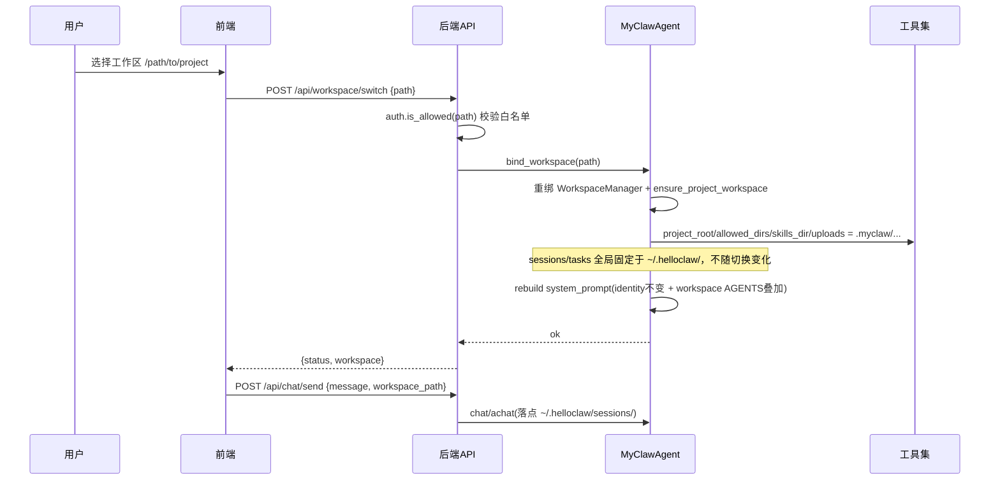

# MyClaw 多工作区工程设计

> 版本：v1.2
> 日期：2026-08-11
> 状态：已实现（v1.1：会话/任务全局化；v1.2：默认工作区与白名单自愈、身份文件工具路径别名）

---

## 目录

1. [背景与核心矛盾](#1-背景与核心矛盾)
2. [三层架构设计](#2-三层架构设计)
3. [两阶段部署流程](#3-两阶段部署流程)
4. [bind_workspace 全量重绑机制](#4-bind_workspace-全量重绑机制)
5. [工作区白名单授权模型](#5-工作区白名单授权模型)
6. [身份文件工具路径别名](#6-身份文件工具路径别名)
7. [数据流与切换时序](#7-数据流与切换时序)
8. [迁移方案与兼容性矩阵](#8-迁移方案与兼容性矩阵)
9. [安全性设计](#9-安全性设计)
10. [对标行业实践](#10-对标行业实践)
11. [改动清单](#11-改动清单)

---

## 1. 背景与核心矛盾

### 1.1 改造前的状态

MyClaw Agent 启动时通过环境变量 `WORKSPACE_PATH` 锁定一个工作区目录（默认 `~/.helloclaw/workspace`），Agent 进程中所有工具（Read/Write/Edit/Bash/RAG/Memory/Sessions/Tasks/Skills）的文件操作根目录都绑定到该路径，运行时不可变更。进程级的全局 Agent 单例使得所有会话共享同一个工作区。

### 1.2 核心矛盾

| 矛盾 | 描述 |
|------|------|
| **身份与工作区耦合** | `IDENTITY.md` / `SOUL.md` / `USER.md`（Agent 人格/身份）与项目代码挤在同一目录下，切到其他项目时人格丢失 |
| **工具根目录锁死** | `BashTool.allowed_directories`、`ReadTool.project_root` 等在 Agent 构造期写死，运行时不支持动态切换 |
| **用户操作范围受限** | 用户无法像 Cursor / WorkBuddy 那样在 UI 上选择"本次任务的工作区" |

### 1.3 改造目标

- **不改人格，换工作区**：Agent 身份（"我是谁"）永远从 `~/.helloclaw/identity/` 读取，工作区（"我要操作哪些文件"）按会话切换
- **进程不重启，工具重绑**：运行时通过 `bind_workspace()` 全量重绑工具根目录及所有依赖 workspace_path 的引用，毫秒级完成切换
- **前端一键选工作区**：侧边栏加选择器，用户选择本地文件夹（须先授权）

---

## 2. 三层架构设计

将 Agent 的"灵魂"（identity）与"工位"（workspace）解耦为三层：

```
Layer 0: Agent 基座     ~/.helloclaw/          ← 进程固定，永不变化
├── config.json                          # LLM / MCP / API Key 配置
├── AGENTS.md                            # 全局默认 prompt 骨架（fallback）
├── identity/                            # 身份/人格基座
│   ├── IDENTITY.md                      # Agent 名字、emoji、vibe
│   ├── SOUL.md                          # 人格、语气、边界
│   ├── USER.md                          # 用户画像、称呼方式
│   └── BOOTSTRAP.md                     # 一次性引导（完成后自动删除）
├── sessions/                            # 会话历史（全局共享，跨工作区）
├── tasks/                               # 任务追踪与 Plan 暂存（全局共享，跨工作区）
├── memory/                              # 全局长期记忆（向量存储）
└── skills/                              # 全局可复用 Skill

Layer 1: 用户工作区     <任意项目目录>/.myclaw/    ← 按 session 切换
├── AGENTS.md                            # 项目行为规范（可选，叠加到基座）
├── HEARTBEAT.md                         # 心跳任务（可选）
├── uploads/                             # per-workspace 文件上传
├── skills/                              # per-workspace Skill（优先级高于全局）
└── automations/                         # per-workspace 定时任务

Layer 2: 会话/任务      会话内的执行上下文        ← 不变（原有机制）
```

> **设计决策（v1.1）**：会话历史与 Task 历史从 `.myclaw/` 提升到 `~/.helloclaw/`。切工作区不再丢对话/任务进度；`bind_workspace` 也无需再重绑 `session_dir` / `TaskTracker._persist_dir`。

### 优先级链

借鉴 Cursor 的 Rules 优先级模型：

```
identity/SOUL.md   >   工作区/AGENTS.md   >   基座/AGENTS.md   >   工具默认行为
   (最高，不可覆盖)     (项目级行为规范)        (全局默认骨架)        (代码中的默认值)
```

System Prompt 构建顺序（`_build_system_prompt`）：
1. AGENTS.md 骨架：优先用工作区 `.myclaw/AGENTS.md`，不存在则用基座 `~/.helloclaw/AGENTS.md` fallback
2. 入职引导：仅当 `identity/BOOTSTRAP.md` 存在时注入（完成后自动删除）
3. 身份信息：从 `identity/IDENTITY.md` 读取
4. 用户信息：从 `identity/USER.md` 读取
5. 人格模板：从 `identity/SOUL.md` 读取
6. 长期记忆/子代理/任务管理指引：自动注入

### 设计决策：为什么用 `.myclaw/` 子目录？

1. 隐藏目录在 Linux/macOS 下自动隐藏，不破坏项目根目录整洁度
2. 参考 WorkBuddy "空间-项目-任务"三层模型 — 工作区文件归拢一处，`.gitignore` 一目了然
3. `.myclaw/` 可整体被 `.gitignore` 排除，也可选择性提交 `AGENTS.md` 给团队共享
4. 对标 OpenClaw 的 `~/.openclaw/workspace/` — MyClaw 选择把 workspace-level 文件放在项目内（让不同项目有不同 AGENTS.md）

---

## 3. 两阶段部署流程

模板部署拆分为两个独立阶段：**Agent 基座部署**（Phase 1）和**工作区部署**（Phase 2）。

### 模板目录结构

```
backend/src/workspace/templates/
├── config.json                       # 全局配置模板（不变）
├── identity/                         # Agent 基座模板
│   ├── IDENTITY.md
│   ├── SOUL.md
│   ├── USER.md
│   └── BOOTSTRAP.md
└── workspace/                        # 工作区模板
    ├── AGENTS.md
    └── HEARTBEAT.md
```

### Phase 1：Agent 基座部署（进程启动时执行一次）

```
backend 进程启动 (main.py)
  │
  ├── MyClawAgent(home_path, workspace_path) 构造函数
  │     │
  │     ├── IdentityManager(home_path).ensure_exists(old_workspace)
  │     │     │
  │     │     ├── [1] 创建 ~/.helloclaw/identity/ 目录
  │     │     ├── [2] 如果 .v2_migration_done 标记不存在 → 从旧 workspace 迁移 IDENTITY/SOUL/USER.md
  │     │     ├── [3] 从 templates/identity/ 复制缺失文件（不覆盖已有）
  │     │     ├── [4] 确保 BOOTSTRAP.md 存在（引导完成后自动删除）
  │     │     └── [5] 写入 .v2_migration_done 标记（防重复迁移）
  │     │
  │     ├── _ensure_base_agents_md()
  │     │     └── 从 templates/workspace/AGENTS.md 复制到 ~/.helloclaw/AGENTS.md（不覆盖）
  │     │
  │     └── WorkspaceManager(workspace_path).ensure_global_config_exists()
  │           └── templates/config.json → ~/.helloclaw/config.json（不覆盖）
```

### Phase 2：工作区部署（首次切换到某项目目录时执行）

```
前端选择工作区 → POST /api/workspace/switch { path }
  │
  ├── auth.is_allowed(path) 校验白名单
  │
  └── agent.bind_workspace(path)
        │
        └── WorkspaceManager(path).ensure_project_workspace()
              │
              ├── [1] 创建 <path>/.myclaw/uploads/
              ├── [2] 创建 <path>/.myclaw/skills/
              ├── [3] 创建 <path>/.myclaw/automations/
              ├── [4] 从 templates/workspace/AGENTS.md 部署（不覆盖）
              ├── [5] 从 templates/workspace/HEARTBEAT.md 部署（不覆盖）
              └── [6] 幂等追加 .gitignore 条目
              （sessions/tasks 已在全局 ~/.helloclaw/，此处不再创建）
```

### 核心差异对比

| 维度 | 旧部署逻辑 | 新部署逻辑 |
|------|-----------|-----------|
| 模板来源 | `templates/` 平铺 7 文件 | `templates/identity/` + `templates/workspace/` 分层 |
| 部署时机 | 启动时一次性全量部署 | Phase 1（启动时基座）+ Phase 2（切工作区时懒部署） |
| 目标路径 | `<workspace>/` 根目录平铺 | 基座 → `~/.helloclaw/identity/`；工作区 → `<project>/.myclaw/` |
| 身份文件 | 和用户代码混在一起 | 隔离在 `~/.helloclaw/identity/`，用户永远看不到 |
| AGENTS.md | 启动时必须存在于 workspace | 工作区 `.myclaw/AGENTS.md` 优先，基座 `~/.helloclaw/AGENTS.md` fallback |
| 文件隔离 | 所有文件散落在项目根目录 | 统一归拢到 `.myclaw/` 子目录，项目根目录保持整洁 |

---

## 4. bind_workspace 全量重绑机制

### 设计动机

`MyClawAgent` 在构造期把 `workspace_path` 深度绑定到多处引用点。切换工作区时如果只重绑 file tools 的 `project_root`，skills/upload/automations 等仍会落在旧工作区，导致跨工作区数据泄漏。

> **v1.1 变更**：`sessions` / `tasks` 已全局化到 `~/.helloclaw/`，路径不再随工作区变化，因此切工作区时**不再重绑** `config.session_dir` 与 `TaskTracker._persist_dir`（引用点从约 14 处减到约 12 处）。

### 全量重绑清单

`bind_workspace()` 方法全量更新所有依赖 workspace_path 的引用点：

| 引用点 | 位置 | 重绑方式 |
|--------|------|----------|
| ReadTool/WriteTool/EditTool.project_root | `_setup_tools` | `setattr(tool, "project_root", abs_path)` |
| BashTool.allowed_directories/default_workdir/_cwd | `_setup_tools` | 重置白名单 + `_cwd=None`（防跨工作区逃逸） |
| RAGTool.workspace_root | `_setup_tools` | `setattr(tool, "workspace_root", abs_path)` |
| self.workspace (WorkspaceManager) | `__init__` | 新建 WorkspaceManager + ensure_project_workspace |
| SkillLoader（工作区 skills 目录） | `__init__` | `update_workspace_dir` + 刷新 Skill 工具（全局 skills 不变） |
| SubAgentOrchestrator.workspace_path | `_setup_tools` | `setattr` |
| EnhancedSimpleAgent.workspace_root | `__init__` | `setattr` 为 `Path(abs_path).resolve()` |
| uploads_root / browser uploads | 多处 | 改为 `self.workspace.uploads_path` |
| AutomationStore | `__init__` | 指向新工作区 `.myclaw/automations/` |
| system_prompt | `_build_system_prompt` | rebuild（identity 不变 + 新工作区 AGENTS 叠加） |
| ~~MemoryCaptureManager~~ | — | **已移除**（记忆写入不再依赖正则捕获；Qdrant Memory 全局，无需随工作区重绑） |
| ~~config.session_dir~~ | — | **无需重绑**（固定 `~/.helloclaw/sessions`） |
| ~~TaskTracker._persist_dir~~ | — | **无需重绑**（固定 `~/.helloclaw/tasks`） |

### 关键实现

```python
def bind_workspace(self, workspace_path: str):
    """切换到指定工作区（运行时动态重绑工具根目录 + 部署 .myclaw/ 结构）"""
    from ..workspace.auth import is_allowed

    abs_path = os.path.abspath(os.path.expanduser(workspace_path))
    # 已是当前工作区：幂等返回（避免路径规范化细微差异导致误报未授权）
    if os.path.realpath(abs_path) == os.path.realpath(self._current_workspace):
        return

    if not is_allowed(workspace_path):
        raise ValueError(f"工作区未授权: {workspace_path}")

    self._current_workspace = abs_path

    # Phase 2 部署：确保 .myclaw/ 子目录结构存在
    self.workspace = WorkspaceManager(abs_path)
    self.workspace.ensure_project_workspace()
    self.workspace_path = abs_path  # 保留属性供外部引用

    # 全量重绑（sessions/tasks 已全局化，无需重绑）
    self._rebind_workspace_tools(abs_path)          # file tools
    self.skill_loader.update_workspace_dir(Path(self.workspace.skills_path))
    self.refresh_skill_tool()
    # sessions / tasks → ~/.helloclaw/，跨工作区共享，此处跳过
    if self._subagent_orchestrator is not None:
        self._subagent_orchestrator.workspace_path = abs_path
    if self._agent is not None and hasattr(self._agent, "workspace_root"):
        self._agent.workspace_root = Path(abs_path).resolve()

    # 重建系统提示词（identity 不变 + 新工作区 AGENTS 叠加）
    if self._agent is not None:
        self.ensure_session_system_prompt(force=True)
```

### 重绑完整性保障

遗漏任一**工作区相关**引用点会导致跨工作区数据泄漏。完整性通过以下方式保障：
1. **构造期引用审计**：构造函数中所有 `self.workspace_path` 引用都已改为 `self.workspace.*_path` 属性
2. **全局路径固定**：`WorkspaceManager.sessions_path` / `tasks_path` 恒为 `~/.helloclaw/sessions|tasks`，getter 内 `makedirs(exist_ok=True)`
3. **缓存清理**：`SkillLoader` 切换后更新工作区目录并刷新 Skill 工具，全局 skills 目录不变
4. **Path 类型适配**：`EnhancedSimpleAgent.workspace_root` 是 `Path` 对象，setattr 时用 `Path(abs_path).resolve()`
5. **BashTool 防逃逸**：切换时 `_cwd=None` 重置 cd 历史，防止 `cd` 跨工作区
6. **身份别名不随重绑失效**：`identity_paths.install_identity_path_resolver` 在 `_setup_tools` 只装一次；重绑只改 `working_dir`/`project_root`，别名闭包读 `tool._identity_dir`（基座固定）

---

## 5. 工作区白名单授权模型

### 授权机制

用户须显式授权一个本地目录后才能**切换到新工作区**。白名单持久化到 `~/.helloclaw/workspaces.json`：

```json
[
  "/home/user/projects/my-app",
  "D:\\Code\\MyProject"
]
```

路径一律经 `os.path.realpath` + `expanduser` 规范化，防止符号链接绕过。

### 默认工作区与自愈（v1.2）

早期实现要求「每个目录都必须先手工 authorize」，但会出现矛盾：**进程已经以 `WORKSPACE_PATH`（默认 `~/.helloclaw/workspace`）启动并绑定了当前目录，白名单文件却缺失**，于是 UI / 发消息仍报「未授权」。

落地修正：

| 时机 | 行为 | 代码 |
|------|------|------|
| Agent 构造 | 对当前工作区 `ensure_authorized()` | `myclaw_agent.__init__` |
| `GET /api/workspace/list` | 若 `current` 不在白名单则自动补授权 | `api/workspace.py` |
| `bind_workspace` | 目标已是当前路径则幂等 return | `myclaw_agent.bind_workspace` |
| 默认路径 | `WORKSPACE_PATH` 默认 `~/.helloclaw/workspace`（与 CLI / `.env` 对齐，**不是**用户家目录 `~`） | `main.py` / `cli` |

`ensure_authorized(path)` 幂等：目录存在则写入白名单并返回规范化绝对路径；无效路径返回 `None`。

> **安全边界不变**：自愈只覆盖「当前已在跑的工作区」和「用户主动 authorize 的目录」，**不会**因前端传任意路径而自动放行；`switch` 到新路径仍须先在白名单内。

### API 端点

| 端点 | 方法 | 说明 |
|------|------|------|
| `/api/workspace/list` | GET | 返回已授权列表 + 当前工作区；并对 current 自愈补授权 |
| `/api/workspace/switch` | POST | 切换到已授权工作区（先校验白名单再 bind_workspace） |
| `/api/workspace/authorize` | POST | 授权新工作区（校验路径存在后加入白名单） |
| `/api/workspace/revoke` | DELETE | 撤销工作区授权 |
| `/api/workspace/pick_folder` | POST | 本机弹出文件夹选择对话框（供 H5 取绝对路径） |

### 四层安全模型

| 层级 | 机制 | 说明 |
|------|------|------|
| 基座层 | `~/.helloclaw/identity/` 在工作区沙箱外 | 人格不随切工作区变化；经工具别名或配置 API 读写，**禁止**写到工作区根同名文件 |
| 用户级 | `~/.helloclaw/workspaces.json` 白名单 | 切换新目录须显式授权；当前工作区可启动/list 自愈 |
| 运行时 | API 校验 + 工具重绑 | 每次切到**新**路径先验证白名单再重绑 |
| 工具级 | `BashTool.allowed_directories` + 文件工具 `working_dir` | 命令与相对路径默认落在当前工作区；身份四件套由别名重定向 |

---

## 6. 身份文件工具路径别名

### 问题

目录解耦后，真文件在 `~/.helloclaw/identity/`，但 hello_agents 的 Read/Write/Edit 默认把相对路径解析到 **工作区 `working_dir`**。入职引导若仍按「工作区相对路径」描述，模型会：

1. `Read("IDENTITY.md")` → `NOT_FOUND`（工作区根没有该文件）
2. `Write("IDENTITY.md")` 「成功」却写到 `<workspace>/IDENTITY.md`，切项目后人设仍丢

System Prompt 虽从基座注入身份正文，**工具层若不纠正，仍会污染工作区**。

### 方案

模块：`backend/src/tools/builtin/identity_paths.py`，在 `_setup_tools` 对 Read/Write/Edit 调用 `install_identity_path_resolver(tool, identity_dir)`。

**第一层 — 包装 `_resolve_path`**：

1. `resolve_identity_alias`：裸名 `IDENTITY.md` / `USER.md` / `SOUL.md` / `BOOTSTRAP.md`，或路径含 `identity/<name>`，或已落在基座下 → 映射到 `~/.helloclaw/identity/<name>`
2. 工作区根兜底：basename 为身份四件套，且父目录 = 当前 `working_dir` → 同样重定向到基座（清理历史误写路径）
3. 其它路径走原逻辑

**第二层 — 包装 Write/Edit 的 `run`**：

hello_agents 在改已有文件前会备份到同目录 `.backups/`，并在响应里 `backup_path.relative_to(self.working_dir)`。文件在基座、`working_dir` 仍是工作区时会抛错。写身份文件时临时把 `working_dir` 切到 `identity_dir`，`finally` 还原。

**提示词同步**：`templates/workspace/AGENTS.md`、`templates/identity/BOOTSTRAP.md` 明确「身份在基座；裸文件名即可；禁止写到工作区根」。已部署用户侧 AGENTS/BOOTSTRAP 需同步或靠新会话模板；工作区根误写文件可迁回基座后删除副本。

### 与沙箱的关系

- 不扩大 Bash 白名单到整个 `~/.helloclaw`
- 仅对身份**文件名别名**开文件工具通道；普通相对路径仍困在当前工作区
- 切工作区只改 `working_dir`，不重装 resolver，避免多层 monkey-patch

---

## 7. 数据流与切换时序



### 前端交互流程

1. App 启动时 `workspaceStore.init()` 拉取已授权列表与当前工作区
2. 用户点击侧边栏 WorkspaceSwitcher 下拉选择已授权工作区，或"打开本地文件夹"输入新路径
3. 新路径先 `authorize` 加入白名单，再 `switch` 切换
4. 发送消息时 `ChatView` 从 `workspaceStore.current` 取当前工作区，作为 `workspace_path` 附带请求
5. 后端 `bind_workspace` 重绑后处理消息；会话落点 `~/.helloclaw/sessions/`（全局，切工作区不丢历史）

---

## 8. 迁移方案与兼容性矩阵

### V1 → V2 自动迁移

迁移逻辑内置在 `IdentityManager.ensure_exists()` 中：

1. **启动时**检查 `~/.helloclaw/.v2_migration_done` 标记
2. 标记不存在 → 扫描 `~/.helloclaw/workspace/` 下的 IDENTITY/SOUL/USER.md → 拷贝到 `~/.helloclaw/identity/`
3. 写入 `.v2_migration_done` 标记，后续启动不再重复迁移
4. 旧 workspace 不存在 → 直接从 `templates/identity/` 部署新文件

### 兼容性矩阵

| 场景 | 行为 |
|------|------|
| 全新安装（无 ~/.helloclaw） | Phase 1 从 templates/identity/ 部署 identity 文件 + BOOTSTRAP.md；基座 AGENTS.md fallback |
| 升级安装（有 ~/.helloclaw/workspace/IDENTITY.md） | Phase 1 自动迁移身份文件到 ~/.helloclaw/identity/ |
| 升级后重新安装（已迁移过） | 跳过迁移，identity 文件保持不变 |
| 旧 session 文件（~/.helloclaw/workspace/sessions/*.json 或 `<project>/.myclaw/sessions/`） | 不自动迁移；用户可手动复制到 `~/.helloclaw/sessions/`（全局目录） |
| 旧 AGENTS.md 行为规范 | 保留在旧 workspace 目录；用户切换工作区到旧目录时可手动拷贝到 .myclaw/AGENTS.md |
| 向前兼容 | `WORKSPACE_PATH` 环境变量仍生效（默认 `~/.helloclaw/workspace`）；新增 `AGENT_HOME`（默认 ~/.helloclaw） |
| 白名单缺失 | 启动 / `GET /list` 对当前工作区 `ensure_authorized` 自愈；新路径仍须显式 authorize |
| 工作区根误写 IDENTITY/USER | 工具别名重定向到基座；可手工迁回 `identity/` 后删除工作区副本 |

### 向后兼容

- `WORKSPACE_PATH` 环境变量仍生效，**默认值保持** `~/.helloclaw/workspace`（与 CLI / 常见 `.env` 一致；早期方案稿中「默认改成 `~`」未落地）
- 新增 `AGENT_HOME` 环境变量（默认 `~/.helloclaw`），仅当用户希望自定义基座位置时设置

---

## 9. 安全性设计

### 沙箱机制（保持 + 增强）

现有 `BashTool` 的危险命令拦截完整保留（`_DANGEROUS_PATTERNS` 包括 rm -rf、sudo、mkfs 等）。

**增强点**：运行时 `bind_workspace()` 动态更新 `BashTool.allowed_directories` 并重置 `_cwd`，确保 `cd` 无法跳出白名单：

```python
# bind_workspace 中重绑 BashTool
tool.allowed_directories = [abs_path]
tool.default_workdir = abs_path
tool._cwd = None  # 重置 cd 历史，防跨工作区逃逸
```

### .gitignore 自动注入

首次创建 `.myclaw/` 时，幂等追加 `.gitignore` 条目：

```gitignore
# MyClaw Agent 工作区文件 (自动生成)
.myclaw/uploads/
.myclaw/automations/runs/
.myclaw/HEARTBEAT.md
# 以下文件可选择提交到 Git 以与团队共享：
# .myclaw/AGENTS.md      <- 项目行为规范，可选择性提交
# .myclaw/skills/         <- 项目专属 Skill，可选择性提交
```

> 会话与任务已存于全局 `~/.helloclaw/sessions|tasks/`，不再写入项目 `.myclaw/`，故 `.gitignore` 中不再包含这两项。

### 禁止的行为

- **禁止** 前端传任意路径越级到 `/etc` → 后端必须校验 `is_allowed()`（自愈不适用于任意新路径）
- **禁止** 切换工作区时不重置 BashTool 的 `_cwd`（防止 cd 跨工作区）
- **禁止** API key 或敏感配置泄露到工作区目录（config.json 在基座 `~/.helloclaw/`）
- **禁止** 将 `IDENTITY.md` / `USER.md` / `SOUL.md` / `BOOTSTRAP.md` 写到工作区根（应走基座；工具层别名兜底）

---

## 10. 对标行业实践

### 公共模式提炼

| 切入点 | OpenClaw | Cursor | WorkBuddy | MyClaw 选择 |
|--------|----------|--------|-----------|-------------|
| 身份/人格存放 | workspace 内 SOUL/IDENTITY | User Rules（全局） | 空间级身份 | **基座 ~/.helloclaw/identity/** |
| 项目行为规则 | workspace 内 AGENTS.md | Project Rules | 项目级配置 | **工作区 .myclaw/AGENTS.md** |
| LLM/MCP 配置 | ~/.openclaw/ | IDE Settings | 同源底座层 | **~/.helloclaw/config.json** |
| 工具沙箱 | 可选 sandbox | IDE 内置沙箱 | 本地执行模式 | **allowed_directories 白名单** |
| 工作区切换 | per-agent 配置 | Multi-root | 空间切换 | **bind_workspace 运行时重绑** |
| `project_root` | 可运行时指定 | 多根索引 | 选中文件夹 | **运行时 setattr 可变** |

### MyClaw 的取舍

| 决策 | 选择 | 原因 |
|------|------|------|
| identity 与 workspace 分离 | ✅ 是 | 借鉴 OpenClaw + Cursor 共识 |
| 沙箱硬隔离（Docker/LXC） | ❌ 不引入 | 改动量太大，沿用 `allowed_directories` 白名单 |
| 云端沙箱模式 | ❌ 不引入 | WorkBuddy 云沙箱需要腾讯云基础设施 |
| 多 Agent 不同 identity | ❌ 不引入 | 当前单 Agent 全局单例，多 Agent 为远期目标 |
| 5 层 workspace 扩展目录 | ❌ 不引入 | 太复杂，`.myclaw/` 扁平结构更可控 |
| Git 自动备份 workspace | ❌ 不引入 | 交由用户自行管理 |
| 空间-项目-任务三层 | ❌ 不引入项目层 | Workspace = 空间级足够，session = 任务级 |
| 会话/任务按工作区隔离 | ❌ 改为全局（v1.1） | `~/.helloclaw/sessions|tasks/` 跨工作区共享，切项目不丢历史 |
| 距离优先嵌套 rules | ❌ 不引入 | 单项目单 AGENTS.md，不需要子目录规则 |
| 身份文件走专用工具 | ❌ 别名包装 Read/Write/Edit（v1.2） | 零新核心工具 footprint；提示词 + `_resolve_path` 双重约束 |

---

## 11. 改动清单

### 后端

| 文件 | 操作 | 说明 |
|------|------|------|
| `backend/src/workspace/identity.py` | 🆕 新增 | IdentityManager：身份文件管理 + 部署 + V1 迁移 |
| `backend/src/workspace/auth.py` | 🆕 / 增强 | 白名单；v1.2 增加 `ensure_authorized` 自愈 |
| `backend/src/workspace/manager.py` | 重写 | 瘦身为仅管理 .myclaw/ 子目录；sessions/tasks 属性指向全局 `~/.helloclaw/` |
| `backend/src/workspace/__init__.py` | 修改 | 导出 IdentityManager, auth |
| `backend/src/workspace/templates/` | 重组 / 修订 | identity/ + workspace/；AGENTS/BOOTSTRAP 标明基座路径 |
| `backend/src/tools/builtin/identity_paths.py` | 🆕 v1.2 | Read/Write/Edit 身份别名 + Write/Edit working_dir 临时切换 |
| `backend/src/agent/myclaw_agent.py` | 修改 | home/identity 分离、bind 幂等、启动 ensure_authorized、安装 identity resolver |
| `backend/src/api/workspace.py` | 🆕 / 增强 | list/switch/authorize/revoke；list 对 current 自愈 |
| `backend/src/api/config.py` | 重写 | 配置读写分流 identity/workspace；get_workspace 返回 agent.workspace |
| `backend/src/api/chat.py` | 修改 | ChatRequest 加 workspace_path；发送前 bind_workspace |
| `backend/src/api/upload.py` | 修改 | uploads 路径改 .myclaw/uploads |
| `backend/src/main.py` | 修改 | home+workspace 分离；默认 `WORKSPACE_PATH=~/.helloclaw/workspace` |
| `backend/tests/tools/test_identity_paths.py` | 🆕 v1.2 | 别名 / 工作区根重定向单测 |

### 前端

| 文件 | 操作 | 说明 |
|------|------|------|
| `frontend/src/api/workspace.ts` | 🆕 新增 | workspace API（axios 封装） |
| `frontend/src/stores/workspace.ts` | 🆕 新增 | Pinia workspace store（setup store） |
| `frontend/src/components/WorkspaceSwitcher.vue` | 🆕 新增 | 工作区选择器（Dropdown + Modal 输入路径） |
| `frontend/src/api/chat.ts` | 修改 | SendMessageOptions 加 workspacePath |
| `frontend/src/views/ChatView.vue` | 修改 | 集成 workspaceStore；发送附带 workspace_path |
| `frontend/src/App.vue` | 修改 | 侧边栏头部插入 WorkspaceSwitcher |

### 零新增依赖

本方案不引入任何新的第三方 Python 或 npm 包。所有改动基于现有框架（FastAPI、HelloAgents、Vue 3、ant-design-vue、Pinia、axios）。

---

*本文档基于 MyClaw 多工作区改造实现整理，代码引用以实际源码为准。*
