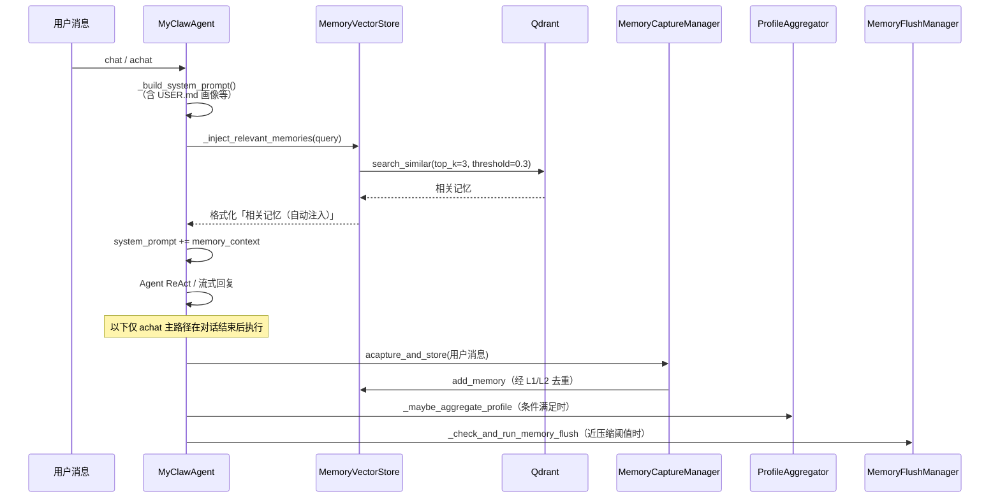
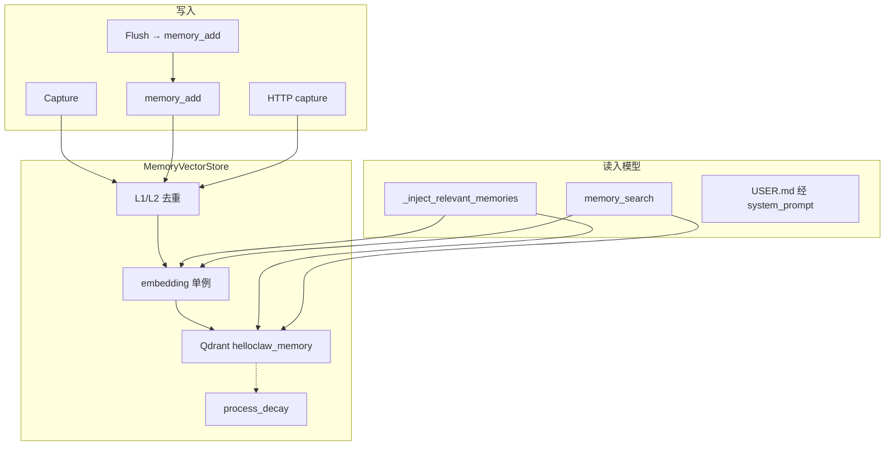
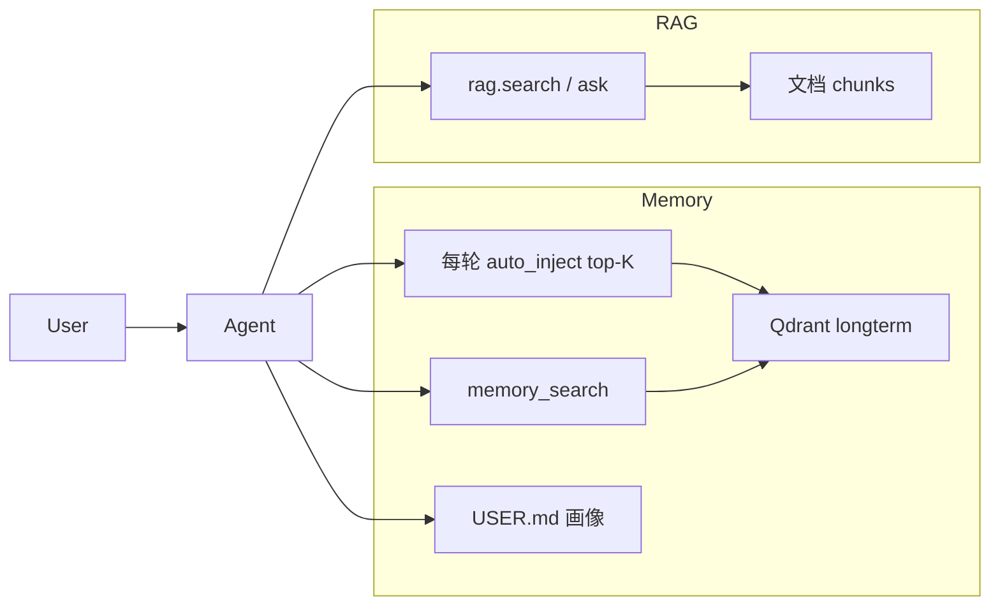

# Memory 实现与功能说明

本文档基于当前代码，说明 MyClaw 中 **Memory（记忆）** 的存储位置、每轮自动注入、内置工具接口、`backend/src/memory` 子模块职责，以及 **Memory 对 Agent 的意义** 与 **Memory 和 RAG / 用户画像的关系**。文中的 Mermaid 图可在 Obsidian 中渲染。

---

## 1. 功能总览

记忆系统为 **统一的长期记忆**：基于 **Qdrant 向量数据库** 存储，使用与 RAGTool 相同的 embedding 基础设施做语义检索。进入模型的路径是 **双通道**：

1. **每轮自动注入（默认开启）**：用户消息到达时，按语义检索 top-K（默认 **3**）条相关记忆，追加到本轮 `system_prompt`。
2. **工具按需深挖**：Agent 可再调 `memory_search` 等子动作获取更多或按分类过滤的结果。

| 特性 | 说明 |
|------|------|
| **存储** | Qdrant 向量数据库（collection: `helloclaw_memory`，可由 `QDRANT_COLLECTION` 覆盖） |
| **写入方式** | 自动捕获（`MemoryCaptureManager`，正则匹配）、Agent 工具 `memory_add`、Memory Flush 静默回合、HTTP `/api/memory/capture` |
| **写入去重** | **L1 字面去重（默认启用）**：`content_hash + category`；**L2 语义去重（默认关闭）**：embedding top-1 + 阈值。命中均不新建，复用旧 `memory_id` 并强化 |
| **检索 / 进入模型** | ① 每轮 `auto_inject` 语义检索并注入 system prompt；② Agent 工具 `memory_search` 按需深挖；③ `USER.md` 画像区域由聚合器从记忆沉淀后，经 `_build_system_prompt` 常驻注入 |
| **遗忘机制** | 衰减式遗忘：`decay_score` 初始 1.0，每 7 天按分类速率衰减，归零则删除；检索命中重置计时器（用进废退）；懒处理（启动时 / `memory_cleanup`） |
| **分类体系** | preference / decision / entity / fact / plan / relationship / reference / rule（8 种） |
| **用户画像联动** | `ProfileAggregator` 从记忆聚合写入 `~/.helloclaw/identity/USER.md` 自动区域（每 10 轮或 preference 过多时触发） |

### 与旧架构的区别

| 维度 | 旧架构 | 当前架构 |
|------|--------|----------|
| 长期记忆 | `MEMORY.md` 文件 | Qdrant 向量 |
| 每日记忆 / 会话摘要 | 独立 Markdown 文件 | 已移除，统一为长期记忆 |
| 检索方式 | 文件子串匹配 | embedding 语义检索 |
| 进入模型 | 早期曾「仅工具按需、不注入」 | **每轮自动注入 top-K** + 工具深挖 + `USER.md` 画像 |

---

## 2. 每轮对话中的记忆生命周期



### 2.1 自动注入（`_inject_relevant_memories`）

实现位置：`backend/src/agent/myclaw_agent.py`。在 `chat()` / `achat()` 中，于 `_build_system_prompt()` **之后**、Agent 运行 **之前** 调用。

行为要点：

- 用当前用户消息（多模态时先拍平为纯文本）做 query，调用 `MemoryVectorStore.search_memories`。
- 命中则追加到本轮 `system_prompt`，标题为 `## 相关记忆（自动注入）`，并提示不足时可再调 `memory_search`。
- **每轮先重建 base system prompt，再追加本轮检索结果**，不会跨轮累加旧注入块。
- 记忆不可用、配置关闭、query 为空或无命中时返回空串，不影响对话。

配置（工作区 / 全局 `config.json` 的 `memory` 段，模板见 `workspace/templates/config.json`）：

| 键 | 默认 | 说明 |
|----|------|------|
| `auto_inject` | `true` | 是否启用每轮自动注入 |
| `auto_inject_top_k` | `3` | 每轮注入条数 |
| `auto_inject_threshold` | `0.3` | 相似度下限（与工具检索默认阈值一致） |

```json
"memory": {
  "auto_inject": true,
  "auto_inject_top_k": 3,
  "auto_inject_threshold": 0.3
}
```

工作区 `AGENTS.md` 中的 Memory 说明已与此对齐：系统会自动注入相关记忆；不够时再用 `memory_search`。

### 2.2 对话结束后的写入与维护（`achat`）

| 步骤 | 方法 | 说明 |
|------|------|------|
| 自动捕获 | `_capture_memories` → `MemoryCaptureManager.acapture_and_store` | 正则分句匹配后写入 Qdrant |
| 画像聚合 | `_maybe_aggregate_profile` | 每 10 轮，或 preference 记忆偏多时，聚合到 `USER.md` |
| Memory Flush | `_check_and_run_memory_flush` | 接近上下文压缩阈值时，静默回合引导 `memory_add`（每会话最多一次） |

> **说明**：同步 `chat()` 同样做自动注入与会话保存；自动捕获 / 画像 / Flush 挂在异步 `achat` 结束路径上（前端流式对话走 `achat`）。

---

## 3. 存储层

### 3.1 MemoryVectorStore（`memory/vector_store.py`）

记忆专用 Qdrant 封装层：

```
MemoryVectorStore
├── qdrant_store: QdrantVectorStore (collection="helloclaw_memory")
├── embedder: EmbeddingModel (从 embedding.py 单例获取)
├── add_memory(content, category, session_id, source) → memory_id
├── search_memories(query, top_k, score_threshold, category) → List[dict]
├── delete_memories(memory_ids) → bool
├── process_decay() → {deleted, updated, total}
├── cleanup_expired(days) → int          # 兼容包装 → process_decay
├── _reinforce_memories(memory_ids)      # 检索命中强化
└── get_stats() → dict
```

**Qdrant Payload 结构**：

| 字段 | 类型 | 说明 |
|------|------|------|
| `content` | string | 记忆文本 |
| `content_hash` | keyword | 归一化内容 sha1[:16]，L1 去重 |
| `category` | keyword | 分类标签 |
| `memory_type` | keyword | 固定 `longterm` |
| `memory_id` | keyword | UUID |
| `timestamp` / `added_at` | integer | 创建时间 |
| `session_id` | keyword | 关联会话（可选） |
| `source` | keyword | capture / agent / flush / api |
| `decay_score` | float | 衰减分数，初始 1.0 |
| `last_decay_ts` | integer | 上次衰减基准 / 访问强化计时 |
| `access_count` | integer | 去重命中或检索强化次数 |

初始化时自动确保 `category`、`content_hash` 的 payload index（云端 Qdrant 对 filter 字段强制要求）。

### 3.2 遗忘机制（衰减式）

- 写入时 `decay_score = 1.0`，`last_decay_ts = now`
- 每 **7 天**（`DECAY_INTERVAL_DAYS`）按分类速率扣减；`≤ 0` 则删除
- **懒处理**：启动时（`main.py` lifespan）或 `memory_cleanup` / `/api/memory/cleanup` 时批量执行
- **访问强化**：`search_memories` 命中（含自动注入检索）会重置 `last_decay_ts`

| 分类 | 每 7 天衰减量 | 理论寿命 | 设计理由 |
|------|---------------|----------|----------|
| `entity` / `rule` | 0.10 | ~70 天 | 个人与规则宜久留 |
| `preference` / `relationship` | 0.15 | ~47 天 | 偏好与关系较重要 |
| `decision` | 0.20 | ~35 天 | 决策中等 |
| `plan` / `fact` | 0.25 | ~28 天 | 标准 |
| `reference` | 0.30 | ~23 天 | URL/路径易过时 |


旧记忆若缺少 `decay_score` / `last_decay_ts`，会回退用 `timestamp` 补算。

### 3.3 写入路径去重（L1 / L2）

`add_memory` 在真正写入前：

1. **L1（默认开）**：归一化文本 → `content_hash`，同 `category` 精确匹配 → 强化旧条、不新建  
2. **L2（默认关）**：仅当 `MEMORY_DEDUPE_THRESHOLD < 1.0`；同分类 embedding top-1 ≥ 阈值 → 同上  

失败均静默回退为正常写入。`MemoryCaptureManager.capture()` 内另有**单次调用内** `seen_contents` 去重；跨次 / 跨会话去重统一由 VectorStore 负责。

| 场景 | L1 | L2（默认关） | 结果 |
|------|----|--------------|------|
| 同内容同分类反复写 | 命中 | — | 复用 ID，`access_count++` |
| 大小写/空白扰动 | 命中 | — | 同上 |
| 同内容不同分类 | 未命中 | 未命中 | 新建两条 |
| 同义改写（L2 关） | 未命中 | 未触发 | 新建 |
| 同义改写（L2 开且命中） | 未命中 | 命中 | 复用 ID |

默认 embedding（如 `all-MiniLM-L6-v2`）对中文反义/同义区分不足，故 L2 默认关闭；换中文友好模型后可设 `MEMORY_DEDUPE_THRESHOLD=0.92` 启用。

### 3.4 Embedding 共享

与 RAG 共用 `rag/embedding.py` 的 `get_text_embedder()`，保证向量空间一致。



---

## 4. 内置工具：`MemoryTool`

实现：`backend/src/tools/builtin/memory.py`。

| 子动作 | 说明 |
|--------|------|
| `memory_search` | 语义检索（默认 top_k=5，可按 category 过滤） |
| `memory_get` | 按 memory_id 查询 |
| `memory_add` | 写入长期记忆（`source=agent`） |
| `memory_list` | 按时间列出最近记忆 |
| `memory_cleanup` | 触发 `process_decay` |
| `memory_delete` | 按 ID 删除 |
| `memory_aggregate_profile` | 手动触发画像聚合 → 更新 `USER.md` 自动区域 |
| `memory_update_longterm` | **已弃用**，转发到 `memory_add` |

与自动注入的关系：

- 自动注入覆盖「本轮最相关的几条」，降低漏调工具的概率。  
- 需要更多结果、按分类过滤、或核对具体 ID 时，仍应使用工具。  
- 工具检索命中同样触发访问强化。

`memory_store` 不可用时，部分动作可回退到旧的 `workspace_manager` 文件 API（过渡兼容）。

---

## 5. `backend/src/memory` 与画像联动

### 5.1 `MemoryCaptureManager`（`capture.py`）

在 `achat` 结束后对用户消息 `acapture_and_store`：

- 按句子切分（中文标点 / 转折连词）  
- `MEMORY_TRIGGERS`（约 28 条）匹配 8 类；一句可多分类，主分类取首个  
- 写入 Qdrant（经 L1/L2）

### 5.2 `MemoryFlushManager`（`memory_flush.py`）

上下文接近压缩阈值时触发**一次**静默回合（`soft_threshold_tokens` 提前量）：

- Prompt 要求用 `memory_add` 写入 Qdrant，勿写文件  
- 仅回复 `[SILENT]` 则不写  
- 新会话 `activate_session` / 清空时 `reset()`

### 5.3 `ProfileAggregator`（`agent/profile_aggregator.py`）

不属于 `memory/` 包，但是记忆链路的下游：

- 从 preference / entity 等记忆聚合到 `USER.md` 的自动区域（`tech_stack` / `work_domain` / `communication` / `code_style`）  
- 保留手动区域（HTML 注释边界）  
- 触发：对话每 10 轮，或 preference 条数超过阈值；也可 `memory_aggregate_profile`  
- 聚合结果经 `_build_system_prompt` 的「用户信息」块**常驻**进 system prompt（与每轮 top-K 自动注入互补：画像偏稳定偏好，自动注入偏本轮相关事实）

### 5.4 包导出

`memory/__init__.py` 导出 `MemoryCaptureManager`、`MemoryFlushManager`、`MemoryVectorStore`。

---

## 6. Memory 对 Agent 的意义

1. **低摩擦回忆**：每轮自动注入 top-K，无需模型先猜要不要调工具。  
2. **可深挖**：自动块不够时用 `memory_search`；重要信息仍可用 `memory_add` 显式写入。  
3. **语义而非字面**：向量检索覆盖改写表述。  
4. **衰减 + 用进废退**：冷记忆自然消退，常被检索的更持久。  
5. **去重**：避免捕获规则把同一句话写成多条。  
6. **画像沉淀**：零散 preference 记忆收敛为 `USER.md`，跨会话稳定影响人设与风格。

---

## 7. Memory 与 RAG / 会话原文的关系

| 维度 | Memory | RAG | 会话 JSON |
|------|--------|-----|-----------|
| **内容** | 对话沉淀的偏好、事实、决策、实体等 | 用户入库的文档知识 | 完整对话 transcript |
| **存储** | Qdrant `helloclaw_memory` | Qdrant RAG collection | `sessions/<id>.json` |
| **进模型** | 每轮 auto_inject + 工具 + USER.md | `rag.search` / `rag.ask` | UI `/history`；**当前无 Agent 跨会话原文检索工具** |
| **生命周期** | 衰减遗忘 | 用户管理 | 随会话文件增删 |



**协同建议**：个人化、对话衍生 → Memory；大文档 / 规范 → RAG；「某次对话原话」目前只能打开对应会话或依赖已蒸馏记忆，尚无 Hermes 式 `session_search`。

---

## 8. 记忆捕获规则参考

`MEMORY_TRIGGERS` 覆盖 8 类（条数以 `capture.py` 为准，约 28 条），示例：

| 分类 | 示例触发 | 条数约 |
|------|----------|--------|
| fact | 记住、remember、带数字事实、版本 | 若干 |
| preference | 喜欢、偏好、习惯、rather | 若干 |
| decision | 决定、改成、纠正、切换 | 若干 |
| plan | 计划、明天、deadline、待办 | 若干 |
| entity | 电话、邮箱、密钥、我叫、GitHub | 若干 |
| relationship | 同事、老板、团队、家人 | 若干 |
| reference | https://、文件路径 | 若干 |
| rule | 禁止、务必、格式要求 | 若干 |

自动捕获可能漏检/误检；关键信息仍建议显式 `memory_add` 或 Flush。

---

## 9. 相关代码与 API 索引

| 位置 | 作用 |
|------|------|
| `backend/src/memory/vector_store.py` | CRUD、衰减、L1/L2、payload index |
| `backend/src/memory/capture.py` | 正则自动捕获 |
| `backend/src/memory/memory_flush.py` | 压缩前静默 Flush |
| `backend/src/tools/builtin/memory.py` | MemoryTool 子动作 |
| `backend/src/agent/myclaw_agent.py` | 自动注入、捕获/Flush/画像调度、system prompt |
| `backend/src/agent/profile_aggregator.py` | 记忆 → USER.md 聚合 |
| `backend/src/workspace/templates/config.json` | `memory.auto_inject*` 默认 |
| `backend/src/workspace/templates/workspace/AGENTS.md` | 面向模型的 Memory 使用说明 |
| `backend/src/main.py` | 启动初始化 + `process_decay` |
| `backend/src/api/memory.py` | HTTP 列表/统计/捕获/清理/删除（Qdrant 调用走 `run_in_threadpool`） |

### HTTP 接口

| 方法 | 路径 | 作用 |
|------|------|------|
| GET | `/api/memory/list` | 最近列表 / 关键词检索 |
| GET | `/api/memory/stats` | 分类统计 |
| POST | `/api/memory/capture` | 手动添加 |
| POST | `/api/memory/cleanup` | 衰减处理 |
| DELETE | `/api/memory/{memory_id}` | 按 ID 删除 |

---

## 10. 配置与运维提示

- **自动注入**：`config.json` → `memory.auto_inject` / `auto_inject_top_k` / `auto_inject_threshold`；关掉 `auto_inject` 则退回「仅工具检索」。  
- **Qdrant**：与 RAG 共享连接，不同 collection；`QDRANT_COLLECTION` 可覆盖记忆 collection 名。  
- **Payload index**：初始化自动建 `category`、`content_hash`。  
- **去重**：`MEMORY_DEDUPE_THRESHOLD`（默认 `1.0` = 关 L2）。  
- **Embedding**：`EMBED_MODEL_TYPE` / `EMBED_MODEL_NAME`；换模后旧向量空间不一致，宜重建或接受效果下降。  
- **HTTP**：同步 Qdrant 操作经 `run_in_threadpool`，避免堵事件循环。  
- **兼容**：`MemoryTool` / Capture 仍保留 `workspace_manager` 回退参数。  
- **局限**：自动注入只带 top-K，不是全库；无跨会话 **原文** 检索；正则捕获非完备。

---

以上为当前 Memory 子系统说明。若调整 `auto_inject*`、`MEMORY_TRIGGERS`、`CATEGORY_DECAY_RATES`、`MEMORY_DEDUPE_THRESHOLD` 或工具参数，以对应源码为准。
