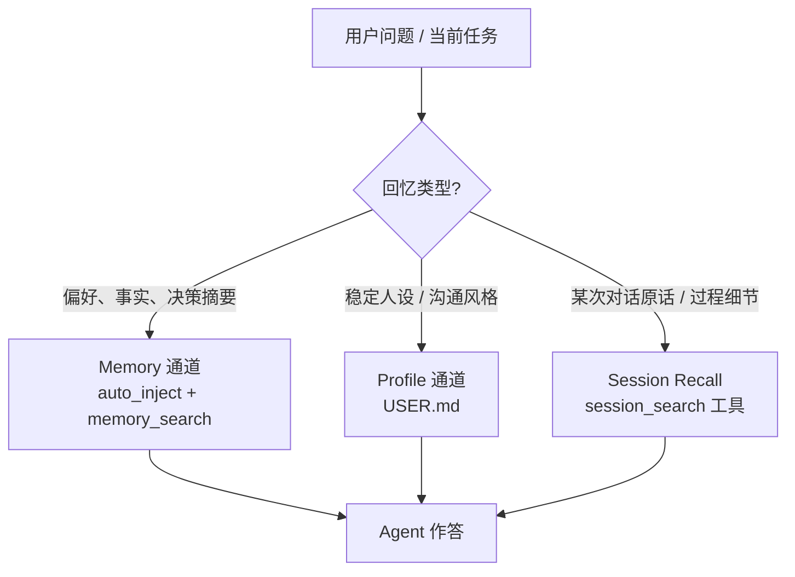
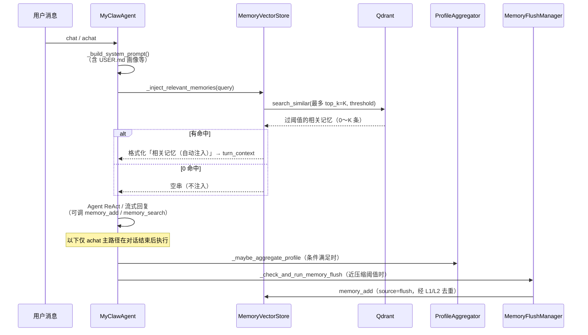
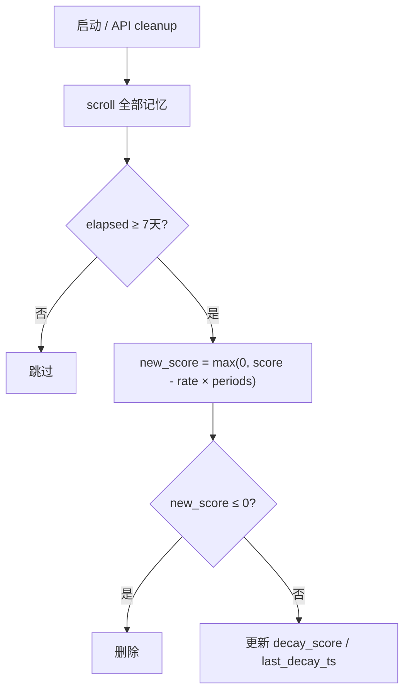
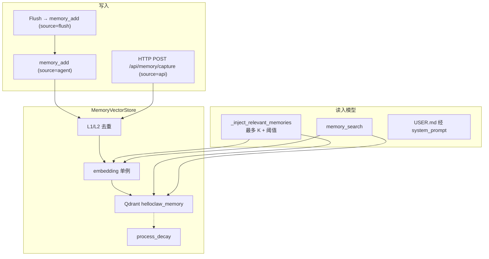
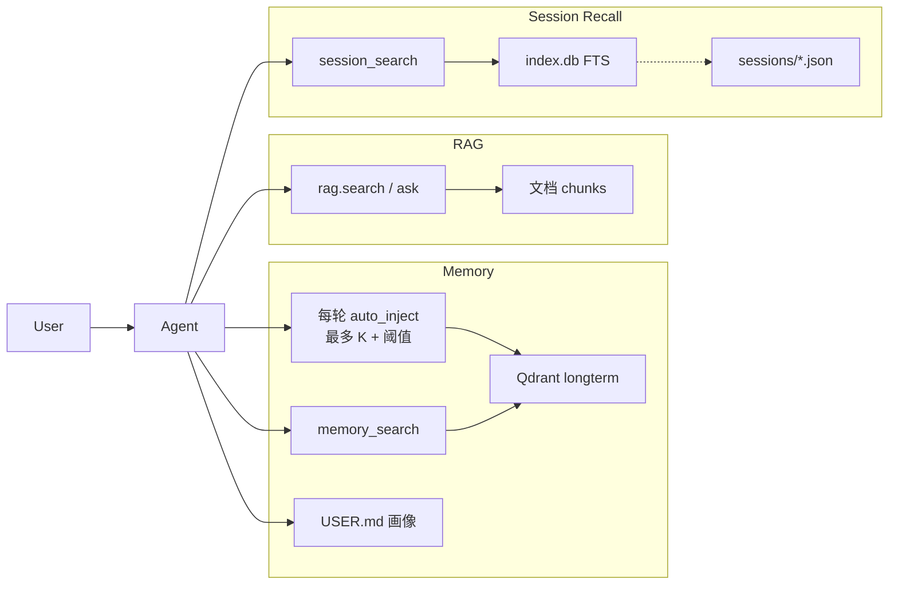
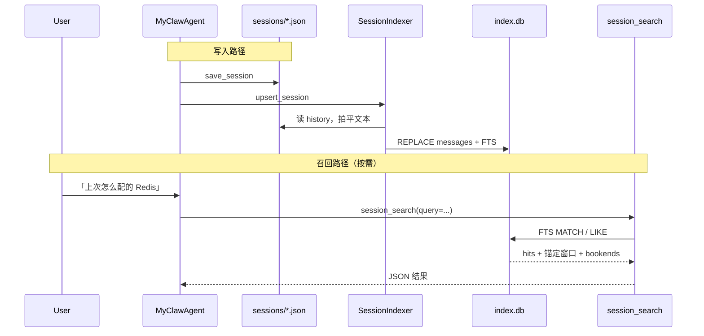

# Memory 与跨会话回忆 — 实现与功能说明

本文档基于当前代码，说明 MyClaw 中 **长期记忆（Memory）**、**用户画像（Profile）** 与 **跨会话原文召回（Session Recall）** 三通道如何分工协作：存储位置、进入模型的方式、内置工具、`backend/src/memory` / `session_store` 职责，以及与 RAG 的边界。文中的 Mermaid 图可在 Obsidian 中渲染。

设计草案详见 [`docs/MyClaw_跨会话回忆设计方案.md`](../MyClaw_跨会话回忆设计方案.md)。

---

## 1. 功能总览

### 1.1 三通道回忆模型



| 通道 | 存什么 | 进模型方式 | 典型问法 |
|------|--------|------------|----------|
| **Memory** | 短条目事实 / 偏好 | 每轮最多 K 条过阈值自动注入 + `memory_*` 工具 | 「我喜欢什么风格？」 |
| **Profile** | 聚合后的用户画像 | 常驻 system prompt（`USER.md`） | 「按我的习惯来」 |
| **Session Recall** | 消息级原文索引 | **仅工具按需**（不自动注入全文） | 「上次部署失败我们怎么排查的？原话是什么？」 |

**原则**：事实偏好走 Memory；「那次对话说了什么」走 Session Recall；禁止把大段 transcript 用 `memory_add` 塞进长期记忆。系统**不会**在对话结束后用正则自动从用户消息里抓取记忆——入库依赖显式写入路径（见下表）。

### 1.2 Memory 通道（事实层）

记忆系统为 **统一的长期记忆**：基于 **Qdrant 向量数据库** 存储，使用与 RAGTool 相同的 embedding 基础设施做语义检索。进入模型的路径是 **双通道**：

1. **每轮自动注入（默认开启）**：用户消息到达时，按语义检索与当前话题相关的记忆，**最多**注入 `auto_inject_top_k` 条（默认 **3**），且相似度须 ≥ `auto_inject_threshold`（默认 **0.3**）。命中不足 K 条时只注入实际过阈值的项；**0 条命中则不注入**（返回空串）。结果经 `turn_context` 合并进本轮发给模型的 **user 前缀**（不写入 `system_prompt`、不入会话历史），以利于 prompt cache。
2. **工具按需深挖**：Agent 可再调 `memory_search` 等子动作获取更多或按分类过滤的结果。

| 特性 | 说明 |
|------|------|
| **存储** | Qdrant 向量数据库（collection: `helloclaw_memory`，可由 `QDRANT_COLLECTION` 覆盖） |
| **写入方式** | ① Agent 工具 `memory_add`（`source=agent`）；② Memory Flush 静默回合引导 `memory_add`（`source=flush`）；③ HTTP `POST /api/memory/capture`（`source=api`）。**已移除**对话结束正则自动捕获 |
| **写入去重** | **L1 字面去重（默认启用）**：`content_hash + category`；**L2 语义去重（默认关闭）**：`MEMORY_DEDUPE_THRESHOLD=1.0`。命中均不新建，复用旧 `memory_id` 并强化 |
| **检索 / 进入模型** | ① 每轮 `auto_inject`：最多 K 条且过阈值，写入 ephemeral `turn_context`；② Agent 工具 `memory_search` 按需深挖；③ `USER.md` 画像区域由聚合器从记忆沉淀后，经 `_build_system_prompt` 常驻于**冻结** system |
| **遗忘机制** | 衰减式遗忘：`decay_score` 初始 1.0，每 7 天按分类速率衰减，归零则删除；检索命中重置计时器（用进废退）；懒处理（启动时 / `/api/memory/cleanup`） |
| **分类体系** | preference / decision / entity / fact / plan / relationship / reference / rule（8 种） |
| **用户画像联动** | `ProfileAggregator` 从记忆聚合写入 `~/.helloclaw/identity/USER.md` 自动区域（每 10 轮或 preference 过多时触发）。画像质量依赖上游显式写入的 preference/entity 等记忆 |
| **AGENTS.md 指引** | 工作区模板已写明「须用 `memory_add` 入库、系统不会自动捕获」。**模板变更只影响新建工作区 / 基座 fallback 拷贝**；已有 `~/.helloclaw/AGENTS.md` 或工作区副本**不会**被自动覆盖 |

### 1.3 Session Recall 通道（原文层）— 本期已落地

| 特性 | 说明 |
|------|------|
| **权威原文** | `~/.helloclaw/sessions/<id>.json`（全局，跨工作区保留） |
| **检索索引** | `~/.helloclaw/sessions/index.db`（SQLite + FTS5，可全量重建；损坏可丢） |
| **Agent 工具** | `session_search`：discover / scroll / read / browse（参数推断，无显式 mode） |
| **进模型** | **仅按需工具**；默认不把旧对话全文自动注入（控 token） |
| **中文 / 降级** | FTS 主路径；CJK 少命中时 LIKE fallback；无 FTS5 时整库 LIKE-only |
| **Ask 模式** | 只读，允许调用 |

### 与旧架构的区别

| 维度 | 旧架构 | 当前架构 |
|------|--------|----------|
| 长期记忆 | `MEMORY.md` 文件 | Qdrant 向量 |
| 每日记忆 / 会话摘要 | 独立 Markdown 文件 | 已移除，统一为长期记忆 |
| 检索方式 | 文件子串匹配 | embedding 语义检索（Memory）+ SQLite FTS（Session Recall） |
| 进入模型 | 早期曾「仅工具按需、不注入」 | **Memory**：每轮最多 K 条过阈值注入 + 工具 + `USER.md`；**Session**：按需 `session_search` |

---

## 2. 每轮对话中的记忆生命周期



### 2.1 自动注入（`_inject_relevant_memories`）

实现位置：`backend/src/agent/myclaw_agent.py`。在 `chat()` / `achat()` 中，于会话绑定与 `ensure_session_system_prompt()` **之后**、Agent 运行 **之前** 组装进 `turn_context`。

行为要点：

- 用当前用户消息（多模态时先拍平为纯文本）做 query，调用 `MemoryVectorStore.search_memories`。
  若环境变量 `MEMORY_RERANK_ENABLED=true`，则在向量召回更大候选池后用 CrossEncoder 重排再截断到 `top_k`（与工具 `memory_search` 共用同一开关）。
- **注入语义不是「固定塞满 top-3」**，而是：**最多** `auto_inject_top_k` 条，且 `score >= auto_inject_threshold`；不足 K 条只注入实际命中；**0 条则完全不注入**。
- 有命中时写入本轮 `turn_context`，标题为 `## 相关记忆（自动注入）`，并提示不足时可再调 `memory_search`。
- **基座 system 在会话内冻结**；记忆块每轮可变，但只出现在发给模型的 user 前缀，**不会**追加进 `system_prompt`，也**不会**写入会话历史。
- 记忆不可用、配置关闭、query 为空或无命中时返回空串，不影响对话。

配置（工作区 / 全局 `config.json` 的 `memory` 段，模板见 `workspace/templates/config.json`）：

| 键 | 默认 | 说明 |
|----|------|------|
| `auto_inject` | `true` | 是否启用每轮自动注入 |
| `auto_inject_top_k` | `3` | **最多**注入条数（上限，非固定条数） |
| `auto_inject_threshold` | `0.3` | 相似度下限；低于此分的结果不注入 |

```json
"memory": {
  "auto_inject": true,
  "auto_inject_top_k": 3,
  "auto_inject_threshold": 0.3
}
```

工作区模板 `AGENTS.md` 中的 Memory / Session Recall 说明已与此对齐：系统最多自动注入少量过阈值记忆（可能为空）；不够时再用 `memory_search`；重要信息须显式 `memory_add`；问某次对话原话用 `session_search`。注意：已有工作区 / 基座上的 `AGENTS.md` 不会随模板自动更新。

### 2.2 对话结束后的写入与维护（`achat`）

| 步骤 | 方法 | 说明 |
|------|------|------|
| 画像聚合 | `_maybe_aggregate_profile` | 每 10 轮，或 preference 记忆偏多时，聚合到 `USER.md` |
| Memory Flush | `_check_and_run_memory_flush` | 接近上下文压缩阈值时，静默回合引导 `memory_add`（`source=flush`，每会话最多一次） |
| 会话索引 | `save_current_session` → `_index_session_safe` | JSON 保存成功后增量 upsert 到 `index.db`（失败不阻断对话） |

> **说明**：同步 `chat()` 同样做自动注入与会话保存（含索引）；画像 / Flush 挂在异步 `achat` 结束路径上（前端流式对话走 `achat`）。**对话过程中的记忆入库**主要依赖 Agent 在 ReAct 中主动调用 `memory_add`；Flush 仅在接近压缩阈值时补一轮静默写入。HTTP `POST /api/memory/capture` 供前端或运维手动添加（`source=api`）。

---

## 3. 存储层

### 3.1 MemoryVectorStore（`memory/vector_store.py`）

记忆专用 Qdrant 封装层：

```
MemoryVectorStore
├── qdrant_store: QdrantVectorStore (collection="helloclaw_memory")
├── embedder: EmbeddingModel (从 embedding.py 单例获取)
├── add_memory(content, category, session_id, source) → memory_id
├── search_memories(query, top_k, score_threshold, category, *, enable_rerank, candidate_k) → List[dict]
│     # enable_rerank=None 时读 MEMORY_RERANK_ENABLED；为 True 时先取候选池再 CrossEncoder 重排
├── delete_memories(memory_ids) → bool
├── process_decay() → {deleted, updated, total}
├── cleanup_expired(days) → int          # 兼容包装 → process_decay
├── _reinforce_memories(memory_ids)      # 检索命中强化
└── get_stats() → dict
```

**Qdrant Payload 结构**：

| 字段 | 类型 | 说明 |
|------|------|------|
| `content` | string | 记忆文本 |
| `content_hash` | keyword | 归一化内容 sha1[:16]，L1 去重 |
| `category` | keyword | 分类标签 |
| `memory_type` | keyword | 固定 `longterm` |
| `memory_id` | keyword | UUID |
| `timestamp` / `added_at` | integer | 创建时间 |
| `session_id` | keyword | 关联会话（可选） |
| `source` | keyword | `agent`（默认）/ `flush` / `api`（历史条目若仍带 `capture` 可忽略，新写入不再使用） |
| `decay_score` | float | 衰减分数，初始 1.0 |
| `last_decay_ts` | integer | 上次衰减基准 / 访问强化计时 |
| `access_count` | integer | 去重命中或检索强化次数 |

初始化时自动确保 `category`、`content_hash` 的 payload index（云端 Qdrant 对 filter 字段强制要求）。

### 3.2 遗忘机制（衰减式）

- 写入时 `decay_score = 1.0`，`last_decay_ts = now`
- 每 **7 天**（`DECAY_INTERVAL_DAYS`）按分类速率扣减；`≤ 0` 则删除
- **懒处理**：启动时（`main.py` lifespan）或 HTTP `/api/memory/cleanup` 时批量执行
- **访问强化**：`search_memories` 命中（含自动注入检索）会重置 `last_decay_ts`

| 分类 | 每 7 天衰减量 | 理论寿命 | 设计理由 |
|------|---------------|----------|----------|
| `entity` / `rule` | 0.10 | ~70 天 | 个人与规则宜久留 |
| `preference` / `relationship` | 0.15 | ~47 天 | 偏好与关系较重要 |
| `decision` | 0.20 | ~35 天 | 决策中等 |
| `plan` / `fact` | 0.25 | ~28 天 | 标准 |
| `reference` | 0.30 | ~23 天 | URL/路径易过时 |



旧记忆若缺少 `decay_score` / `last_decay_ts`，会回退用 `timestamp` 补算。

### 3.3 写入路径去重（L1 / L2）

`add_memory` 在真正写入前：

1. **L1（默认开）**：归一化文本 → `content_hash`，同 `category` 精确匹配 → 强化旧条、不新建  
2. **L2（默认关）**：仅当 `MEMORY_DEDUPE_THRESHOLD < 1.0`；同分类 embedding top-1 ≥ 阈值 → 同上  

失败均静默回退为正常写入。跨次 / 跨会话去重统一由 VectorStore 负责。

| 场景 | L1 | L2（默认关） | 结果 |
|------|----|--------------|------|
| 同内容同分类反复写 | 命中 | — | 复用 ID，`access_count++` |
| 大小写/空白扰动 | 命中 | — | 同上 |
| 同内容不同分类 | 未命中 | 未命中 | 新建两条 |
| 同义改写（L2 关） | 未命中 | 未触发 | 新建 |
| 同义改写（L2 开且命中） | 未命中 | 命中 | 复用 ID |

#### 如何启用 L2 语义去重

默认 embedding（如 `all-MiniLM-L6-v2`）对中文反义 / 同义区分不足（实测反义对相似度有时反高于同义对），故 `MEMORY_DEDUPE_THRESHOLD` 默认为 **`1.0`（关闭 L2）**，只保留零误判的 L1。

启用步骤：

1. **先换中文友好 embedding**，例如在环境变量中设置 `EMBED_MODEL_NAME=BAAI/bge-small-zh-v1.5`（或同等中英友好模型）。换模后旧向量与新空间不一致，宜重建 Memory collection 或接受检索效果暂时下降。
2. **再下调阈值**：将 `MEMORY_DEDUPE_THRESHOLD` 设为 **`0.90`～`0.93`**（经验值；bge-small-zh-v1.5 上同义改写常落在 ~0.93–0.96，明显反义常落在 ~0.82–0.88）。阈值 `< 1.0` 即启用 L2。
3. 观察一段时间：若同义仍大量重复写入，可略降阈值；若反义被误合并，则略升阈值。

### 3.4 Embedding 共享

与 RAG 共用 `rag/embedding.py` 的 `get_text_embedder()`，保证向量空间一致。



---

## 4. 内置工具：`MemoryTool`

实现：`backend/src/tools/builtin/memory.py`（`expandable=True`，注册时展开为独立工具）。

为降低 LLM 工具选型噪声，**Agent 仅可见两个子工具**；列表/按 ID 查询/衰减/删除/手动画像聚合仍由系统 lifespan、HTTP API、`ProfileAggregator` 自动路径提供。

| 子工具 | 说明 | 元数据 |
|--------|------|--------|
| `memory_search` | 语义检索（默认 top_k=5，可按 category 过滤）；结果含全文与 ID | `has_side_effects=False`，`output_size_hint=1000` |
| `memory_add` | 写入长期记忆（`source=agent`） | `has_side_effects=True`，`output_size_hint=200`（Ask / Plan 规划期屏蔽） |

与自动注入的关系：

- 自动注入覆盖「本轮最相关、且过阈值的最多 K 条」，降低漏调工具的概率；也可能为 0 条。  
- 需要更多结果或按分类过滤时，使用 `memory_search`。  
- 重要偏好 / 决策 / 实体须在对话中主动 `memory_add`（或依赖 Flush / HTTP），系统不会事后正则抓取。  
- 工具检索命中同样触发访问强化。

`memory_store` 不可用时，search/add 可回退到旧的 `workspace_manager` 文件 API（过渡兼容）。

---

## 5. `backend/src/memory` 与画像联动

### 5.1 `MemoryFlushManager`（`memory_flush.py`）

上下文接近压缩阈值时触发**一次**静默回合（`soft_threshold_tokens` 提前量）：

- Prompt 要求用 `memory_add` 写入 Qdrant，勿写文件  
- 仅回复 `[SILENT]` 则不写  
- 新会话 `activate_session` / 清空时 `reset()`  
- 成功写入时 `source=flush`

### 5.2 `ProfileAggregator`（`agent/profile_aggregator.py`）

不属于 `memory/` 包，但是记忆链路的下游：

- 从 preference / entity 等记忆聚合到 `USER.md` 的自动区域（`tech_stack` / `work_domain` / `communication` / `code_style`）  
- 保留手动区域（HTML 注释边界）  
- 触发：对话每 10 轮，或 preference 条数超过阈值（`achat` 末尾自动）；**不再**向 Agent 暴露 `memory_aggregate_profile` 工具  
- 聚合结果经 `_build_system_prompt` 的「用户信息」块**常驻**进 system prompt（与每轮最多 K 条过阈值的自动注入互补：画像偏稳定偏好，自动注入偏本轮相关事实）  
- **依赖显式写入**：正则自动捕获已移除后，画像质量取决于 Agent `memory_add`、Flush 与 HTTP API 写入的记忆是否充足

### 5.3 包导出

`memory/__init__.py` 导出 `MemoryFlushManager`、`MemoryVectorStore`（**不再**导出已删除的 `MemoryCaptureManager`）。

---

## 6. Memory 对 Agent 的意义

1. **低摩擦回忆**：每轮自动注入最多 K 条过阈值记忆，无需模型先猜要不要调工具；无关话题则为 0，不浪费 token。  
2. **可深挖**：自动块不够时用 `memory_search`；重要信息须用 `memory_add` 显式写入（或 Flush / API）。  
3. **语义而非字面**：向量检索覆盖改写表述。  
4. **衰减 + 用进废退**：冷记忆自然消退，常被检索的更持久。  
5. **去重**：L1 拦截同句反复写入；换中文 embedding 后可开 L2 合并同义改写。  
6. **画像沉淀**：零散 preference 记忆收敛为 `USER.md`，跨会话稳定影响人设与风格。  
7. **与原文通道互补**：Memory 答「记住了什么」；需要原话时用 `session_search`，避免把 transcript 污染事实库。

---

## 7. Memory / RAG / Session Recall 三通道关系

| 维度 | Memory | RAG | Session Recall |
|------|--------|-----|----------------|
| **内容** | 对话沉淀的偏好、事实、决策、实体等 | 用户入库的文档知识 | 历史会话消息原文 |
| **存储** | Qdrant `helloclaw_memory` | Qdrant RAG collection | JSON 权威 + SQLite `index.db` |
| **进模型** | 每轮 auto_inject（最多 K + 阈值）+ 工具 + USER.md | `rag.search` / `rag.ask` | **仅** `session_search` 按需 |
| **生命周期** | 衰减遗忘 | 用户管理 | 随会话 JSON 增删；索引可重建 |



**协同建议**：个人化、对话衍生 → Memory；大文档 / 规范 → RAG；「某次对话原话 / 排障过程」→ `session_search`（先 discover，必要时再 `memory_add` 固化短事实）。**【禁止】** 整段 transcript 进 Memory。

---

## 7.1 Session Recall 实现详解

### 架构与数据流



| 路径 | 角色 |
|------|------|
| `~/.helloclaw/sessions/*.json` | **权威原文**（UI `/session/{id}/history`、load_session） |
| `~/.helloclaw/sessions/index.db` | **检索索引**（可 `POST /api/session-search/rebuild` 重建） |

核心包：`backend/src/session_store/`（`probe` / `db` / `indexer` / `search` / `models` / `config`）。

### 工具：`session_search`

实现：`backend/src/tools/builtin/session_search_tool.py`。参数推断模式（对齐 Hermes）：

| 模式 | 触发参数 | 行为 |
|------|----------|------|
| **discover** | `query` | FTS/LIKE 检索 → 按 session 去重 → snippet + ±window + bookends |
| **scroll** | `session_id` + `around_message_id` | 以该消息为中心的窗口 |
| **read** | 仅 `session_id` | 会话摘要 + head/tail（不全量倾倒） |
| **browse** | 无参或仅 `limit` | 按 `updated_at` 列近期会话 |

约束与默认：

- 默认排除当前会话 live 命中（`exclude_current_session`）  
- 默认只搜 `user,assistant`；tool 消息默认不入索引（`index_tool_messages: false`）  
- 索引文本优先 `metadata.original_content`（ContextManager snip 场景），否则 `content`；摘要行可标 `is_compacted`  
- `has_side_effects=False`，Ask / Plan 规划期可用；`output_size_hint≈4000`

### 索引生命周期

| 事件 | 动作 |
|------|------|
| `save_current_session` / `chat` 保存成功 | `_index_session_safe` → `upsert_session`（失败只打日志） |
| `delete_session` | `indexer.delete_session` |
| 启动 lifespan | probe FTS → `ensure_schema` → 空库或 schema 落后则后台 `rebuild_if_needed` |
| HTTP | `POST /api/session-search/rebuild` 全量重建 |

启动时探测本机 SQLite 是否编入 FTS5；不可用则 `index_mode=like`，**不引入新 pip 依赖**。

### 配置（`config.json` → `session_recall`）

```json
"session_recall": {
  "enabled": true,
  "db_path": null,
  "discover_limit": 3,
  "fts_scan_limit": 100,
  "default_window": 5,
  "index_tool_messages": false,
  "exclude_current_session": true,
  "cjk_like_fallback": true,
  "auto_hint_in_prompt": false
}
```

`enabled: false` 时不注册工具、不挂钩索引。`auto_hint_in_prompt` 预留（本期默认关、不实现每轮自动塞旧对话）。

### HTTP 调试接口

| 方法 | 路径 | 作用 |
|------|------|------|
| GET | `/api/session-search?q=&limit=` | discover |
| GET | `/api/session-search/{session_id}/around/{msg_id}` | scroll |
| POST | `/api/session-search/rebuild` | 全量重建 |

同步 SQLite 经 `run_in_threadpool`。

### 测试

`backend/tests/session_store/test_session_store.py`：probe、LIKE 降级、双会话隔离、排除当前会话、删改一致、rebuild、`original_content` 优先、Ask 模式不在副作用黑名单等。

```bash
cd backend && python -m unittest tests.session_store.test_session_store -v
```

---

## 8. 写入路径与分类约定

记忆**不再**依赖正则自动捕获。入库只有三条路径：

| 路径 | `source` | 说明 |
|------|----------|------|
| Agent `memory_add` | `agent`（`add_memory` 默认值） | 对话中按 AGENTS.md 指引显式写入短条目 |
| Memory Flush 静默回合 | `flush` | 接近压缩阈值时引导模型用 `memory_add` 保存要点 |
| HTTP `POST /api/memory/capture` | `api` | 前端 / 运维手动添加；路径名保留 `capture`，语义为「手动入库」而非正则抓取 |

分类仍为 8 种：`preference` / `decision` / `entity` / `fact` / `plan` / `relationship` / `reference` / `rule`。模型写入时应选最贴切的一类；HTTP 请求体同样可指定 `category`。

工作区模板 `AGENTS.md` 已强调：口头承诺「记住了」不够，须调用 `memory_add`。该模板变更**只影响新建工作区或基座 fallback 拷贝**；已有 `~/.helloclaw/AGENTS.md` 或项目内副本需人工同步。

---

## 9. 相关代码与 API 索引

| 位置 | 作用 |
|------|------|
| `backend/src/memory/vector_store.py` | CRUD、衰减、L1/L2、payload index；`add_memory(..., source="agent")` |
| `backend/src/memory/memory_flush.py` | 压缩前静默 Flush |
| `backend/src/memory/__init__.py` | 导出 `MemoryFlushManager`、`MemoryVectorStore` |
| `backend/src/tools/builtin/memory.py` | MemoryTool 子动作 |
| `backend/src/session_store/` | Session Recall：probe / schema / indexer / search |
| `backend/src/tools/builtin/session_search_tool.py` | `session_search` 工具 |
| `backend/src/api/session_search.py` | HTTP discover / scroll / rebuild |
| `backend/src/agent/myclaw_agent.py` | 自动注入（最多 K + 阈值）、Flush/画像、session 索引挂钩、system prompt |
| `backend/src/agent/profile_aggregator.py` | 记忆 → USER.md 聚合 |
| `backend/src/workspace/templates/config.json` | `memory.*` / `session_recall.*` 默认 |
| `backend/src/workspace/templates/workspace/AGENTS.md` | 面向模型的三通道使用说明（新建工作区生效） |
| `backend/src/main.py` | 启动初始化 + `process_decay` + session 索引后台 rebuild |
| `backend/src/api/memory.py` | HTTP 列表/统计/手动 capture/清理/删除（Qdrant 调用走 `run_in_threadpool`） |
| `backend/tests/session_store/` | Session Recall 单测 |

### HTTP 接口（Memory）

| 方法 | 路径 | 作用 |
|------|------|------|
| GET | `/api/memory/list` | 最近列表 / 关键词检索 |
| GET | `/api/memory/stats` | 分类统计 |
| POST | `/api/memory/capture` | 手动添加（`source=api`） |
| POST | `/api/memory/cleanup` | 衰减处理 |
| DELETE | `/api/memory/{memory_id}` | 按 ID 删除 |

### HTTP 接口（Session Recall）

| 方法 | 路径 | 作用 |
|------|------|------|
| GET | `/api/session-search?q=&limit=` | discover |
| GET | `/api/session-search/{session_id}/around/{msg_id}` | scroll |
| POST | `/api/session-search/rebuild` | 全量重建索引 |

---

## 10. 配置与运维提示

- **自动注入**：`config.json` → `memory.auto_inject` / `auto_inject_top_k`（**最多**条数）/ `auto_inject_threshold`；关掉 `auto_inject` 则退回「仅工具检索」。0 命中不注入。  
- **Session Recall**：`session_recall.enabled`；`force_like` 可强制 LIKE 路径（测试/排障）；索引默认 `~/.helloclaw/sessions/index.db`。  
- **Qdrant**：与 RAG 共享连接，不同 collection；`QDRANT_COLLECTION` 可覆盖记忆 collection 名。  
- **Payload index**：初始化自动建 `category`、`content_hash`。  
- **去重**：L1 默认开；L2 由 `MEMORY_DEDUPE_THRESHOLD` 控制（默认 `1.0` = 关）。启用 L2 前请换中文友好 embedding（如 `BAAI/bge-small-zh-v1.5`），再设阈值 `0.90`～`0.93`。  
- **Memory 重排**：`MEMORY_RERANK_ENABLED`（默认 `false`）；候选池 `MEMORY_RERANK_CANDIDATE_K`（默认 `20`）。模型加载仍受全局 `RERANK_ENABLED` / `RERANK_MODEL_NAME` 控制。评测对比：`python -m evals --channel memory` vs `--channel memory_reranked`。  
- **Embedding**：`EMBED_MODEL_TYPE` / `EMBED_MODEL_NAME`；换模后旧向量空间不一致，宜重建或接受效果下降。  
- **HTTP**：同步 Qdrant / SQLite 操作经 `run_in_threadpool`，避免堵事件循环。  
- **兼容**：`MemoryTool` 仍保留 `workspace_manager` 回退参数。  
- **AGENTS.md**：模板更新不自动覆盖已有基座 / 工作区文件。  
- **局限**：Memory 自动注入只带「最多 K 条过阈值」相关记忆，不是全库；写入依赖模型工具调用与 Flush / API，可能漏写。跨会话**原文**由 `session_search` 补齐；语义改写召回弱于向量（中文依赖 LIKE fallback，二期可加 trigram）。前端「搜索历史」UI 尚未做。

---

---

## 11. 离线检索评测

Memory / RAG 向量检索的 Hit@K、Recall@K、MRR 等离线评测脚手架见：

- [`backend/evals/README.md`](../../backend/evals/README.md)

使用隔离 collection `helloclaw_eval_memory`，命令示例：`cd backend && python -m evals --channel memory --reseed`。

---

以上为当前 **Memory + Session Recall** 说明。若调整 `auto_inject*`、`session_recall.*`、`CATEGORY_DECAY_RATES`、`MEMORY_DEDUPE_THRESHOLD` 或工具参数，以对应源码为准。
