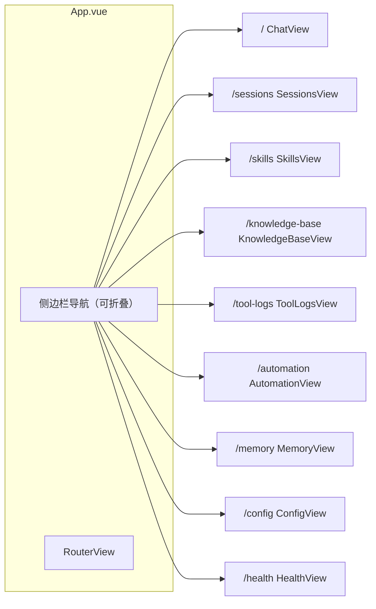
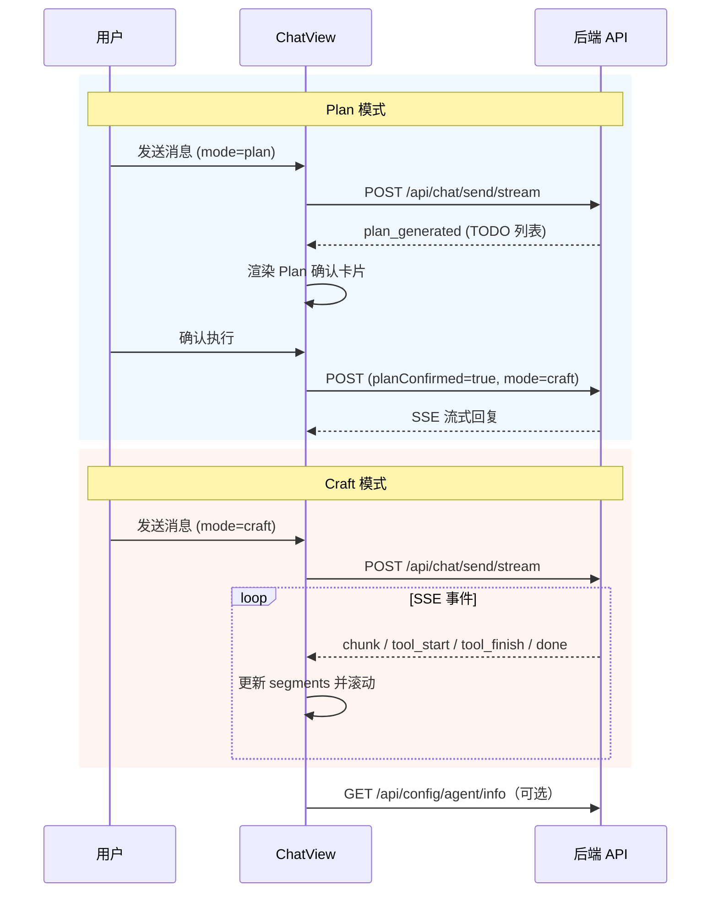

# 前端实现说明（Vue 3 + TypeScript）

本文档基于 `frontend/src` 当前代码，说明 MyClaw Web 前端的架构、页面职责、与后端的交互方式及关键实现细节。文中的 Mermaid 图可在 Obsidian 中渲染。

---

## 1. 技术栈与入口

| 类别 | 选型 |
|------|------|
| 框架 | Vue 3（`<script setup>` + Composition API） |
| 语言 | TypeScript |
| 路由 | Vue Router 4（`createWebHistory`） |
| 状态 | Pinia |
| UI | Ant Design Vue 4 + `@ant-design/icons-vue` |
| HTTP | Axios（封装于 `api/index.ts`） |
| 流式对话 | 原生 `fetch` + `ReadableStream` 解析 SSE（见 `api/chat.ts`） |
| Markdown | `marked` 解析 + `dompurify` 消毒（见 `utils/markdown.ts`） |
| 主题 | 暗色/亮色双模式，localStorage 持久化 |
| 时间格式化 | dayjs |

应用入口：`main.ts` 依次挂载 Pinia、Router、Ant Design Vue 全局组件，样式入口为 `assets/main.css`。

根布局：`App.vue` 使用 `ConfigProvider` 定制主题色（龙虾红 `#ff5c5c`），左侧可折叠侧边栏 + `RouterView` 主内容区，包含暗色/亮色主题切换按钮和 30s 间隔的后端健康轮询。

---

## 2. 路由与页面映射

路由定义于 `router/index.ts`，均为懒加载组件（10 条路由）：

| 路径 | 路由名 | 组件 | 职责摘要 |
|------|--------|------|----------|
| `/` | `chat` | `views/ChatView.vue` | **主聊天**：SSE 流式回复、三模式切换、Plan 确认、工具卡片、文件上传、会话恢复、任务面板 |
| `/sessions` | `sessions` | `views/SessionsView.vue` | 会话列表、新建、删除、跳转聊天 |
| `/skills` | `skills` | `views/SkillsView.vue` | 技能卡片网格：启用/禁用、编辑、导入（本地/Git）、环境安装 |
| `/skills/:name/edit` | `skill-editor` | `views/SkillEditor.vue` | 全屏编辑 SKILL.md，保存/改名检测 |
| `/knowledge-base` | `knowledge-base` | `views/KnowledgeBaseView.vue` | 知识库文档列表，查看分段/删除，可跳转聊天页打开文档 |
| `/tool-logs` | `tool-logs` | `views/ToolLogsView.vue` | 按日期查看工具调用日志，详情弹窗 |
| `/automation` | `automation` | `views/AutomationView.vue` | 定时任务表格管理：创建/编辑/删除，启用/禁用，运行历史 |
| `/memory` | `memory` | `views/MemoryView.vue` | 记忆列表与详情：8 种分类筛选、搜索、删除、统计、清理 |
| `/config` | `config` | `views/ConfigView.vue` | 配置文件列表、编辑、保存、初始化重置（可勾选清除会话/记忆/全局配置） |
| `/health` | `health` | `views/HealthView.vue` | 健康检查面板：LLM 延迟、Qdrant 集合数、磁盘/内存用量 |

仓库中另有 `HomeView.vue`、`AboutView.vue` 等文件，**当前未注册到路由**，可视为遗留或示例页面。



侧边栏菜单分为两组：
- **对话**：聊天（`/`）、会话（`/sessions`）
- **系统**：技能、知识库、工具日志、定时任务、记忆、配置、健康检查

---

## 3. 目录结构（`src/`）

```
frontend/src/
├── main.ts                     # 应用入口
├── App.vue                     # 壳布局 + 主题切换 + 侧栏菜单 + 健康轮询
├── router/index.ts             # 路由表（10 条懒加载路由）
├── api/
│   ├── index.ts                # Axios 实例（baseURL、拦截器）
│   ├── chat.ts                 # SSE 流式聊天（fetch + 三种模式 + Plan 确认）
│   ├── session.ts              # 会话 CRUD + 历史 + 上下文用量
│   ├── workspace.ts            # 工作区：列表、切换、选择、授权
│   ├── skill.ts                # 技能：列表、详情、保存、开关、导入、安装
│   ├── config.ts               # 配置读写、重置、Agent 信息
│   ├── memory.ts               # 记忆列表、详情、搜索、删除、清理、统计
│   ├── automation.ts           # 定时任务：列表、创建、更新、删除、历史
│   ├── health.ts               # 健康检查：LLM/Qdrant/磁盘/内存
│   ├── logs.ts                 # 工具日志：列表、详情、删除
│   ├── docs.ts                 # 知识库：文档列表、删除
│   ├── upload.ts               # multipart 上传（fetch）
│   └── agent.ts                # Agent 任务进度
├── views/                      # 页面级组件（10 个）
│   ├── ChatView.vue            # 核心聊天页
│   ├── SessionsView.vue        # 会话管理
│   ├── SkillsView.vue          # 技能卡片网格
│   ├── SkillEditor.vue         # 技能编辑器
│   ├── KnowledgeBaseView.vue   # 知识库浏览
│   ├── ToolLogsView.vue        # 工具日志
│   ├── AutomationView.vue      # 定时任务管理
│   ├── MemoryView.vue          # 记忆管理
│   ├── ConfigView.vue          # 配置编辑
│   └── HealthView.vue          # 健康检查
├── components/                 # 复用组件
│   ├── AgentModeSelector.vue   # Agent 模式选择器（Ask/Plan/Craft 下拉）
│   ├── AttachmentChip.vue      # 附件标签（图片/文档缩略预览）
│   ├── TaskCard.vue            # 任务卡片（ToolCall 可视化）
│   ├── UserMessageContent.vue  # 用户消息内容（含附件展示）
│   └── TaskPanel.vue           # 任务进度面板
├── utils/
│   ├── markdown.ts             # Markdown 渲染 + 时间格式化
│   └── toolDisplay.ts          # 工具名映射、入参/结果展示
├── assets/                     # 全局样式、SVG 图标等
├── stores/                     # Pinia（counter 示例）
└── .env.example                # 环境变量参考
```

---

## 4. API 层设计

### 4.1 Axios 封装（`api/index.ts`）

- 默认 `baseURL`：`import.meta.env.VITE_API_BASE_URL || 'http://localhost:8000/api'`
- 超时 30s
- 响应拦截器直接返回 `response.data`，业务层拿到的是解包后的 JSON

### 4.2 SSE 流式请求（`api/chat.ts`）

核心函数 `sendMessageStream` 使用 `fetch` 请求 `POST /api/chat/send/stream`，手动解析 SSE 文本流。

**SendMessageOptions 接口**：

```typescript
interface SendMessageOptions {
  attachments?: PendingAttachment[]     // 附件列表
  userTurnIndex?: number               // 编辑/重发时的消息轮次索引
  skipUserMessage?: boolean            // Plan 确认时不追加用户消息
  skipInputClear?: boolean             // 不清空输入框
  skipAttachmentsClear?: boolean       // 不清空附件
  mode?: 'ask' | 'plan' | 'craft'      // Agent 模式
  planConfirmed?: boolean              // Plan 已确认
  skill?: string                       // 技能快捷指令
  regenerate?: boolean                 // 重新生成
}
```

**StreamEvent 类型**：

| 事件 | 说明 |
|------|------|
| `session` | 返回 session_id |
| `chunk` | 文本片段 |
| `step_start` / `step_finish` | 步骤边界 |
| `tool_start` | 工具开始调用（名称 + 参数） |
| `tool_finish` | 工具调用完成（结果 + 状态） |
| `phrase_start` / `phrase_finish` | 短语标记 |
| `done` | 对话完成 |
| `plan_generated` | Plan 模式生成计划（含 `PlanTodoItem[]`） |
| `error` | 错误事件 |

### 4.3 环境变量

| 变量 | 用途 | 文件 |
|------|------|------|
| `VITE_API_BASE_URL` | Axios 基础 URL | `api/index.ts`、`upload.ts` |
| `VITE_API_BASE` | SSE fetch 基础 URL（可为空走 Vite 代理） | `chat.ts` |

开发环境下 `VITE_API_BASE` 为空时，`fetch('/api/...')` 走 Vite 开发服务器的代理（`vite.config.ts` 将 `/api` 转发到 `http://localhost:8000`）。

---

## 5. 聊天页（`ChatView.vue`）核心流程

### 5.1 会话生命周期

1. **挂载** `onMounted` → `initSession()`
2. 优先顺序：`route.query.session` → `localStorage['helloclaw.lastSessionId']` → 调用 `sessionApi.create()`
3. 将当前 `session_id` 写入 localStorage，并用 `history.replaceState` 同步 URL 为 `/?session=...`
4. `watch(route.query.session)`：从其他页带 `session` 跳转时重新拉取历史

### 5.2 Agent 模式选择

通过 `AgentModeSelector` 组件（下拉按钮）选择三种模式：

| 模式 | 行为 |
|------|------|
| **Ask** | 只读工具，LLM 直接回复，禁止 Write/Edit/Execute |
| **Plan** | 先 READ_ONLY ReAct 生成计划 → `plan_generated` SSE 事件 → 前端展示确认卡片 → 用户确认后 FULL ReAct 执行 |
| **Craft** | 全工具自动 ReAct，无需确认 |

**Plan 确认流程**：

```
用户发送 → Plan 模式 SSE 流 → plan_generated 事件
    → 前端渲染 Plan 确认卡片（Markdown 格式 TODO 列表）
    → 用户「确认，开始执行」→ POST { mode: 'craft', planConfirmed: true, skipUserMessage: true }
    → 后端恢复 Plan → FULL ReAct 执行
    → 用户「取消」→ 清理 pendingPlan 状态
```

### 5.3 发送消息与 SSE

- 调用 `chatApi.sendMessageStream(message, currentSessionId, onChunk, AbortSignal, options)`
- 根据事件类型维护**单条 assistant 消息**的 `segments` 数组：
  - `step_start`：新建文本段
  - `chunk`：追加到当前文本段
  - `tool_start` / `tool_finish`：工具卡片（running → done/error）
  - `session` / `done`：更新 `session_id`；`done` 后刷新 `configApi.getAgentInfo()` 更新助手名称
  - `plan_generated`：渲染计划 Markdown + 展示确认卡片
- **停止生成**：`AbortController.abort()`，取消时保留已生成内容
- **编辑重新发送**：带 `userTurnIndex`，后端执行轮次替换后仅重新生成该轮
- **Plan 确认重发**：带 `planConfirmed: true` + `skipUserMessage: true`，不在前端追加重复用户消息

### 5.4 历史记录加载

- `sessionApi.getHistory` 返回 OpenAI 风格消息（含 `tool_calls`、`tool` 角色）
- 两遍扫描：先收集 `tool` 消息的 `tool_call_id → content`，再拼成带 `segments` 的 assistant 气泡

### 5.5 附件上传

- 隐藏 `<input type="file" accept>` → 前端预校验文件大小（图片 10MB、文档 20MB）
- `uploadApi.uploadFile(file, currentSessionId)` → 上传到工作区
- `AttachmentChip` 组件展示附件缩略标签，支持删除
- 发送时附件信息通过 `options.attachments` 传递

### 5.6 上下文窗口显示

- 通过 `sessionApi.getContextUsage(sessionId)` 获取 token 用量
- 底部显示 Progress 进度条：用量/总窗口，超 80% 变黄、超 95% 变红

### 5.7 任务面板集成

- `TaskPanel` 组件展示后端 `TaskTracker` 当前任务的进度
- 通过 `agentApi.getTaskProgress(sessionId)` 轮询

### 5.8 UI 细节

- **消息分组**：连续相同 `role` 合并为 Slack 风格的一组，显示头像与底部昵称/时间
- **工具卡片**：`toolDisplay.ts` 提供中文名、图标；系统操作（`Thought`/`Finish` 等）不显示
- **Markdown**：助手文本使用 `renderMarkdown`（`marked` + `DOMPurify`）
- **Plan 卡片**：`Transition` 动画滑入，Markdown 渲染 TODO 列表，两个操作按钮
- **技能快捷指令**：`/<skill_name>` 自动设置 `options.skill`



---

## 6. 其他页面要点

### 6.1 `SessionsView.vue`

- `sessionApi.list` / `create` / `delete`
- 「打开」：`router.push({ name: 'chat', query: { session: id } })`

### 6.2 `SkillsView.vue`

- 卡片网格展示所有技能（名称、描述、环境状态徽标）
- 启用/禁用开关（乐观更新 + API 调用）
- 「编辑」跳转到 `/skills/:name/edit`
- 「删除」带确认弹窗
- 「导入技能」：支持本地目录和 Git 仓库两种来源
  - 项目级（`scope=workspace`）vs 用户级（`scope=user`）选择
- 「安装/重装环境」：调用 setup 接口，展示安装日志弹窗

### 6.3 `SkillEditor.vue`

- 全屏 `Input.TextArea` 编辑 SKILL.md
- 保存时检测名称变化（提示路径变更）
- 未保存离开时浏览器 beforeunload 拦截

### 6.4 `KnowledgeBaseView.vue`

- 表格展示已向量化文档（文件名、路径、分段数、预览片段）
- 「打开」跳转到聊天页 `?doc=文件名`
- 「删除」移除向量数据

### 6.5 `ToolLogsView.vue`

- 按日期分组列出工具日志文件
- 点击打开弹窗：表格展示日志记录（工具名、状态、耗时、JSON 详情）
- 支持删除日志文件

### 6.6 `AutomationView.vue`

- 表格管理定时任务（名称、调度规则、状态、最后运行时间）
- 创建/编辑：调度类型 drop-down（`once`/`interval`/`rrule`）、cron 表达式输入
- 启用/禁用开关
- 运行历史弹窗（时间、状态、结果预览）

### 6.7 `MemoryView.vue`

- 记忆列表：8 种分类筛选（preference/decision/entity/fact/plan/relation/citation/rule）
- 关键词搜索、详情弹窗、单条删除
- 统计面板：各类别记忆数量
- 清理过期记忆按钮

### 6.8 `ConfigView.vue`

- 左侧配置导航：CONFIG / IDENTITY / USER / SOUL / MEMORY / AGENTS / HEARTBEAT / BOOTSTRAP
- 右侧 `Input.TextArea` 编辑器
- `put` 保存；`reset` 带 query 参数初始化模板
- 重置时可勾选清除 sessions / memory / global_config
- `localStorage.removeItem('helloclaw.lastSessionId')`
- 重置成功后 `router.push({ name: 'chat', query: { refresh: timestamp } })`，`ChatView` 监听 `refresh` 重新拉取 Agent 信息

### 6.9 `HealthView.vue`

- 4 张卡片展示健康状态，每张有 status 指示器
- LLM 模型：延迟 + 模型名
- Qdrant：集合数 + 延迟
- 磁盘：可用/已用百分比
- 内存：RSS 进程内存 / 系统可用内存

---

## 7. 工具展示配置（`utils/toolDisplay.ts`）

- `TOOL_DISPLAY_CONFIG`：将后端工具名映射为**中文名称 + Emoji**
- `getToolConfig`：未知工具回退到默认「工具 🔧」
- `formatToolArgs` / `formatToolResult`：长文本截断，便于卡片展示

---

## 8. 样式与资源

- `assets/base.css`、`main.css`：CSS 变量与全局样式（与 Ant Design Reset 共存）
- `App.vue` 中侧边栏宽度 220px（可折叠），主内容区白色背景
- Logo 使用 `assets/lobster.svg`
- 暗色/亮色模式通过 CSS 变量切换，状态写入 localStorage

---

## 9. 开发与构建

```bash
cd frontend
pnpm install
pnpm dev      # 默认 http://localhost:5173 ，/api 代理到后端 8000
pnpm build
```

类型检查：`pnpm` 脚本中的 `vue-tsc --build`。

---

## 10. 小结

| 能力 | 实现位置 |
|------|----------|
| 流式对话 + 三模式切换 | `ChatView.vue`、`AgentModeSelector.vue`、`api/chat.ts` |
| Plan 两阶段确认 | `ChatView.vue`（plan_generated 事件 + 确认卡片） |
| 工具可视化 | `ChatView.vue`、`TaskCard.vue`、`utils/toolDisplay.ts` |
| 任务进度面板 | `TaskPanel.vue`、`api/agent.ts` |
| 会话持久与恢复 | `api/session.ts`、`ChatView` 中 localStorage + URL query |
| 附件上传与预览 | `AttachmentChip.vue`、`api/upload.ts` |
| 技能管理 | `SkillsView.vue`、`SkillEditor.vue`、`api/skill.ts` |
| 知识库浏览 | `KnowledgeBaseView.vue`、`api/docs.ts` |
| 工具日志 | `ToolLogsView.vue`、`api/logs.ts` |
| 定时任务 | `AutomationView.vue`、`api/automation.ts` |
| 记忆管理 | `MemoryView.vue`、`api/memory.ts` |
| 配置编辑 | `ConfigView.vue`、`api/config.ts` |
| 健康检查 | `HealthView.vue`、`App.vue`（轮询）、`api/health.ts` |
| Markdown 安全渲染 | `utils/markdown.ts`（marked + DOMPurify） |
| 上下文窗口监控 | `ChatView.vue`、`api/session.ts`（getContextUsage） |
| 暗色/亮色主题 | `App.vue`（localStorage + CSS 变量） |

以上为当前前端实现的说明文档；若后续新增路由或组件，请同步更新本文档与 `frontend/.env.example`。
