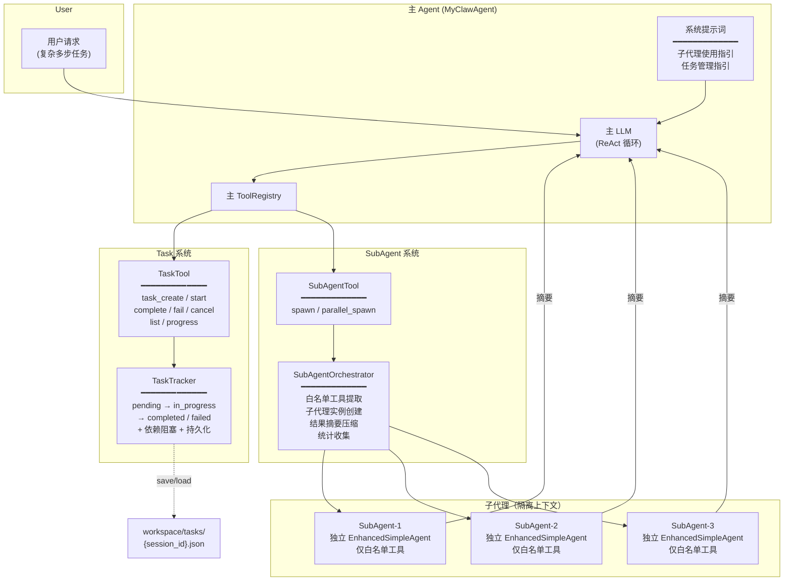
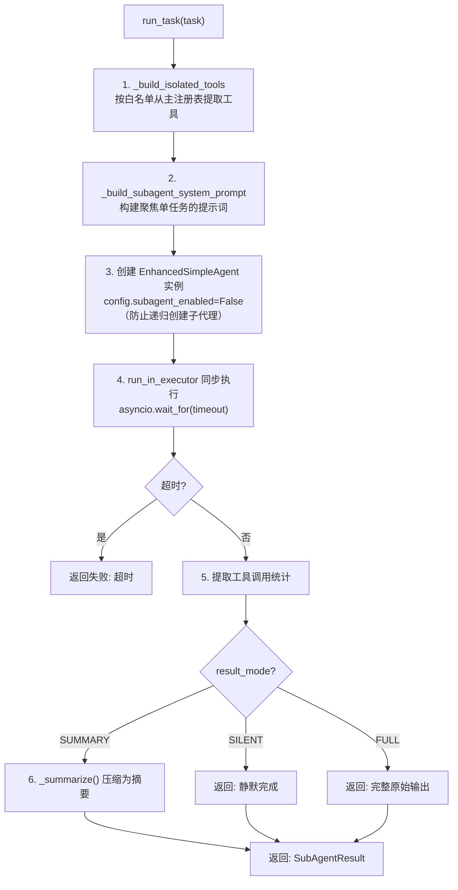
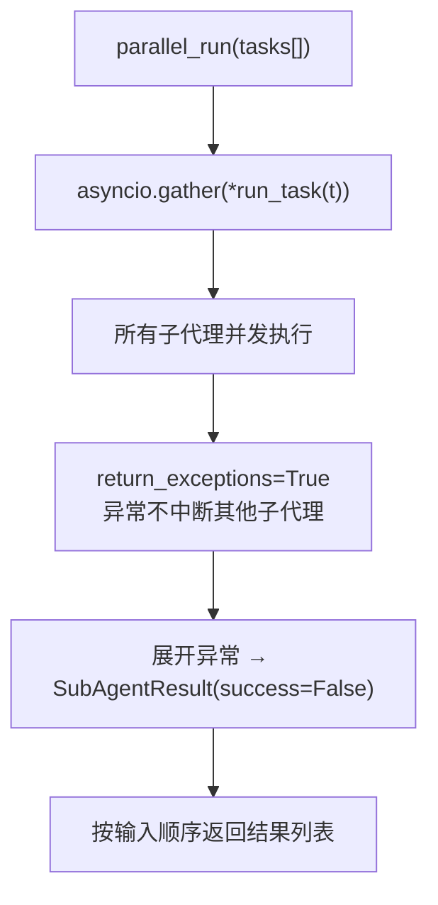
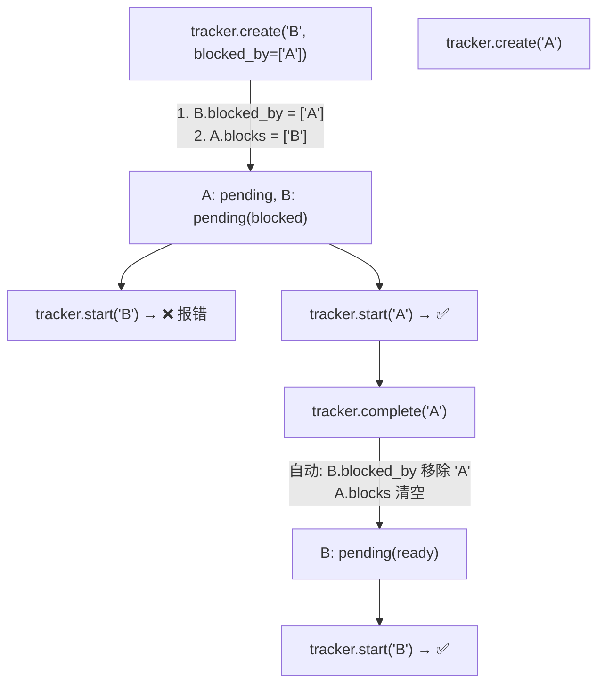
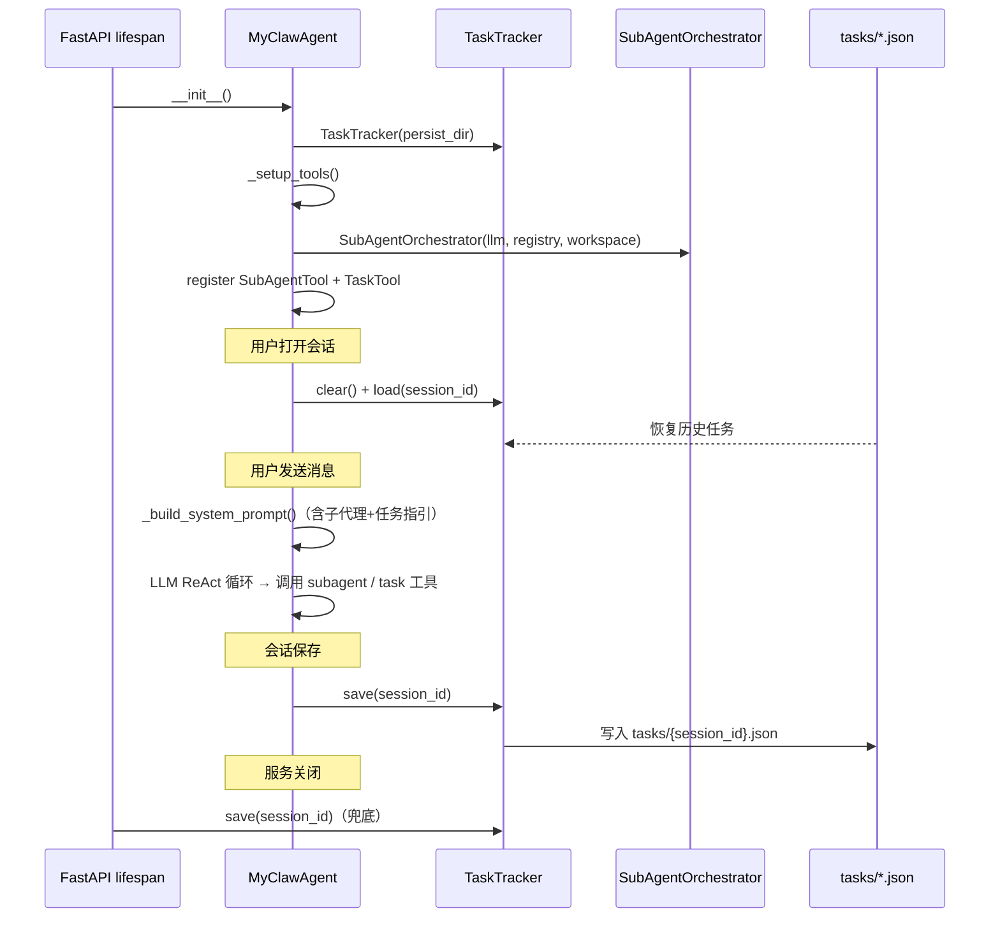

# SubAgent 与 Task 系统实现说明

本文档基于当前代码，说明 MyClaw 中 **SubAgent（子代理上下文隔离 + 并行执行）** 与 **Task（结构化任务管理）** 的设计理念、核心组件、内置工具接口、与主 Agent 的集成方式，以及 **生命周期钩子** 与 **后续优化方向**。文中的 Mermaid 图可在 Obsidian 中渲染。

---

## 1. 功能总览

本次改造为 MyClaw 引入了两大能力：**上下文隔离的子代理并行执行** 与 **显式的多步任务追溯**。二者协同工作，让 Agent 在保持主上下文精简的同时，可靠地完成复杂任务。

| 特性 | 说明 |
|------|------|
| **子代理 (SubAgent)** | 主 Agent 将重型工具执行委托给隔离子代理，子代理消化中间数据，仅回传摘要 |
| **并行执行** | 多个无依赖的子代理可同时启动，共享 LLM 连接池但上下文完全隔离 |
| **三种结果模式** | `SUMMARY`（默认，LLM 压缩摘要）/ `FULL`（完整输出）/ `SILENT`（纯副作用，不回传） |
| **任务管理 (Task)** | 显式状态机（pending → in_progress → completed / failed），含依赖阻塞 + 自动解除 |
| **任务持久化** | 按会话 ID 存档到 `workspace/tasks/{session_id}.json`，会话切换时自动加载 |
| **触发方式** | LLM 自主决策（SubAgent 和 Task 均作为普通工具注册，由 ReAct 循环按需调用） |
| **Token 节省** | 子代理默认回传摘要，搜索/读取大量文件的场景可减少主上下文 80%+ Token 消耗 |

### 与改造前的区别

| 维度 | 改造前 | 改造后 |
|------|--------|--------|
| 工具执行上下文 | 全部在主 Agent 上下文中执行，几千行 grep 输出直接塞入对话 | 重型任务委托给子代理，主上下文只看到摘要 |
| 并行能力 | 无（ReAct 循环串行执行工具） | `parallel_spawn` 并行启动多个子代理 |
| 任务追溯 | 无（LLM 凭记忆推进步骤，容易遗漏） | 显式任务列表 + 状态机 + 依赖管理 |
| 任务持久化 | 无 | 会话保存/切换/服务关闭时自动持久化 |
| 主 Agent 职责 | 决策 + 执行 | 纯决策，执行委托给子代理 |

---

## 2. 架构设计

### 2.1 Master-Worker 模式

```
主 Agent（决策中枢）
  ├── 系统提示词（含子代理指引 + 任务管理指引）
  ├── TaskTool（创建/推进任务）
  └── SubAgentTool（委托执行）
        ├→ SubAgent-1（隔离上下文 + 白名单工具）→ 返回摘要
        ├→ SubAgent-2（隔离上下文 + 白名单工具）→ 返回摘要
        └→ SubAgent-3（隔离上下文 + 白名单工具）→ 返回摘要

主上下文始终保持精简
```

核心设计思想借鉴 WorkBuddy 架构：
- **主 Agent 专注决策**：阅读子代理摘要，推进任务进度，制定下一步计划
- **子 Agent 消化复杂度**：在隔离上下文中搜索、读取、计算，中间数据就地消化
- **工具白名单**：子代理只能访问主 Agent 显式授权的工具，无法访问 memory/capture/MCP 等内部管理工具

### 2.2 架构全景图



---

## 3. `backend/src/agent/subagent_orchestrator.py`

实现文件分布：

```
backend/src/agent/
├── subagent_orchestrator.py   # SubAgentOrchestrator + 数据模型 + 辅助函数
├── task_tracker.py            # TaskTracker + Task 数据模型
└── myclaw_agent.py            # 初始化编排器/追踪器 + 生命周期钩子

backend/src/tools/builtin/
├── subagent_tool.py           # SubAgentTool：将编排器包装为 Tool
└── task_tool.py               # TaskTool：将追踪器包装为 Tool
```

### 3.1 数据模型

#### `SubAgentTask` — 子代理任务定义

| 字段 | 类型 | 说明 |
|------|------|------|
| `task_id` | `str` | UUID[:8]，自动生成 |
| `description` | `str` | 自然语言任务描述（子代理的系统提示词） |
| `tools` | `List[str]` | 白名单工具名列表，空列表 = 纯文本推理 |
| `result_mode` | `SubAgentResultMode` | `SUMMARY`（默认）/ `FULL` / `SILENT` |
| `max_iterations` | `int` | 最大工具调用迭代次数，默认 8（比主代理的 15 更保守） |
| `timeout_seconds` | `int` | 超时时间（秒），默认 60 |

#### `SubAgentResultMode` — 结果回传模式

| 模式 | 行为 | 适用场景 |
|------|------|---------|
| `SUMMARY` | 子代理输出 > 500 字符时调用 LLM 压缩为 300 字摘要 | 默认模式，省 Token |
| `FULL` | 原样回传子代理完整输出 | 主 Agent 必须看原始数据 |
| `SILENT` | 不回传任何内容 | 纯副作用任务（清理、验证） |

#### `SubAgentResult` — 子代理执行结果

| 字段 | 说明 |
|------|------|
| `task_id` | 对应任务 ID |
| `success` | 是否执行成功 |
| `summary` | 摘要/完整输出文本 |
| `tool_calls_count` | 子代理执行的工具调用次数 |
| `duration_ms` | 执行耗时（毫秒） |
| `error` | 失败时的错误信息 |

### 3.2 `SubAgentOrchestrator` — 核心编排器

```
SubAgentOrchestrator
├── llm: 主 Agent 的 LLM 引用（复用连接）
├── master_tool_registry: 主工具注册表（按名查找工具）
├── workspace_path: 工作空间根路径
├── _summary_llm: 可选的专用摘要模型
├── total_spawns / total_tool_calls / total_duration_ms: 统计计数器
├── run_task(task) → SubAgentResult          # 同步执行单个子代理
├── parallel_run(tasks) → List[SubAgentResult] # 并行执行多个子代理
├── get_stats() → dict                       # 获取统计信息
├── _build_isolated_tools(tool_names)        # 白名单工具提取
├── _build_subagent_system_prompt(task)      # 构建子代理系统提示词
└── _summarize(text)                         # LLM 压缩摘要
```

#### 单个子代理执行流程



#### 并行执行流程



#### 子代理系统提示词

子代理的系统提示词被精心设计为 **单任务、单目标**，与主 Agent 的多任务系统提示词完全不同：

```python
def _build_subagent_system_prompt(task):
    return f"""你是一个专注于单一任务的子代理。你的唯一工作：

任务：{task.description}

规则：
1. 只做任务要求的事，不要偏离主题
2. 完成后输出清晰的结果摘要，不要问"还需要什么"
3. 如果任务无法完成，直接说明原因
4. 不要尝试加载技能、管理记忆、搜索网络（除非任务要求）
{可用工具提示}"""
```

关键差异：
- 不接受外部聊天指令（只有任务描述）
- 不接触记忆系统
- 不加载技能（Skill）
- 不接触 MCP 工具（除非主 Agent 显式授权）
- 子代理内 `subagent_enabled=False`，禁止递归创建孙代理

### 3.3 辅助函数（供 Context Guard 使用）

```python
# 工具输出预估（tokens）
TOOL_OUTPUT_ESTIMATES = {
    "read_file": 5000, "execute_command": 3000,
    "web_search": 4000, "web_fetch": 8000,
    "calculator": 100,  # ... 等
}

estimate_tool_output_tokens(tool_name) → int
should_delegate_to_subagent(tool_name, threshold=5000) → bool
```

> **当前状态**：这两个函数已实现但未生效。SubAgent 触发完全依赖 LLM 自主判断。P2 计划在 `_try_execute_ready_tool` 中引入 Context Guard 自动路由，届时这两个函数将成为路由依据。

---

## 4. `backend/src/agent/task_tracker.py`

### 4.1 数据模型

#### `TaskStatus` — 任务状态

```
PENDING → IN_PROGRESS → COMPLETED / FAILED
              ↓
          CANCELLED
```

#### `Task` — 单个任务

| 字段 | 类型 | 说明 |
|------|------|------|
| `id` | `str` | `task_` + UUID[:8] |
| `subject` | `str` | 简短标题（如"修复登录认证 bug"） |
| `description` | `str` | 详细描述 |
| `status` | `TaskStatus` | 当前状态 |
| `blocked_by` | `List[str]` | 依赖的任务 ID（这些任务必须先完成） |
| `blocks` | `List[str]` | 被哪些任务依赖（反向关系，自动维护） |
| `created_at` | `float` | 创建时间戳 |
| `started_at` | `float` | 开始时间戳 |
| `completed_at` | `float` | 完成时间戳 |
| `owner` | `str` | 分派给哪个子代理（预留字段） |
| `notes` | `str` | 备注（完成/失败时补充原因） |

#### 关键属性

| 属性 | 逻辑 |
|------|------|
| `is_blocked` | `len(blocked_by) > 0` |
| `is_ready` | `status == PENDING and not blocked_by` |
| `duration_seconds` | `completed_at - started_at` |

### 4.2 `TaskTracker` — 任务追踪器

```
TaskTracker
├── _tasks: Dict[str, Task]            # 内存任务表
├── _persist_dir: str | None           # 持久化目录
├── MAX_TASKS = 20                     # 单会话任务上限
├── create(subject, desc, blocked_by)  # 创建任务 + 反向建立 blocks 关系
├── start(task_id)                     # 标记进行中（含依赖检查）
├── complete(task_id, notes)           # 完成 + 自动解除阻塞
├── fail(task_id, reason)              # 标记失败
├── cancel(task_id, reason)            # 取消 + 解除阻塞
├── get(task_id) → Task | None
├── list_all() → List[Task]            # 按创建时间排序
├── list_ready() → List[Task]          # pending + 无阻塞
├── list_blocked() → List[Task]        # 被阻塞的
├── list_active() → List[Task]         # pending + in_progress
├── get_progress_summary() → str      # 格式化进度摘要
├── get_next_available() → Task | None # 下一个可开始任务
├── save(session_id) → bool           # 持久化到 JSON
├── load(session_id) → bool           # 从 JSON 恢复
└── clear()                            # 清空（会话切换时）
```

#### 依赖阻塞与自动解除



依赖关系是**双向维护**的：
- `create` 时：`B.blocked_by = ['A']` → 反向 `A.blocks.append('B')`
- `complete/cancel` 时：遍历 `blocks` → 清理依赖任务的 `blocked_by`
- `start` 时：检查所有 `blocked_by` 中的任务是否已完成/取消，否则拒绝

#### 进度摘要格式

调用 `get_progress_summary()` 返回的 Markdown 文本示例：

```markdown
## 任务进度 (2/5)

**进行中：**
- 🔄 [task_a1b2] 创建 utils/helper.py

**待开始：**
- ⏳ [task_c3d4] 编写时间格式化函数
- ⏳ [task_e5f6] 编写测试用例

**被阻塞：**
- 🚫 [task_g7h8] 运行测试 ← 等待: task_e5f6

已完成 2 个任务。继续推进剩余任务。
```

此摘要可通过系统提示词注入或 Memory Flush 路径注入主 Agent 上下文（目前仅在 `task_progress` 动作中返回，后续可扩展自动注入）。

#### 持久化数据结构

`workspace/tasks/{session_id}.json`：

```json
{
  "session_id": "abc12345",
  "saved_at": "2026-07-03T10:30:00",
  "tasks": [
    {
      "id": "task_a1b2c3d4",
      "subject": "搜索所有 Python 文件中的 TODO",
      "description": "...",
      "status": "completed",
      "blocked_by": [],
      "blocks": [],
      "created_at": 1751512800.0,
      "started_at": 1751512810.0,
      "completed_at": 1751512830.0,
      "owner": "",
      "notes": "找到 12 个 TODO"
    }
  ]
}
```

---

## 5. 内置工具接口

### 5.1 `SubAgentTool` (`subagent`)

实现文件：`backend/src/tools/builtin/subagent_tool.py`。

| 动作 | 说明 | 关键参数 |
|------|------|---------|
| **`spawn`** | 启动单个子代理 | `task`（必填，任务描述）、`tools`（可选，逗号分隔工具名） |
| **`parallel_spawn`** | 并行启动多个子代理 | `tasks_json`（必填，JSON 数组，每项含 `task` + `tools`） |

#### spawn 调用示例

```json
{
  "action": "spawn",
  "task": "搜索 backend/src/agent/ 目录下所有 Python 文件中包含 'asyncio' 的行",
  "tools": "execute_command, read_file"
}
```

返回：

```
[子代理 a1b2c3d4] 任务完成
工具调用: 3 次
耗时: 2450ms
结论: 在 backend/src/agent/ 下找到 8 个文件共 42 处 asyncio 使用，
      主要集中在 enhanced_simple_agent.py（28 处）和 myclaw_agent.py（10 处）
```

#### parallel_spawn 调用示例

```json
{
  "action": "parallel_spawn",
  "tasks_json": "[{\"task\":\"列出 frontend/src/views/ 下所有文件\",\"tools\":\"execute_command\"},{\"task\":\"检查 backend/src/tools/ 的代码行数\",\"tools\":\"execute_command\"},{\"task\":\"查看 backend/pyproject.toml 的内容\",\"tools\":\"read_file\"}]"
}
```

### 5.2 `TaskTool` (`task`)

实现文件：`backend/src/tools/builtin/task_tool.py`。

| 动作 | 说明 | 关键参数 |
|------|------|---------|
| **`task_create`** | 创建新任务 | `subject`（必填）、`description`、`depends_on`（逗号分隔 ID） |
| **`task_start`** | 标记进行中 | `task_id`（必填） |
| **`task_complete`** | 标记已完成 | `task_id`（必填）、`notes` |
| **`task_fail`** | 标记失败 | `task_id`（必填）、`notes`（失败原因） |
| **`task_cancel`** | 取消任务 | `task_id`（必填）、`notes` |
| **`task_list`** | 列出所有任务 | 无额外参数 |
| **`task_progress`** | 查看进度摘要 | 无额外参数 |

---

## 6. 系统提示词注入

在 `MyClawAgent._build_system_prompt` 中，每次构建系统提示词时追加两段指引（共约 500 tokens）：

### 6.1 子代理使用指引

```
## 子代理（SubAgent）
你拥有启动子代理的能力（subagent 工具）。子代理在隔离的上下文中
独立完成任务，它们的工具输出不会污染你的主上下文。

**使用原则**：
1. 需要搜索/读取大量文件 → 委托给子代理（用 execute_command + read_file）
2. 需要多步数据处理 → 委托给子代理
3. 多个可并行的独立子任务 → 用 parallel_spawn 并行启动
4. 简单的单次工具调用（读一个小文件、一次计算）→ 不用子代理，直接调用

**注意**：子代理的结果以摘要形式返回。如果需要看原始数据，
可以要求子代理将结果写入文件，然后用 read_file 读取。
```

### 6.2 任务管理指引

```
## 任务管理
对于包含 3 个以上独立步骤的复杂请求，你必须：
1. 用 task_create 创建任务列表（每个步骤一个任务）
2. 用 task_start 标记当前正在做的任务
3. 用 task_complete 标记已完成的任务
4. 如果某个任务依赖其他任务的输出，在创建时指定 depends_on
5. 完成任务后自动检查 task_list，推进下一个可开始的任务

这能确保你不会遗漏任何步骤。
```

### 6.3 注入时机

系统提示词在以下时机重建并注入：
- `MyClawAgent.__init__`：初始化时
- `chat()`：每次同步对话前（L616）
- `achat()`：每次流式对话前（L677）

确保每次对话都携带最新的子代理 + 任务管理指引。

---

## 7. 生命周期集成

| 时机 | 触发点 | 行为 |
|------|--------|------|
| **Agent 初始化** | `MyClawAgent.__init__` | `TaskTracker` 创建（`_task_tracker`）；`_subagent_orchestrator` 置为 None |
| **工具注册** | `_setup_tools()` 末尾 | 延迟创建 `SubAgentOrchestrator`（此时 LLM 已就绪）；注册 `SubAgentTool` + `TaskTool` |
| **会话激活** | `activate_session()` | `_task_tracker.clear()` → `_task_tracker.load(session_id)` |
| **会话保存** | `save_current_session()` | `_task_tracker.save(session_id)` |
| **服务关闭** | `main.py` lifespan shutdown | 最后尝试 `_task_tracker.save(session_id)` |



---

## 8. 与 hello_agents 的关系

| 组件 | MyClaw 实现 | hello_agents 内置 | 说明 |
|------|------------|-------------------|------|
| 子代理 | `SubAgentOrchestrator` | `Config.subagent_enabled` | MyClaw 使用自实现，hello_agents 内置子代理已关闭 (`subagent_enabled=False`) |
| 任务管理 | `TaskTracker` | `Config.todowrite_enabled` | MyClaw 使用自实现，hello_agents 内置 TodoWrite 已关闭 (`todowrite_enabled=False`) |
| 技能 | `SkillLoader` | `Config.skills_enabled` | MyClaw 使用自实现，hello_agents 内置技能系统已关闭 (`skills_enabled=False`) |

三条均为 **"自实现替代内置"** 的统一模式，确保 MyClaw 对核心行为有完全控制权。

---

## 9. 关键设计决策

### 9.1 为什么子代理触发依赖 LLM 判断？

当前不实现自动委托路由（Context Guard），原因：
- **Phase 1 复杂度控制**：自动判断涉及上下文大小监听、工具输出预估、ReAct 循环拦截，引入风险高
- **LLM 已足够智能**：系统提示词中的 4 条使用原则能覆盖绝大多数场景
- **P2 预留**：`should_delegate_to_subagent()` 和 `estimate_tool_output_tokens()` 已实现，待 Phase 2 接入 `_try_execute_ready_tool`

### 9.2 为什么子代理默认 max_iterations=8？

子代理应比主代理（max_iterations=15）更保守，因为：
- 子代理的任务通常更聚焦，不需要多轮探索
- 子代理超时会阻塞主对话（并行场景影响更大）
- 减少 LLM API 调用的叠加成本

### 9.3 为什么子代理禁止递归创建子代理？

`sub_config.subagent_enabled = False` 防止子代理再 spawn 孙代理，理由是：
- **收益递减**：孙代理会进一步丢失上下文，摘要链条过长失去意义
- **成本爆炸**：嵌套 N 层的工具调用消耗的 API 次数呈指数增长
- **可控性**：主 Agent 始终是唯一的决策中枢

### 9.4 为什么 SUMMARY 模式下用 LLM 而非简单截断？

简单截断可能丢失关键结论（截断在工具输出的中间部分）。LLM 摘要确保：
- 保留最终结论和关键发现
- 去掉命令行回显、错误堆栈等噪声
- 输出长度稳定（≤300 字），主上下文消耗可预测

---

## 10. 命令式 vs 建议式触发

| 组件 | 触发方式 | 效果 |
|------|---------|------|
| **SubAgent** | 建议式（LLM 判断） | 4 条原则指引 LLM 何时委托。LLM 可能不听话，需要后续 P2 Context Guard 强制路由 |
| **Task** | 命令式（系统提示词要求） | "对于包含 3 个以上独立步骤的复杂请求，你必须…" — 使用"必须"而非"建议" |

---

## 11. 后续优化方向

| 优先级 | 方向 | 说明 |
|--------|------|------|
| **P1** | 子代理 `summary_llm` 可配置 | 当前复用主 LLM 做摘要，后续可配置独立的轻量模型（如 glm-4-flash）降低摘要成本 |
| **P2** | Context Guard 自动路由 | 在 `_try_execute_ready_tool` 中根据 `should_delegate_to_subagent()` 自动拦截重型工具调用并路由到子代理，不再依赖 LLM 判断 |
| **P3** | 任务模板 | 为常见任务类型（代码重构、项目初始化、文档生成）预定义任务模板 |
| **P4** | 子代理超时策略 | 基于任务复杂度（历史工具调用数、预估 token 量）动态调整 `timeout_seconds` |
| **P5** | 任务进度自动注入 | 将 `TodoScheduler.get_progress_summary()`（Plan 执行期）经 `turn_context` 注入本轮 user 前缀；`TaskTracker` 进度仍以工具返回为主 |

---

## 12. 明确边界

- ❌ **子代理不自动触发**：当前完全依赖 LLM 调用 `subagent` 工具，不做底层拦截
- ❌ **子代理不可递归**：`subagent_enabled=False` 禁止子代理再创建子代理
- ❌ **不替代 ReAct 循环**：Task 是增强可追溯性的辅助层，不改写工具调用执行流程
- ⚠️ **子代理超时默认 60s**：超大任务可能超时，需主 Agent 拆分或增大 timeout
- ⚠️ **最大任务数 20**：单会话超过 20 个任务将被拒绝，应先完成/取消旧任务

---

## 13. 相关代码与 API 索引

| 位置 | 作用 |
|------|------|
| `backend/src/agent/subagent_orchestrator.py` | `SubAgentOrchestrator`：上下文隔离 + 并行执行 + 摘要压缩 + 工具预估函数 |
| `backend/src/agent/task_tracker.py` | `TaskTracker`：任务生命周期管理 + 依赖阻塞 + 持久化 |
| `backend/src/tools/builtin/subagent_tool.py` | `SubAgentTool`：将编排器包装为 `subagent` 工具（spawn / parallel_spawn） |
| `backend/src/tools/builtin/task_tool.py` | `TaskTool`：将追踪器包装为 `task` 工具（7 个动作） |
| `backend/src/tools/__init__.py` | 导出 `SubAgentTool` + `TaskTool` |
| `backend/src/tools/builtin/__init__.py` | 导出 `SubAgentTool` + `TaskTool` |
| `backend/src/agent/myclaw_agent.py` | 初始化编排器/追踪器、注册工具、冻结 system / turn_context、生命周期钩子 |
| `backend/src/agent/enhanced_simple_agent.py` | 新增 `subagent_orchestrator` 可选参数（预留扩展） |
| `backend/src/main.py` | `lifespan` shutdown 阶段持久化任务列表 |
| `docs/IMPLEMENTATION_GUIDE.md` | 实施指南：安装步骤 + 测试清单 + 回滚方案 |

---

## 14. 故障排查参考

| 症状 | 可能原因 | 定位线索 |
|------|---------|---------|
| 子代理从不被调用 | LLM 未遵循系统提示词指引 | 检查工具调用日志中是否有 `subagent`；若没有，可能是 LLM 直接调用 `execute_command` 了 |
| 子代理超时 | 任务过于复杂或工具输出过大 | 检查子代理的 `task.max_iterations` 和 `timeout_seconds`；考虑让主 Agent 拆分任务 |
| 并行子代理返回结果不一致 | `asyncio.gather` 中某个子代理抛异常 | 异常被 `return_exceptions=True` 捕获并转为 `SubAgentResult(success=False)`，不影响其他子代理 |
| 任务切换后进度丢失 | `workspace/tasks/` 目录不存在或无写入权限 | 检查 `_task_tracker._persist_dir` 路径和权限 |
| 主上下文仍然很大 | 子代理使用了 `FULL` 模式 | 检查是否误用了 `result_mode=FULL`；默认 `SUMMARY` 才会压缩 |
| 任务创建返回 "任务 ID 已存在" | `task_id` 参数与已有任务冲突 | 不传 `task_id` 时自动生成 UUID[:8]，基本不会冲突；若手动指定需确保唯一 |

---

以上为当前 SubAgent 与 Task 系统的实现与功能说明；若后续调整 `SubAgentTask` 参数、`TaskTool` 动作、`max_iterations` 默认值或生命周期钩子，请以对应源码为准。

---

## 15. 变更记录

### 64900cf — 增加对是否使用子代理的预判（2026-07-06）

> **作者**：promisestar
> **范围**：4 个文件，+285 行 / -60 行

本次提交完成了 SubAgent 系统的 **Phase 2——Context Guard 自动路由**，将"建议式委托"升级为"强制式拦截"。

**核心变化**：

| 维度 | 改动前 | 改动后 |
|------|--------|--------|
| 子代理触发 | LLM 自主判断（建议式） | Context Guard 在工具执行前强制拦截 |
| 工具输出预估 | 散落在 `subagent_orchestrator.py` 中的辅助函数 | 统一收敛到 `context/context_guard.py` |
| 副作用保护 | 无 | `NO_DELEGATE_TOOLS` 黑名单阻止副作用工具被委托 |
| 路由策略 | 二元（委托 / 不委托） | 三级：`inline`（直接执行）/ `snip`（执行+截断）/ `delegate`（委托子代理） |

**文件变更详情**：

| 文件 | 变更 | 说明 |
|------|------|------|
| `context/context_guard.py` | **新建**（+231 行） | `ContextGuard` 类：三级路由引擎 + 工具输出预估表 + 委托执行器 + 任务描述格式化器 |
| `agent/enhanced_simple_agent.py` | **修改**（+51 行） | 在 `_try_execute_ready_tool` 中注入 Context Guard 拦截逻辑：工具执行前先调用 `should_delegate()`，命中则自动委托子代理并返回摘要 |
| `agent/myclaw_agent.py` | **修改**（+1 行） | 将 `self._subagent_orchestrator` 传递给 `EnhancedSimpleAgent` 构造函数，使 Context Guard 可用 |
| `agent/subagent_orchestrator.py` | **修改**（-60 行） | 移除冗余的 `TOOL_OUTPUT_ESTIMATES`、`estimate_tool_output_tokens()`、`should_delegate_to_subagent()`；修复 `parallel_run` 的 `asyncio.gather(return_exceptions=True)` 类型注解 |

**Context Guard 三级路由规则**（阈值随模型上下文窗口动态计算）：

```
工具调用
  ├── NO_DELEGATE_TOOLS 中的工具 → inline/snip（无论如何不委托）
  │     Write, Edit, memory_add, calculator, task, subagent, Skill, browser, automation
  │
  ├── 预估输出 < small_threshold → inline（直接执行，结果放入主上下文）
  │
  ├── 预估输出 small_threshold ~ large_threshold → snip
  │     （正常执行；超长 tool 输出由 ContextManager.tool_snip_chars 在压缩层截断）
  │
  └── 预估输出 >= large_threshold → delegate（委托子代理，主上下文只收到摘要）
```

**动态额度（相对 128K 基准）**：

| 量 | 含义 | 128K 时 | 缩放方式 |
|----|------|---------|----------|
| `output_size_hint` / `TOOL_ESTIMATES` | 工具预估输出 token **绝对值** | 如 `web_fetch=8000` | **不随窗口缩放** |
| `small_threshold` | inline / snip 分界 | 2000 | `max(500, window × 2000/128000)` |
| `large_threshold` | snip / delegate 分界 | 8000 | `max(small+1, window × 8000/128000)` |
| `tool_snip_chars` | 单条 tool 消息字符裁剪上限 | 1500 | `max(1500, min(100000, 1500 × window/128000))` |

只缩放阈值、不缩放 hint：若两者同比例放大，路由结果对窗口不变，大窗口下仍会把 `web_fetch` 等误委派。`MyClawAgent._sync_context_window` 在感知模型窗口后同步调用 `ContextGuard.update_context_window` 与 `ContextManager.update_context_window`。

**降级策略**：当 `orchestrator` 不可用或委托执行失败时，`delegate` 自动降级为直接执行（Agent 侧捕获异常后走本地 `_execute_tool_call`），保证功能不中断。

**设计要点**：
- 拦截插入点在 `_try_execute_ready_tool` 中的去重检查之后、限量检查之前，确保委托行为也受去重和限量约束
- 委托执行通过 `SubAgentOrchestrator.run_task()` 创建隔离子代理，`max_iterations=3`（子代理通常只需 1 次工具调用）
- 委托结果以 `[自动委托...]` 前缀的格式化文本注入主上下文，含子代理 ID、工具名、调用次数、耗时和结果摘要
- 工具描述格式化器（`_format_task_description`）针对 `Read`、`web_fetch`、`execute_command` 等高频真实工具名生成语义化子代理任务描述
