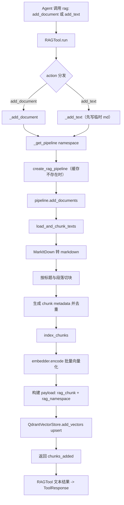
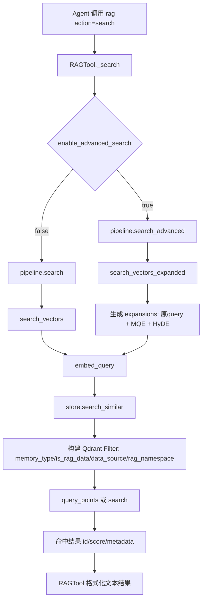
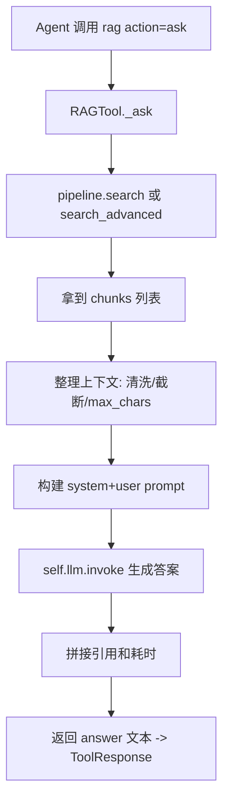
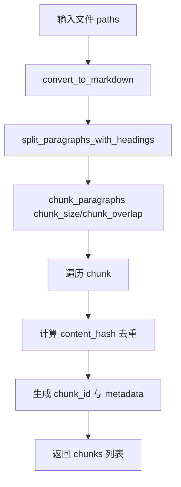
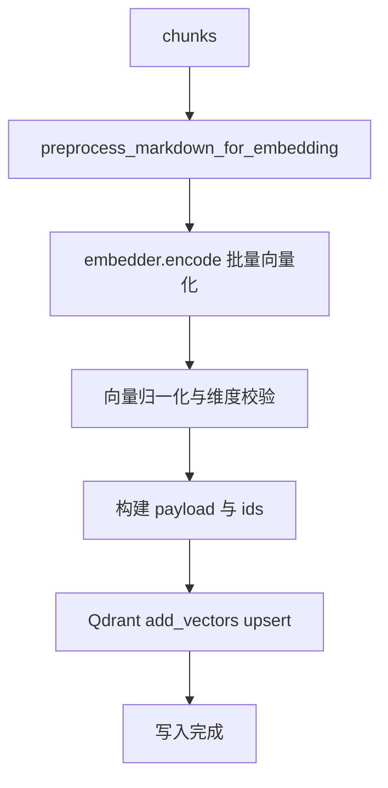
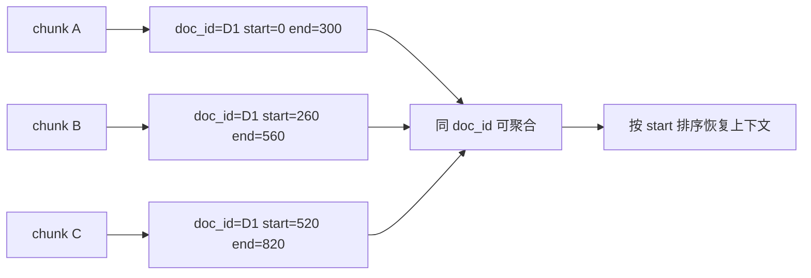
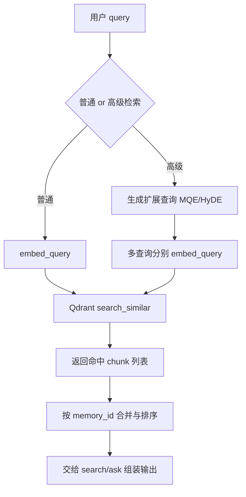
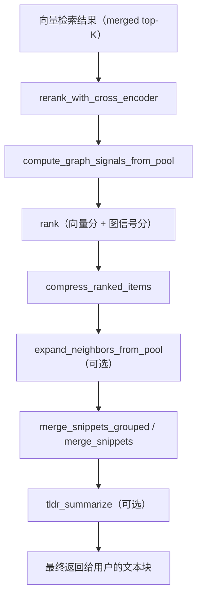

# MyClaw RAG 实现说明

## 1. 概览

本项目的 RAG 由两层组成：

- **核心管道层**：`src/rag/`（文档解析、切块、向量化、Qdrant 存储与检索）
- **工具编排层**：`src/tools/builtin/rag_tool.py`（对 Agent 暴露 `add_text / add_document / search / ask / stats / clear`）

当前实现是“**Qdrant 向量检索 + 可选查询扩展（MQE / HyDE）+ LLM 答案生成**”的架构。

---

## 2. 目录与职责

### 2.1 `src/rag/embedding.py`

统一嵌入提供器，核心职责：

- 提供 `EmbeddingModel` 抽象
- 本地实现：`LocalTransformerEmbedding`
  - 优先 `sentence-transformers`
  - 失败回退 `transformers + torch`
- 兜底实现：`TFIDFEmbedding`
- 全局单例接口：
  - `get_text_embedder()`
  - `get_dimension()`
  - `refresh_embedder()`

关键点：

- 向量维度动态来自 `embedder.dimension`，默认回退 `384`
- 通过环境变量控制：`EMBED_MODEL_TYPE / EMBED_MODEL_NAME / EMBED_API_KEY / EMBED_BASE_URL`

### 2.2 `src/rag/qdrant_store.py`

Qdrant 适配层，核心职责：

- 初始化客户端与集合（云端或本地）
- 建立 payload 索引（`memory_type`、`rag_namespace`、`is_rag_data` 等）
- 向量写入：`add_vectors`
- 向量检索：`search_similar`
- 清理、删除、统计、健康检查

关键点：

- 新旧 API 兼容：优先 `query_points()`，回退 `search()`
- 检索时 `where` 转换为 Qdrant `Filter(must=[FieldCondition...])`
- 维度不匹配或连接异常时会记录日志并返回空结果（而不是抛出致命异常）

### 2.3 `src/rag/pipeline.py`

RAG 核心流程实现，分三段：

1. **Ingestion（入库）**
   - `load_and_chunk_texts`：读取文档 -> Markdown 化 -> 段落/标题感知切块
   - `index_chunks`：文本预处理 -> 批量 embedding -> upsert Qdrant
2. **Retrieval（检索）**
   - `search_vectors`：单查询向量检索
   - `search_vectors_expanded`：多查询扩展检索（MQE + HyDE）
3. **High-level API**
   - `create_rag_pipeline` 返回统一接口字典：
     - `add_documents`
     - `search`
     - `search_advanced`
     - `get_stats`

补充能力（目前部分未接入主链路）：

- `rerank_with_cross_encoder`（交叉编码器重排，当前未直接接入主检索返回）
- `rank / merge_snippets / compress_ranked_items / tldr_summarize` 等后处理函数

### 2.4 `src/tools/builtin/rag_tool.py`

面向 Agent 的工具层，核心职责：

- 管理多命名空间 pipeline 缓存（`self._pipelines`）
- 对外动作：
  - `add_document`：文件入库
  - `add_text`：文本入库（先落临时 `.md` 再复用入库流程）
  - `search`：直接检索并格式化输出
  - `ask`：检索 -> 组上下文 -> 调用 LLM 生成答案
  - `stats`：读 Qdrant 统计
  - `clear`：清空并重建该命名空间
- `run()` 已按 hello_agents 协议返回 `ToolResponse`（适配 `run_with_timing`）

---

## 3. 端到端流程

## 3.1 文档入库流程（add_document / add_text）



## 3.2 检索流程（search）



## 3.3 问答流程（ask）



---

## 4. 数据模型（在 Qdrant 的 payload）

入库时每个 chunk 会写入以下关键字段（来自 `index_chunks`）：

- 检索过滤标记：
  - `memory_type = "rag_chunk"`
  - `is_rag_data = True`
  - `data_source = "rag_pipeline"`
  - `rag_namespace = <namespace>`
- 文档结构信息：
  - `source_path`
  - `doc_id`
  - `start` / `end`
  - `heading_path`
  - `lang` / `file_ext`
- 内容相关：
  - `content`（原 chunk 内容）
  - `memory_id`（chunk id）

---

## 5. 检索策略细节

### 5.1 基础检索

- 查询文本 -> `embed_query` 向量化
- 过滤条件固定包含 RAG 标记，避免检索到非 RAG 记忆
- 结果按 Qdrant 分数返回

### 5.2 高级检索（当前默认开启）

- `MQE`：通过 LLM 生成多个改写查询
- `HyDE`：通过 LLM 生成一段“假设答案文档”作为检索查询
- 合并策略：同一 `memory_id` 取最高分

### 5.3 异常与退化

- embedding 失败 -> 零向量回退（可继续执行但召回质量下降）
- Qdrant 搜索异常 -> 返回空结果并打印日志
- 因此上层常见表现是“未找到结果”，而非服务直接崩溃

---

## 6. 工具接口约定（`rag_tool.py`）

`run(parameters)` 的 `action`：

- `add_document`
- `add_text`
- `search`
- `ask`
- `stats`
- `clear`

返回：

- 统一为 `ToolResponse`
- 其中 `.text` 是给模型/用户的可读信息
- `run_with_timing` 会额外注入 `stats.time_ms`

---

## 7. 当前实现的已知特点与注意项

1. **`rerank_with_cross_encoder` 目前未接入主检索链路**  
   函数存在且可用，但 `search_vectors/search_vectors_expanded` 未调用。

2. **`ask` 中 `self.llm.invoke` 返回类型依赖 hello_agents 版本**  
   若返回 `LLMResponse`，需要取 `.content`；否则要确保为字符串。

3. **Qdrant 云连接稳定性影响检索可用性**  
   如出现 `WinError 10054`，属于网络或远端连接中断，不是算法逻辑错误。

4. **维度一致性由 `get_dimension()` 驱动**  
   向量库集合维度和嵌入模型维度必须一致，否则会降级/丢弃部分向量。

---

## 8. 快速定位入口（调试时）

- 工具入口：`src/tools/builtin/rag_tool.py` -> `RAGTool.run`
- 管道创建：`src/rag/pipeline.py` -> `create_rag_pipeline`
- 入库链路：`add_documents` -> `load_and_chunk_texts` -> `index_chunks`
- 检索链路：`search/search_advanced` -> `search_vectors/search_vectors_expanded`
- 向量存储：`src/rag/qdrant_store.py` -> `add_vectors/search_similar`

---

## 9. Chunk 切分、向量化、入库与关联（详细）

这一节聚焦你关心的 5 件事：**切分、向量化、入库、关联、实际查询**。

### 9.1 Chunk 切分策略

入口：`load_and_chunk_texts(paths, chunk_size, chunk_overlap, namespace, source_label)`

执行顺序：

1. 文档统一转换为 markdown（`_convert_to_markdown`）
2. 按标题与段落做结构化拆分（`_split_paragraphs_with_headings`）
3. 基于近似 token 长度合并段落生成 chunk（`_chunk_paragraphs`）
4. 为每个 chunk 记录位置信息（`start/end`）与结构信息（`heading_path`）
5. 使用 `content_hash` 去重，生成 `chunk_id`

说明：

- `chunk_size` / `chunk_overlap` 控制 chunk 粒度与上下文重叠
- 如果单段过长，仍可能形成超大 chunk，后续 embedding 端可能发生截断



### 9.2 向量化与入库

入口：`index_chunks(store, chunks, rag_namespace)`

执行顺序：

1. 对 chunk 文本做 markdown 预处理（去格式噪音）
2. 调用统一 embedder 批量编码（`embedder.encode`）
3. 向量归一化与维度对齐（异常时填零向量）
4. 组装 payload（包含 RAG 标记 + 文档定位信息）
5. 调用 `QdrantVectorStore.add_vectors` 批量 upsert

关键 payload 字段（用于检索与关联）：

- `memory_id`
- `memory_type = rag_chunk`
- `rag_namespace`
- `is_rag_data = True`
- `data_source = rag_pipeline`
- `doc_id`, `source_path`, `start`, `end`, `heading_path`, `content`



### 9.3 多个 chunk 之间如何保持关联

关联不是靠“向量之间互相链接”，而是靠 payload 元数据：

- **同文档关联**：`doc_id`
- **原文顺序关联**：`start/end`
- **来源关联**：`source_path`
- **语义结构关联**：`heading_path`
- **唯一定位**：`memory_id`

在检索后，系统可按 `doc_id` 聚合、按 `start` 排序，必要时补邻居 chunk（`expand_neighbors_from_pool`）恢复上下文连续性。



### 9.4 实际查询流程（向量库检索）

基础检索入口：`search_vectors`

1. query -> `embed_query` 得到查询向量
2. 构建 where 过滤（`rag_chunk`、`is_rag_data`、`data_source`、`rag_namespace`）
3. 调 `store.search_similar`
4. Qdrant 返回 topK chunk（`id/score/metadata`）

高级检索入口：`search_vectors_expanded`

1. 在原 query 基础上扩展 `MQE + HyDE`
2. 每个扩展查询各自向量检索
3. 按 `memory_id` 合并去重并保留最高分



### 9.5 与 `rag_tool.py` 的对接关系

- `add_document` / `add_text` -> `pipeline.add_documents`（触发切分+向量化+入库）
- `search` -> `pipeline.search` 或 `pipeline.search_advanced`
- `ask` -> 先检索 chunk，再拼接上下文给 LLM 生成回答

---

## 10. 检索后处理流水线：提升精度的多层策略

检索返回的 top-K 结果只是按向量相似度排序的原始 chunk 列表，直接交给 LLM 使用时存在以下问题：

- 同一文档的多个片段重复出现，挤占上下文预算
- 语义相似但结构上孤立（缺失前后文）
- 向量相似度 ≠ 真正相关性

为此 pipeline 提供了一套可组合的后处理流水线，每一层聚焦一个维度的质量提升。

整体流程如下：



---

### 10.1 Cross-Encoder 重排序（`rerank_with_cross_encoder`）

向量检索使用 Bi-Encoder（query 和 document 独立编码再算余弦距离），效率高但精度有限。Cross-Encoder 将 `(query, document)` 拼接后一次性输入模型，输出相关性分数，精度更高但更慢。

**核心逻辑**：

```python
def rerank_with_cross_encoder(query, items, top_k=10):
    ce = get_cross_encoder()  # 全局单例，通过环境变量 RERANK_MODEL_NAME 配置
    if ce is None:            # 不可用时自动回退到原始向量排序
        return items[:top_k]
    pairs = [[query, it["content"]] for it in items]  # (query, doc) 对
    scores = ce.predict(pairs)                         # Cross-Encoder 打分
    for it, s in zip(items, scores):
        it["rerank_score"] = float(s)
    items.sort(key=lambda x: x.get("rerank_score", x.get("score", 0.0)), reverse=True)
    return items[:top_k]
```

**与基础检索的关系**：
- Cross-Encoder 仅对已召回的候选集做精排，不做全量扫描
- 默认使用 `cross-encoder/ms-marco-MiniLM-L-6-v2`（轻量，适合重排序场景）
- 通过环境变量 `RERANK_ENABLED=0` 可禁用，回退到纯向量排序

**配置环境变量**：

| 变量 | 说明 | 默认值 |
|------|------|--------|
| `RERANK_MODEL_NAME` | Cross-Encoder 模型名称 | `cross-encoder/ms-marco-MiniLM-L-6-v2` |
| `RERANK_ENABLED` | 设为 `0`/`false` 禁用 | 默认启用 |

---

### 10.2 图信号计算（`compute_graph_signals_from_pool`）

向量检索只看语义相似度，忽略了文档的结构信息。该方法基于 chunk 的 payload 元数据计算两种信号：

**信号 1：同文档密度（Same-Doc Density）**

```python
doc_counts = {doc_id: len(chunks) for doc_id, chunks in by_doc.items()}
density = doc_counts[doc_id] / max_count  # 归一化到 [0, 1]
```

含义：同一文档被命中的 chunk 越多，该文档整体越相关。这缓解了"一个文档的多个段落都相关但每个单看分数一般"的问题。

**信号 2：位置邻近度（Proximity）**

```python
for neighbor in 窗口范围内的同文档 chunk:
    dist = abs(chunk_i.start - neighbor.start)
    prox_acc += max(0, 1.0 - dist / proximity_window_chars)
```

含义：同一文档中物理位置接近的 chunk 互相增强。如果向量检索命中了文档中连续多个段落，它们在答案中应该被优先考虑。

**权重公式**：

```
graph_signal[chunk] = same_doc_weight × density + proximity_weight × prox_acc
```

两个权重默认均为 `1.0`，最终信号归一化到 `[0, 1]`。

---

### 10.3 多信号融合排序（`rank`）

将向量相似度分与图信号分加权融合：

```python
score = w_vector × vector_score + w_graph × graph_score
       = 0.7        × 向量分数      + 0.3   × 图信号分数
```

默认权重 **7:3**，可调整以偏好语义匹配或结构信号。

输出包含详细的分数明细，每个结果附加：

```python
{
    "memory_id": "chunk_id",
    "score": 0.85,       # 综合分
    "vector_score": 0.82, # 向量相似度
    "graph_score": 0.30,  # 图信号分
    "content": "文本内容",
    "metadata": {...}
}
```

---

### 10.4 结果压缩（`compress_ranked_items`）

排序后的结果往往包含来自同一文档的大量重复片段，影响答案的多样性和 LLM 上下文的利用效率。压缩策略有两种：

**策略 1：合并相邻片段**（`join_gap` 默认 200 字符）

同一文档中位置间隔不超过 `join_gap` 的连续 chunk 自动拼接，形成一个完整段落：

```python
if start - prev_end <= join_gap and start >= prev_start:
    merged_text = prev_content + "\n\n" + current_content
```

**策略 2：限制每文档条目数**（`max_per_doc` 默认 2）

同一文档最多保留 `max_per_doc` 个非合并片段（优先保留高分数者）：

```python
if by_doc_count[did] >= max_per_doc:
    continue  # 跳过该片段
```

**效果**：确保最终结果中不同来源都能被展示，避免单一文档独占上下文。

---

### 10.5 邻域上下文扩展（`expand_neighbors_from_pool`）

向量检索召回的是语义最匹配的个别 chunk，但这些 chunk 往往缺少前后文。该方法基于 chunk 的 `start/end` 位置信息，从候选池中补充前后相邻的片段：

```python
for offset in range(1, neighbors + 1):
    for j in (idx - offset, idx + offset):  # 向前、向后扩展
        cand = pool[j]
        if cand not in selected:
            additions.append(cand)
```

**参数**：

| 参数 | 默认值 | 说明 |
|------|--------|------|
| `neighbors` | 1 | 每条结果最多向两边各扩展 1 个邻居 |
| `max_additions` | 5 | 全局最多新增 5 个片段 |

**效果**：将孤立的"语义命中点"扩展为连续段落，帮助 LLM 理解上下文。

---

### 10.6 结果合并与引用（`merge_snippets` / `merge_snippets_grouped`）

**简单合并**（`merge_snippets`）：

按 `max_chars` 限制依次拼接，超出即截断。适合快速生成无引用需求的纯文本。

**分组合并**（`merge_snippets_grouped`）：

1. 按 `doc_id` 分组，组内按文档原始位置排序
2. 组间按累计分数排序（高相关文档优先展示）
3. 每条片段自动带 `[1]` `[2]` 引用编号
4. 末尾输出含路径、位置、章节的 References 块

输出格式：

```text
[片段内容 1] [1]

[片段内容 2] [2]

References:
[1] /path/to/doc.pdf (0-300) – 第1章 概述
[2] /path/to/doc.pdf (550-800) – 第1.1节 定义
```

---

### 10.7 摘要生成（`tldr_summarize`）

在输出过长或用户只需要点时，调用 LLM 将上下文压缩为要点列表：

```python
def tldr_summarize(text, bullets=3):
    llm = HelloAgentsLLM()
    prompt = "请将以下内容概括为简洁的要点列表..."
    return llm.invoke(prompt)
```

**使用场景**：
- 检索返回大量片段，超出 `max_chars` 限制
- 用户问题为"帮我总结一下这个文档"
- 作为最终答案的摘要前缀

---

### 10.8 当前使用状态与接入说明

| 步骤 | 函数 | 当前状态 |
|------|------|----------|
| Cross-Encoder 重排 | `rerank_with_cross_encoder` | ✅ 已接入 `search_vectors_expanded`（第 921 行） |
| 图信号 + 排序 | `compute_graph_signals_from_pool` + `rank` | ⚠️ 函数已就绪，但未接入主力检索链路 |
| 结果压缩 | `compress_ranked_items` | ⚠️ 函数已就绪，但未接入主力检索链路 |
| 邻域扩展 | `expand_neighbors_from_pool` | ⚠️ 函数已就绪，但未接入主力检索链路 |
| 分组合并 | `merge_snippets_grouped` | ⚠️ 函数已就绪，但未接入主力检索链路 |
| 摘要生成 | `tldr_summarize` | ⚠️ 函数已就绪，但未接入主力检索链路 |

> **说明**：带 ⚠️ 标识的函数在 `pipeline.py` 中均已完整实现，但 `create_rag_pipeline()` 返回的高层接口和 `rag_tool.py` 的 `_ask()` / `_search()` 尚未串联这些步骤。若需提升检索精度，可在工具层的检索结果返回前依次调用这些后处理函数。

