# Skill 系统实现与升级说明

本文档基于当前代码，说明 MyClaw 中 **Skill（技能）** 系统的全新自实现架构，涵盖后端加载与管理模块、前端管理界面、聊天框 `/` 触发机制，以及与 `hello_agents` 旧依赖的对比。文中的 Mermaid 图可在 Obsidian 中渲染。

---

## 1. 功能总览

Skill 系统已从依赖外部库 `hello_agents` 完全替换为**项目自实现**，同时新增了完整的前端管理页面和聊天框 `/` 触发选择功能。

| 特性 | 说明 |
|------|------|
| **存储** | 工作空间 `skills/` 目录，每个技能一个子目录，核心文件为 `SKILL.md` |
| **加载机制** | 渐进式披露（三层）：启动时仅加载元数据，运行时按需加载完整正文，资源文件仅在工具响应中列出 |
| **状态管理** | 独立 JSON 文件 `skill_states.json`，不修改原始 `SKILL.md`；默认启用，不在文件中视为启用 |
| **导入方式** | 本地目录复制（`shutil.copytree`）和 Git 仓库克隆（`git clone`）两种方式 |
| **依赖管理** | 每个技能拥有独立 venv（`skills/<name>/.venv`），导入时自动安装 `requirements.txt`，优先使用 `uv` 加速 |
| **名称校验** | 严格拒绝非法字符（路径分隔符、Windows 保留名、`.`/`_` 开头等），中文/字母/数字/`- _ .` 合法 |
| **错误处理** | 6 个结构化异常类（`SkillError` 体系），所有失败原因可定位；前端展示带 `code` 的可读错误消息 |
| **目录名规则** | 强制 `dir.name == frontmatter.name`，编辑改 name 时自动重命名目录并迁移状态 |
| **管理界面** | 前端卡片列表（开关、编辑、删除、依赖状态徽标、安装/重装按钮）+ 导入弹窗（Tab 切换本地/Git） |
| **编辑器** | 独立页面编辑 `SKILL.md` 全文，支持改 name 自动重命名，保存后刷新 Agent 工具描述 |
| **Agent 调用** | SkillTool 工具（Agent 主动调用）+ 聊天框 `/技能名` 前缀触发（用户主动选择） |

### 与旧架构的区别

| 维度 | 旧架构（hello_agents） | 新架构（自实现） |
|------|----------------------|-----------------|
| Skill 加载 | `hello_agents.skills.SkillLoader` | `backend/src/skills/loader.py` — 完全自实现，含导入/编辑/删除/热重载 |
| Skill Tool | `hello_agents.tools.builtin.SkillTool` | `backend/src/tools/builtin/skill_tool.py` — 自实现，含 `$ARGUMENTS` 占位替换 |
| 管理界面 | 无 | 前端页面：列表管理 + 编辑器 + 导入弹窗 |
| 触发方式 | Agent 自动调用工具 | Agent 自动调用 + 聊天框 `/` 手动选择 |
| 启用/禁用 | 无 | `SkillStateManager` 持久化开关状态 |
| 技能导入 | 无 | 支持本地目录和 Git 仓库 |
| 依赖管理 | 共享主环境（易冲突） | 每技能独立 venv，自动安装 |
| 执行环境 | Agent 自行尝试 `python`/`python3` | SkillTool 响应中明确指定专属解释器路径 |
| 名称合法性 | 无校验（异常被静默吞掉） | `validators.py` 严格校验，非法立即拒绝 |
| 错误反馈 | 静默 `return None` | 结构化异常 + 日志堆栈，前端展示 `code` |
| 目录-名一致 | 不保证 | 强制 `dir.name == name`，改名自动重命名 |
| 描述刷新 | 启动时固定 | 导入/删除/切换/编辑后动态刷新工具描述 |

---

## 2. 后端架构

### 2.1 模块总览

技能系统后端由三个模块组成：加载层（`skills/`）、工具层（`skill_tool.py`）、接口层（`api/skills.py`），均集成于 `MyClawAgent` 中。

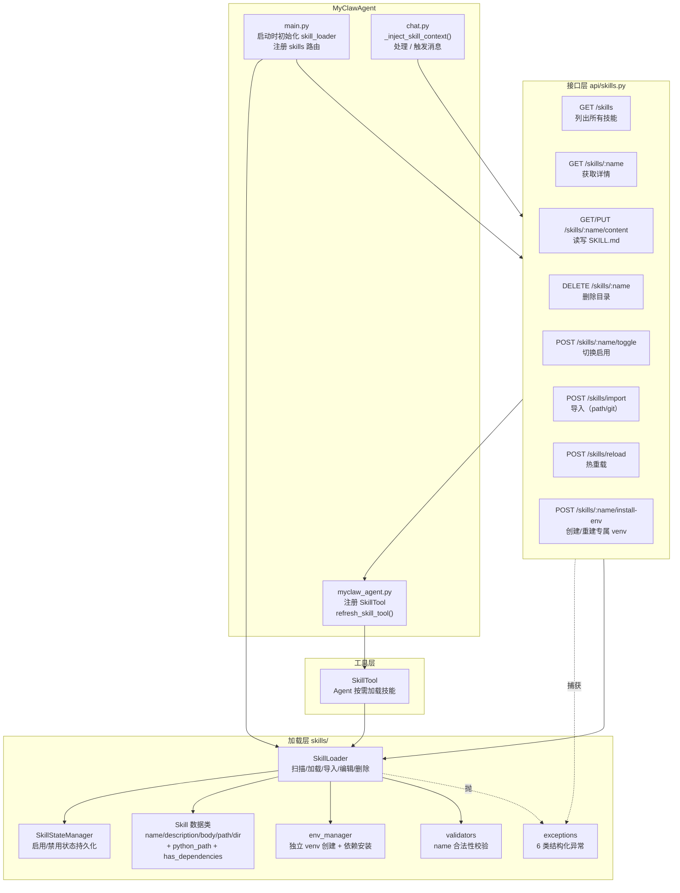

### 2.2 SkillLoader — 加载与生命周期

`SkillLoader` 是技能系统的核心，负责技能的完整生命周期管理。

#### 渐进式披露（三层加载）

| 层级 | 内容 | 加载时机 | Token 估算 |
|------|------|---------|-----------|
| Layer 1 — 元数据 | `name` + `description`（YAML frontmatter） | 启动时一次性扫描 | ~100 tokens/skill |
| Layer 2 — 正文 | `body`（SKILL.md 去除 frontmatter 后的正文） | Agent 调用 SkillTool 时按需加载 | ~2000+ tokens |
| Layer 3 — 资源 | `scripts/` `references/` `examples/` `assets/` 目录 | SkillTool 响应中列出文件清单 | 仅文件列表 |

#### 扫描与加载流程

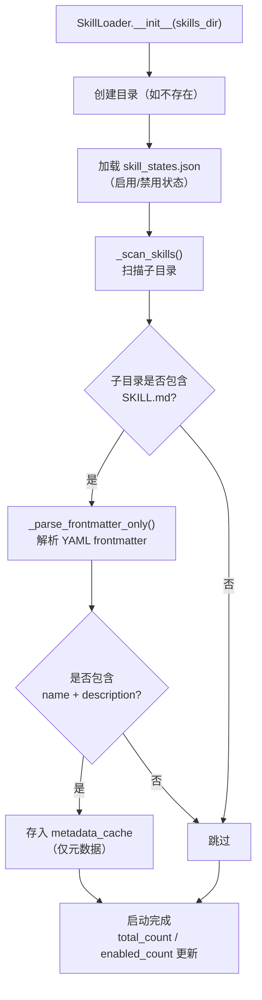

#### 按需加载

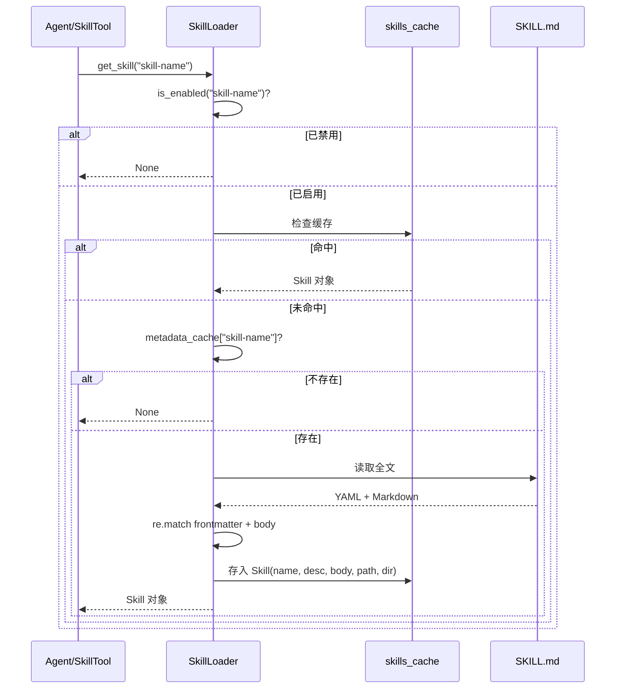

#### 核心能力一览

| 方法 | 说明 |
|------|------|
| `_scan_skills()` | 启动时扫描子目录，解析 YAML frontmatter，写入 metadata_cache |
| `get_skill(name)` | 按需加载完整技能，已禁用返回 None |
| `list_skill_infos()` | 返回全部技能的 name / description / enabled / dir（前端列表用） |
| `get_descriptions(only_enabled)` | 格式化文本 "— name: description"，用于 SkillTool 描述 |
| `get_skill_content(name)` | 获取 SKILL.md 原始全文（编辑器用） |
| `set_skill_content(name, content)` | 写入新内容到 SKILL.md，清除缓存并重新解析元数据 |
| `set_enabled(name, enabled)` | 开关启用/禁用，同步写入 skill_states.json |
| `delete_skill(name)` | 删除技能子目录，同时清理缓存和状态 |
| `import_from_path(source)` | 本地目录复制导入 |
| `import_from_git(repo_url)` | Git 克隆导入（支持多技能仓库） |
| `reload()` | 清空缓存重新扫描（热重载） |

### 2.3 SkillStateManager — 状态持久化

启用/禁用状态独立于 `SKILL.md` 存储，避免修改原始技能文件。状态文件位于 `skills/skill_states.json`。

| 方法 | 说明 |
|------|------|
| `is_enabled(name)` | 检测启用状态，**不在文件中视为启用**（默认 `True`） |
| `set_enabled(name, enabled)` | 设置状态并立即写入文件 |
| `remove_state(name)` | 删除技能时清理对应记录 |

### 2.4 SkillTool — Agent 工具

自实现版 SkillTool，替代 `hello_agents` 同名工具。Agent 可调用此工具按需加载技能。

**参数**：

| 参数 | 类型 | 必填 | 说明 |
|------|------|------|------|
| `skill` | string | 是 | 要加载的技能名称 |
| `args` | string | 否 | 替换 `SKILL.md` 正文中的 `$ARGUMENTS` 占位符 |

**执行流程**：

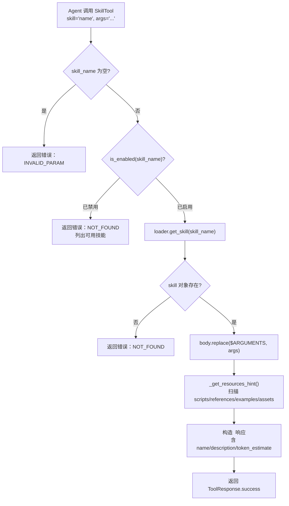

**描述刷新**：`refresh_description()` 方法在技能列表变化（导入/删除/切换启用）后由 API 层调用，重新生成工具描述中的可用技能列表。

### 2.5 技能 API（`api/skills.py`）

提供完整的 RESTful CRUD 接口，前缀 `/api/skills`。

| 端点 | 方法 | 说明 |
|------|------|------|
| `/skills` | GET | 返回 `{skills[], total, enabled_count}`；每项含 `has_venv` / `has_dependencies` / `python_path` |
| `/skills/{name}` | GET | 返回单个技能详情 |
| `/skills/{name}/content` | GET | 返回 SKILL.md 原始内容 |
| `/skills/{name}/content` | PUT | 更新 SKILL.md 内容；改 name 时自动重命名，返回 `{message, name, renamed}` |
| `/skills/{name}` | DELETE | 删除技能目录（含 `.venv`） |
| `/skills/{name}/toggle` | POST | 切换启用/禁用，返回 `{message, enabled}` |
| `/skills/import` | POST | 导入技能（body: `{source_type, source}`），导入后自动安装依赖 |
| `/skills/{name}/install-env` | POST | 为指定技能创建/重建专属 venv 并安装依赖，返回 `{success, message, python_path, log}` |
| `/skills/reload` | POST | 热重载技能列表 |

**关键设计**：
- **工具描述同步**：所有会改变技能列表的接口（import / delete / toggle / update-content / install-env / reload）在操作完成后调用 `_refresh_skill_tool()`，通过 Agent 实例的 `refresh_skill_tool()` 方法更新 SkillTool 的工具描述。
- **结构化错误**：所有 `SkillError` 子类被自动转换为 `HTTPException`，`detail` 字段是 `{code, message, detail}` 结构而非纯字符串，便于前端国际化和精确处理。详见 §2.8。

### 2.6 导入机制

#### 本地目录导入（`source_type="path"`）

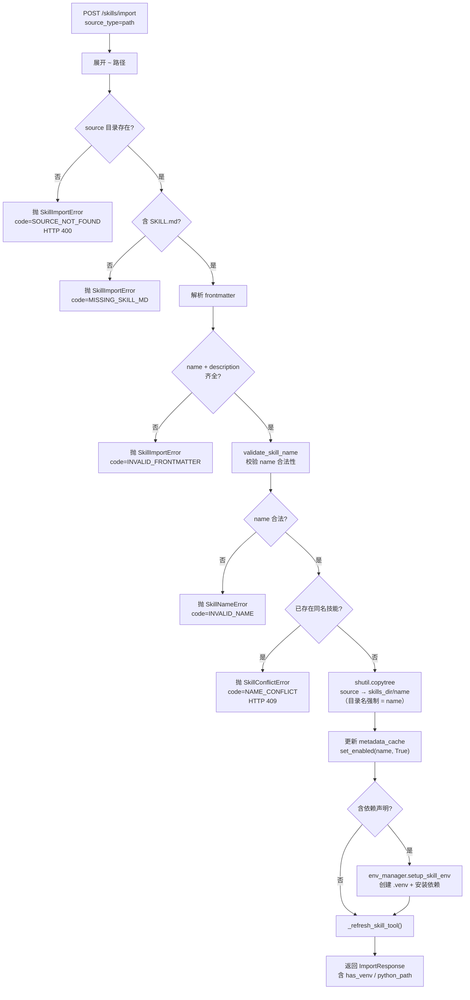

#### Git 仓库导入（`source_type="git"`）

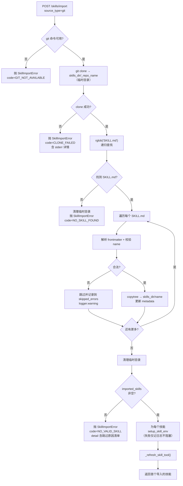

### 2.7 依赖管理（独立 venv）

为避免不同技能的 Python 依赖相互冲突、避免污染主环境，**每个技能拥有独立的虚拟环境**，位于 `skills/<name>/.venv`。

#### 依赖声明的三种来源

`env_manager` 按优先级查找依赖：

| 优先级 | 来源 | 格式 |
|--------|------|------|
| 高 | `<skill>/requirements.txt` | 标准 pip 依赖清单（推荐） |
| 中 | `<skill>/requirements-skill.txt` | 同上，备选文件名 |
| 低 | `SKILL.md` frontmatter 的 `dependencies` 字段 | YAML 列表 |

只要任一来源存在依赖声明，导入时会自动建 venv 并安装。

#### 工具链：uv 优先，pip 兜底

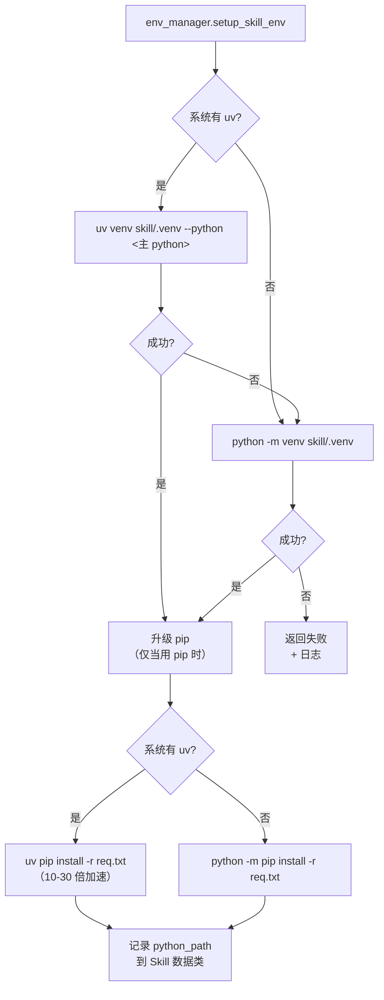

**关键点**：
- `uv` 不是硬依赖，未安装时自动降级到 `python -m venv` + `pip`
- venv 解释器路径平台自适应：Windows 是 `.venv/Scripts/python.exe`，Linux/macOS 是 `.venv/bin/python`
- `Skill.python_path` 字段在 `get_skill()` 时通过 `env_manager.get_venv_python()` 动态探测，不持久化（避免目录被外部移动时失效）

#### Agent 如何使用专属环境

SkillTool 加载技能时，响应中包含**明确的解释器路径**和**执行规则**，引导 Agent 直接使用该路径而非凭直觉调用 `python` / `python3`：

```
✅ 技能已加载：a-share-data
📁 技能目录：C:/Users/me/.helloclaw/workspace/skills/a-share-data
🐍 专属 Python 解释器（已安装该技能所需依赖）：
    C:/Users/me/.helloclaw/workspace/skills/a-share-data/.venv/Scripts/python.exe
    执行示例：
    "C:/.../python.exe" "C:/.../scripts/fetch_realtime.py" --quote 600519 --json

⚠️ 执行规则（必须遵守）：
1. 「可用资源」中已列出所有脚本和文档的完整路径，请直接使用这些路径，不要搜索文件系统。
2. 执行 Python 脚本时，必须使用上方指定的 Python 解释器，不要用 `python` 或 `python3` 这种依赖 PATH 的写法。
3. 如果脚本报 ModuleNotFoundError，说明依赖未安装到本技能的专属环境，请告知用户而不是自行 pip install。
```

这一设计解决了"Agent 在多个 Python 环境间反复试错"的历史问题。

### 2.8 错误处理与日志

#### 异常体系

`backend/src/skills/exceptions.py` 定义 6 个结构化异常，均继承 `SkillError`：

| 异常 | 触发场景 | HTTP 状态 |
|------|---------|----------|
| `SkillError` | 基类，含 `code` / `message` / `detail` 三字段 | 500（默认） |
| `SkillImportError` | 导入失败（源不存在/clone 失败/复制失败/SKILL.md 缺失） | 400 |
| `SkillLoadError` | 文件 I/O 错误（读 SKILL.md 失败、YAML 语法错误、写入失败、重命名失败） | 500 |
| `SkillNameError` | 技能名不合法（含非法字符、保留名等） | 400 |
| `SkillConflictError` | 同名技能已存在 | 409 |
| `SkillNotFoundError` | 技能不存在 | 404 |

每个异常都携带：
- `code`：机器可读错误码（如 `SOURCE_NOT_FOUND` / `INVALID_FRONTMATTER` / `CLONE_FAILED` / `RENAME_FAILED`）
- `message`：用户可读消息
- `detail`：可选的诊断信息（路径、stderr 摘录等）

#### API 响应格式

所有业务异常被自动转为 `HTTPException`，响应体格式统一：

```json
{
  "detail": {
    "code": "INVALID_NAME",
    "message": "技能名包含非法字符 '/'。仅允许字母、数字、中文、连字符（-）、下划线（_）、点（.）",
    "detail": "输入 name='foo/bar'"
  }
}
```

前端 `extractErrorMessage` 工具函数解析此结构，展示为：`技能名包含非法字符 '/'...（INVALID_NAME）`。

#### 日志策略

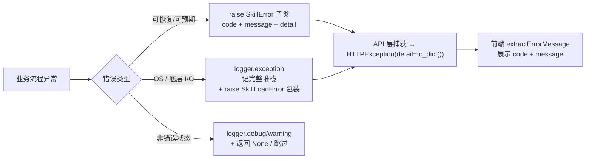

**沿用项目惯例**：
- `logging.getLogger(__name__)` 用于详细异常和堆栈（开发者关注）
- `print(f"⚠️ ...")` 仅用于面向用户的状态提示（启动日志、安装进度等）

### 2.9 技能名校验规则

`backend/src/skills/validators.py` 强制约束 frontmatter 中的 `name` 字段：

| 规则 | 允许 | 拒绝 |
|------|------|------|
| 字符集 | 字母 `A-Za-z`、数字 `0-9`、中文、`-` `_` `.` | `/ \ : * ? " < > \|` 及控制字符 |
| 长度 | 1-64 字符 | 超过 64 或为空 |
| 起始 | 字母/数字/中文 | `.` 开头（隐藏目录）、`_` 开头（Python 私有模块） |
| 结尾 | 任意合法字符 | `.` 结尾、空格结尾（Windows 不允许） |
| 保留名 | — | `__pycache__` / `.venv` / `venv` / `CON` / `PRN` / `AUX` / `NUL` / `COM1-9` / `LPT1-9` |
| 路径段 | — | `.` / `..` |

**调用点**：
- `import_from_path` / `import_from_git`：解析 frontmatter 后立即校验，失败抛 `SkillNameError`
- `set_skill_content`：检测到新 frontmatter.name 与当前 name 不同时，校验新 name 合法性，失败抛 `SkillNameError`
- `_scan_skills`：扫描时遇到不合法 name 跳过 + warning（兼容旧数据）

### 2.10 目录名一致性

强制约束：**`skill_dir.name == frontmatter.name`**。该约束在两个时机生效：

#### 导入时

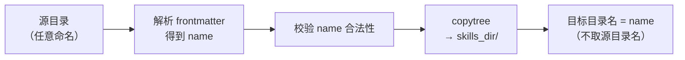

#### 编辑改名时

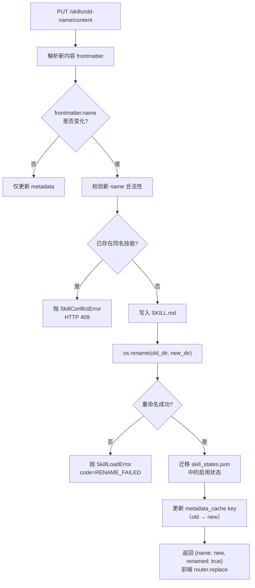

#### 兼容旧数据

`_scan_skills` 扫描时若发现 `dir.name != frontmatter.name`：
- 记录 `logger.warning`：`"技能目录名 'X' 与 frontmatter.name 'Y' 不一致..."`
- 仍以 `name` 为 cache key 加载（保证可用）
- 提示用户手动修复或重新导入

---

## 3. 前端架构

### 3.1 页面与组件总览

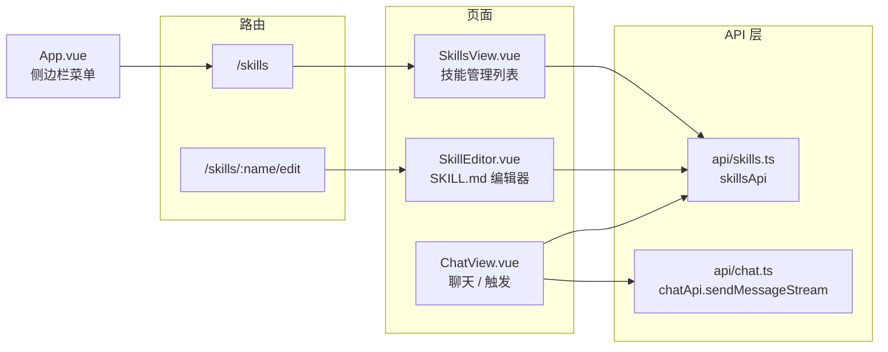

### 3.2 SkillsView.vue — 技能管理页面

**布局**：顶部标题栏（左侧标题+描述，右侧导入按钮）+ 响应式卡片网格。

每张技能卡片包含：

| 元素 | 说明 |
|------|------|
| 图标 | 红色渐变圆形 ⚡ 图标 |
| 技能名 | `skill.name`（粗体，单行溢出省略） |
| 描述 | `skill.description`（两行截断） |
| **环境状态徽标** | 三态：绿色「专属环境就绪」/ 黄色「依赖未安装」/ 灰色「无依赖」 |
| 目录路径 | `skill.dir`（灰色小字，文件夹图标） |
| 启用开关 | Ant Design Switch 组件（乐观更新 + 失败恢复） |
| **安装/重装依赖** | 仅当技能声明依赖时显示；点击调用 `/install-env` 端点 |
| 编辑按钮 | 路由跳转到 `/skills/:name/edit` |
| 删除按钮 | Popconfirm 确认后调用 DELETE API（同时删除 `.venv`） |

**统一错误处理**：所有接口失败都通过 `extractErrorMessage(error, fallback)` 提取结构化 detail：
- 后端结构 `{detail: {code, message, detail}}` → 展示为 `<message>（<code>）`
- 兼容旧的纯字符串 detail
- axios 错误对象的 `message` 字段作为兜底

**开关交互流程**：

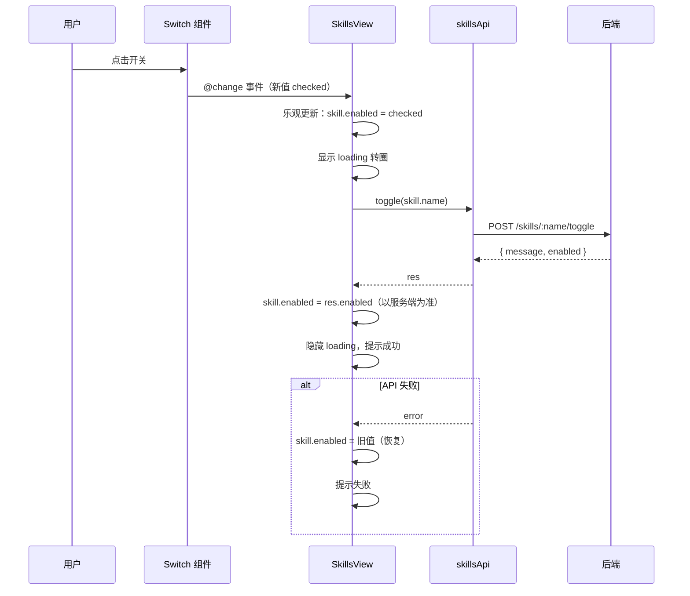

**导入弹窗**：

- 使用 Ant Design Modal + Tabs 组件
- Tab 1 "本地目录"：输入框 + 提示文字（输入完整路径）
- Tab 2 "Git 仓库"：输入框 + GitHub 图标前缀（输入 Git URL）
- 确认后调用 POST `/api/skills/import`，成功后关闭弹窗并刷新列表

### 3.3 SkillEditor.vue — 技能编辑器

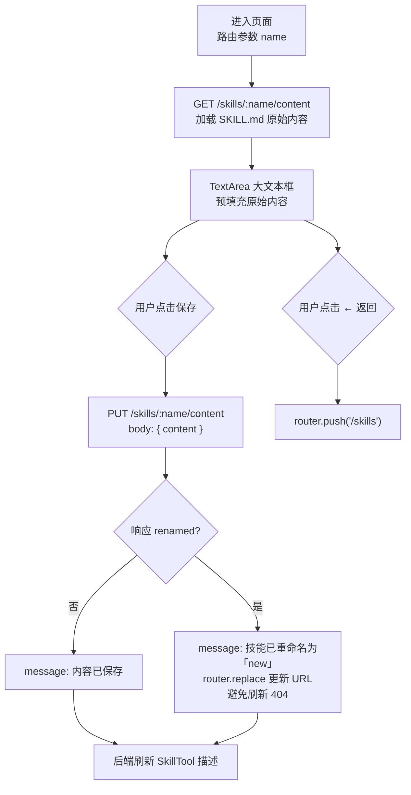

**关键设计**：`skillName` 用 `ref` 而非常量，便于改名后同步更新页面标题和后续请求路径。改名失败（如 `RENAME_FAILED` / `NAME_CONFLICT`）会通过 `extractErrorMessage` 展示具体错误码。

### 3.4 ChatView.vue — 聊天框 `/` 触发

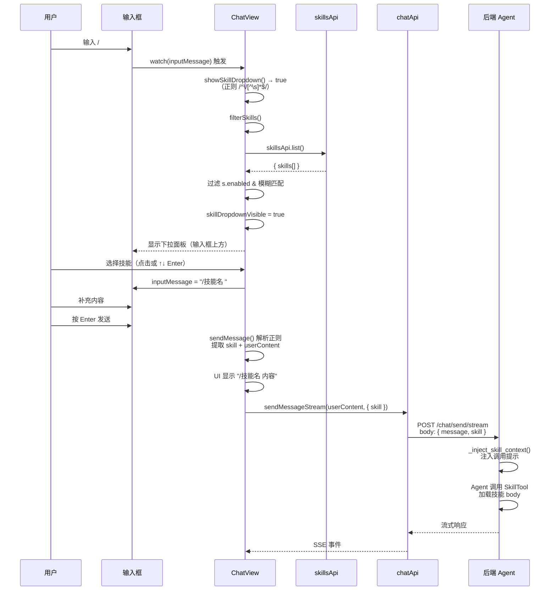

**下拉面板定位**：退出前定位上下文是 `.chat-view`（整个视图高度），导致 `bottom: 100%` 将面板推到视口外。修复后下拉面板移入 `.chat-input-wrapper`（`position: relative`），`bottom: 100%` 相对于输入区域高度，面板正确显示在输入框上方。

**`_inject_skill_context` 设计**：不注入技能 body 到用户消息，而是注入提示文本告知 Agent 用户选择了某技能，引导 Agent 调用 SkillTool 加载。这避免了技能全文混入会话历史（切换页面回来后看到全文的问题）。

---

## 4. 技能目录结构

```
<workspace>/skills/                  # 默认: ~/.helloclaw/workspace/skills
├── skill_states.json                # 启用/禁用状态（不修改原始文件）
├── <技能名-1>/                       # 目录名 == frontmatter.name（强制约束）
│   ├── SKILL.md                     # 核心文件：YAML frontmatter + Markdown body
│   ├── requirements.txt             # 可选：Python 依赖清单（导入时自动安装）
│   ├── .venv/                       # 自动生成：专属虚拟环境
│   │   └── Scripts/python.exe       # Windows，Linux/macOS 为 bin/python
│   ├── scripts/                     # 可选：可执行脚本
│   ├── examples/                    # 可选：示例文件
│   ├── references/                  # 可选：参考文档
│   └── assets/                      # 可选：静态资源
└── <技能名-2>/
    └── SKILL.md
```

**SKILL.md 格式要求**：必须以 YAML frontmatter 开头（`---` 包裹），且必须包含 `name` 和 `description` 字段。`name` 需通过 §2.9 的校验规则。缺少任一必需字段则该目录不被识别为技能。

```yaml
---
name: 技能名称              # 必需，须通过 validate_skill_name 校验
description: 简短描述       # 必需
dependencies:               # 可选，会自动安装到 <skill>/.venv
  - akshare
  - pandas>=2.0
---

# 技能正文

具体说明、步骤、注意事项等。

如需运行时替换参数，使用 $ARGUMENTS 占位符。
```

**依赖声明优先级**：`requirements.txt` > `requirements-skill.txt` > frontmatter 的 `dependencies` 字段。任一存在即触发自动建 venv + 安装。

---

## 5. 集成点与关键修改

### 5.1 `myclaw_agent.py`

将 `Config(skills_enabled=False)` 禁用 hello_agents 内置 Skill 系统，改用自实现 `SkillLoader` + `SkillTool`。注册时保存 `_skill_tool` 引用，对外暴露 `refresh_skill_tool()` 方法供 API 层在技能列表变化后刷新工具描述。

### 5.2 `main.py`

在 lifespan startup 中将 Agent 的 `skill_loader` 注入 `skills` API 模块，同时注册技能路由。初始化日志中输出技能总数和已启用数。

### 5.3 `chat.py`

`ChatRequest` 增加 `skill` 可选字段。`_inject_skill_context()` 在有 skill 参数时构造提示消息引导 Agent 调用 SkillTool。同时注入于同步（`/send/sync`）和流式（`/send/stream`）两个接口。

### 5.4 前端 `chat.ts`

`SendMessageOptions` 增加 `skill` 字段，`sendMessageStream` 请求体中包含 `skill` 参数。

---

## 6. 数据流：用户选择技能到 Agent 执行的完整链路

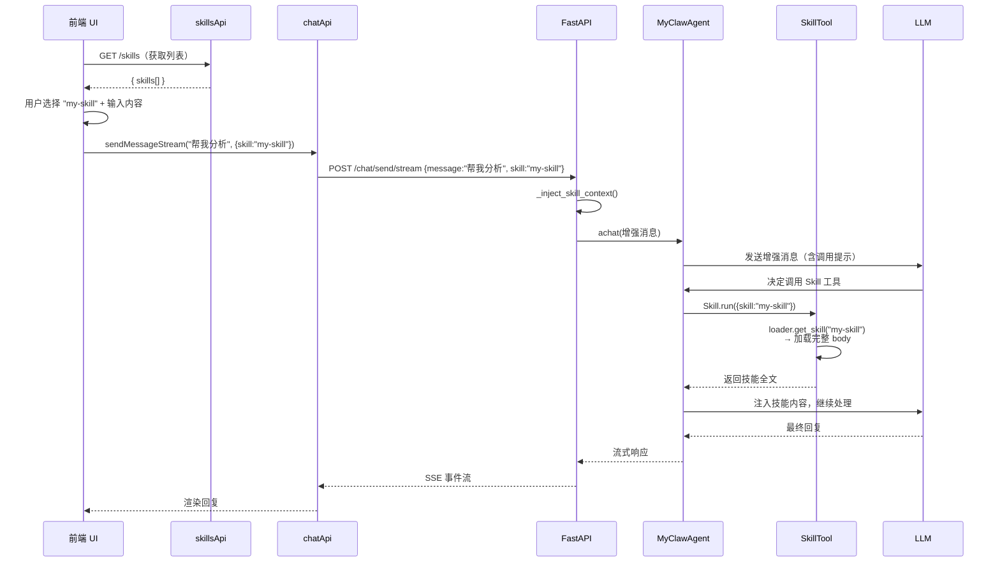

---

## 7. 修复记录

按升级阶段分类。

### 7.1 首轮升级修复

| # | 问题 | 根因 | 影响 |
|---|------|------|------|
| 1 | 输入 `/` 后下拉框不显示 | 下拉面板定位上下文是 `.chat-view`（整个视图），`bottom: 100%` 推出视口 | 用户无法看到技能选择列表 |
| 2 | 开关点击不响应 | Switch 使用 `:checked` 单向绑定 + `@click.stop`，视觉状态无法随点击切换 | 技能管理页开关形同虚设 |
| 3 | 开关对不存在的技能不报错 | `is_enabled()` 返回 bool（非 Optional），`if current is None` 永不触发 | 误操作时无提示 |
| 4 | 导入后技能未重置为启用 | `import_from_path/git` 未调用 `set_enabled(name, True)`，复用旧的禁用记录 | 新导入的技能可能不可用 |
| 5 | 导入后 Agent 不知道新技能 | SkillTool 描述在初始化时固定，无刷新机制 | Agent 工具列表不更新 |
| 6 | 切换页面后消息显示技能全文 | `_inject_skill_context` 将 body 注入到用户消息，Agent 保存进会话历史 | 用户看到大量技能文本 |
| 7 | 技能名含特殊字符时下拉消失 | 正则 `[\w\u4e00-\u9fff-]` 不支持 `.` 等字符 | 部分技能无法通过 `/` 选择 |

### 7.2 依赖管理升级修复

| # | 问题 | 根因 | 解决 |
|---|------|------|------|
| 8 | Agent 在多个 Python 环境间反复试错 | SkillTool 响应未告知正确解释器路径，技能依赖未安装到固定环境 | 每技能独立 venv + 响应中明确 `python_path` |
| 9 | 主 venv 缺 pip 导致 Agent 无法装包 | 装包逻辑交给 Agent 运行时 `pip install`，不可靠 | 导入时一次性安装，pip 走主 python 或 uv |
| 10 | 单轮工具调用过多导致超 10 轮迭代 | LLM 一次响应生成 15+ 个重复搜索调用 | `max_tools_per_round=5` + 同参数去重 |

### 7.3 健壮性升级修复

| # | 问题 | 根因 | 解决 |
|---|------|------|------|
| 11 | `name` 含非法字符导致 `copytree` 崩溃后被静默吞掉 | 全捕获 `except Exception: return None` | `validators.py` 强校验 + `SkillNameError` 拒绝（§2.9） |
| 12 | 导入/加载失败时用户和日志都看不到根因 | 大量 `except Exception: return None` | `exceptions.py` 6 类结构化异常 + `logger.exception` 记堆栈（§2.8） |
| 13 | 目录名与 `frontmatter.name` 可能不一致 | 旧实现允许二者不同 | 导入强制 `dir.name = name`；编辑改 name 自动重命名（§2.10） |

---

## 8. 相关代码索引

| 位置 | 作用 |
|------|------|
| `backend/src/skills/__init__.py` | Skill 数据类、异常类、校验函数包导出 |
| `backend/src/skills/loader.py` | SkillLoader：扫描、加载、导入、编辑、删除、改名、热重载 |
| `backend/src/skills/state_manager.py` | SkillStateManager：启用/禁用状态持久化 |
| `backend/src/skills/env_manager.py` | 独立 venv 创建（uv/pip）+ 依赖安装 + 解释器探测 |
| `backend/src/skills/exceptions.py` | 6 个结构化异常类（含 `code`/`message`/`detail`） |
| `backend/src/skills/validators.py` | `validate_skill_name` / `ensure_valid_skill_name` |
| `backend/src/tools/builtin/skill_tool.py` | SkillTool：Agent 按需调用工具，响应注入 python_path |
| `backend/src/api/skills.py` | 技能 CRUD API（9 个端点）+ `SkillError → HTTPException` 转换 |
| `backend/src/agent/myclaw_agent.py` | 注册 SkillTool、暴露 refresh_skill_tool() |
| `backend/src/agent/enhanced_simple_agent.py` | `max_tools_per_round` + 同参数去重保护 |
| `backend/src/api/chat.py` | ChatRequest.skill 字段、_inject_skill_context() |
| `backend/src/main.py` | 注入 skill_loader、注册 skills 路由 |
| `backend/src/tools/__init__.py` | 导出 SkillTool |
| `backend/src/tools/builtin/__init__.py` | 内置工具导出 |
| `frontend/src/api/skills.ts` | 前端 Skill API 封装（含 `installEnv` / `SkillContentUpdateResponse`） |
| `frontend/src/api/chat.ts` | SendMessageOptions.skill 字段 |
| `frontend/src/views/SkillsView.vue` | 技能管理列表 + 环境状态徽标 + 安装日志 Modal |
| `frontend/src/views/SkillEditor.vue` | SKILL.md 编辑器（支持改名后路由更新） |
| `frontend/src/views/ChatView.vue` | / 触发选择、sendMessage 解析 |
| `frontend/src/router/index.ts` | /skills 和 /skills/:name/edit 路由 |
| `frontend/src/App.vue` | 侧边栏 "技能" 菜单项 |

---

## 9. 配置与运维提示

### 路径与文件
- **技能存储路径**：默认为 `~/.helloclaw/workspace/skills`，由 `MyClawAgent` 构造函数的 `workspace_path` 决定。自定义工作空间时技能目录跟随变化。
- **SKILL.md 格式**：必须以 YAML frontmatter 开头（`---` 包裹），且必须包含合法的 `name` 和 `description`。缺失任一字段则该目录不被识别。
- **状态文件**：`skill_states.json` 位于 `skills/` 目录下，独立于各技能子目录。删除技能时会自动清理对应记录。
- **专属 venv**：每个技能的 `.venv` 与技能目录同删除，独立于全局环境。

### 依赖管理
- **可选 uv 加速**：系统装了 `uv`（`pip install uv` 或 `winget install astral-sh.uv`）时，venv 创建 + 依赖安装会快 5-10 倍。未安装则降级到 `python -m venv` + `pip`，功能一致。
- **依赖来源优先级**：`requirements.txt` > `requirements-skill.txt` > `SKILL.md` frontmatter `dependencies`。
- **手动重装**：技能卡片上点击「重装依赖」即可触发 `POST /skills/:name/install-env`，会清空旧 `.venv` 重建。
- **Agent 执行规则**：SkillTool 响应里 §2.7 的"执行规则"会强制 Agent 用专属解释器，遇到 ModuleNotFoundError 也不应自行 `pip install`，而应提示用户重装依赖。

### 名称与命名
- **合法字符集**：见 §2.9 表格。新导入的 SKILL.md 若 `name` 不合法会直接拒绝；旧数据扫描时若不合法仅记 warning 跳过加载。
- **改名**：通过修改 SKILL.md 的 `name` 字段保存即触发目录重命名。冲突或重命名失败会返回结构化错误。

### 错误诊断
- **后端日志**：异常 stack trace 通过 `logging.getLogger(__name__)` 输出，默认级别 INFO/WARNING。排查导入失败时优先看 `logger.exception` 的完整堆栈。
- **前端错误**：结构化错误会展示为 `<message>（<code>）`，可根据 `code` 精确定位（如 `INVALID_NAME` / `NAME_CONFLICT` / `RENAME_FAILED`）。

### 其他
- **Git 导入**：依赖本地 `git` 命令可用。导入过程先将仓库克隆到临时目录 `skills/_repo_name`，提取技能后删除临时目录。
- **热重载**：调用 `POST /api/skills/reload` 可重新扫描技能目录并刷新工具描述，无需重启服务。
- **默认启用**：新导入的技能默认处于"启用"状态。若需禁用，可通过前端界面或 `POST /api/skills/:name/toggle` 接口操作。

---

以上为 Skill 系统的当前实现与功能说明；若后续调整架构或接口，请以对应源码为准。
