# Skill 系统实现与升级说明

本文档基于当前代码，说明 MyClaw 中 **Skill（技能）** 系统的全新自实现架构，涵盖后端加载与管理模块、前端管理界面、聊天框 `/` 触发机制，以及与 `hello_agents` 旧依赖的对比。文中的 Mermaid 图可在 Obsidian 中渲染。

---

## 1. 功能总览

Skill 系统已从依赖外部库 `hello_agents` 完全替换为**项目自实现**，同时新增了完整的前端管理页面和聊天框 `/` 触发选择功能。

| 特性 | 说明 |
|------|------|
| **存储** | 工作空间 `skills/` 目录，每个技能一个子目录，核心文件为 `SKILL.md` |
| **加载机制** | 渐进式披露（三层）：启动时仅加载元数据，运行时按需加载完整正文，资源文件仅在工具响应中列出 |
| **状态管理** | 独立 JSON 文件 `skill_states.json`，不修改原始 `SKILL.md`；默认启用，不在文件中视为启用 |
| **导入方式** | 本地目录复制（`shutil.copytree`）和 Git 仓库克隆（`git clone`）两种方式 |
| **管理界面** | 前端卡片式列表（Swtich 开关、编辑按钮、删除按钮、目录路径展示）+ 导入弹窗（Tab 切换本地/Git） |
| **编辑器** | 独立页面编辑 `SKILL.md` 全文，保存后自动刷新 Agent 工具描述 |
| **Agent 调用** | SkillTool 工具（Agent 主动调用）+ 聊天框 `/技能名` 前缀触发（用户主动选择） |

### 与旧架构的区别

| 维度 | 旧架构（hello_agents） | 新架构（自实现） |
|------|----------------------|-----------------|
| Skill 加载 | `hello_agents.skills.SkillLoader` | `backend/src/skills/loader.py` — 完全自实现，含导入/编辑/删除/热重载 |
| Skill Tool | `hello_agents.tools.builtin.SkillTool` | `backend/src/tools/builtin/skill_tool.py` — 自实现，含 `$ARGUMENTS` 占位替换 |
| 管理界面 | 无 | 前端页面：列表管理 + 编辑器 + 导入弹窗 |
| 触发方式 | Agent 自动调用工具 | Agent 自动调用 + 聊天框 `/` 手动选择 |
| 启用/禁用 | 无 | `SkillStateManager` 持久化开关状态 |
| 技能导入 | 无 | 支持本地目录和 Git 仓库 |
| 描述刷新 | 启动时固定 | 导入/删除/切换后动态刷新工具描述 |

---

## 2. 后端架构

### 2.1 模块总览

技能系统后端由三个模块组成：加载层（`skills/`）、工具层（`skill_tool.py`）、接口层（`api/skills.py`），均集成于 `MyClawAgent` 中。

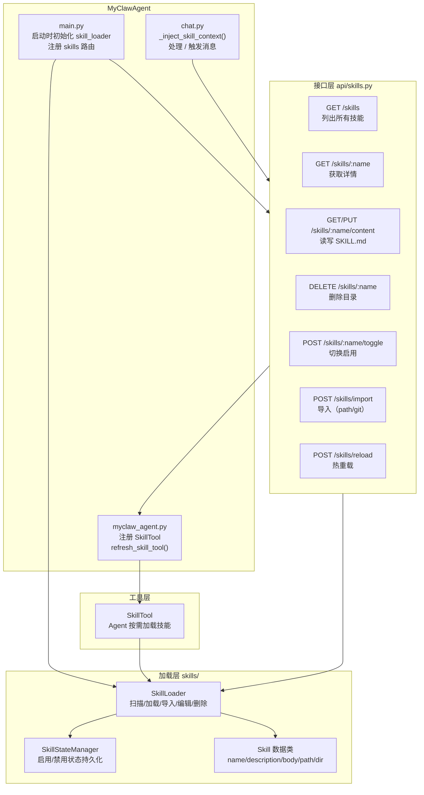

### 2.2 SkillLoader — 加载与生命周期

`SkillLoader` 是技能系统的核心，负责技能的完整生命周期管理。

#### 渐进式披露（三层加载）

| 层级 | 内容 | 加载时机 | Token 估算 |
|------|------|---------|-----------|
| Layer 1 — 元数据 | `name` + `description`（YAML frontmatter） | 启动时一次性扫描 | ~100 tokens/skill |
| Layer 2 — 正文 | `body`（SKILL.md 去除 frontmatter 后的正文） | Agent 调用 SkillTool 时按需加载 | ~2000+ tokens |
| Layer 3 — 资源 | `scripts/` `references/` `examples/` `assets/` 目录 | SkillTool 响应中列出文件清单 | 仅文件列表 |

#### 扫描与加载流程

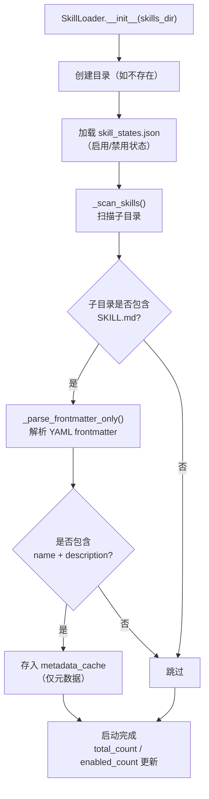

#### 按需加载

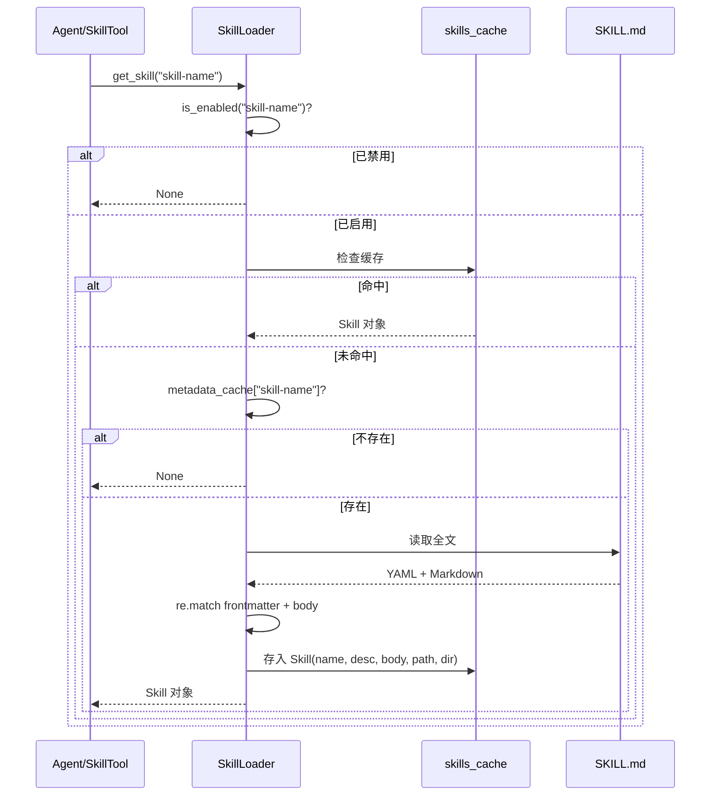

#### 核心能力一览

| 方法 | 说明 |
|------|------|
| `_scan_skills()` | 启动时扫描子目录，解析 YAML frontmatter，写入 metadata_cache |
| `get_skill(name)` | 按需加载完整技能，已禁用返回 None |
| `list_skill_infos()` | 返回全部技能的 name / description / enabled / dir（前端列表用） |
| `get_descriptions(only_enabled)` | 格式化文本 "— name: description"，用于 SkillTool 描述 |
| `get_skill_content(name)` | 获取 SKILL.md 原始全文（编辑器用） |
| `set_skill_content(name, content)` | 写入新内容到 SKILL.md，清除缓存并重新解析元数据 |
| `set_enabled(name, enabled)` | 开关启用/禁用，同步写入 skill_states.json |
| `delete_skill(name)` | 删除技能子目录，同时清理缓存和状态 |
| `import_from_path(source)` | 本地目录复制导入 |
| `import_from_git(repo_url)` | Git 克隆导入（支持多技能仓库） |
| `reload()` | 清空缓存重新扫描（热重载） |

### 2.3 SkillStateManager — 状态持久化

启用/禁用状态独立于 `SKILL.md` 存储，避免修改原始技能文件。状态文件位于 `skills/skill_states.json`。

| 方法 | 说明 |
|------|------|
| `is_enabled(name)` | 检测启用状态，**不在文件中视为启用**（默认 `True`） |
| `set_enabled(name, enabled)` | 设置状态并立即写入文件 |
| `remove_state(name)` | 删除技能时清理对应记录 |

### 2.4 SkillTool — Agent 工具

自实现版 SkillTool，替代 `hello_agents` 同名工具。Agent 可调用此工具按需加载技能。

**参数**：

| 参数 | 类型 | 必填 | 说明 |
|------|------|------|------|
| `skill` | string | 是 | 要加载的技能名称 |
| `args` | string | 否 | 替换 `SKILL.md` 正文中的 `$ARGUMENTS` 占位符 |

**执行流程**：

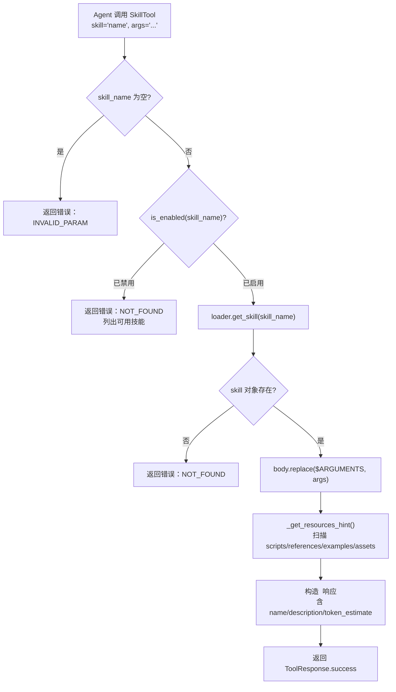

**描述刷新**：`refresh_description()` 方法在技能列表变化（导入/删除/切换启用）后由 API 层调用，重新生成工具描述中的可用技能列表。

### 2.5 技能 API（`api/skills.py`）

提供完整的 RESTful CRUD 接口，前缀 `/api/skills`。

| 端点 | 方法 | 说明 |
|------|------|------|
| `/skills` | GET | 返回 `{skills[], total, enabled_count}` |
| `/skills/{name}` | GET | 返回单个技能详情 |
| `/skills/{name}/content` | GET | 返回 SKILL.md 原始内容 |
| `/skills/{name}/content` | PUT | 更新 SKILL.md 内容（body: `{content}`） |
| `/skills/{name}` | DELETE | 删除技能目录 |
| `/skills/{name}/toggle` | POST | 切换启用/禁用，返回 `{message, enabled}` |
| `/skills/import` | POST | 导入技能（body: `{source_type, source}`） |
| `/skills/reload` | POST | 热重载技能列表 |

**关键设计**：所有会改变技能列表的接口（import / delete / toggle / update-content / reload）在操作完成后均调用 `_refresh_skill_tool()`，通过 Agent 实例的 `refresh_skill_tool()` 方法更新 SkillTool 的工具描述。

### 2.6 导入机制

#### 本地目录导入（`source_type="path"`）

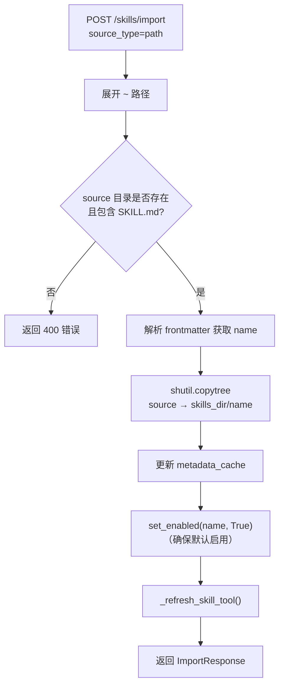

#### Git 仓库导入（`source_type="git"`）

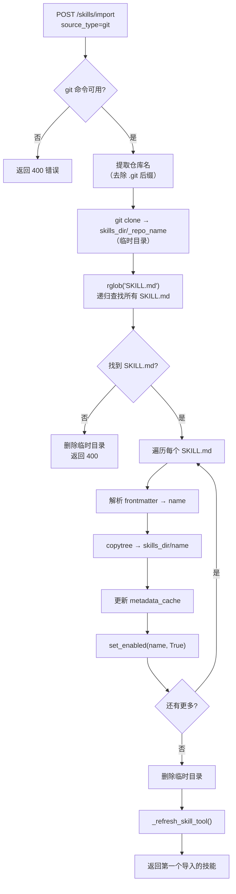

---

## 3. 前端架构

### 3.1 页面与组件总览

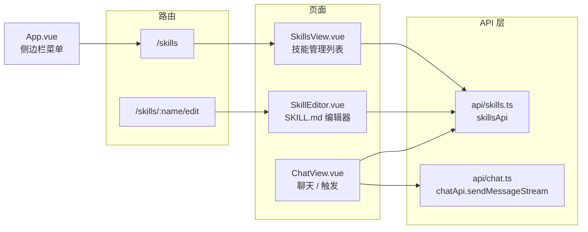

### 3.2 SkillsView.vue — 技能管理页面

**布局**：顶部标题栏（左侧标题+描述，右侧导入按钮）+ 响应式卡片网格。

每张技能卡片包含：

| 元素 | 说明 |
|------|------|
| 图标 | 红色渐变圆形 ⚡ 图标 |
| 技能名 | `skill.name`（粗体，单行溢出省略） |
| 描述 | `skill.description`（两行截断） |
| 目录路径 | `skill.dir`（灰色小字，文件夹图标） |
| 启用开关 | Ant Design Switch 组件 |
| 编辑按钮 | 路由跳转到 `/skills/:name/edit` |
| 删除按钮 | Popconfirm 确认后调用 DELETE API |

**开关交互流程**：

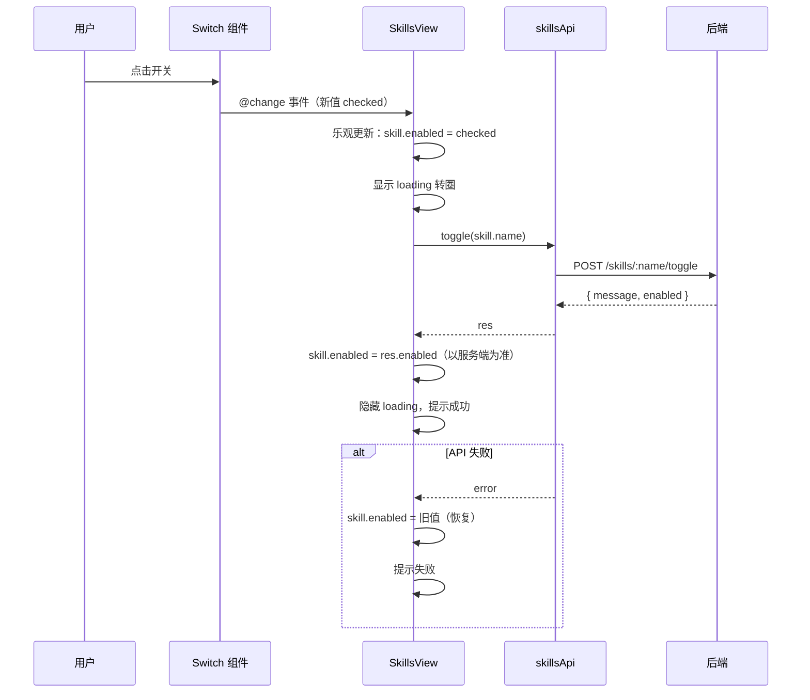

**导入弹窗**：

- 使用 Ant Design Modal + Tabs 组件
- Tab 1 "本地目录"：输入框 + 提示文字（输入完整路径）
- Tab 2 "Git 仓库"：输入框 + GitHub 图标前缀（输入 Git URL）
- 确认后调用 POST `/api/skills/import`，成功后关闭弹窗并刷新列表

### 3.3 SkillEditor.vue — 技能编辑器

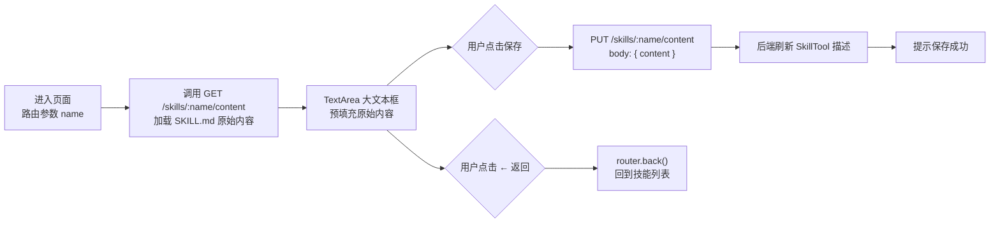

### 3.4 ChatView.vue — 聊天框 `/` 触发

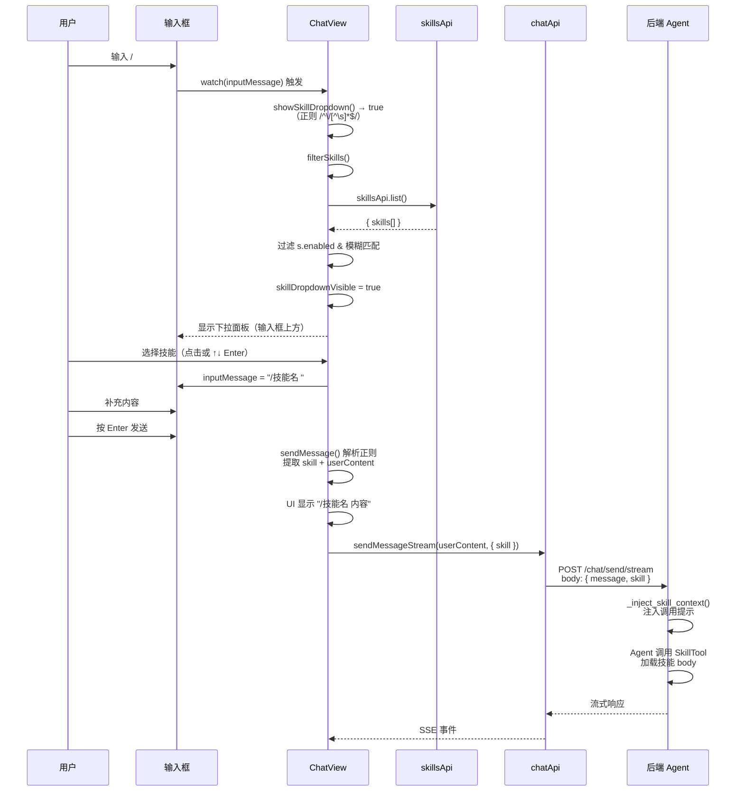

**下拉面板定位**：退出前定位上下文是 `.chat-view`（整个视图高度），导致 `bottom: 100%` 将面板推到视口外。修复后下拉面板移入 `.chat-input-wrapper`（`position: relative`），`bottom: 100%` 相对于输入区域高度，面板正确显示在输入框上方。

**`_inject_skill_context` 设计**：不注入技能 body 到用户消息，而是注入提示文本告知 Agent 用户选择了某技能，引导 Agent 调用 SkillTool 加载。这避免了技能全文混入会话历史（切换页面回来后看到全文的问题）。

---

## 4. 技能目录结构

```
<workspace>/skills/                  # 默认: ~/.helloclaw/workspace/skills
├── skill_states.json                # 启用/禁用状态（不修改原始文件）
├── <技能名-1>/
│   ├── SKILL.md                     # 核心文件：YAML frontmatter + Markdown body
│   ├── scripts/                     # 可选：可执行脚本
│   ├── examples/                    # 可选：示例文件
│   ├── references/                  # 可选：参考文档
│   └── assets/                      # 可选：静态资源
└── <技能名-2>/
    └── SKILL.md
```

**SKILL.md 格式要求**：必须以 YAML frontmatter 开头（`---` 包裹），且必须包含 `name` 和 `description` 字段。缺少任一字段则该目录不被识别为技能。

```yaml
---
name: 技能名称
description: 简短描述
---

# 技能正文

具体说明、步骤、注意事项等。

如需运行时替换参数，使用 $ARGUMENTS 占位符。
```

---

## 5. 集成点与关键修改

### 5.1 `myclaw_agent.py`

将 `Config(skills_enabled=False)` 禁用 hello_agents 内置 Skill 系统，改用自实现 `SkillLoader` + `SkillTool`。注册时保存 `_skill_tool` 引用，对外暴露 `refresh_skill_tool()` 方法供 API 层在技能列表变化后刷新工具描述。

### 5.2 `main.py`

在 lifespan startup 中将 Agent 的 `skill_loader` 注入 `skills` API 模块，同时注册技能路由。初始化日志中输出技能总数和已启用数。

### 5.3 `chat.py`

`ChatRequest` 增加 `skill` 可选字段。`_inject_skill_context()` 在有 skill 参数时构造提示消息引导 Agent 调用 SkillTool。同时注入于同步（`/send/sync`）和流式（`/send/stream`）两个接口。

### 5.4 前端 `chat.ts`

`SendMessageOptions` 增加 `skill` 字段，`sendMessageStream` 请求体中包含 `skill` 参数。

---

## 6. 数据流：用户选择技能到 Agent 执行的完整链路

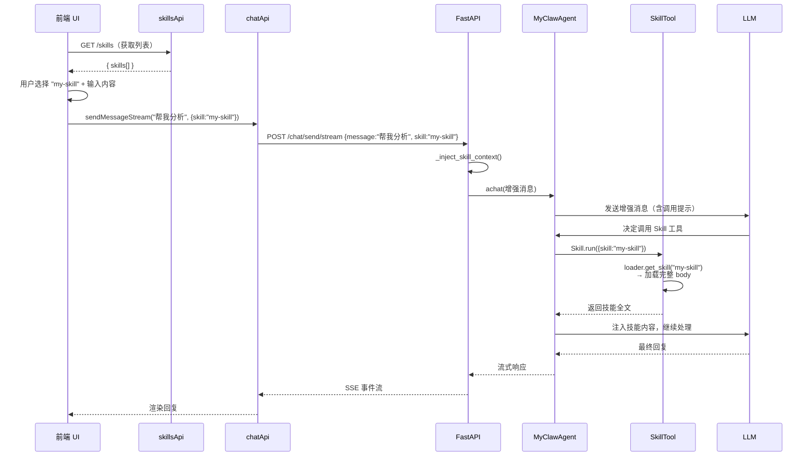

---

## 7. 修复记录

本次升级中识别并修复的缺陷：

| # | 问题 | 根因 | 影响 |
|---|------|------|------|
| 1 | 输入 `/` 后下拉框不显示 | 下拉面板定位上下文是 `.chat-view`（整个视图），`bottom: 100%` 推出视口 | 用户无法看到技能选择列表 |
| 2 | 开关点击不响应 | Switch 使用 `:checked` 单向绑定 + `@click.stop`，视觉状态无法随点击切换 | 技能管理页开关形同虚设 |
| 3 | 开关对不存在的技能不报错 | `is_enabled()` 返回 bool（非 Optional），`if current is None` 永不触发 | 误操作时无提示 |
| 4 | 导入后技能未重置为启用 | `import_from_path/git` 未调用 `set_enabled(name, True)`，复用旧的禁用记录 | 新导入的技能可能不可用 |
| 5 | 导入后 Agent 不知道新技能 | SkillTool 描述在初始化时固定，无刷新机制 | Agent 工具列表不更新 |
| 6 | 切换页面后消息显示技能全文 | `_inject_skill_context` 将 body 注入到用户消息，Agent 保存进会话历史 | 用户看到大量技能文本 |
| 7 | 技能名含特殊字符时下拉消失 | 正则 `[\w\u4e00-\u9fff-]` 不支持 `.` 等字符 | 部分技能无法通过 `/` 选择 |

---

## 8. 相关代码索引

| 位置 | 作用 |
|------|------|
| `backend/src/skills/__init__.py` | Skill 数据类、包导出 |
| `backend/src/skills/loader.py` | SkillLoader：扫描、加载、导入、编辑、删除、热重载 |
| `backend/src/skills/state_manager.py` | SkillStateManager：启用/禁用状态持久化 |
| `backend/src/tools/builtin/skill_tool.py` | SkillTool：Agent 按需调用工具 |
| `backend/src/api/skills.py` | 技能 CRUD API（8 个端点） |
| `backend/src/agent/myclaw_agent.py` | 注册 SkillTool、暴露 refresh_skill_tool() |
| `backend/src/api/chat.py` | ChatRequest.skill 字段、_inject_skill_context() |
| `backend/src/main.py` | 注入 skill_loader、注册 skills 路由 |
| `backend/src/tools/__init__.py` | 导出 SkillTool |
| `backend/src/tools/builtin/__init__.py` | 内置工具导出 |
| `frontend/src/api/skills.ts` | 前端 Skill API 封装 |
| `frontend/src/api/chat.ts` | SendMessageOptions.skill 字段 |
| `frontend/src/views/SkillsView.vue` | 技能管理列表页面 |
| `frontend/src/views/SkillEditor.vue` | SKILL.md 编辑器页面 |
| `frontend/src/views/ChatView.vue` | / 触发选择、sendMessage 解析 |
| `frontend/src/router/index.ts` | /skills 和 /skills/:name/edit 路由 |
| `frontend/src/App.vue` | 侧边栏 "技能" 菜单项 |

---

## 9. 配置与运维提示

- **技能存储路径**：默认为 `~/.helloclaw/workspace/skills`，由 `MyClawAgent` 构造函数的 `workspace_path` 决定。自定义工作空间时技能目录跟随变化。
- **SKILL.md 格式**：必须以 YAML frontmatter 开头（`---` 包裹），且必须包含 `name` 和 `description`。缺失任一字段则该目录不被识别。
- **状态文件**：`skill_states.json` 位于 `skills/` 目录下，独立于各技能子目录。删除技能时会自动清理对应记录。
- **Git 导入**：依赖本地 `git` 命令可用。导入过程先将仓库克隆到临时目录 `skills/_repo_name`，提取技能后删除临时目录。
- **热重载**：调用 `POST /api/skills/reload` 可重新扫描技能目录并刷新工具描述，无需重启服务。
- **默认启用**：新导入的技能默认处于“启用”状态。若需禁用，可通过前端界面或 `POST /api/skills/:name/toggle` 接口操作。

---

以上为 Skill 系统的当前实现与功能说明；若后续调整架构或接口，请以对应源码为准。
