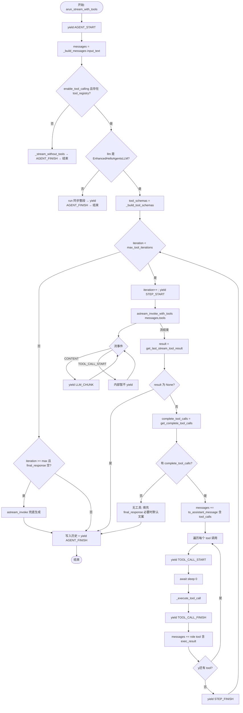
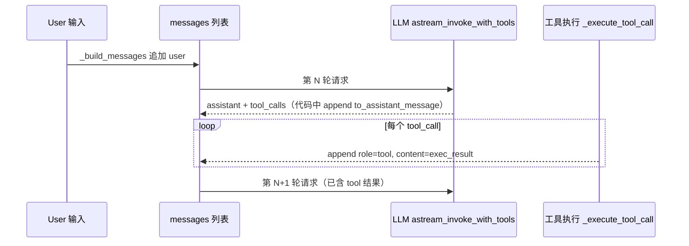

# `EnhancedSimpleAgent.arun_stream_with_tools` 执行流程说明

本文档说明 `backend/src/agent/enhanced_simple_agent.py` 中异步方法 **`arun_stream_with_tools`** 的完整执行路径：消息如何构建、何时流式输出、何时执行工具、工具结果如何写回 **`messages`** 并发往下轮 LLM、最终如何写入会话历史并结束。

**源码位置**：`backend/src/agent/enhanced_simple_agent.py`（约第 101 行起）

**依赖前提**：流式工具调用路径要求 `self.llm` 为 **`EnhancedHelloAgentsLLM`**（见 `_supports_streaming_tools`）；否则会回退到同步 `run()`。

---

## 1. 角色与产出

| 项目 | 说明 |
|------|------|
| 输入 | `input_text`（本轮用户问题），以及 `**kwargs` 透传给 LLM |
| 核心状态 | `messages`：OpenAI 风格对话列表（system / 历史 / user / assistant含tool_calls / tool） |
| 对外产出 | 异步生成器 **`AsyncGenerator[StreamEvent, None]`**，供上层（如 HTTP SSE）转发给前端 |
| 副作用 | 结束时调用 `self.add_message(...)` 写入 `self._history`（用户消息、可选工具链、最终 assistant 回复） |

---

## 2. 消息列表 `messages` 的构建（首轮）

1. **`messages = self._build_messages(input_text)`**
   - 若有 `system_prompt`，先插入 `role: system`
   - 遍历 `self._history`，**保留** `assistant` 的 `tool_calls` 与 `tool` 的 `tool_call_id`（通过 `Message.metadata`），避免工具链断裂
   - 最后追加本轮用户：`{ role: user, content: input_text }`

---

## 3. 分支：是否走「流式工具调用」

```text
若未启用工具 或 无 tool_registry
  → _stream_without_tools(messages)（纯对话流式），结束

若 LLM 非 EnhancedHelloAgentsLLM
  → 警告后 self.run(input_text) 同步一整段，yield AGENT_FINISH，结束

否则
  → 进入「while 迭代 + astream_invoke_with_tools」主流程
```

---

## 4. 主循环（最多 `max_tool_iterations` 轮）

每一轮大致顺序：

1. **`yield STEP_START`**（步骤序号）
2. **`async for event in self.llm.astream_invoke_with_tools(messages, tools=tool_schemas, tool_choice="auto")`**
   - 若事件为 **`CONTENT`**：将模型增量文本 **`yield LLM_CHUNK`**（并 `print`）
   - 若事件为 **`TOOL_CALL_START`**：此处**不**向外 yield（注释写明等执行完再发）
3. 流结束后 **`result = self.llm.get_last_stream_tool_result()`**
   - 若 `result is None`：**break** 退出 while
4. **`complete_tool_calls = result.get_complete_tool_calls()`**
5. 若 **`result.content`** 非空：更新 **`final_response`**（保存本轮 assistant 可见文本）
6. **若无 `complete_tool_calls`**：视为模型直接回答
   - 若 `final_response` 仍空：置为默认「抱歉…」
   - **break** 退出 while（不再执行工具）
7. **若有工具调用**：
   - **`messages.append(result.to_assistant_message())`**  
     → 把「带 `tool_calls` 的 assistant 消息」拼进上下文（下一轮模型能看到自己发了哪些工具请求）
   - **对每个 `tc` in `complete_tool_calls`**：
     - 解析 `arguments`（JSON 失败则向 `messages` 追加一条 **`role: tool`** 的错误内容并 `continue`）
     - **`yield TOOL_CALL_START`**（含 tool_name、args、tool_call_id）
     - **`await asyncio.sleep(0)`** 让出事件循环，便于 SSE 先把 tool_start 发出去
     - **`exec_result = self._execute_tool_call(tool_name, arguments)`**
     - **`yield TOOL_CALL_FINISH`**（含 result）
     - 记录到 **`tool_call_records`**
     - **`messages.append({ role: tool, tool_call_id, content: exec_result })`**  
       → **工具输出在此处进入上下文**，供**下一轮** `astream_invoke_with_tools` 使用
8. **`yield STEP_FINISH`**
9. while 继续下一迭代（除非已 break）

---

## 5. 达到最大迭代次数时的兜底

若 **`current_iteration >= max_tool_iterations`** 且 **`final_response` 仍为空**：

- 打印提示后，调用 **`self.llm.astream_invoke(messages)`** 再流式生成一段最终回答
- 每个 chunk **`yield LLM_CHUNK`**
- 异常时尝试用 `get_last_stream_tool_result().content` 兜底

---

## 6. 结束阶段：写入会话历史并收尾

1. **`self.add_message(Message(input_text, "user"))`**
2. 若 **`tool_call_records` 非空**：
   - 追加一条 **`assistant`** 消息，`metadata.tool_calls` 由记录拼装（id 为 `call_{i}` 形式）
   - 为每条工具结果追加 **`tool`** 消息（`metadata.tool_call_id` 同样为 `call_{i}`）
3. 若存在 **`final_response`**：追加最终 **`assistant`** 文本消息
4. 打印耗时与轮数
5. **`yield AGENT_FINISH`**（`result=final_response`）

外层 **`except`**：发送 **`ERROR`**，再 **`AGENT_FINISH`**（空结果）以优雅结束流。

---

## 7. Obsidian 总览流程图（Mermaid）

> 在 Obsidian 中需开启 Mermaid 渲染（默认支持代码块 `mermaid`）。若某主题不渲染，可安装社区插件「Mermaid Tools」或使用阅读模式预览。

### 7.1 顶层流程



### 7.2 单轮「工具链」数据流（messages 如何变长）



---

## 8. 对外事件与日志对应关系（便于对照终端）

| 阶段 | `StreamEventType`（概念） | 终端常见输出 |
|------|---------------------------|--------------|
| 开始 | `AGENT_START` | `开始处理问题（流式）` |
| 每轮开始 | `STEP_START` | `--- 第 n 轮 ---` |
| 模型增量 | `LLM_CHUNK` | `LLM 输出:` 后跟流式字符 |
| 工具开始 | `TOOL_CALL_START` | `调用工具: name(args)` |
| 工具结束 | `TOOL_CALL_FINISH` | `观察: ...` 或失败提示 |
| 每轮结束 | `STEP_FINISH` | （无固定单行，可视为步骤边界） |
| 结束 | `AGENT_FINISH` | `完成，耗时 ...` |
| 异常 | `ERROR` | `LLM 调用失败` / `Agent 执行失败` |

具体枚举名以 `hello_agents.core.streaming.StreamEventType` 为准。

---

## 9. 实现细节提示（阅读源码时易忽略）

1. **流式事件里的 `TOOL_CALL_START` 被忽略**：真正发给前端的是执行工具前 **`yield TOOL_CALL_START`**，而不是 LLM 内部事件（见源码注释）。
2. **工具结果进入上下文的唯一位置（主路径）**：`messages.append({ role: "tool", ... })`，发生在 `_execute_tool_call` 之后。
3. **会话落盘与 `messages` 不是同一结构**：`add_message` 用 `tool_call_records` 重放了一版 `tool_calls` / `tool`（id 规则为 `call_{i}`），与流式 LLM 返回的 `tool_call_id` 可能不完全一致；若你关心严格对齐，需要单独审计 `Message.metadata` 与 API 侧 id。

---

## 10. 相关文件

- `backend/src/agent/enhanced_simple_agent.py` — 本文档主题
- `backend/src/agent/enhanced_llm.py` — `astream_invoke_with_tools` / `get_last_stream_tool_result`
- `hello_agents` — `SimpleAgent`、`StreamEvent`、`Message` 等基类与协议

---

*文档生成说明：流程依据仓库内 `EnhancedSimpleAgent.arun_stream_with_tools` 源码整理；若后续改动该方法，请同步更新本页 Mermaid 图与表格。*
