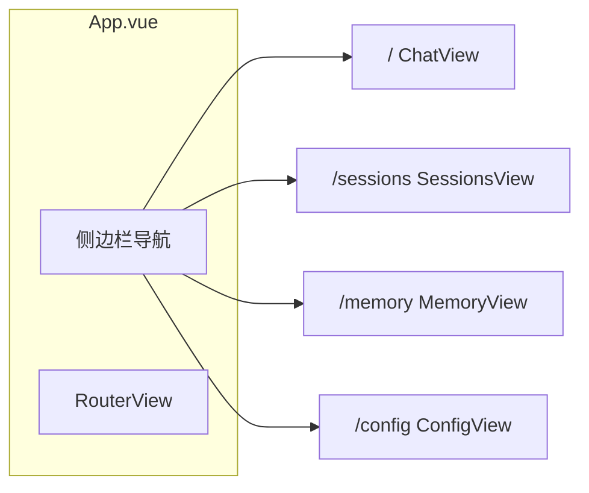
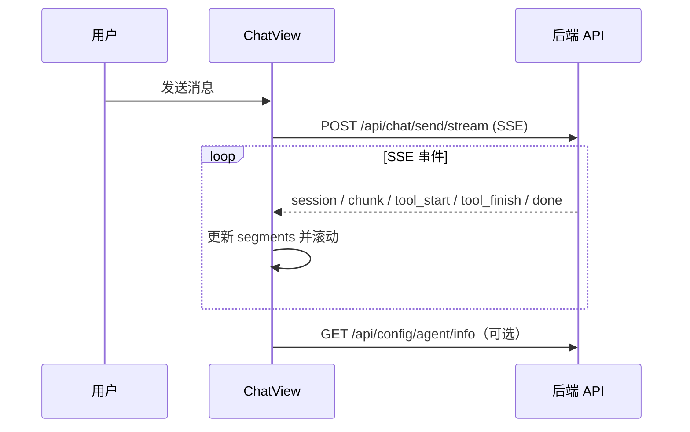

# 前端实现说明（Vue 3 + TypeScript）

本文档基于 `frontend/src` 当前代码，说明 MyClaw Web 前端的架构、页面职责、与后端的交互方式及关键实现细节。文中的 Mermaid 图可在 Obsidian 中渲染。

---

## 1. 技术栈与入口

| 类别 | 选型 |
|------|------|
| 框架 | Vue 3（`<script setup>` + Composition API） |
| 语言 | TypeScript |
| 路由 | Vue Router 4（`createWebHistory`） |
| 状态 | Pinia（已挂载；默认模板中的 `stores/counter.ts` 未在业务中引用） |
| UI | Ant Design Vue 4 + `@ant-design/icons-vue` |
| HTTP | Axios（封装于 `api/index.ts`） |
| 流式对话 | 原生 `fetch` + `ReadableStream` 解析 SSE（见 `api/chat.ts`） |
| Markdown | `marked` 解析 + `dompurify` 消毒（见 `utils/markdown.ts`） |

应用入口：`main.ts` 依次挂载 Pinia、Router、Ant Design Vue 全局组件，样式入口为 `assets/main.css`。

根布局：`App.vue` 使用 `ConfigProvider` 定制 **主题色（龙虾红 `#ff5c5c`）**，左侧固定侧边栏 + `RouterView` 主内容区。

---

## 2. 路由与页面映射

路由定义于 `router/index.ts`，均为懒加载组件：

| 路径 | 路由名 | 组件 | 职责摘要 |
|------|--------|------|----------|
| `/` | `chat` | `views/ChatView.vue` | 主聊天：SSE 流式回复、工具卡片、文件上传、会话恢复 |
| `/sessions` | `sessions` | `views/SessionsView.vue` | 会话列表、新建、删除、跳转聊天 |
| `/memory` | `memory` | `views/MemoryView.vue` | 每日记忆列表与详情预览 |
| `/config` | `config` | `views/ConfigView.vue` | 工作空间配置文件列表、编辑、保存、初始化重置 |

仓库中另有 `HomeView.vue`、`AboutView.vue` 等文件，**当前未注册到路由**，可视为遗留或示例页面。



---

## 3. 目录结构（`src/`）

```
frontend/src/
├── main.ts                 # 应用入口
├── App.vue                 # 壳布局 + 主题 + 侧栏菜单
├── router/index.ts         # 路由表
├── api/
│   ├── index.ts            # Axios 实例（baseURL、拦截器）
│   ├── chat.ts             # SSE 流式聊天（fetch）
│   ├── session.ts          # 会话 CRUD + 历史
│   ├── memory.ts           # 记忆列表/详情
│   ├── config.ts           # 配置读写、重置、Agent 信息
│   └── upload.ts           # multipart 上传（fetch）
├── views/                  # 页面级组件
├── utils/
│   ├── markdown.ts         # Markdown 渲染 + 时间格式化
│   └── toolDisplay.ts      # 工具名映射、入参/结果展示
├── assets/                 # 全局样式、SVG 图标等
├── components/             # 示例/图标组件（聊天主流程以 ChatView 内联为主）
└── stores/                 # Pinia（counter 示例）
```

---

## 4. API 层设计

### 4.1 Axios 封装（`api/index.ts`）

- 默认 `baseURL`：`import.meta.env.VITE_API_BASE_URL || 'http://localhost:8000/api'`
- 超时 30s
- **响应拦截器直接返回 `response.data`**，因此业务层拿到的已是解包后的 JSON

### 4.2 非 Axios 请求

- **`api/chat.ts`**：使用 `fetch` 请求 `POST /api/chat/send/stream`，手动解析 **SSE** 文本流（按行识别 `event:` / `data:`），将事件映射为内部 `StreamEvent` 回调。
- **`api/upload.ts`**：使用 `fetch` + `FormData` 上传，避免 Axios 默认 `Content-Type: application/json` 干扰 multipart。

### 4.3 环境变量注意点

- `chat.ts` 中 SSE 的基 URL 使用 **`VITE_API_BASE`**（可为空字符串）。开发环境下若为空，`fetch('/api/...')` 会走 Vite 开发服务器的 **代理**（`vite.config.ts` 将 `/api` 转发到 `http://localhost:8000`）。
- `upload.ts` 与 `api/index.ts` 默认使用 **`VITE_API_BASE_URL`**。若生产环境前后端分离，需统一配置，避免聊天与上传指向不一致。

参考：`frontend/.env.example` 中的 `VITE_API_BASE_URL`。

---

## 5. 聊天页（`ChatView.vue`）核心流程

### 5.1 会话生命周期

1. **挂载** `onMounted` → `initSession()`  
2. 优先顺序：`route.query.session` → `localStorage['helloclaw.lastSessionId']` → 调用 `sessionApi.create()`  
3. 将当前 `session_id` 写入 localStorage，并用 `history.replaceState` 同步 URL 为 `/?session=...`  
4. `watch(route.query.session)`：从其他页带 `session` 跳转时重新拉取历史  

### 5.2 发送消息与 SSE

- 调用 `chatApi.sendMessageStream(message, currentSessionId, onChunk, AbortSignal)`  
- 根据事件类型维护 **单条 assistant 消息** 的 `segments` 数组：  
  - `step_start`：新建文本段  
  - `chunk`：追加到当前文本段  
  - `tool_start` / `tool_finish`：工具卡片（running → done/error）  
  - `session` / `done`：更新 `session_id`；`done` 后可选刷新 `configApi.getAgentInfo()` 以更新侧栏展示的助手名称  
- **停止生成**：`AbortController.abort()`，取消时保留已生成内容  

### 5.3 历史记录加载

- `sessionApi.getHistory` 返回 OpenAI 风格消息（含 `tool_calls`、`tool` 角色）  
- 两遍扫描：先收集 `tool` 消息的 `tool_call_id → content`，再拼成带 `segments` 的 assistant 气泡，便于与流式 UI 一致  

### 5.4 文件上传

- 隐藏 `<input type="file" multiple>` → `uploadApi.uploadFile(file, currentSessionId)`  
- 成功后将 `[附件: stored_path（filename）]` 插入输入框，由用户补充说明后发送  

### 5.5 UI 细节

- **消息分组**：连续相同 `role` 合并为 Slack 风格的一组，显示头像与底部昵称/时间  
- **工具卡片**：`toolDisplay.ts` 提供中文名、图标；`Thought`/`Finish` 等可设为 `hidden`  
- **Markdown**：助手文本使用 `renderMarkdown`（`marked` + `DOMPurify`）  



---

## 6. 其他页面要点

### 6.1 `SessionsView.vue`

- `sessionApi.list` / `create` / `delete`  
- 「打开」：`router.push({ name: 'chat', query: { session: id } })`  

### 6.2 `MemoryView.vue`

- `memoryApi.list` 展示每日记忆条目；点击加载详情（列表项已含 `content`）  
- 详情区使用轻量 `formatMarkdown`（正则替换标题/粗体），**与聊天区的 `marked` 管线不同**，属简单预览  

### 6.3 `ConfigView.vue`

- `configApi.list` → 点击 `get` 加载全文到 `Input.TextArea`  
- `put` 保存；`reset` 带 query 参数初始化模板  
- 若勾选清除会话：`localStorage.removeItem('helloclaw.lastSessionId')`  
- 重置成功后 `router.push({ name: 'chat', query: { refresh: timestamp } })`，`ChatView` 监听 `refresh` 重新拉取 Agent 信息并清除 query  

---

## 7. 工具展示配置（`utils/toolDisplay.ts`）

- `TOOL_DISPLAY_CONFIG`：将后端工具名映射为 **中文名称 + Emoji**  
- `getToolConfig`：未知工具回退到默认「工具 🔧」  
- `formatToolArgs` / `formatToolResult`：长文本截断，便于卡片展示  

---

## 8. 样式与资源

- `assets/base.css`、`main.css`：CSS 变量与全局样式（与 Ant Design Reset 共存）  
- `App.vue` 中侧边栏宽度 220px，主内容区 `#f5f5f5` 背景  
- Logo 使用 `assets/lobster.svg`  

---

## 9. 开发与构建

```bash
cd frontend
pnpm install
pnpm dev      # 默认 http://localhost:5173 ，/api 代理到后端 8000
pnpm build
```

类型检查：`pnpm` 脚本中的 `vue-tsc --build`。

---

## 10. 小结

| 能力 | 实现位置 |
|------|----------|
| 流式对话 + 工具可视化 | `ChatView.vue`、`api/chat.ts`、`utils/toolDisplay.ts` |
| 会话持久与恢复 | `session.ts`、`ChatView` 中 localStorage + URL query |
| 文件上传到工作空间 | `upload.ts`、`ChatView` 附件插入 |
| 记忆只读浏览 | `MemoryView.vue`、`memory.ts` |
| 工作空间配置编辑 | `ConfigView.vue`、`config.ts` |

以上为当前前端实现的说明文档；若后续新增路由或统一环境变量命名，请同步更新本节与 `frontend/.env.example`。
