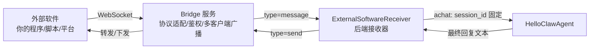
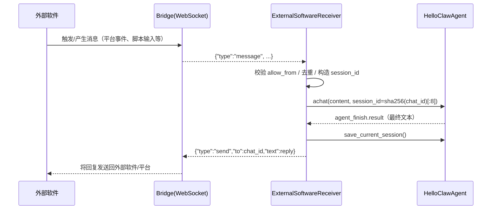

# 外部软件消息接入说明（External Bridge）

本文档说明如何让“外部软件”把消息发送到当前 HelloClaw 后端的 Agent，并拿到回复。

本实现参考了 `nanobot/nanobot/channels` 的设计思想：**外部平台/软件 →（桥接服务）→ 后端接收器 → Agent →（回写）→ 外部平台/软件**。

---

## 功能概述

你现在获得了一个“外部软件消息接收器”，它会：

- 通过 WebSocket 连接到一个外部桥接服务（Bridge）
- 接收桥接服务推送的入站消息（`type="message"`）
- 将入站消息映射为对 Agent 的一次对话输入（内部调用 `HelloClawAgent.achat`）
- 获取最终回复后，回写给桥接服务（`type="send"`）
- 为同一 `chat_id` 固定生成 `session_id`，保证多轮对话上下文连续

对应代码位置：

- **接收器**：`MyClaw/backend/src/channels/external_software_receiver.py`
- **应用启动挂载**：`MyClaw/backend/src/main.py`
- **并发保护（共享锁）**：`MyClaw/backend/src/main.py` + `MyClaw/backend/src/api/chat.py`

---

## 架构与数据流

### 组件关系图（Obsidian 可渲染 Mermaid）



### 时序图（从外部消息到回复）



---

## 协议说明（Bridge ↔ 后端接收器）

当前后端接收器对齐 `nanobot` 的 WhatsApp Bridge 协议风格（`type` 字段驱动）。

### 1）Bridge → 后端（入站消息）

接收器只处理 `type="message"` 的消息，其余类型（如 `status/qr/error`）会忽略。

**入站消息最小示例：**

```json
{
  "type": "message",
  "id": "msg_001",
  "sender": "user123@some.chat",
  "pn": "user123@some.chat",
  "content": "你好，帮我总结一下今天的待办",
  "timestamp": 1710000000,
  "isGroup": false,
  "media": []
}
```

字段含义（后端使用方式）：

- **type**：必须为 `"message"`
- **id**：用于去重（同一条消息重复推送会被丢弃）；可选但强烈建议提供
- **sender**：
  - 用作 **chat_id**（回复时的 `to`）
  - 实际上建议它是“可用于回发回复”的目标标识
- **pn**：用于计算 `sender_id`（权限 allowFrom）；优先级：`pn` > `sender`
- **content**：消息正文（将作为 Agent 输入）
- **media**：文件路径数组（可选）
  - 后端会将其附加为 `"[image: path]" / "[file: path]"` 标签拼到 content 里，帮助模型理解上下文

> 语音消息占位：若 `content == "[Voice Message]"`，后端会替换成不可转写的提示文本。

### 2）后端 → Bridge（回写回复）

当后端生成回复后，会向同一条 WebSocket 连接发送：

```json
{
  "type": "send",
  "to": "user123@some.chat",
  "text": "……这里是 Agent 的最终回复……"
}
```

- **to**：等于入站 `sender`（也就是 chat_id）
- **text**：最终回复文本

### 3）可选：鉴权握手（后端 → Bridge）

如果你在 Bridge 端启用了 token 鉴权（参考 nanobot bridge 的做法），后端会在连接建立后第一时间发送：

```json
{"type":"auth","token":"<EXTERNAL_BRIDGE_TOKEN>"}
```

---

## 后端如何启用（HelloClaw Backend）

后端不会默认启动外部接收器，必须显式配置启用：

满足以下任一条件就会启用：

- 设置 **`EXTERNAL_BRIDGE_ENABLED=true`**
- 或设置 **`EXTERNAL_BRIDGE_URL`**（非空）

### 环境变量（后端）

| 变量 | 作用 | 默认值 |
|---|---|---|
| `EXTERNAL_BRIDGE_ENABLED` | 是否启用接收器 | 为空（不启用） |
| `EXTERNAL_BRIDGE_URL` | Bridge 的 WebSocket 地址 | `ws://127.0.0.1:3001`（仅在启用后使用） |
| `EXTERNAL_BRIDGE_TOKEN` | Bridge token（可选） | 空 |
| `EXTERNAL_BRIDGE_ALLOW_FROM` | 允许的 sender_id 列表（逗号分隔） | `*` |
| `EXTERNAL_BRIDGE_CONNECT_TIMEOUT_S` | 连接超时 | `10` |
| `EXTERNAL_BRIDGE_HANDLE_TIMEOUT_S` | 单条消息处理超时 | `120` |

### allow_from（权限）规则

后端会从入站消息派生 `sender_id`，然后执行：

- `EXTERNAL_BRIDGE_ALLOW_FROM` 为空：**拒绝全部**
- 包含 `*`：**允许全部**
- 否则：只有 `sender_id` 在列表内才会处理

`sender_id` 的派生逻辑：

- 优先使用 `pn`，否则使用 `sender`
- 若包含 `@`，取 `@` 前部分作为 `sender_id`

示例：

- `sender="12345@s.whatsapp.net"` → `sender_id="12345"`
- `pn="alice@example.com"` → `sender_id="alice"`

---

## 外部软件如何向当前 Agent 发送消息（详细）

你需要一个 Bridge（桥接服务）。原因是：后端接收器作为 **WebSocket 客户端** 主动连接 Bridge，并从 Bridge 接收入站事件。

外部软件有两种典型接入方式：

1) 外部软件本身直接实现 Bridge（即它同时作为 WebSocket Server，等待后端来连）  
2) 复用已有 Bridge（例如参考 `nanobot/bridge` 的实现），外部软件只需要把平台事件送进 Bridge

下面给出“最容易跑通”的 2 套方式。

---

### 方式 A：你自己写一个最小 Bridge（推荐用于联调）

#### A1. Bridge 行为要求

Bridge 需要做到：

- 作为 WebSocket Server 监听一个地址（例如 `ws://127.0.0.1:3001`）
- 接受后端连接（可选 token 鉴权）
- 当外部软件产生消息时，向所有已连接客户端广播 `type="message"` 的 JSON
- 当收到后端发来的 `type="send"` 时，把它“送回外部软件”（联调阶段也可以先打印出来）

#### A2. 外部软件（Bridge）向后端发送消息的 JSON 模板

你只要让 Bridge 给后端推送下面这种结构即可：

```json
{
  "type": "message",
  "id": "your-unique-id",
  "sender": "your-chat-id",
  "pn": "your-sender-id",
  "content": "你要发给 agent 的文本",
  "timestamp": 0,
  "isGroup": false,
  "media": []
}
```

其中最关键的是：

- `type="message"`
- `sender`（后端回复会回写到这个目标）
- `content`
- `id`（用于去重，强烈建议）

#### A3. 用 Node.js 快速实现一个最小 Bridge（示例代码）

> 你可以把它保存为 `bridge-min.js`，用 `node bridge-min.js` 启动。

```js
import { WebSocketServer } from "ws";

const port = process.env.BRIDGE_PORT ? Number(process.env.BRIDGE_PORT) : 3001;
const token = process.env.BRIDGE_TOKEN || "";

const wss = new WebSocketServer({ host: "127.0.0.1", port });
const clients = new Set();

console.log(`bridge listening on ws://127.0.0.1:${port}`);

wss.on("connection", (ws) => {
  clients.add(ws);

  // 可选：token 鉴权（与后端 EXTERNAL_BRIDGE_TOKEN 对齐）
  if (token) {
    const timeout = setTimeout(() => ws.close(4001, "Auth timeout"), 5000);
    ws.once("message", (data) => {
      clearTimeout(timeout);
      try {
        const msg = JSON.parse(data.toString());
        if (msg.type === "auth" && msg.token === token) {
          console.log("backend authenticated");
        } else {
          ws.close(4003, "Invalid token");
        }
      } catch {
        ws.close(4003, "Invalid auth message");
      }
    });
  }

  ws.on("message", (data) => {
    // 收到后端回写的 send
    try {
      const msg = JSON.parse(data.toString());
      if (msg.type === "send") {
        console.log("[from-backend]", msg);
      }
    } catch {
      console.log("[from-backend raw]", String(data));
    }
  });

  ws.on("close", () => clients.delete(ws));
  ws.on("error", () => clients.delete(ws));
});

// 联调：每 10 秒广播一条测试消息给后端
setInterval(() => {
  const inbound = {
    type: "message",
    id: "test_" + Date.now(),
    sender: "demo_chat_1",
    pn: "demo_user_1",
    content: "你好！请用一句话解释什么是 RAG。",
    timestamp: Math.floor(Date.now() / 1000),
    isGroup: false,
    media: [],
  };
  const payload = JSON.stringify(inbound);
  for (const c of clients) c.send(payload);
  console.log("[to-backend]", inbound);
}, 10000);
```

然后在后端设置环境变量启用接收器：

- `EXTERNAL_BRIDGE_ENABLED=true`
- `EXTERNAL_BRIDGE_URL=ws://127.0.0.1:3001`
- （可选）`EXTERNAL_BRIDGE_TOKEN=...`
- （可选）`EXTERNAL_BRIDGE_ALLOW_FROM=*` 或者白名单

---

### 方式 B：复用 nanobot 的 Bridge（协议最对齐）

本仓库已将 `nanobot/bridge` **复用并放入** `MyClaw/bridge`（它本质上就是一个 WebSocket Server，并把 WhatsApp 的事件转成 `type="message"` 广播给 Python 客户端），因此后端接收器的字段解析与协议就是“最贴合”的。

这种模式下，外部软件（例如 WhatsApp/某平台）→ nanobot bridge → 后端接收器。

**后端只需要配置：**

- `EXTERNAL_BRIDGE_ENABLED=true`
- `EXTERNAL_BRIDGE_URL=ws://127.0.0.1:3001`
- 如果 bridge 启用了 token：`EXTERNAL_BRIDGE_TOKEN=<相同 token>`

**Bridge 启动方式（MyClaw/bridge）：**

- 进入 `MyClaw/bridge`：
  - `npm install`
  - `npm run build`
  - `npm start`

可选环境变量（Bridge）：

- `BRIDGE_PORT=3001`
- `AUTH_DIR=~/.helloclaw/whatsapp-auth`
- `BRIDGE_TOKEN=...`

> 你外部软件如果不是 WhatsApp，也可以照 `MyClaw/bridge/src/server.ts` 的做法：把你平台的事件转成 `type="message"` 广播即可。

---

## 会话与上下文（为什么能多轮对话）

后端使用 `chat_id -> session_id` 的固定映射：

- `session_id = sha256(chat_id)[:8]`

因此：

- 同一个 `sender/chat_id` 发来的多条消息会进入同一个 session
- Agent 会持续加载/追加同一个会话文件，从而保留上下文

---

## 并发与稳定性说明（重要）

由于 `HelloClawAgent` 在后端进程内是“全局单例”，内部会维护 `_current_session_id` 等状态。

为避免并发请求导致会话串线，本实现：

- 在 `src/main.py` 创建了全局锁 `_agent_lock`
- 在 HTTP 路由（`api/chat.py`）与外部接收器（`ExternalSoftwareReceiver`）中统一使用这把锁

这意味着同一时刻只会有一个请求/外部消息在驱动 Agent。

---

## 排错指南（快速定位问题）

- **后端没启动接收器**
  - 检查是否设置了 `EXTERNAL_BRIDGE_ENABLED=true` 或 `EXTERNAL_BRIDGE_URL`
  - 查看后端启动日志是否出现 `ExternalSoftwareReceiver started (background)`

- **后端一直连不上 Bridge**
  - 确认 Bridge 监听地址与 `EXTERNAL_BRIDGE_URL` 一致
  - 如果是本机：建议 `ws://127.0.0.1:<port>`

- **消息发送了但后端不处理**
  - 检查 `EXTERNAL_BRIDGE_ALLOW_FROM` 是否限制了 sender_id
  - 检查入站 JSON 是否包含 `type="message"`、`sender`、`content`

- **后端回写了 send，但外部软件收不到**
  - 确认 Bridge 在收到 `type="send"` 时确实有把它发送回外部平台/软件
  - 联调阶段先打印 `send`，确认回写链路已通

---

## 版本与兼容性

- 后端 WebSocket 客户端依赖 `websockets` Python 包（当前虚拟环境已包含）
- 接收器不会引入额外第三方日志依赖（使用标准库 `logging`）

