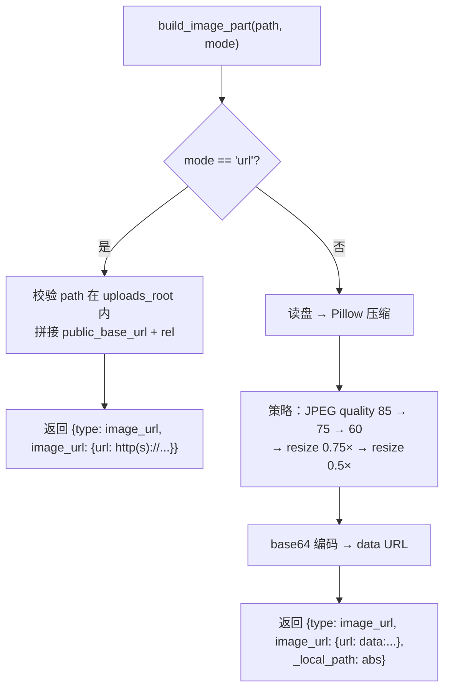
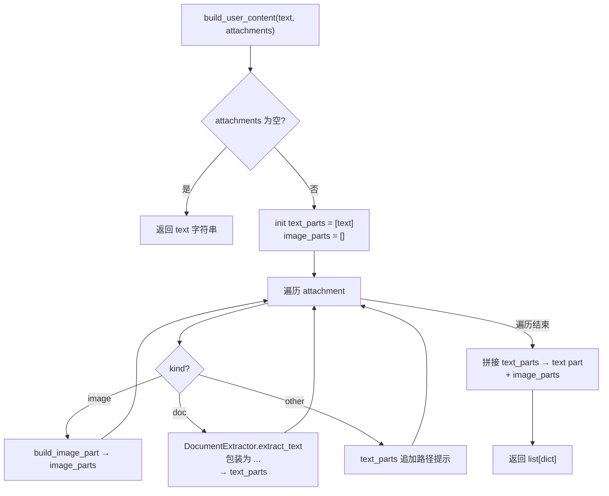
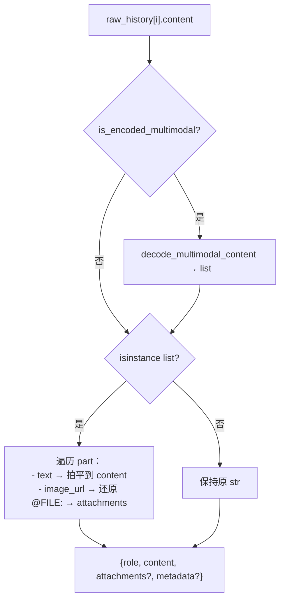
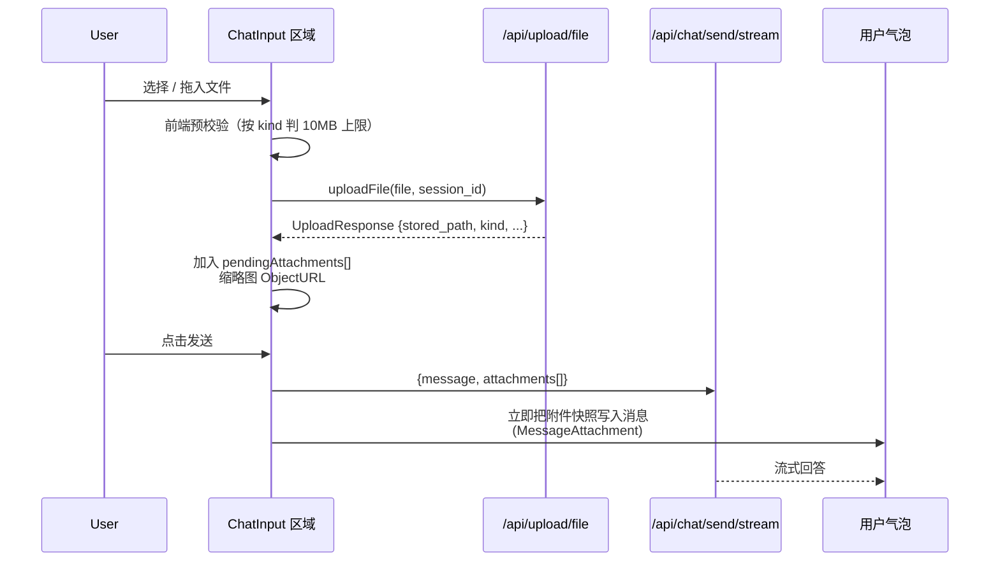
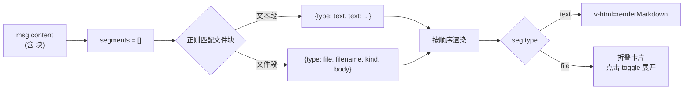

# 多模态实现与功能说明

本文档基于当前代码，说明 MyClaw 中 **多模态输入（图片 + 文档）** 的能力范围、协议字段、`backend/src/multimodal` 子模块职责、与 vendor `hello_agents` 的桥接策略，以及 **历史/Token 估算/前端折叠展示** 的全链路设计。文中的 Mermaid 图可在 Obsidian 中渲染。

---

## 1. 功能总览

多模态输入聚焦在 **聊天阶段直接接收图片与文档**：图片走原生 VLM `image_url`、文档抽文本注入到本轮用户消息。整条链路向后兼容旧的"纯文本 message"协议，未引入新的会话存储格式。

| 特性 | 说明 |
|------|------|
| **输入：图片** | JPG / JPEG / PNG / GIF / BMP / WEBP / TIFF；原生 VLM `image_url`（base64 内联或公网 URL） |
| **输入：文档** | PDF / DOC / DOCX / XLS / XLSX / PPT / PPTX / TXT / MD / CSV / JSON / HTML / 等（复用 `markitdown`） |
| **图片传输** | 默认 base64 内联（Pillow 递进压缩到 ≤5MB）；可配置切换为公网 URL 模式（mount `/files`） |
| **文档大小硬限** | 上传期 `MULTIMODAL_DOC_MAX_BYTES`（默认 10MB），超出直接 `413`，文件不落盘 |
| **文档处理策略** | 全文抽取注入本轮 user 消息（不截断），以 `<file name="..." kind="...">...</file>` 片段包裹 |
| **历史持久化** | base64 不入历史：image_url 序列化为 `@FILE:<abs_path>` 路径引用，LLM 调用前即时读盘还原 |
| **会话回放** | 历史中的图片自动还原为前端可显示的 data URL；文档块在 UI 上折叠为可展开卡片 |
| **输出模态** | 暂不实现（不做 TTS、文生图、视频生成） |
| **Bridge 外部接入** | 维持原协议，不引入附件字段 |

### 与"原始方案"的区别（演进记录）

| 维度 | 初版实现 | 当前实现 |
|------|---------|---------|
| `Message.content` 中的图片 | 内联完整 base64（约 7MB/张） | 仅存 `@FILE:<abs_path>` 引用（~250 字节） |
| 历史 token 估算 | 把 base64 字符串当文本算 → 单图 ~2,000,000 tokens（虚高） | 仅算用户文本 + 1024/张占位 → ~50 tokens |
| sessions/*.json 体积 | 每张图 +7MB | 每张图 +250 字节 |
| 文档块在 UI | 直接 `v-html` 渲染，整段文档撑爆气泡 | 折叠为可展开卡片（`UserMessageContent.vue`） |

---

## 2. 协议层

### 2.1 上传 `POST /api/upload/file`

实现：`backend/src/api/upload.py`。返回结构（`UploadResponse`）：

```json
{
  "filename": "demo.pdf",
  "stored_path": "uploads/<session>/demo.pdf",
  "size": 102400,
  "mime_type": "application/pdf",
  "kind": "image | doc | other",
  "extracted_chars": 12000
}
```

字节上限按 `kind` 分流，写入阶段流式累加 `total`，超限立即抛 `413 Payload Too Large` 并删除半成品：

| kind | 字节上限 | 环境变量 |
|------|---------|---------|
| `doc` | 10MB | `MULTIMODAL_DOC_MAX_BYTES` |
| `image` | 由 MB 计算 | `MULTIMODAL_MAX_IMAGE_MB` |
| `other` | 上传通用上限 | `UPLOAD_MAX_BYTES` |

### 2.2 文档预览 `GET /api/upload/extract?path=...&preview_chars=2000`

仅返回前 N 个字符给前端用作 UI 预览；真正注入对话仍在 Agent 端按 `stored_path` 再次抽取（保持 SSOT）。

### 2.3 对话 `POST /api/chat/send/stream`

`ChatRequest` 在原字段基础上新增 `attachments: List[Attachment]`：

```jsonc
{
  "message": "请看下这张图片",
  "session_id": "abc123",
  "attachments": [
    { "stored_path": "uploads/abc123/photo.png",
      "filename": "photo.png",
      "mime_type": "image/png",
      "kind": "image",
      "size": 28477 }
  ]
}
```

后端语义：
- **图片附件** → 构造 OpenAI 多模态 `image_url` part（含私有字段 `_local_path`）
- **文档附件** → `MarkItDown` 抽取全文 → 拼接为 `<file name="..." kind="...">...</file>` 片段附加到 text part
- **other 附件** → 仅在 text part 中追加路径引用提示（让 Agent 自行决定是否用 `read` 工具读取）

最终送给 VLM 的 `content` 形如：

```python
[
  {"type": "text", "text": "用户文本 + <file name='a.pdf' kind='pdf'>全文</file>"},
  {"type": "image_url", "image_url": {"url": "data:image/png;base64,..."}},
]
```

### 2.4 会话历史 `GET /api/session/{id}/history`

由 `MyClawAgent.get_session_history` → `api/session.py` 透传。对包含图片 part 的用户消息额外返回 `attachments`：

```jsonc
{
  "role": "user",
  "content": "拍平后的文本（含 <file>...</file> 片段）",
  "attachments": [
    { "kind": "image", "url": "<data:image/...|http(s)://...>" }
  ]
}
```

文本部分兼容三种 content 形态：旧字符串、新 list-content、`__MM_V1__:` 编码字符串（详见第 3 节）。

---

## 3. `backend/src/multimodal` 子模块

实现文件分布：

```
backend/src/multimodal/
├── __init__.py          # 暴露 MultimodalConfig / build_user_content / flatten_content_to_text / ...
├── extractor.py         # DocumentExtractor：复用 markitdown 抽取，纯文本走 open().read()
├── image.py             # build_image_part / load_image_as_data_url / Pillow 递进压缩
└── content_builder.py   # build_user_content：组装 list-content + 文档块 + 图片 part
```

### 3.1 `DocumentExtractor`（`extractor.py`）

按扩展名分发抽取策略。返回结构：`{"text": str, "kind": str, "chars": int, "error": Optional[str]}`。

| 文档类型 | 策略 |
|---------|------|
| `txt / md / csv / json / yaml / html / log / ini / ...` | `open().read()` 直接读，避免 markitdown 二次包装造成的内容偏移 |
| `pdf / docx / xlsx / pptx / 等` | `MarkItDown().convert(path)`，统一返回纯文本 |
| 解析异常 | 安全降级：返回 `text=""` + `error="…"`，由 `content_builder` 在文档块尾追加 `[抽取提示]` |

文档大小已在 `upload.py` 写入阶段硬限到 10MB，本层 **不再做字符级截断**。

### 3.2 `build_image_part`（`image.py`）

把本地图片转为 OpenAI 兼容 `image_url` part，支持 base64 / url 双模式。



注意返回的 part 中包含**私有字段 `_local_path`**：供 `multimodal_bridge` 在编码进历史前**剥离 base64 并替换为路径引用**（详见第 4 节）。`_xxx` 私有字段在送给 LLM 前会被 `_build_messages` patch 统一剥除。

`load_image_as_data_url(path, max_mb)` 是同一份压缩策略的轻量重入口，供历史回放和 `_build_messages` patch 在运行时即时读盘还原图片。

### 3.3 `build_user_content`（`content_builder.py`）

总装函数。输入 `(text, attachments, workspace_root, config)`，输出：

- **无附件** → 原样返回 `text` 字符串（保持现有链路无侵入）
- **有附件** → 返回 `list[dict]`，首项为 text part（含拼接的文档块），后续依次为 image_url part

降级语义：
- 图片读取失败 → 退化为 text part `[图片读取失败: filename - reason]`，不阻断对话
- 文档抽取失败 → `<file>` 块内附 `[抽取提示] error`，让 LLM 知情



---

## 4. 多模态桥接（`backend/src/agent/multimodal_bridge.py`）

这是整个多模态实现的**核心粘合剂**，目标是：**在不修改 vendor `hello_agents` 代码的前提下**，让 OpenAI list-content 能流过 `Message.content: str` 强类型校验，并且不撑爆历史/token 统计。

### 4.1 三层职责

| 职责 | API | 出现位置 |
|------|-----|---------|
| 写入历史前编码 | `encode_multimodal_content(list)` → `str` | `MyClawAgent._prepare_message_with_attachments` |
| LLM 调用前还原 | `decode_and_materialize_for_llm(str)` → `list` | `_build_messages` patch（一次性安装） |
| 历史回放/摘要 | `decode_multimodal_content(str)` → `list`<br/>`is_encoded_multimodal(content)` → `bool` | `get_session_history` / `_format_history_for_summary` |

### 4.2 编码格式

```
__MM_V1__:<base64-of-json>::TEXT::<原始用户文本拼接>
```

- **`__MM_V1__:`** 魔术前缀，`is_encoded_multimodal` 据此识别
- **base64-of-json** 是去掉真实 base64 的 list-content 的 base64+JSON 序列化（只保留 `@FILE:<abs_path>` 引用，约 100 字节级别）
- **`::TEXT::<原文>`** 把所有 text part 拼起来作为"可读尾巴"，让 token 估算、日志展示、摘要剪枝路径不出现乱码

### 4.3 image_url 路径引用机制（关键）

编码时（`_strip_image_url_payload`）：把 `image_url.url` 中的 `data:...;base64,...` 替换为 `@FILE:<_local_path>`，并删除 `_local_path` 私有字段。URL 模式（http/https）保留原样。

解码即时还原时（`_restore_image_url_payload`）：把 `@FILE:<abs_path>` 用 `load_image_as_data_url` 重新读盘构造为真实 data URL，文件已被删除时降级为 `[图片读取失败]` 文本 part。

```mermaid
sequenceDiagram
    participant U as 用户消息+附件
    participant A as MyClawAgent
    participant B as multimodal_bridge
    participant H as Message.content (历史)
    participant P as _build_messages patch
    participant L as OpenAI LLM

    U->>A: chat(message, attachments)
    A->>A: build_user_content → list-content<br/>image_url.url = data:image/png;base64,XXXX...
    A->>B: encode_multimodal_content(list)
    B->>B: 把 data:...base64 替换为 @FILE:&lt;abs_path&gt;
    B->>B: base64.encode(json.dumps(...))
    B->>H: "__MM_V1__:<short>::TEXT::原文"
    Note over H: Message.content 中只有 ~250 字节<br/>token_counter 不再被撑爆
    A->>P: agent.run(encoded_str)
    P->>B: decode_and_materialize_for_llm(encoded_str)
    B->>B: 找到 image_url.url = @FILE:&lt;path&gt;<br/>load_image_as_data_url(path)
    B->>P: 还原后的 list-content（含真实 data URL）
    P->>L: OpenAI chat.completions.create(messages=[...])
```

### 4.4 一次性 Patch（`install_simple_agent_multimodal_patch`）

`MyClawAgent.__init__` 末尾调用，幂等：

```python
original = EnhancedSimpleAgent._build_messages
def patched(self, input_text):
    messages = original(self, input_text)
    for item in messages:
        if is_encoded_multimodal(item.get("content")):
            item["content"] = decode_and_materialize_for_llm(item["content"])
    return messages
EnhancedSimpleAgent._build_messages = patched
```

效果：
- vendor `EnhancedSimpleAgent.run / arun_stream_with_tools` 中 4 处 `self.add_message(Message(input_text, "user"))` **不需要任何修改**
- LLM 收到的依然是干净的 list-content，含真实可识别的 data URL
- 内存 history / 持久化 JSON / token 估算路径都只看到短字符串

---

## 5. 历史与上下文统计

### 5.1 `MyClawAgent.get_session_history`

兼容三种 content 形态：



`_materialize_image_ref_for_display(url)` 在 base64 模式下用 `load_image_as_data_url` 即时构造前端可显示的 data URL；URL 模式直接透传；文件已删则返回空串（前端跳过该附件项）。

### 5.2 Token 估算（`src/context/tokenizer.py`）

`count_messages` 增加 list-content 分支：

| content 类型 | 估算方式 |
|-------------|---------|
| `str` | `count_tokens(text)`（tiktoken） |
| `list[dict]` | text part 拼接后 tiktoken + 每张图片占位 **1024 tokens** |

对于编码字符串（`__MM_V1__:...`），由于其中 `::TEXT::` 后已附原文，`count_tokens` 算到的近似等于真实用户文本长度，**不会再被 base64 撑爆**。

### 5.3 摘要兼容（`src/context/context_manager.py`）

`_format_history_for_summary` 在截取 500 字符前：

1. 检测 `is_encoded_multimodal(msg.content)` → 解码回 list
2. 用 `flatten_content_to_text` 拍平为纯文本（图片用 `[image:base64]` 占位）
3. 再做长度截断

避免摘要里出现 base64 噪声或 list 类型导致的 `TypeError`。

---

## 6. 前端实现

### 6.1 组件分工

| 文件 | 职责 |
|------|------|
| `frontend/src/components/AttachmentChip.vue` | 附件卡片：图片缩略图 / 文档图标 + 文件名 + 大小，可选删除按钮 |
| `frontend/src/components/UserMessageContent.vue` | 用户气泡内容渲染：自动识别 `<file>...</file>` 块折叠为可展开卡片，普通文本仍走 markdown |
| `frontend/src/views/ChatView.vue` | 整合：附件预览条、拖拽落区、消息气泡、编辑回填、技能/上下文等 |
| `frontend/src/api/upload.ts` | `uploadFile` + `kind/mime_type/extracted_chars` 类型 |
| `frontend/src/api/chat.ts` | `ChatAttachment` 类型 + `sendMessageStream(..., attachments)` |
| `frontend/src/api/session.ts` | `HistoryAttachmentMeta` 类型（仅 image），承载历史回显数据 |

### 6.2 交互流程



### 6.3 用户气泡折叠展示

`UserMessageContent.vue` 用正则 `<file\s+name="([^"]*)"\s+kind="([^"]*)">([\s\S]*?)<\/file>` 把 content 拆为 `text` 与 `file` 段，按原顺序渲染：

- **文本段** → 走 `renderMarkdown`
- **文档段** → 折叠卡片，标题显示文件名 + 字数统计，点击展开 `<pre>` 显示原始抽取文本（`max-height: 320px` 滚动）



### 6.4 编辑/重发回填

- **编辑用户消息**：`openEditUserMessage` 用 `splitUserContent` 剥离 `<file>` 块，编辑框只显示用户原文，提交时把剥离的块原样拼回 → 文档内容不丢失
- **重发**：`regenerateLastResponse` 直接传历史 content（含 `<file>` 块），后端 `build_user_content` 只对图片 attachments 重新构造 image_url part，不重复注入文档

---

## 7. 配置与环境变量

`backend/.env`：

```env
# 图片传给 VLM 的方式
MULTIMODAL_IMAGE_MODE=base64           # base64 | url

# URL 模式下的公网前缀（启用时后端 mount /files → workspace/uploads）
# MULTIMODAL_PUBLIC_BASE_URL=http://your-host:8000/files

# 单张图片在上传期的字节上限（MB，默认 10MB）
MULTIMODAL_MAX_IMAGE_MB=10

# 单文档上传字节硬上限（默认 10MB），超出 → 413
MULTIMODAL_DOC_MAX_BYTES=10485760
```

`MyClawAgent._build_multimodal_config()` 每轮对话**重新读取** env，便于运行时热改图片模式。

---

## 8. 静态资源（URL 模式）

`backend/src/main.py` 在 `MULTIMODAL_IMAGE_MODE=url` 且配置了 `MULTIMODAL_PUBLIC_BASE_URL` 时，自动 mount：

```python
app.mount("/files", StaticFiles(directory=workspace/uploads), name="uploads")
```

URL 模式下 image_url.url 形如 `http://your-host:8000/files/<session>/photo.png`，VLM 直接走 HTTP 下载。注意：**部分云端 VLM 要求公网可达**，本地部署建议用默认 base64 模式。

---

## 9. 明确边界

- ❌ **不做 OCR**：图片直接交给 VLM 理解
- ❌ **不做自动入 RAG**：用户可手动调 `rag` 工具
- ❌ **不动 Bridge 协议**：外部接入仍是纯文本 message
- ❌ **不实现输出模态**：TTS / 文生图 / 视频
- ⚠️ **使用图片输入需切换到 VLM**（如 GLM-4V、GPT-4o、Qwen-VL）。非视觉模型只会忽略 `image_url` part；文档功能与模型类型无关
- ⚠️ **10MB 文档全文注入仍可能消耗大量 token**：超大文档建议主动入 RAG
- ⚠️ **base64 模式不要把 `MULTIMODAL_MAX_IMAGE_MB` 调得过大**：即使经过 Pillow 压缩，超过 5MB 的 data URL 也会显著消耗 VLM 上下文

---

## 10. 相关代码与 API 索引

| 位置 | 作用 |
|------|------|
| `backend/src/multimodal/__init__.py` | 子包入口：暴露 `MultimodalConfig` / `build_user_content` / `flatten_content_to_text` / `DocumentExtractor` |
| `backend/src/multimodal/extractor.py` | `DocumentExtractor`：按扩展名分发 markitdown / open().read() |
| `backend/src/multimodal/image.py` | `build_image_part` / `load_image_as_data_url`：Pillow 递进压缩 + 双模式 |
| `backend/src/multimodal/content_builder.py` | `build_user_content`：组装 OpenAI list-content |
| `backend/src/agent/multimodal_bridge.py` | 编解码 + 路径引用 + `_build_messages` patch |
| `backend/src/agent/myclaw_agent.py` | `chat / achat` 接收 `attachments`、构造 list-content、`get_session_history` 还原图片附件 |
| `backend/src/api/upload.py` | `UploadResponse` 扩展、按 `kind` 分流字节上限、`/extract` 预览端点 |
| `backend/src/api/chat.py` | `ChatRequest.attachments` 透传给 agent |
| `backend/src/api/session.py` | `ChatMessage.attachments`：把历史中的图片元数据传给前端 |
| `backend/src/context/tokenizer.py` | `count_messages` 兼容 list-content + 图片占位 |
| `backend/src/context/context_manager.py` | `_format_history_for_summary` 兼容编码字符串 |
| `backend/src/main.py` | URL 模式下挂载 `/files` 静态资源 |
| `frontend/src/components/AttachmentChip.vue` | 附件卡片组件 |
| `frontend/src/components/UserMessageContent.vue` | 用户消息内容渲染（含 `<file>` 块折叠展开） |
| `frontend/src/views/ChatView.vue` | 附件预览条、拖拽、编辑回填等 |

---

## 11. 故障排查参考

| 症状 | 可能原因 | 定位线索 |
|------|---------|---------|
| 上传图片后历史中无缩略图 | `api/session.py` 未透传 `attachments` 字段 | 检查 `ChatMessage.attachments` 是否非空 |
| 历史会话中图片打不开 | 用户已手动删除 `workspace/uploads/<session>/*` | `get_session_history` 跳过失效附件；可在前端兜底显示"图片已失效" |
| token 估算异常虚高 | `Message.content` 中存了真实 base64（旧编码逻辑） | 看 `sessions/*.json`，若有 `__MM_V1__:` 后跟超长内容则是旧数据；新建会话即可 |
| LLM 回复混乱 / 出现工具 schema 残片 | 配置的 `LLM_MODEL_ID` 在 proxy 上不存在 → 静默 fallback | 用最小 OpenAI client 直接测 `chat.completions.create(model=...)`，看是否返回 `content=None` |
| `<file>` 块在气泡里以原文显示 | 前端组件未引入 `UserMessageContent` 或正则未命中 | 检查 ChatView 中用户气泡分支是否走子组件，检查 `<file name="..." kind="...">` 双引号是否被改成中文引号 |
| 上传文档返回 413 | 文档超过 10MB | 调小或调高 `MULTIMODAL_DOC_MAX_BYTES`；超大文档建议入 RAG |

---

以上为当前多模态子系统的实现与功能说明；若后续调整 `MULTIMODAL_*` 环境变量、`_FILE_REF_PREFIX` 编码格式或 `build_user_content` 输入结构，请以对应源码为准。
