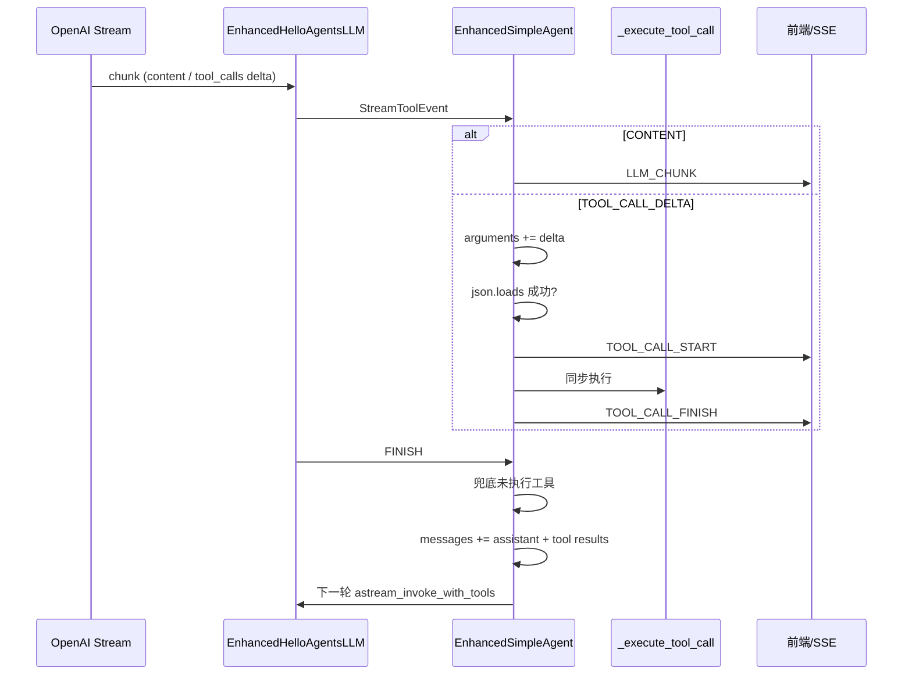

# EnhancedSimpleAgent 流式工具调用实现分析

本文说明 `backend/src/agent/enhanced_simple_agent.py` 与 `backend/src/agent/enhanced_llm.py` 如何实现：**边接收 LLM 返回的 chunk，边执行工具调用**。

---

## 总体架构

「边收 chunk、边跑工具」由两层协作完成：

| 层级 | 类 / 方法 | 职责 |
|------|-----------|------|
| LLM | `EnhancedHelloAgentsLLM.astream_invoke_with_tools` | 把 OpenAI 流式 chunk 拆成 `CONTENT` / `TOOL_CALL_START` / `TOOL_CALL_DELTA` / `FINISH` |
| Agent | `EnhancedSimpleAgent.arun_stream_with_tools` | 消费上述事件：文本立刻转发；参数 JSON 一旦可解析就立刻执行工具 |

入口是 `arun_stream_with_tools`；若 LLM 不是 `EnhancedHelloAgentsLLM`，会回退到非流式的 `run()`。

---

## 1. LLM 层：如何把 HTTP chunk 变成事件

`EnhancedHelloAgentsLLM.astream_invoke_with_tools`（`enhanced_llm.py`）使用 OpenAI 兼容 API，`stream=True`：

```python
async for chunk in response:
    choice = chunk.choices[0]
    delta = choice.delta

    # 文本增量
    if delta.content:
        result.add_content(delta.content)
        yield StreamToolEvent(event_type=StreamToolEventType.CONTENT, content=delta.content)

    # 工具调用增量
    if delta.tool_calls:
        for tc_delta in delta.tool_calls:
            idx = tc_delta.index
            # TOOL_CALL_START：收到 id 或 name
            # TOOL_CALL_DELTA：arguments 字符串片段

    if choice.finish_reason:
        yield StreamToolEvent(event_type=StreamToolEventType.FINISH, ...)
```

要点：

- 使用 `stream=True` 的 `chat.completions.create`，`async for chunk in response` 逐块读取。
- 同一条 SSE 流里可能交替出现 `delta.content` 和 `delta.tool_calls`（模型先说话、再调工具，或穿插进行）。
- `StreamToolCallResult` 在 LLM 侧同步累积全文和完整 `tool_calls`，供本轮结束后 `get_last_stream_tool_result()` 使用。

相关类型定义见 `enhanced_llm.py`：

- `StreamToolEventType`：`CONTENT` | `TOOL_CALL_START` | `TOOL_CALL_DELTA` | `FINISH`
- `StreamToolEvent`：单次流式事件载体
- `StreamToolCallResult`：整轮累积结果（`content`、`tool_calls`、`to_assistant_message()`）

---

## 2. Agent 层：单循环里「收流 + 触发执行」

核心在 `arun_stream_with_tools` 的 `while current_iteration < max_tool_iterations` 内，对 `astream_invoke_with_tools` 的 `async for`：

```python
async for event in self.llm.astream_invoke_with_tools(
    messages=messages,
    tools=tool_schemas,
    tool_choice="auto",
    **kwargs
):
    if event.event_type == StreamToolEventType.CONTENT:
        yield StreamEvent.create(StreamEventType.LLM_CHUNK, ...)
    elif event.event_type == StreamToolEventType.TOOL_CALL_START:
        # 更新 pending_tools[idx]，并尝试执行前序已就绪工具
    elif event.event_type == StreamToolEventType.TOOL_CALL_DELTA:
        pending_tools[idx]["arguments"] += event.tool_arguments_delta
        async for tool_event in self._try_execute_ready_tool(...):
            yield tool_event
```

### 2.1 文本 chunk：立即透传

`CONTENT` → 立刻 `yield LLM_CHUNK`，前端可边打字边显示，不等待工具结束。

### 2.2 工具状态：`pending_tools` 按 index 累积

每个工具调用用 `tool_call_index` 作为 key，维护：

```python
{ "id": "", "name": "", "arguments": "", "executed": False }
```

- `TOOL_CALL_START`：写入 `id` / `name`
- `TOOL_CALL_DELTA`：把参数片段拼到 `arguments` 字符串上

### 2.3 「参数 JSON 完整就执行」：`_try_execute_ready_tool`

```python
async def _try_execute_ready_tool(tc_state, ...):
    if tc_state.get("executed"):
        return
    # 需要 id、name、非空 arguments
    try:
        arguments = json.loads(args_str)
    except json.JSONDecodeError:
        return  # JSON 还不完整，继续等下一个 DELTA

    tc_state["executed"] = True
    async for event in self._yield_tool_call_execution(...):
        yield event
```

机制：每收到一段 `arguments` delta 就尝试 `json.loads`；解析失败则静默返回，继续收流；一旦合法 JSON，**不必等整轮 LLM 结束**就调用 `_yield_tool_call_execution`。

这是「边收边执行」的关键，而不是等 `FINISH` 或整段响应结束。

### 2.4 多工具顺序

当新的 `TOOL_CALL_START`（更大 `idx`）到达时，会先对 `prev_idx < idx` 的 pending 工具调用 `_try_execute_ready_tool`，保证先完成的工具先执行（符合 OpenAI 多 tool call 的常见顺序）。

### 2.5 流结束：`FINISH` 与兜底

- `FINISH`：再扫一遍 `pending_tools`，执行仍未 `executed` 的；JSON 仍无法解析则走 `_execute_tool_call_with_error`。
- 流结束后：`get_last_stream_tool_result()` + `complete_tool_calls` 再兜底执行漏网工具（例如未收到 `FINISH`）。

---

## 3. 工具执行如何向外推送

`_yield_tool_call_execution` 流程：

```python
yield StreamEvent.create(StreamEventType.TOOL_CALL_START, ...)
await asyncio.sleep(0)  # 让出事件循环，便于前端先收到 START
exec_result = self._execute_tool_call(tool_name, arguments)  # 同步执行（基类 SimpleAgent）
yield StreamEvent.create(StreamEventType.TOOL_CALL_FINISH, ...)
```

- 对外：`TOOL_CALL_START` →（同步跑工具）→ `TOOL_CALL_FINISH`。
- `await asyncio.sleep(0)`：在 START 和实际执行之间让出控制权，减少 START 被 FINISH「粘在一起」发不出去的情况。
- `_execute_tool_call` 来自基类 `SimpleAgent`，**同步阻塞**当前 async 生成器；执行期间不会再消费新的 LLM chunk，但已发出的 `LLM_CHUNK` 不会丢。

工具结果写入 `tool_results_by_id`，并追加到 `tool_call_records` 供会话历史持久化。

---

## 4. 一轮结束后的 ReAct 循环

流式一轮结束后（`arun_stream_with_tools` 内 LLM 流关闭后）：

1. `result = llm.get_last_stream_tool_result()`
2. 若无 `complete_tool_calls` → 有最终文本则 `break`，结束多轮。
3. 若有工具调用 → 把 `assistant`（含 `tool_calls`）和各 `tool` 结果 `append` 到 `messages`，`current_iteration += 1`，再调一次 `astream_invoke_with_tools`。

因此：

- **单轮流内**：收 chunk + 尽早执行工具；
- **跨轮**：标准 function-calling 多轮对话（最多 `max_tool_iterations` 轮）。

超过最大迭代且仍无最终文本时，会再调用 `astream_invoke` 纯文本流式收尾。

---

## 5. 数据流示意



---

## 6. 需要区分的「真并行」与当前实现

| 能力 | 是否实现 |
|------|----------|
| 边收 LLM 文本 chunk 边展示 | ✅ 每个 `CONTENT` 立即 `LLM_CHUNK` |
| 参数还在流式传输时就执行工具 | ✅ `json.loads` 成功即执行 |
| 工具执行与 LLM 接收真正并行 | ❌ 工具在 `async for` 循环内同步执行，会暂停读流 |
| 多个工具彼此并行 | ❌ 顺序 `async for` + 同步 `_execute_tool_call` |

若模型在工具参数传完之前还在输出文本，文本 chunk 仍会先被处理；一旦进入某次 `_yield_tool_call_execution`，该次工具跑完前不会处理后续 LLM 事件。

---

## 7. 与上游的衔接

`MyClawAgent.achat`（`myclaw_agent.py`）直接：

```python
async for event in self._agent.arun_stream_with_tools(message, **llm_kwargs):
    yield event
```

API 层再将 `StreamEvent` 转成 SSE/WebSocket 推给前端（如 `ChatView.vue`）。

---

## 8. 相关文件

| 文件 | 说明 |
|------|------|
| `backend/src/agent/enhanced_simple_agent.py` | Agent 流式编排、工具就绪检测与执行 |
| `backend/src/agent/enhanced_llm.py` | OpenAI 流式 chunk 解析与事件产出 |
| `backend/src/agent/myclaw_agent.py` | `achat` 入口，转发 `StreamEvent` |
| `docs/enhanced_simple_agent_arun_stream_with_tools.md` | 同主题早期文档（v1 docs） |

---

## 一句话总结

`EnhancedHelloAgentsLLM` 把 OpenAI 流拆成语义事件；`EnhancedSimpleAgent` 在同一 `async for` 里对文本即时转发，对工具参数增量累积并在 `json.loads` 成功时立即同步执行，从而形成「边收 LLM 流、边跑工具」的体验；多轮工具对话则通过 `messages` 追加与 `while` 迭代完成。
