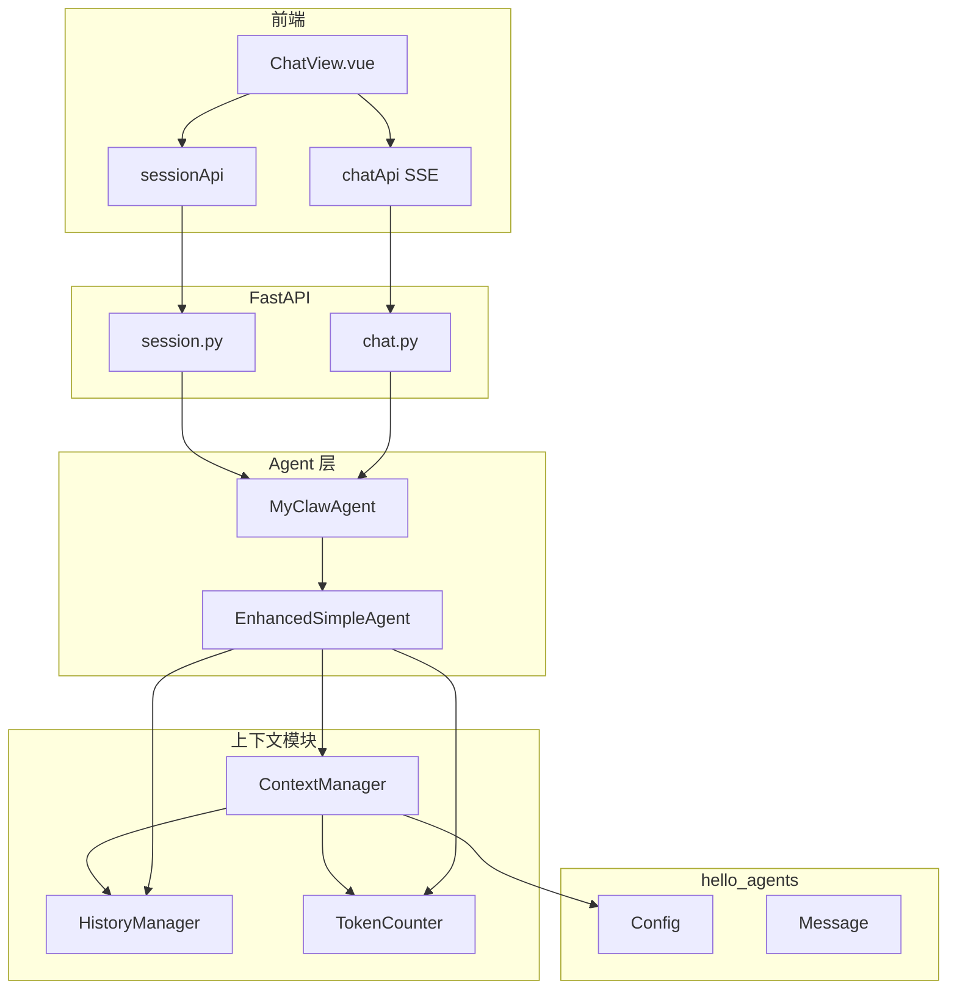
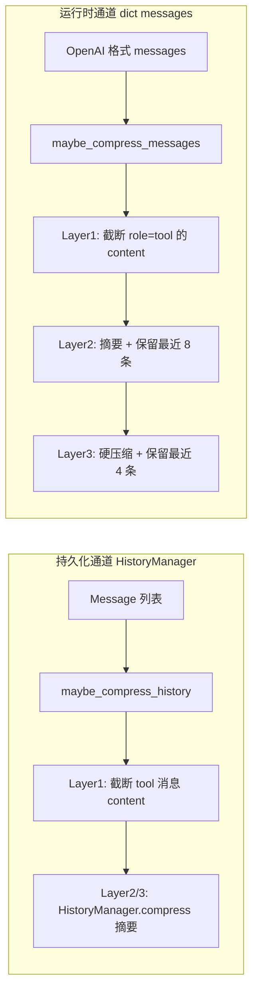
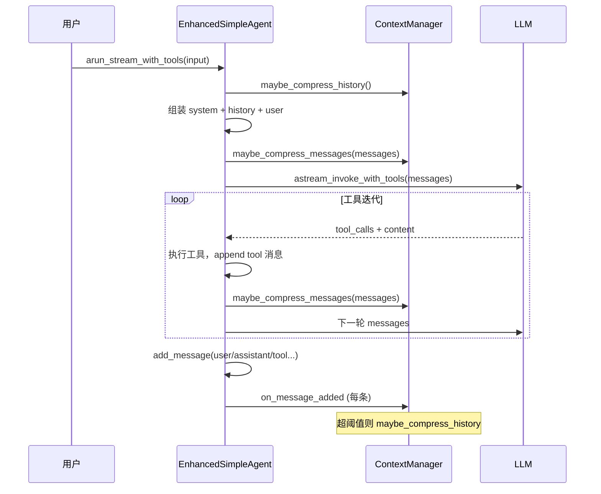
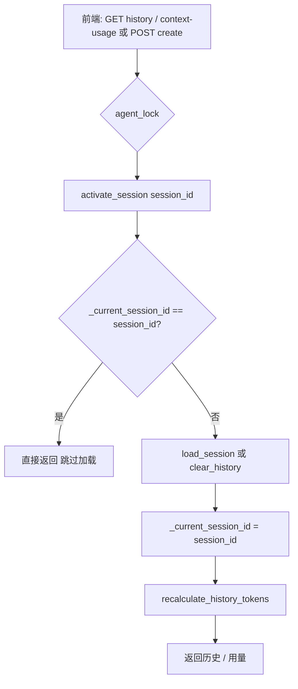
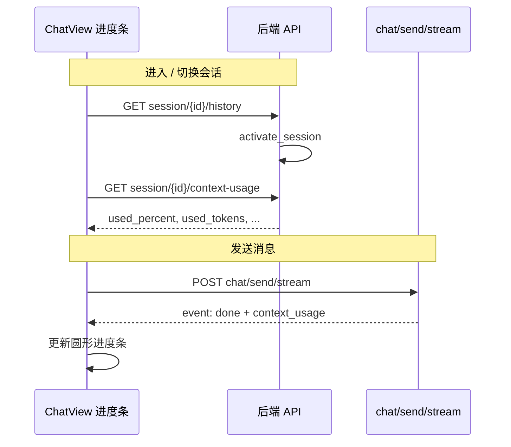

# 上下文管理实现说明

本文说明 MyClaw 中**上下文窗口管理**的整体设计：如何将压缩逻辑从 `hello_agents` 基类 Agent 中解耦为独立的 `ContextManager`，如何在多粒度阈值下执行压缩，以及前后端如何展示上下文用量。

---

## 设计目标

| 目标 | 实现方式 |
|------|----------|
| 与 Agent 解耦 | `backend/src/context/context_manager.py` 独立类，Agent 仅持有实例并调用方法 |
| 多粒度压缩 | 参考 [CoreCoder](https://github.com/) 分层思路：截断 → 摘要 → 硬压缩 |
| 双通道管理 | **持久化历史**（`Message` / `HistoryManager`）与 **单次 LLM 调用消息列表**（`dict`）分别处理 |
| 会话一致性 | `MyClawAgent.activate_session` 在打开历史会话时同步内存与 `_current_session_id` |
| 前端可观测 | 圆形进度条 + SSE `done` 推送 `context_usage`（无定时轮询） |

---

## 模块与依赖关系



### 核心文件

| 路径 | 职责 |
|------|------|
| `backend/src/context/context_manager.py` | `ContextManager`：token 追踪、三层压缩 |
| `backend/src/context/__init__.py` | 模块导出 |
| `backend/src/agent/enhanced_simple_agent.py` | 集成点：`_build_messages`、`add_message`、工具循环 |
| `backend/src/agent/myclaw_agent.py` | `activate_session`、`get_context_usage` |
| `backend/src/api/session.py` | 历史 / 用量 API，加载会话时 `activate_session` |
| `backend/src/api/chat.py` | 流式结束时附带 `context_usage` |
| `frontend/src/views/ChatView.vue` | 进度条 UI、SSE 更新用量 |

---

## ContextManager 概览

`ContextManager` 在初始化时根据 `config.context_window` 计算三个阈值（默认比例）：

| 层级 | 配置参数 | 默认阈值 | 作用 |
|------|----------|----------|------|
| Layer 1 `tool_snip` | `snip_ratio` | 50% | 过长 tool 输出保留首尾行 |
| Layer 2 `summarize` | `summarize_ratio` | 70% | 旧对话压缩为摘要，保留最近 N 轮 |
| Layer 3 `hard_collapse` | `collapse_ratio` | 90% | 更激进摘要 + 更少保留轮次（`hard_retain_rounds=4`） |

构造函数还支持：`tool_snip_chars`（默认 1500）、`hard_retain_rounds` 等。

### 对外 API（主要方法）

| 方法 | 说明 |
|------|------|
| `on_message_added(message)` | 增量 token + `maybe_compress_history()` |
| `maybe_compress_history()` | 对 `HistoryManager` 内历史分层压缩 |
| `maybe_compress_messages(messages, system_prompt)` | 对即将送入 LLM 的 `dict` 列表原地压缩 |
| `recalculate_history_tokens()` | 全量重算（压缩 / 加载会话后） |
| `reset()` | 清空历史 token 计数（配合 `clear_history`） |
| `history_token_count` | 当前历史 token 缓存（供用量统计） |

---

## 双通道压缩模型

上下文数据存在两种形态，压缩策略一一对应：



**为何需要两通道？**

- **历史通道**：对话结束后写入 `sessions/*.json`，控制长期会话体积。
- **运行时通道**：单轮工具调用会在 `messages` 中追加大量 tool 结果，可能尚未写入历史就撑爆窗口；因此在工具循环内也要压缩。

---

## 压缩触发时机（Agent 侧）



### EnhancedSimpleAgent 集成要点

1. **初始化**：创建 `ContextManager`，并 `recalculate_history_tokens()`。
2. **重写 `add_message`**：不再调用基类带压缩的 `add_message`，改为 `history_manager.append` + `context_manager.on_message_added`。
3. **重写 `clear_history`**：`history_manager.clear` + `context_manager.reset`。
4. **`_build_messages`**：构建前 `maybe_compress_history()`，构建后 `maybe_compress_messages()`。
5. **工具循环结束每轮**：`messages` 追加 tool 结果后调用 `maybe_compress_messages()`。
6. **`_history` setter**：批量替换历史后 `recalculate_history_tokens()`。

---

## Layer 2 摘要策略

对**历史通道**的 Layer 2/3，最终通过 `HistoryManager.compress(summary)` 写入一条 `role=summary` 的消息，并保留最近 `min_retain_rounds`（配置项，默认 10；硬压缩时降为 `hard_retain_rounds`）。

摘要正文来源：

| `enable_smart_compression` | 行为 |
|--------------------------|------|
| `false`（默认） | 简单统计摘要（轮次、消息条数） |
| `true` | 调用独立配置的摘要 LLM（`summary_llm_provider` / `summary_llm_model`）生成结构化中文摘要 |

对**运行时通道**的 Layer 2/3，在 `messages` 列表头部插入「压缩说明」伪对话，尾部保留最近若干条真实消息；可选用主 LLM 或规则提取生成摘要。

---

## Token 计数

| 场景 | 方式 |
|------|------|
| 历史消息 | `hello_agents.context.token_counter.TokenCounter`（tiktoken，失败时 `len//4`） |
| 运行时 dict | `estimate_dict_messages_tokens`（约 3 字符/token）+ `tool_calls` 字符串估算 |
| 用量 API | `used_tokens = system_tokens + history_tokens` |

`get_context_usage` 在 `session_id == _current_session_id` 时使用 `context_manager.history_token_count`；否则从会话文件离线估算。

---

## 会话激活（activate_session）

打开历史会话时，仅读文件展示会导致内存中的 `_current_session_id` 与前端不一致。因此在相关 API 中先激活会话：



**调用位置：**

- `GET /api/session/{id}/history`
- `GET /api/session/{id}/context-usage`
- `POST /api/session/create`（新建空会话）
- `MyClawAgent.achat` / `chat`（发消息前，`user_turn_index` 走 `_prepare_session_turn_replace` 特例）

---

## 前端用量展示



- **UI**：输入框旁 Ant Design `Progress type="circle"`，悬停显示 `xx.xx% context used (used / window tokens)`。
- **颜色**：&lt;70% 绿、70–90% 橙、≥90% 红。
- **更新策略**：无 `setInterval` 轮询；仅在初始化/切换会话时拉取 `context-usage`，每轮对话结束由 SSE `done.context_usage` 更新。

---

## HTTP API

| 端点 | 说明 |
|------|------|
| `GET /api/session/{session_id}/history` | 激活会话 + 返回 OpenAI 格式历史 |
| `GET /api/session/{session_id}/context-usage` | 激活会话 + 返回用量 JSON |
| `POST /api/chat/send/stream` | `agent_finish` 时 `done` 事件含 `context_usage` |

`context_usage` 字段示例：

```json
{
  "session_id": "462402de",
  "context_window": 128000,
  "used_tokens": 53760,
  "system_tokens": 12000,
  "history_tokens": 41760,
  "used_percent": 42.0
}
```

---

## 配置项（hello_agents.Config / MyClawAgent）

| 字段 | 默认值 | 说明 |
|------|--------|------|
| `context_window` | `128000` | 上下文窗口 token 上限 |
| `compression_threshold` | `0.8` | 与 Memory Flush 等逻辑共用（非 ContextManager 三层阈值） |
| `min_retain_rounds` | `10` | 摘要后保留的完整对话轮数 |
| `enable_smart_compression` | `false` | 是否用 LLM 生成历史摘要 |
| `summary_llm_provider` / `summary_llm_model` | deepseek 等 | 摘要专用模型 |
| `summary_max_tokens` / `summary_temperature` | 800 / 0.3 | 摘要生成参数 |

`ContextManager` 三层比例在代码中默认为 `0.5 / 0.7 / 0.9`，可在构造 `ContextManager(...)` 时通过 `snip_ratio` 等参数覆盖。

---

## 与 hello_agents 基类的关系

`hello_agents.core.agent.Agent` 仍在 `add_message` 内嵌 `_should_compress` / `_compress_history`。MyClaw 通过 **`EnhancedSimpleAgent` 重写 `add_message` / `clear_history`**，完全改由 `ContextManager` 负责，避免双重压缩。

基类能力仍被复用：

- `HistoryManager`（追加、轮次边界、`compress`）
- `TokenCounter`（tiktoken 计数）
- `Config` 中的窗口与摘要相关配置

---

## 扩展与注意点

1. **流式生成过程中**：历史仅在回合结束 `add_message` 后更新；进度条在 `done` 前不会反映本轮工具调用的临时膨胀（运行时通道会在服务端压缩，但不推送中间用量）。
2. **同会话重复激活**：`activate_session` 在 `_current_session_id` 已一致时短路，避免重复 `load_session` 覆盖内存或清空 `_resend_suffix`。
3. **并发**：会话与聊天 API 通过 `main.py` 中的 `asyncio.Lock` 串行访问 Agent，避免切换会话与对话交错。

---

## 相关文档

- [README.md](../README.md) — 功能概览中的上下文管理摘要
- [EnhancedSimpleAgent-流式工具调用实现分析.md](./EnhancedSimpleAgent-流式工具调用实现分析.md) — 工具循环与 `messages` 追加逻辑
